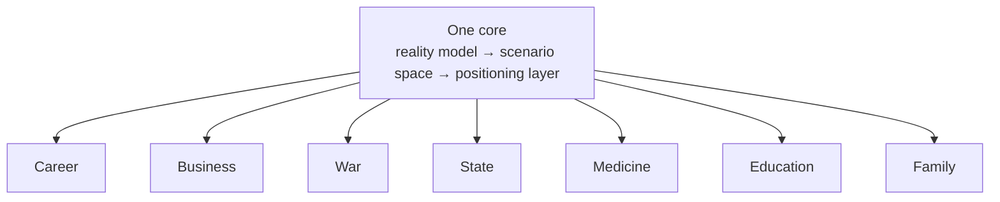

# 2. One Ontology, Many Verticals: One Core Beneath Different Spheres of Life

**Private document. Not for open publication.** This is the second of five essays in the Trajectories series. In the first, I changed the atom of intelligence — from the answer to the trajectory — and assembled a core of three layers: a reality model, a scenario space, and a positioning layer. Here I stress-test that core. I take one ontology and run it through several entirely different spheres of life to show that they do not require different intelligences. They require one ontology and different domain specifics.

**Alex Krol** — strategy, AI, growth infrastructure

> 🇷🇺 **Russian version:** [Ru/1_Concept/2_one-ontology-many-verticals.md](../../Ru/1_Concept/2_one-ontology-many-verticals.md)

> © 2026 Alex Krol. Private concept document of the Trajectories series. Not for open publication; distribution, quotation, or translation only with the author's explicit written permission.

## Contents

0. [TL;DR — one core, many spheres](#tldr)
1. [The core is invariant: why professions look different](#1-core)
2. [A run through the verticals](#2-verticals)
3. [Different spheres, not different intelligences](#3-conclusion)
4. [Glossary](#glossary)

---

## 0. TL;DR — one core, many spheres 

In the first essay I changed the atom of intelligence: the unit is not an inference but a trajectory, and above it stands a core of three layers — a reality model (active and reactive elements), a scenario space, and a positioning layer. Here I advance a thesis that would sound abstract without that core — and becomes testable with it.

The thesis is simple, and I lay it on the table at once. One and the same core describes any complex sphere of life. Career, business, war, the state, medicine, education, family — these are not different types of intelligence, each demanding its own special engine. They are different spheres for one ontology. Each contains constraints that cannot be shifted quickly; probabilistic forces you do not control; agents moving through that field and accumulating memory. What changes is the domain specifics — the particular constraints, the particular forces, the particular agents. The logic of navigation changes nowhere.

I prove this not by declaration but by a run-through. I take the three layers of the core and lay them over several verticals in succession — career with its talent market, war with its three scales of action, medicine with its clinical pathways, education with its fan of scenarios. In each I find the same reality model, the same scenario space, the same positioning layer, and one and the same productive vector — where to go. And when the verticals line up in a row, the engineering prejudice I want to expose becomes visible: the belief that every sphere needs its own separate AI. It does not. What is needed is one ontology and many maps of domain specifics. And if the ontology is one, then the human being, too, ceases to be a set of isolated verticals — but that is the next essay.

---

## 1. The core is invariant: why professions look different 

In the first essay the core assembled into a vertical stack of three layers. At the bottom, a reality model built of active and reactive elements: some generate impact, others change state in response. Above it, a scenario space: a set of typical trajectories over that model. On top, a positioning layer that chooses which train to board and what vector to follow. I will not re-explain these layers; they are fixed, and the series stands on them. I take them as given and ask the question that follows from them directly.

If the core is invariant, why do the people who use it look like members of incompatible professions? A career coach, a business strategist, a military planner, an attending physician, an education methodologist — between them, it seems, lies an abyss. Different languages, different tools, different diplomas, different conferences. Common sense says these are different intelligences: one is good with people and job titles, another with markets and metrics, a third with theaters of war, a fourth with pathophysiology. And the engineering instinct obediently answers in kind — to each sphere its own special engine, its own model, its own team.

I hold that this is an illusion, and I want to dispel it at once rather than save it for the finale. All these people are doing one and the same thing. They navigate a scenario space over a reality model. The career coach builds a map of positions and transitions and guides a person along it. The military planner builds a map of the theater and guides forces. The physician builds a map of the disease course and guides the patient. One core, one mode of work. What differs is not their intelligence but the **domain specifics** — the particular set of constraints, forces, and agents through which the course is plotted. A profession is not a separate brain. A profession is the specifics that brain has loaded.

The illusion rests on the incommensurability of vocabularies. The language of career is grades, sponsors, visibility; the language of medicine is etiology, protocol, outcome; the language of war is theater, campaign, echelon. These vocabularies share not a single term, and it seems as though different vocabularies must conceal different ways of thinking. But a vocabulary is the labeling of the terrain, not the design of the navigator. A geologist and a sailor name the relief with different words, and yet both read elevation, slope, and obstacle. The difference of vocabularies is a surface layer; beneath it lies one and the same operation of reading reality and plotting a course. I want to descend below the vocabularies to that operation and show that in career, medicine, and war it is literally one.

Let me note at once, so that no one is tempted to take my thesis for a triviality. I am not saying that "everything has something in common" — a banality from which nothing follows. I am saying something stronger: what is common is a specific three-layer construction that can be transferred from sphere to sphere in its entirety, with all the connections between the layers, losing nothing along the way. If the transfer breaks on even one vertical, the thesis is false, and I will see that honestly. The run-through below is precisely that breaking test: I load one ontology with seven different spheres in succession and watch for where it cracks.

To carry out the run-through, the concepts fixed in the first essay are exactly enough. In each vertical I will ask the same questions. What plays the role of passive constraints here — that which sets the geometry and does not change in a single move? What are the probabilistic forces here — active, alien, caught by statistics rather than by control? Who is the agent here, moving along a trajectory and accumulating memory? How does a scenario space assemble out of this, and what productive vector does the positioning layer choose? It is convenient to keep this before one's eyes as a picture: constraints as islands, forces as winds, agents as ships for a captain who cares about one thing only — where to sail. The picture helps one see, but what works beneath it are the concepts of the first essay, and it is precisely those that I am testing.

---

## 2. A run through the verticals 

I begin with career, because its structure is the most recognizable. The passive constraints here are structural: position levels, grades, formal requirements, regulations, industry-level and personal boundaries such as education or geography. They are hard: a grade cannot be leapt over by wishing, and this sets the geometry of any career route. The probabilistic forces are trends inside the company and in the market: which functions are growing, which teams are in the ascendant, which roles are in demand, who has just arrived as the new executive and reshuffled the alignment of alliances. The agent is a particular person with their skills, reputation, relationships, and current position. And it is immediately apparent that an assistant that edits résumés operates at the level of the local step, whereas what is needed is a positioning layer: it holds the map of positions and trends, unfolds a fan of routes — vertical growth within a function, a lateral move into an adjacent one, a jump across companies to a grade higher, an exploratory move such as an internship or a secondment — and chooses a course toward the target role, even if individual steps along the way will be imperfect.

Career has a continuation worth pausing over. The same positioning layer turns one hundred eighty degrees and serves not the person but the corporation — and it turns out to be one system seen from two sides. From the person's side, it builds a personal space of career routes. From the corporation's side, it matches people to projects. A project here is a coherent group of constraints with its own level of risk and its own forecast of forces: an M&A deal, the launch of a new market, a major transformation — each carries its own set of constraints, its own uncertainty, its own schedule pressure, its own window of opportunity and top-management attention. And people are matched to it not by abstract skills but by trajectory type. One person loves going into uncharted territory and coming back with a result — that one goes to scout the new market. Another reliably holds predictability — that one scales what already works. A third is ideal for the linkages between divisions that do not talk to each other. The task of the positioning layer is not to fill a slot in a project but to place people across projects so that every project receives the trajectory type it needs and every person ends up where it advances their own course. Career coaching and talent management cease to be two different tasks; they are one scenario space over one model of active and reactive elements, in which the system simultaneously guides people and staffs projects. It builds a personal space of routes for each person and at the same time optimizes the portfolio of trajectories of promising people — so as not to lose them and to put them on the right projects. And to work this way it does not need to be an insider: it suffices to see actual behavior and results rather than résumés — to identify the promising by how they move, not by how they describe themselves. This fork is not hypothetical: internal *talent marketplaces* (systems that match employee profiles to internal opportunities) are an actually deployed, though still maturing, corporate practice[^6][^7].

War raises the stakes and lays bare what in career was blurred — the scale of action. Military doctrine long ago formalized what in the first essay I called the difference between the local step and the vector: war is distributed across three levels — strategy, operational art, tactics. Strategy sets the goals, operational art orchestrates campaigns within a theater, tactics resolves individual engagements; the intermediate, operational level is the link connecting strategic goals with the tactical employment of forces[^1][^2]. The translation into the concepts of the core is direct: the theater of operations is the passive constraints, the adversary and the overall situation are the probabilistic forces, operations and special missions are agents dispatched to different sectors. A special operation — a raid, an airborne assault, an act of sabotage — is an agent of a particular class: an ultra-precise selection of the team for the task, deep reconnaissance of the situation, hard limits on time and noise, a one-time window, a high price of failure. You cannot send a random person there; what goes there is a class honed precisely for that terrain — and this is the same placement of people across projects as in career, only the price of error is different. In this picture, one core works at once as a general staff and as an officer of personnel and intelligence: the general staff holds the map of the theater and the state of the troops and plans the campaign as a sequence of operations, while the personnel side identifies the capable by actual behavior and matches them to missions so that this both strengthens the campaign and develops the people — a soldier's career is composed of rightly chosen operations. And the main lesson of war for my core is that the winner is not the one who conducts every engagement impeccably but the one who correctly distributes forces across directions and sustains the campaign's logistics. Perfect tactics in a war lost at the level of strategy is a polished local step on a train going the wrong way. The same two levels, the same primacy of geometry over the quality of the step — only the price of error is measured differently.

Medicine carries the same ontology into an element where the probabilistic forces are no longer a market but biology, and the stakes are maximal. The passive constraints here are harder than anywhere else: anatomy and physiology, protocols, contraindications, available technologies, regulation, the patient's chronic conditions, age, genetics — everything that sets the shape of the situation and does not change quickly. The probabilistic forces are the course of the disease, infections, responses to therapy, lifestyle, random events. The agent is the patient together with the treating team, moving along a joint trajectory through diagnosis, choice of therapy, correction, rehabilitation. And medicine has already partly formalized navigation explicitly. A clinical pathway — a multidisciplinary route for managing a patient with a predictable course, in which interventions are ordered in time — is a course plotted in advance according to protocols, and systematic reviews show that it works precisely where the course is predictable, ensuring the timeliness of interventions without harm[^3][^4]. And the agents here, too, come in different classes — by where the intervention strikes. The Russian medical tradition divides therapy into etiotropic (aimed at the cause of the disease), pathogenetic (aimed at the mechanism of its development), and symptomatic (aimed at its manifestations)[^5]; the English-language literature classifies differently — and what matters to me is not which partition is more correct but that the positioning layer here, too, chooses where to strike: to reconnoiter the cause, to press on the mechanism, or to suppress the symptom. Positioning in the medical element is the choice not of a single pill but of an entire regimen: to go in aggressively, to hold a sparing tactic, or to set the course toward quality of life when no good outcome remains. And the matter is not exhausted by the clinical pathway: living navigation adds to the protocol what the protocol does not contain — it observes the patient's long trajectory, learns from the outcomes of previous cases, and proposes routes not only by diagnosis but by the vector of the person's life, for whom one and the same diagnosis is a different situation. The same reality model, the same fan of scenarios, the same choice of course — it is just that the constraints are called contraindications, and the forces the course of a disease.

Education closes out the vivid series and shows the fan of scenarios in its purest form. The passive constraints are standards, curricula, age limits, basic cognitive regularities: what cannot be shifted within a semester. The probabilistic forces are demand for professions, technological shifts, socioeconomic trends, the student's personal environment. The agent is a particular person or group on its own trajectory of competence development. And here the fan of routes is visible without any translation: a learning scenario is a design of the overall trajectory of a course, with goals, stages, and checkpoints, while the education system itself likewise unfolds into a fan of possible development paths — from a return to the former model to radical renewal. Education researchers distinguish several types of such scenarios, ranging roughly from the restorationist to the innovative, and argue over one thing only — which course to choose. Before us is the question of positioning in its pure form: not "deliver the right lesson" but choose a vector of development. And the agent here is not necessarily one person: it can be a group on a shared trajectory, or the education system itself, leading an entire generation through its constraints. An educational assistant that does not understand this remains yet another course platform — it polishes the individual lesson, the local step, and does not see what train the student is riding. The positioning layer, by contrast, sees where the person stands in the space of competencies and which course leads them toward the target spheres — career, enterprise, health, civic role; and the productive vector here is not "learn a fact" but to be on a route that converges, over the long run, with where the person needs to arrive.

Business, the state, and the family complete the series, and I give them briefly — not because the ontology is weaker there, but because after four full unfoldings it reads at half a word. In business, the passive constraints are market structure, regulation, resource and technological frames; the forces are demand, competitors, channels, trends of attention; the agents are products, initiatives, campaigns; and the funnel is the chosen course along which the positioning layer steers a portfolio of scenarios, extinguishing some and scaling others. State and municipal governance is the same ontology at a larger scale: the constraints here are the constitution, laws, budget rules, levels of government, and the territories themselves with their resources; the forces are economic cycles, demography, migration, political and external shifts that the authorities do not control but are obliged to build into their scenarios; the agents are national projects, reforms, municipal initiatives, and the teams that carry them. A project here unfolds into a set of sectors of a single territory — transport, utilities, education, public safety — across which a portfolio of programs is steered in concert; and the positioning layer once again chooses not "the right decision on one question" but a vector of development for the territory under the given constraints and forces. In the family, the constraints are characters, values, the histories of the parental families, socioeconomic frames; the forces are crises, relocations, the birth of children, age transitions that cannot be predicted but whose patterns are visible; the agent is the family as a single subject moving along a long trajectory. And navigation here is occupied with exactly the same thing as everywhere else: not untangling a single quarrel but holding the vector of the relationship — where the couple is moving, toward closeness or toward estrangement, and whether it is time to change course. Seven spheres, from grades to marriage, from the theater of war to the clinical protocol, from a territory's budget to the family budget. The constraints differ everywhere, the forces are everywhere local, the agents are of every class. The ontology is one.

---

## 3. Different spheres, not different intelligences 

When the verticals are lined up in a row, what I placed on the first page comes through in them — and now I can rest it on the run-through. In all seven spheres, one core is at work. The reality model built of active and reactive elements, the scenario space above it, the positioning layer on top — this order did not waver in career, in war, in medicine, in education, or in the governance of a territory. Only the domain specifics changed: what counts as a constraint, which forces act in the given sphere, which agents move through it. Grades and contraindications are constraints of different natures. The labor market and the course of a disease are forces of different natures. An employee, a special-operations team, a patient, a student are agents of one core. Navigation itself — unfold the fan of courses and choose the productive vector — changed nowhere.

This allows me to name the engineering prejudice against which this entire essay is written. Common sense and the industry say in one voice: to each sphere its own special AI. A separate engine for recruiting, a separate one for military planning, a separate medical one, a separate educational one, each with its own model, its own team, its own jargon. I contend that this is an error at the level of the atom. These are not different intelligences. They are different spheres for one ontology. The specificity of a vertical lives not in the core but in the domain specifics — in the set of constraints, forces, and agents loaded into that vertical. To build a separate brain for each sphere is to multiply the core where only the specifics should be multiplied. The correct architecture is the inverse: one maximally abstract core concerned with scenarios, vectors, and active/reactive elements — and verticals as interchangeable sets of domain specifics on top of it.

From this follows the bet I am placing on the core. It must be designed not for the first vertical one takes into work but for the invariant — so that adding a new sphere is the loading of new domain specifics, not the rewriting of the engine. Career, business, war, the state, medicine, education, family are not seven products that will one day have to be integrated somehow. They are seven spheres of one ontology, and it remains common by construction, because what was common was the core through which they were all described. The concepts of the first essay — reality model, scenario space, positioning layer, productive vector — exist precisely for this: they set a single format in which any sphere is described in such a way that the core understands it immediately. The convenient picture of islands and winds helps one see this with the eyes, but it is not the picture that carries the description — it is the concepts themselves.

And here the ontology itself suggests the next move. All along I have spoken of verticals as if they were different spaces traversed by different agents. But the human being is one. The same person simultaneously builds a career, runs an enterprise, undergoes treatment, studies, lives in a family — and these are not seven separate agents in seven worlds but a single point whose position must be measured along all the axes at once. If the ontology is one, then the person, too, ceases to be a set of isolated verticals and becomes a single point in a multidimensional space through which they drift, shifting along all dimensions at once. What that space is, how its axes are defined, and where their common wind carries a person — that is where the next essay begins.

---

## Sources

[^1]: U.S. Joint Chiefs of Staff (2022). *Joint Publication 3-0: Joint Campaigns and Operations*. Washington, D.C.: Chairman of the Joint Chiefs of Staff, 18 June 2022 (as amended 10 September 2024). https://irp.fas.org/doddir/dod/jp3_0.pdf

[^2]: Svechin, A. A. (1927). *Strategiya* [Strategy]. Moscow: Voennyi Vestnik. (English edition: Svechin, A. A. (1992). *Strategy* / ed. K. D. Lee. Minneapolis: East View Publications.) https://www.rusi.org/podcasts/talking-strategy/episode-5-alexander-svechin-soviet-strategic-thought

[^3]: De Bleser, L., Depreitere, R., De Waele, K., Vanhaecht, K., Vlayen, J., & Sermeus, W. (2006). Defining pathways. *Journal of Nursing Management*, 14(7), 553–563. https://e-p-a.org/care-pathways/

[^4]: Allen, D., Gillen, E., & Rixson, L. (2009). Systematic review of the effectiveness of integrated care pathways: what works, for whom, in which circumstances? *International Journal of Evidence-Based Healthcare*, 7(2), 61–74. https://onlinelibrary.wiley.com/doi/abs/10.1111/j.1744-1609.2009.00127.x

[^5]: Kharkevich, D. A. (2010). *Farmakologiya: uchebnik* [Pharmacology: A Textbook] (10th ed.). Moscow: GEOTAR-Media. Section "Vidy farmakoterapii" [Types of Pharmacotherapy]. https://ru.wikipedia.org/wiki/Фармакотерапия

[^6]: Gantcheva, I., Schwartz, J., Jones, R., et al. (2020). *Activating the internal talent marketplace*. Deloitte Insights, 17 September 2020. https://www.deloitte.com/us/en/insights/topics/talent/internal-talent-marketplace.html

[^7]: Gartner (2024). *Market Guide for Internal Talent Marketplaces*. Stamford, CT: Gartner, Inc. https://www.gartner.com/reviews/market/internal-talent-marketplaces

---

## Glossary 

The load-bearing terms of this essay are the concepts of the first essay; they are given here in brief. Essay 2 introduces no new entities: it shows that one ontology works across all spheres. The maritime images (islands, winds, ships) are illustration, not concepts: behind them stand the Essay 1 terms listed below.

### What this essay introduces

**Vertical** — a sphere of complex life (career, business, war, the state, medicine, education, family). Not a separate intelligence with its own engine, but the same Essay 1 ontology with particular constraints, forces, and agents. The essay's thesis: different verticals are different spheres, not different intelligences.

**Registry of verticals** — the set of spheres through which one ontology is run. Each is its own set of domain specifics on top of one core.

### External concepts drawn upon

**Levels of war: strategy, operational art, tactics** — the division of action into three scales, formalized by military doctrine: strategy sets the goals, operational art orchestrates campaigns, tactics resolves individual engagements. In the essay, it confirms that the productive vector matters more than the quality of an individual step.

**Clinical pathway** — a multidisciplinary route for managing a patient with a predictable course, in which interventions are ordered in time. In the essay, an example of how medicine has already partly formalized navigation.

**The therapy triad: etiotropic / pathogenetic / symptomatic** — the division of therapy by point of application: at the cause of the disease, at the mechanism of its development, at its manifestations. A Russian medical tradition (the English-language literature classifies differently). In the essay, the choice of a regimen of intervention to fit the specifics of a case.

**Internal talent marketplaces** — systems that match employee profiles to internal opportunities; an actually deployed, though still maturing, corporate practice. In the essay, empirical confirmation of the fork "the navigator serves not the person but the corporation."

### Inherited from Essay 1 (in brief)

**Trajectory** — a stretch of time over which an agent plans, acts, observes, corrects course, and accumulates experience. The atom of intelligence in place of the inference.

**Reality model (active / reactive elements)** — the bottom layer of the core: active elements generate impact, reactive ones change state in response. Each vertical has its own constraints (reactive, slow) and its own forces (active, alien).

**Scenario space** — the set of typical trajectories over the reality model; that across which a course is plotted.

**Positioning layer** — the top layer of the core: it chooses which train to board and what vector to follow.

**Productive vector** — the direction of movement in the scenario space; the object of control in place of the individual step. In any vertical, the captain cares about one thing — where to go.

**Fan of scenarios** — the set of trajectories available from the current point; the object of position choice.
