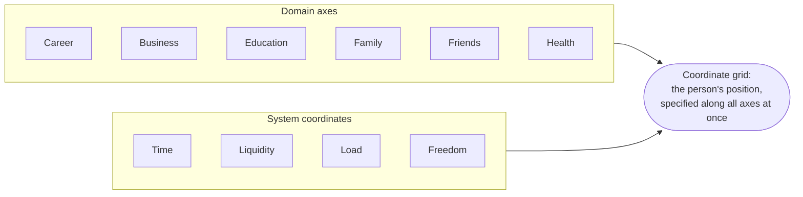
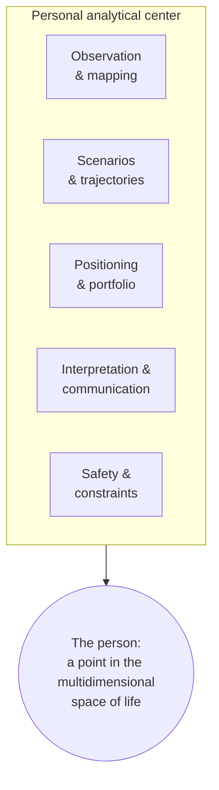

# 3. The Multidimensional Space of Life and Drift: One Person, One Map, One Navigator

**A private document. Not for open publication.** This is the third of five essays in the Trajectories series and its conceptual center. In the first, I changed the atom of intelligence — from the answer to the trajectory — and assembled a core of three layers. In the second, I ran that core across seven spheres of life and showed that they do not require different intelligences. Here I bring those spheres together into a single figure: the person is a point in the multidimensional space of life, and that person has a single navigator. It is here that the triad of the ontology is first explicitly named the core, and it is here that its form is born.

**Alex Krol** — strategy, AI, growth infrastructure

> 🇷🇺 **Russian version:** [Ru/1_Concept/3_multidimensional-life-drift.md](../../Ru/1_Concept/3_multidimensional-life-drift.md)

> © 2026 Alex Krol. Private concept document of the Trajectories series. Not for open publication; distribution, quotation, or translation only with the author's explicit written permission.

## Table of Contents

0. [TL;DR — seven maps turned out to be one map](#tldr)
1. [From verticals to the axes of a single space](#1-axes)
2. [The person as a point: drift instead of an answer](#2-drift)
3. [Everything is a signal: behavior instead of self-report](#3-signal)
4. [Why accuracy grows with the number of users](#4-scale)
5. [The personal analytical center: functions and contracts](#5-center)
6. [The Guardian: a form, not a fairy](#6-form)
7. [Glossary](#glossary)

---

## 0. TL;DR — seven maps turned out to be one map 

In the second essay I ran a single ontology across seven spheres of life and demonstrated that they do not need different intelligences. Here I take the next step, and it inverts the picture. The seven verticals are not seven applications between which bridges will someday have to be built. They are seven axes of a single space in which a single person lives. And since the person is one, the navigator is one as well.

From this immediately follows a change of operating mode. The navigator does not answer a query — it holds the person's point on the entire map at once and models the drift: where the person is being carried across the aggregate of axes, and what small increment will bend that displacement in the right direction. The goal, meanwhile, is not a dream point but a cone of admissible states within which the person is fine. A good career move that wrecks health the navigator sees not as a local success but as a vector conflict between axes.

And the material by which it reads the position is not a questionnaire. It is behavior: what the person does, what they do not do, how they talk about it. Action, inaction, and speech form a stream of observable data through which the position is updated continuously. As the number of people who have passed through the system grows, this stream turns it from a clever chat into an empirical map of reality: one can see which families of trajectories actually lead where. Architecturally, this is not one large agent but a personal analytical center composed of several rich functions: each has its own group of agents, with contracts between them. And this form already has a literary prototype: in Sergei Snegov's novel *Humans as Gods*, it is called the Guardian. I am not copying a magic fairy out of science fiction — I am extracting the principle of organization and translating it into engineering terms.

---

## 1. From verticals to the axes of a single space 

The second essay ended at a fork that I am now passing through. Throughout that run I spoke of the verticals as if they were different spaces traversed by different agents: career separately, business separately, health separately. Convenient for proving the invariance of the core, but factually wrong. The person is one. They simultaneously build a career, run a business, undergo treatment, study, live in a family, hold on to friends. This is not seven agents in seven worlds. It is one point whose position must be measured along all directions at once.

And then the vertical ceases to be a separate map and becomes an axis. Career, business, education, family, friends, health — six substantive axes of one person's life. The psychology of well-being has long operationalized "life as a whole" through a similar set of core domains — standard of living, health, achievement, relationships, safety, community connectedness, future security; the *Personal Wellbeing Index* measures precisely this[^pwi]. I take one thing from there: life decomposes into domain axes, and there are few of them. To the substantive axes I add system coordinates that run through all the domains at once — time, liquidity, load, freedom. These are not separate spheres of life but dimensions in which the price of any move along any substantive axis is denominated: every step in a career or in a family costs something in time, in money, in load, in the degree of freedom it takes away or returns. Combine the substantive axes with the system ones, and you get the coordinate grid in which the person's position is specified.

Before moving on, I pause and name the thing for whose sake the entire series was written. Beneath all the verticals of the second essay and beneath this space lies a single construction, and until now I have been unfolding it piece by piece. Now I assemble it into one and explicitly call it the core. The core is a triad. At the bottom, a model of reality: active elements generate impact, reactive ones change state in response. Above it, a scenario space: a set of typical trajectories of "active impact → reactive change" on top of that model. At the top, a positioning layer: the choice of which active element to be right now, which reactive ones to act upon, and which vector to follow. The division into active and reactive elements is my own, made for my purposes; I do not attribute it to external work. But the entire series rests on this triad, and the order of its layers cannot be permuted: positioning has nothing to operate on without the scenario space, and the scenario space has nowhere to come from without the model of reality.

This triad is the load-bearing structure of the present essay, and what follows must be read through it. The multidimensional space of life is the scenario space unfolded across all of a person's axes at once rather than along a single vertical. The substantive and system axes are the markup of the model of reality: what here is reactive and slow, what is active and belongs to others. And the navigator that guides the person through this space is the positioning layer, raised from the level of a single sphere to the level of the whole life. I am not introducing new entities. I take the triad fixed in the first two essays and show that it works not only inside a vertical but across all the verticals at once — as a single map of a single person.

It is worth showing how the triad maps onto each axis, to see that the markup really is one. On the career axis, the active elements are the person and the managers around them; the reactive ones are the organizational structure, the grade ladder, reputation — changing slowly under pressure. On the business axis, the active elements are teams and capital; the reactive ones are markets, metrics, infrastructure. On the health axis, the active elements are the person and their physicians; the reactive ones are the body, the course of disease, the healthcare system. On the education axis, the active elements are the person and those who teach them; the reactive ones are the knowledge and skills that have to be mastered. On the family-and-friends axis, the active elements are the person and those close to them; the reactive ones are the structure of relationships, the routines of daily life, the density of ties. Each axis has its own "physics," its own concrete active and reactive elements, its own geometry of the rigid and the movable. But the logic is the same everywhere: the active acts upon the reactive, the reactive changes state, and from the new state follows the next move. The axes differ in content, not in construction, and that is exactly why they can be assembled into a single grid rather than kept as seven incompatible maps. It is the triad that makes the axes commensurable.

---

## 2. The person as a point: drift instead of an answer 

Once the axes are brought into a single grid, the person acquires coordinates within it. Their position is a point: current roles and projects, acquired competencies, state of health, configuration of relationships, reserves of time and money, levels of load and freedom. Not an image and not a self-description, but a position in space specified along all axes at once. And around this point lies a geometry the person did not choose: regions one cannot enter, or can enter only at excessive cost — regulatory and physical limits, personal taboos; metric pits that are easy to fall into and hard to climb out of — burnout, the debt trap, a toxic environment. This is the same model of reality as in the verticals: hard constraints that cannot be shifted in a single move, and probabilistic forces one does not control.

Through this field run families of trajectories — the typical routes that people in a similar position usually take. Career, educational, family, business branches, each with its own horizon, risk, and characteristic outcome. The navigator sees not only the current point but also the fan of these routes diverging from it. And here is the central turn of the entire essay. In such a space, the goal is not a point. The dream point is an illusion out of motivational books: "this is the position, this is the income, this is the body I want to attain." The real goal is a cone of admissible states: a region in which the person is fine across the aggregate of axes. Enough money with enough freedom, enough depth with enough breadth, enough closeness with enough autonomy. Inside the cone lie many different points, and all of them suit the person. The navigator aims not at one of them but at entering the cone and staying inside it.

From this follows what a recommendation turns out to be. Not "here is the ideal action." Rather, a step that creates a steady drift toward the cone, even if it is locally suboptimal. Drift is a notion from the first essay: the displacement of a trajectory under the action of steps and a vector, where the geometry of motion matters more than the quality of any single step. Here it becomes central and multidimensional. The navigator models not one best move but small increments of state, integrated over time in the desired direction along all axes. This optic directly inherits from the first essay: control with a planning horizon — at each step the trajectory is optimized over a horizon ahead, the first step is executed, the window slides forward; and portfolio logic — value lies not in an individual position but in the configuration of the portfolio, and a single drawdown decides nothing if the composition is right. I am not redefining these constructions; I am leaning on them: drift in multidimensional space is the same trajectory on a sliding horizon, except that the horizon now spans the whole life, and the portfolio is allocated not across trades but across axes.

A full recommendation therefore assembles into several movements, not one. First, the navigator assesses the current position — where the person actually stands in the space according to accumulated behavior, not according to what the person says about themselves. Next, it selects not a dream point but that very cone of admissible states the person would be fine landing in. Then it compares families of scenarios: which routes statistically lead into that cone, with what risks and on what horizon, and which lead past it. And only at the end does it propose a local step — not "the ideal action in general," but an action that shifts the person toward the chosen trajectory and does not drive them into a hard constraint. All four movements operate over the long run: none of them is about the best answer here and now; all of them are about making the integral over time come out positive. This is close to a life autopilot that does not supplant the person's will but continuously suggests a course along which the accumulated drift adds up in the desired direction.

And right here surfaces what one-dimensional assistants cannot see in principle. A good "train" in a career may be bad for health or for family. A promotion that moves the person up the career axis carries them down the load axis into a pit and along the relationships axis into estrangement. An assistant that looks at career in isolation will report success. A navigator that holds all the axes at once sees the same event as a vector conflict between axes: the aggregate drift is carrying the person out of the cone even though one coordinate has improved. This is not a local optimization to be fine-tuned but a structural choice to be made deliberately: what one is prepared to sacrifice, which axis to trade away, where to draw the boundary of the trade. One-dimensional advice does not even pose this question. A multidimensional navigator begins with it.

---

## 3. Everything is a signal: behavior instead of self-report 

To hold the person's point on the map, the navigator needs to know where that point actually is. And here it has no right to trust a questionnaire. Position in the space is determined not by what a person says about themselves but by what they do. True preferences are revealed through actual choice, not through declaration — an old and solid result of economic theory, the theory of revealed preference[^revpref]. A person announces one goal and votes for another with their time, attention, and money. The navigator updates the coordinates according to the voting, not the announcement.

The material for this comes in three streams, and all three are read as data. Action is the direct step along the trajectory: projects, tasks, meetings, purchases, workouts, conversations — what the person actually invests time and energy in. Here one can see where they are factually moving. Speech is a window into their current model of the world: how they describe themselves, others, and the future; what they consider possible and impossible; whom they grant the right to act; what causal links they hold in their head. And the third stream, the one usually written off, is inaction. What the person does not do: postpones important letters, avoids conversations, does not go to the doctor, does not submit the application, for years fails to launch the project they keep talking about. Inaction is not emptiness. It is the field of avoidance: fears, blind spots, hidden constraints. Often it is precisely here that the real trajectory is visible more clearly than in actions — the chronic postponement of an uncomfortable but important step says more about a person's position than any declaration of intent.

Hence an invariant of the core: there is no empty time, and there are no insignificant acts. The absence of action in a particular zone of life is a diagnostic signal no weaker than action. Every small act and every utterance is a measurement of the current trajectory — noisy, but a measurement. Behavioral science already operates in this mode: digital phenotyping is the moment-by-moment quantification of a person's state from the data of their ordinary devices, with a substantial share of the data collected passively, without the person's active participation[^digphen]. I am not hiding the sharpness of this. Across all three streams, including what the person has not done, the navigator continuously refines where the person stands and where they are being carried. It sounds like total observation, and I will not soften it: yes, everything falls within the field of view.

But precisely here runs the boundary that must not be lost, and it is built into the construction itself rather than glued on top. The stream is collected not to evaluate the person but to tune the navigation. The navigator does not issue grades, does not keep a dossier for a verdict, does not rank the person against others. It checks one thing: whether the actual drift matches the vector the person themselves considers desirable, or whether it is pulling them into a different funnel of scenarios. And if it is pulling them away, the navigator intervenes in measured doses: it proposes a small step, a conversation, an experiment, a shift of focus that corrects the course. The purpose of the stream is to help the person drift where they themselves want to go, not where the system wants. The difference between navigation and surveillance is not in the volume of observation — it is total in both cases. The difference is in who owns the vector and whether the system has a built-in constraint on what it is entitled to do with that knowledge. This function — safety and constraints as part of the core rather than a superstructure — I unfold in the fifth and sixth sections. What matters here is to fix one thing: "everything is a signal" works only in tandem with "a signal for navigation, not for judgment"; otherwise it is no longer what I am designing.

---

## 4. Why accuracy grows with the number of users 

Everything described has a property that changes the nature of the system as it grows. While a single person passes through the navigator, it relies on that person's history and on general considerations. When thousands and hundreds of thousands of trajectories pass through it, something appears that a single-user system cannot have — a statistics of routes. One can see which combinations of steps in career, business, health, and education actually lead to similar outcomes, and which sound attractive yet empirically do not work. The families of scenarios cease to be speculative and become observable clusters.

The mechanism of this growth is not new; it has a precise name. Recommending to "people like you" from the aggregate of others' choices is collaborative filtering, a term and method three decades old[^cf]. For a new person it is immediately visible which already-observed trajectories they are closest to — by behavior, speech, inaction — and which scenarios proved productive for such profiles and which drained resources. These are no longer tips from general-purpose books but recommendations drawn from genuinely similar lives. And on top lies a second loop, also with a name: data network effects — more users yield more data, more data makes the product more accurate, accuracy brings in new users[^datanfx]. The loop is self-reinforcing. As the number of people who have passed through the system grows, the navigator understands better and better which trains exist at all, where they actually arrive, and how small signals correlate with future outcomes.

It is worth dwelling on what exactly improves, because it is not one quality but three distinct ones. First, scenario clusters become visible: stable families of routes emerge from the mass of trajectories, and in place of the speculative "this is how it is usually done," empirical outlines of terrain begin to show, on which one can see where the person stands relative to typical paths. Second, learning on outcomes strengthens: statistics accumulate on which scenarios actually produce the desired drift along the key coordinates — income, health, satisfaction, durability of the business — and which lead to systematic loss, so attractive-sounding but non-working routes can be culled by fact rather than by intuition. Third, the precision of personalization grows: a new person, by their behavior, speech, and inaction, is immediately projected onto the nearest observed lives, and the navigator offers them not the average but what worked precisely for the similar. These three qualities pull one another along: sharper clusters yield cleaner learning on outcomes, cleaner learning yields more precise personalization, and more precise personalization retains more people and improves the clusters again.

And then the system changes genre. From a clever chat answering queries, it drifts toward what I call an empirical map of reality — a map on which one can see where the trajectories through the multidimensional space converge. Here I am obliged to be precise and not pass off the desired as fact. No such atlas exists today: there is no verified source in which the trajectories of entire human lives have been assembled into a single map, and I do not attribute this map to any study. It is a direction toward which the data loop leads, not a finished artifact. What I claim is not "such a map exists" but "collaborative filtering plus data network effects set a vector along which, as it grows, the system shifts from chat toward an empirical map." The map here is a horizon, not an existing thing.

This horizon is reached only if a hard condition is met, and without it the whole construction degenerates. "More signals — higher accuracy" holds only under two things at once. First: the signals must fall into a single geometry — into the multidimensional space and its scenarios — rather than pile up as unconnected logs; otherwise there is plenty of data and no map. Second: the system must learn on trajectories and outcomes, not on individual queries. And then something easy to overlook amid the joys of scale becomes critical: the quality of the input. The loop works only with built-in selection of scenarios, the culling of harmful and toxic patterns, and protection against memory poisoning — against noise, fashion, or ideology seeping into the map and passing itself off as outcome statistics. Without this filter, growth in the number of users does not raise accuracy but amplifies distortion: the system begins confidently leading people along routes that are popular rather than ones that work. Selection and protection are therefore not a hygienic option but the condition under which scale yields accuracy at all. This leads directly to the question of how the navigator is organized inside.

---

## 5. The personal analytical center: functions and contracts 

When I gather everything the navigator must be able to do, it becomes clear: this is not one large agent. A single agent charged with observing, building scenarios, choosing the vector, explaining decisions, and holding the constraints all at once is not an architecture but a junk heap. The nature of the task decomposes into several rich functions, and each person ends up with their own personal analytical center for decision-making — a set of functions, no matter by whom they are performed. The very idea of mind as a society of many interacting agents from which intelligence emerges was formulated long ago — Minsky's *Society of Mind*[^som]; I transfer it from the organization of a single mind to the organization of a navigator over a life.

There are few of these functions, and they fall into place naturally. There is the function of observation and mapping: it receives the three streams of signals, normalizes them and binds them to the coordinates of the space, and keeps the person's position current. There is the function of scenarios and trajectories: it builds and updates the families of routes, identifies clusters, evaluates the quality of scenarios by outcomes, and spawns new branches. There is the function of positioning and portfolio — the navigator's strategic staff: it chooses the vector and the train against the background of the current position, the person's goals, and the geometry of constraints, and it thinks like an investor, not a day trader. There is the function of interpretation and communication: it translates a complex internal decision into a human explanation and into a gentle intervention — not only what to do, but why. And there is the function of safety and constraints: privacy control, limits on intervention, filtering of toxic scenarios, protection against data poisoning — exactly the built-in layer without which "everything is a signal" from the third section turns into surveillance, and the scale from the fourth amplifies distortion.

Each such function is served not by a single performer but by a group of agents with their own specializations — observation, analysis, planning, simulation, communication within a single function. And between the functions lie contracts: clear interfaces through which they exchange results without reaching into one another's internals. Observation passes upward the updated state and the signals. Scenarios deliver the set of possible routes with their profiles. Positioning chooses the course and sends constraints downward. Interpretation receives the decision and gives the person an intelligible narrative. Inside a function there are its own protocols; outside, it behaves as a sharply delineated service. This is the language of multi-agent systems, in which many autonomous agents interact through strict interfaces — "contracts"[^mas]; I am not inventing it, I am applying it to the navigator. The result is not a single brain but the architecture of a center in which groups of agents work like the departments of a good analytical staff.

And the chief property of this construction is that it is invariant to who occupies the cells of the org chart. The functions, roles, and contracts are specified independently of whether a human or an AI performs a given role. Today it is a hybrid: some functions are carried by people, some by agents. Tomorrow more cells get automated. The day after, perhaps, more still. But the org structure itself — which functions exist, how they are linked by contracts, what flow passes between them — does not change with what fills the cells. I am designing neither an assistant nor a particular roster of performers. I am designing a pattern for the organization of decision-making, into which AI gradually moves deeper and deeper, taking over more and more roles, while the pattern itself remains the same. This is what makes it possible to build the center today, without waiting for everything to be automated: the org structure can be specified now and populated as the agents grow into their roles.

---

## 6. The Guardian: a form, not a fairy 

When I carry this construction to its conclusion — a personal analytical center for every person, one that observes their life, holds the map, models the drift, chooses the vector, and tactfully returns all of this as advice and as the structuring of the environment — I realize that I am describing nothing new. This form has already been described, and described precisely. In Sergei Snegov's *Humans as Gods*, every person has a Guardian.

It is worth citing how this is done in the novel, because the match is not approximate. The Guardian is "my wise and dispassionate mentor and guide"; she "speaks in a pleasant female voice… or simply lights up her answers in the brain"; she "was a peculiar part of myself, my link to all of humanity"[^snegov]. Let me take this apart function by function, without sliding into a retelling of the novel. "Mentor and guide" — she does not answer a question; she steers a trajectory: talks one out of the destructive, nudges toward the reasonable, helps choose what to take on. That is the positioning layer. "Link to all of humanity" — she is embedded in the civilization's shared information network, knows the geometry of the world, and draws on the mind of the entire civilization rather than on a single head. That is both the observation function mapping the world and the scale loop from the fourth section — accuracy from connection with everyone. And what the novel presents as a matter of course — the Guardian protects the person from self-destruction rather than merely optimizing their utility — is the safety-and-constraints function, built in rather than bolted on.

And here is the point for which I brought up Snegov in the first place. I am not copying the interface of a magic fairy from science fiction. The image in the novel is given as an artistic result, as a ready-made property of a utopian civilization, about which no one asks how it is built inside. What interests me is not the fairy but the principle of organization that lies beneath her, and I extract it from the novel and translate it into engineering terms: a set of functions — observation, scenarios, positioning, communication, safety; an architecture of agent groups and contracts between them; a multidimensional map of life along which all of this guides the person. Snegov looked from above, from the vantage of a finished society of human gods. I look from below, as a systems architect: not "here is the ideal Guardian," but "here is the core that, step by step, as agents take up their roles, grows an ordinary person into someone who has such a center." The Guardian is not magic. It is the right architecture of navigation through reality, saturated with data, scenarios, and feedback.

And I stop exactly where the construction is complete but the principal question about it has not yet been posed. If every person can have such a center, the question arises of who will actually have it: to whom it is accessible, what it runs on, who pays, where the boundaries lie of what it is entitled to do with everything it knows. The form has been described. What follows is the question of who will get it and at what price. The next essay begins there.

---

## Sources

[^snegov]: Snegov, S. A. *Humans as Gods* (novel trilogy, 1966–1977): *Galactic Reconnaissance* (1966), *Invasion into Perseus* (1968), *The Ring of Reverse Time* (1977). Aelita Award (1984). The image of the "Guardian" — a personal mentor-keeper assigned to every person — is quoted from Book 1, *Galactic Reconnaissance*: "my wise and dispassionate mentor and guide"; "speaks in a pleasant female voice… or simply lights up her answers in the brain"; "she was a peculiar part of myself, my link to all of humanity" (quotations rendered here in my translation from the Russian). Text: https://fantlab.ru/work13831

[^pwi]: Cummins R. A. (2003). Developing a National Index of Subjective Wellbeing: The Australian Unity Wellbeing Index. *Social Indicators Research*, 64, 159–190. The Personal Wellbeing Index measures well-being through core life domains (standard of living, health, achievement, relationships, safety, community connectedness, future security) — an operationalization of "life as a set of domain axes." https://www.acqol.com.au/uploads/pwi-a/pwi-a-english.pdf

[^revpref]: Samuelson P. A. (1938). A Note on the Pure Theory of Consumer's Behaviour. *Economica*, 5(17), 61–71. The theory of revealed preference: true preferences are revealed through actual choice rather than through declarations. https://en.wikipedia.org/wiki/Revealed_preference

[^digphen]: Torous J., Kiang M. V., Lorme J., Onnela J.-P. (2016). New Tools for New Research in Psychiatry: A Scalable and Customizable Platform to Empower Data-Driven Smartphone Research. *JMIR Mental Health*, 3(2):e16. Digital phenotyping — the "moment-by-moment quantification of the individual-level human phenotype in situ" from the data of personal devices; passive data are collected without the person's active participation. https://mental.jmir.org/2016/2/e16/

[^cf]: Goldberg D., Nichols D., Oki B. M., Terry D. (1992). Using collaborative filtering to weave an information tapestry. *Communications of the ACM*, 35(12), 61–70. The original source of the term "collaborative filtering": recommendation based on the choices of similar users. https://dl.acm.org/doi/10.1145/138859.138867

[^datanfx]: Hagiu A., Wright J. (2023). Data-enabled learning, network effects, and competitive advantage. *RAND Journal of Economics*, 54(4). Data network effects: more users → more data → a more accurate product → more users (a self-reinforcing loop). https://onlinelibrary.wiley.com/doi/abs/10.1111/1756-2171.12453

[^som]: Minsky M. (1986). The Society of Mind. New York: Simon & Schuster. ISBN 0-671-65713-5. Mind as a society of many simple agents from whose interaction intelligence emerges. https://en.wikipedia.org/wiki/Society_of_Mind

[^mas]: Wooldridge M. (2009). An Introduction to MultiAgent Systems, 2nd ed. Chichester: Wiley. ISBN 978-0-470-51946-2. A multi-agent system is a set of autonomous agents interacting through well-defined interfaces — "contracts." https://www.wiley.com/en-us/An+Introduction+to+MultiAgent+Systems,+2nd+Edition-p-9780470519462

---

## Glossary 

The load-bearing language of this essay consists of the notions of the first essay; here they are given briefly, with a pointer to their owner, and are not redefined. Essay 3 introduces little that is new: it assembles the verticals of Essay 2 into a single figure and for the first time explicitly names the triad of the ontology the core. The entries are ordered by the course of the argument, not alphabetically.

### What this essay introduces

**The core (the triad of the ontology)** — the load-bearing construction of the entire series, first explicitly named the core right here. Three layers in strict order: at the bottom, the model of reality (active/reactive elements); above it, the scenario space; on top, the positioning layer. The order of the layers cannot be permuted: positioning has nothing to operate on without the scenario space, and the latter has nowhere to come from without the model of reality. ↔ assembles notions already introduced in Essay 1; adds no new entity.

**Multidimensional space of life** — the scenario space of Essay 1 unfolded not along a single vertical but across all of a person's axes at once. The person is a point within it, specified along all directions; that point has one navigator. ↔ it is the scenario space at the scale of a whole life, not a new entity.

**Domain axes (substantive axes)** — the verticals of Essay 2 rethought as directions of a single space rather than separate maps: career, business, education, family, friends, health. They are few, and they decompose life as a whole. ↔ at this scale, the vertical of Essay 2 becomes an axis.

**System coordinates** — dimensions that run through all the substantive axes at once: time, liquidity, load, freedom. Not separate spheres of life, but that in which the price of any move along any axis is denominated. Together with the domain axes they specify the coordinate grid of the person's position.

**Point (the person's position)** — the person's location in the coordinate grid, specified along all axes at once: roles and projects, competencies, health, relationships, reserves of time and money, load and freedom. Not an image and not a self-description, but a measured position. ↔ the position of Essay 1, raised to the level of the whole life.

**Cone of admissible states** — the true goal of navigation in place of the dream point: the region in which the person is fine across the aggregate of axes (enough money with enough freedom, closeness with autonomy, and so on). Inside the cone are many points that suit the person; the navigator aims at entering the cone and staying inside, not at a single point.

**Drift (central, multidimensional)** — the notion of Essay 1 (displacement of a trajectory under the action of steps and a vector, where the geometry of motion matters more than the quality of a step), here carried to its central and multidimensional form. The navigator models not one best move but small increments of state, integrated over time toward the cone along all axes at once. ↔ the same trajectory on a sliding horizon, except that the horizon spans the whole life and the portfolio is allocated across axes.

**Vector conflict (between axes)** — the situation that only a multidimensional navigator can see: a good move along one axis (a career promotion) carries the person away along others (load, relationships), and the aggregate drift takes them out of the cone. Not a local optimization to be fine-tuned, but a structural trade-off to be accepted deliberately. A one-dimensional assistant does not even pose the question.

**Behavior-as-signal** — the principle by which the navigator reads position: not from a questionnaire, but from what the person does, what they do not do, and how they talk about it. Three streams — action, inaction, speech — form a stream of observable data through which the position is updated continuously. The invariant: there is no empty time, and there are no insignificant acts.

**Inaction as a signal** — the third stream, usually written off: what the person does not do (postpones, avoids, fails for years to launch). Not emptiness, but the field of avoidance — fears, blind spots, hidden constraints. Often shows the real trajectory more clearly than action does.

**"A signal for navigation, not for judgment"** — the built-in (not glued-on) boundary of the principle "everything is a signal": the stream is collected to tune navigation toward the vector the person themselves considers desirable, not to issue grades, keep a dossier, or rank the person. The difference between navigation and surveillance lies not in the volume of observation (it is total in both cases) but in who owns the vector and whether a constraint on the use of the knowledge is built in.

**Empirical map of reality** — the horizon toward which the system drifts as the number of trajectories that have passed through it grows: a map on which one can see where families of routes through the multidimensional space actually converge. **A deficit, to be held honestly:** no such atlas of entire human lives exists today, and it is not attributed to any source — it is a direction set by the data loop (collaborative filtering plus data network effects), not a finished artifact.

**Personal analytical center** — the architectural answer to how the navigator is organized inside: not one large agent, but a center of several rich function-departments — each person has their own. The functions: observation/mapping, scenarios/trajectories, positioning/portfolio, interpretation/communication, safety/constraints. Each is served by a group of agents; between the functions are contracts.

**Core functions and contracts** — the five functions of the center plus the interfaces between them. Inside a function — its own protocols and its own group of agents; outside, the function behaves as a sharply delineated service exchanging results by contract without reaching into its neighbor's internals. The chief property: the org structure is invariant to who occupies the cells — human or AI; what gets automated is the filling, not the pattern.

**Safety function (safety and constraints)** — one of the five functions, and the only one that turns the whole construction from surveillance into navigation: privacy control, limits on intervention, filtering of toxic scenarios, protection against data poisoning. Built into the core, not bolted on top; without it, "everything is a signal" degenerates into a dossier, and scale amplifies distortion.

**The Guardian (a form, not a fairy)** — the literary prototype of the entire construction, from Sergei Snegov's novel *Humans as Gods*: a personal mentor-guide assigned to every person, connected to the mind of the entire civilization[^snegov]. The author does not copy a magic fairy out of science fiction — he extracts the principle of organization (functions, agent groups, contracts, a multidimensional map) and translates it into engineering terms. ↔ Snegov looked from above, from a finished society; here the view is from below, that of a systems architect.

### External notions brought in

**Well-being domains (Personal Wellbeing Index)** — an operationalization of "life as a whole" through a small set of core domains (standard of living, health, achievement, relationships, safety, belonging, future security)[^pwi]. In the essay — external support for the thesis that life decomposes into domain axes, and that they are few.

**Revealed preference** — a result of economic theory: true preferences are revealed through actual choice, not through declaration[^revpref]. In the essay — the grounds for reading a person's position by how they vote with their time, attention, and money rather than by what they announce about themselves.

**Digital phenotyping** — moment-by-moment quantification of a person's state from the data of their ordinary devices, much of it collected passively[^digphen]. In the essay — an indicator that behavioral science already operates in the mode of "behavior as continuous measurement."

**Collaborative filtering** — the method of recommending to "people like you" based on the aggregate of others' choices[^cf]. In the essay — the mechanism by which a new person is projected onto the nearest observed trajectories and receives what worked for similar lives.

**Data network effects** — a self-reinforcing loop: more users yield more data, more data makes the product more accurate, accuracy brings in new users[^datanfx]. In the essay — the second loop on top of collaborative filtering, setting the vector from a clever chat toward the empirical map.

**Society of Mind** — Minsky's idea that intelligence emerges from the interaction of many simple agents[^som]. In the essay — transferred from the organization of a single mind to the organization of a navigator over a life: the center as a society of functions and agents.

**Multi-agent systems** — a set of autonomous agents interacting through strict interfaces — "contracts"[^mas]. In the essay — the language in which the function-departments and the contracts between them are described; the author applies it to the navigator rather than inventing it.

### Inherited from Essay 1 (in brief)

**Model of reality (active / reactive elements)** — the bottom layer of the core: active elements generate impact; reactive ones change state in response. The active/reactive division is the author's own and is not attributed to external work. Each axis of life has its own specifics of the rigid and the movable.

**Scenario space** — the set of typical trajectories of "active impact → reactive change" on top of the model of reality; that across which a course is plotted. In this essay it is unfolded across all of a person's axes at once.

**Positioning layer** — the top layer of the core: the choice of which active element to be right now, which reactive ones to act upon, and which vector to follow. Here it is raised from the level of a single sphere to the level of the whole life — this is the navigator.

**Productive vector** — the direction of motion in the scenario space; the object of control in place of the individual step.

**Drift** — displacement of a trajectory under the action of steps and a vector, where the geometry of motion matters more than the quality of any single step. Fully developed above, in the entry "Drift (central, multidimensional)."

**Fan of scenarios** — the set of trajectories available from the current point; the object of positional choice. Here — the families of routes diverging from the person's point.

**Trajectory** — a stretch of time over which an agent plans, acts, observes, corrects course, and accumulates experience. The atom of intelligence in place of the inference; here — the route of a whole life through the multidimensional space.

**Vertical** — a sphere of complex life (career, business, war, the state, medicine, education, family) as the same ontology of Essay 1 with concrete constraints and forces. In this essay the vertical becomes an axis of a single space.
