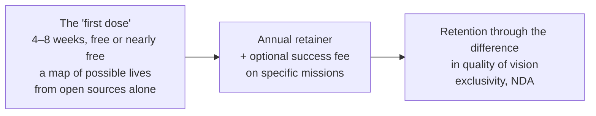

# 4. Personal AGI, OSINT, and the Illusion of Secrecy: Whom to Begin With and How It Sells

**A private document. Not for open publication.** This is the fourth of five essays in the Trajectories series. The third assembled the form: a personal analytic center for every human being — the Guardian, translated from Snegov's science fiction into engineering terms — and ended on the question of who would receive that form first, and at what price. Here I answer it: whom to begin with, how it sells, and where the boundaries of the permissible run. The fifth essay will close the series: two levels of action — changing the world and changing the actor — and the scaling from the individual to the group.

**Alex Krol** — strategy, AI, growth infrastructure

> 🇷🇺 **Russian version:** [Ru/1_Concept/4_personal-agi-osint-go-to-market.md](../../Ru/1_Concept/4_personal-agi-osint-go-to-market.md)

> © 2026 Alex Krol. Private concept document of the Trajectories series. Not for open publication; distribution, quotation, or translation only with the author's explicit written permission.

## Contents

0. [TL;DR — whom to sell the Guardian to, and why them](#tldr)
1. [Why the top segment: they already pay for think tanks](#uhnw)
2. ["Personal AGI" and the "first dose" model](#first-dose)
3. [No one will hand over the data: OSINT and listener agents](#osint)
4. [The illusion of secrecy versus the digital footprint](#illusion)
5. [Ethics as part of the product: consent, transparency, confidence levels](#ethics)
6. [Analysis is cartography of the future](#cartography)
7. [Bottom-up: verticals → invariants → integration](#bottom-up)
8. [Glossary](#glossary)

---

## 0. TL;DR — whom to sell the Guardian to, and why them 

The third essay ended on a question: if every human being can have a personal analytic center, who gets it first. Here is the answer. The Guardian's first market is not a million users but a narrow top stratum: the very wealthy and the very influential. They already maintain personal analytic structures — the family office, consulting, private banking — and a digital decision-making center is, for them, not an exotic novelty but the next layer of familiar infrastructure. It should be sold as personal AGI: no one knows what *AGI* is supposed to be, so what is sold is an experience, not a technology — not a level of intelligence but the level of coverage and coordination that no single advisor possesses. The entry point is the "first dose": a free period during which the system is obligated to stun outright — to show a map of possible lives assembled from open sources alone. No one will hand over private data, and no one needs to: OSINT and the digital footprint provide enough, because scenarios require not secrets but patterns of behavior and connections. The illusion of secrecy among the wealthy works in the product's favor. Ethics — consent, transparency, confidence levels — is not an appendix to the deal but its condition. And analysis, throughout this system, is not a conclusion but cartography of the future: a person sails not across a sea but through time.

---

## 1. Why the top segment: they already pay for think tanks 

The choice of a first market is not a question of who needs the product most. It is a question of who does not need the product's right to exist explained to them. The very wealthy and influential — *UHNW*, *ultra-high-net-worth* families and individuals — already finance personal *think tanks*, analytic staffs serving a single family: the *family office* (a private structure that manages a family's capital and affairs), consulting, coaches, *private banking*, political and media consulting. The UBS report on 317 family offices shows the scale of this habit: the average family's wealth is 2.7 billion dollars, and running the office itself costs 0.35–0.44 percent of capital per year[^famoff]. Sociology gives this a precise name — the infrastructure of dynastic wealth: confidentiality, trust, service to the family on a generational horizon[^dynwealth]. To a person who already maintains such a structure, the idea of a "digital analytic center with continuous accompaniment" does not sound like science fiction. It sounds like the next layer of the same infrastructure.

A ready consumer context sits nearby as well. I observe the luxury-services market experimenting with AI concierges, personal digital assistants, and human-plus-AI hybrids carrying subscriptions in the tens of thousands of dollars a year — this is my observation of the segment, not statistics. But the pattern is legible: the segment is already prepared to pay for accompaniment of this kind, and the product in question is a smarter, scenario-driven, more strategic variant of the same pattern. Not a concierge that books reservations, but a staff that navigates.

The top segment has a third property, a purely engineering one: a high ticket buys time. While clients number in the single digits and each pays as for a strategic advisor, one can run deeply customized pilots, accumulate scenarios and refine the core, road-test the ethics and the boundaries of intervention — without the pressure to "scale to a million users" that kills an architecture before it has time to take shape.

What exactly is sold to such a client. A personal decision-making center — the very functions assembled in the third essay: observation, scenarios, positioning, communication, security; a team of agents and a few humans who build and maintain a map of scenarios across the client's principal verticals — capital, influence, health, legacy, family. What is sold is integration, not competition: the family office, the banks, the lawyers, the foundations, the medical providers stay in place and become sources of signals and objects of scenarios, while the system is layered above them as a single navigator. And what is sold is value of a different scale — not the optimization of a single investment decision, but the coherence of the entire portfolio of projects, people, initiatives, and legacy: the level of a life's course and a dynasty's, the very horizon on which the family office is already accustomed to operate[^dynwealth].

Here, too, is an honest fork that I record at once. This segment sharpens everything: trust, privacy, political risks. The security core will have to be built from day one, not "later." But it is precisely this segment that gives the system access to **rich multidimensional trajectories** — to lives in which capital, influence, family, and reputation are interwoven most densely — and it is on such trajectories that the scenario component trains best. And then, as in Snegov, the construction descends: from "Guardians for the gods" to mass lightweight versions on the same core.

---

## 2. "Personal AGI" and the "first dose" model 

It should be sold as personal AGI. The phrase lands in the segment's imagination precisely because no one — not the laboratories, not the regulators, not the clients themselves — knows what *AGI* (*artificial general intelligence*) is supposed to be. This looks like a weakness: how does one sell what has no definition. To me it is open space. What is sold is an experience, not a technology, and the key lies not in the word AGI but in the promise. Not "a better chatbot" but a personal navigational brain across all of the client's verticals: capital, business, family, health, status, legacy. A single point that sees the whole picture and helps construct trajectories rather than dispensing disconnected advice. What is sold is not AGI as a level of intelligence — what is sold is **the level of coverage and coordination** that no single advisor possesses today: the banker, the lawyer, and the head of the family office each see their own sector, and no one sees the whole.

The entry point is the "first dose" model. A free or nearly free trial period: four to eight weeks of an analytic center bolted onto the client's life — connection to permitted data, construction of the map, accompaniment of several major decisions. The period's goal is not to prove predictive accuracy. The goal is to let the client feel a new kind of awareness and coordination across all verticals at once: a state in which the whole picture is gathered at a single point and decisions stop contradicting one another. After the trial period — an annual retainer at a high ticket, on the logic of the family office and the strategic advisor, and optionally a success fee on specific missions: deals, restructurings, major personal decisions.

The terms of entry come from the same segment. Strict exclusivity: a limited number of clients, an NDA (non-disclosure agreement) covering the very fact of the engagement. And a human face on the service — a team rather than a voice from nowhere, to lower the anxiety of the first dose. Exclusivity here is not a pose but a mechanism: research on luxury consumption shows that the wealthiest buyers, those with the lowest need to display status, pay a premium for "quiet" markers recognizable only to their own kind[^luxsignal], and the status component of an expensive purchase as such was described as far back as Veblen — consumption as a signal of position[^veblen]. A closed club with an NDA is a continuation of the same mechanism.

Now the honest part, without which the whole package turns into hype. "Personal AGI" is a marketing label. Beneath it is a scenario-driven, *data-driven* system, far removed from the autonomy that Snegov's Guardian possessed. But it already delivers what no single consultant can: cross-vertical consistency — decisions about capital, family, and reputation are coherent with one another — and memory for trajectories rather than for individual meetings. The client's chief fear in this segment is a machine's confident but wrong and context-blind advice. So a validation layer and a manual sieve, transparency in the logic of recommendations, and clear boundaries of responsibility are built into the product from day one: this is a navigator, not an autopilot without a pilot.

And then the psychology of the dose takes over. If several weeks have been lived with a system that holds the whole picture at once, giving it up means returning to scattered advisors and the blind zones between them. Having grown used to a new level of awareness and coordination, walking away is psychologically expensive. The entire model rests on this: retention not by contract but by the difference in quality of vision.

---

## 3. No one will hand over the data: OSINT and listener agents 

Now the sober move, without which everything above remains a slide deck. No one will grant access to private data. Not banking data, not corporate, not medical — and the wealthier the client, the harder the perimeter. The tempting conclusion is that a personal center is impossible without years of accumulated trust. The conclusion is wrong. No one will hand over the data — and no one needs to.

The client permits the agent to listen and to collect what is open: public social media, speeches, interviews, corporate reports, court and registry records, the press — plus whatever the client voluntarily speaks aloud to the assistant in voice and text and considers non-secret. The collection and analysis of open sources is not a hobbyist improvisation but an established intelligence discipline with more than half a century of history: *OSINT*, *open-source intelligence*, with its own definitions and its own cycle[^osint]. The modern survey literature describes exactly the toolkit needed here: systems that gather, process, and correlate scattered points of open cyberspace into coherent knowledge[^osintsurvey].

Within the center's architecture, this is the work of listener agents: specialized OSINT agents that collect and normalize open information and build a profile of trajectories and context. They do not break into private repositories — they operate as a very intelligent, long-lived researcher of a person and their surroundings. In the terms of the core from the third essay, this stream feeds the observation-and-mapping function and supplies material to the scenario function — the real trajectories of people of this class, their outcomes, their patterns.

And then — stun outright. From the accumulated profile, the system generates several deeply plausible scenarios of the future — for career, business, influence, risks, public reputation — and shows the person a map of possible lives that ordinarily only expensive consulting plus years of experience can provide. It does so quickly and unexpectedly. But the key is not in the showmanship. The key is for the person to feel that the system sees them in the context of the world and can construct non-trivial scenarios rather than summarize the news. Surprise sells the first meeting; depth of vision sells the accompaniment.

Thus the order of acquaintance with the form from the third essay takes shape: the "Guardian-as-scout." First she silently observes and builds the map — from public material only. Then she steps out to speak: several strong scenarios and an offer to accompany further. The form itself does not change — what changes is the side from which a person first sees it.

---

## 4. The illusion of secrecy versus the digital footprint 

Here comes the predictable objection: "there is nothing serious about me in the open." The feeling among the wealthy and influential that "everything is under control and everything is secret" diverges sharply from the reality of their footprint. The divergence itself — between declared concern for privacy and actual disclosing behavior — has long been documented; in the literature it is called the *privacy paradox*[^privparadox]. The illusion of secrecy is not the personal naivety of a given individual but a systemic property: everyone is confident of control until someone gathers their footprint in one place.

And the footprint is enormous. Any person of note leaves a mass of open and semi-open points: public registries, deals, court cases, media, social networks, speeches, connections, holdings, patents, donations, foundation memberships. Modern tools assemble this piece by piece from dozens of sources, join it through indirect markers — geography, timing, social circle, speech style — and reconstruct rather accurate profiles and scenarios without hacking anything[^osintsurvey].

The central fact of this section: the aggregated profile reveals an order of magnitude more than any individual point of the footprint. That is not a figure of speech. The classic study of digital footprints showed that Facebook likes alone predict sexual orientation (88% accuracy), race (95%), political views (85%), and personality traits — from signals each of which is innocuous in isolation[^likes]. The law has formalized the same thing as the mosaic theory: a sequence of observations, none of which constitutes a search on its own, becomes one in the aggregate[^mosaic]. And this is already being exploited by more than analysts: according to the FBI, cumulative losses from business email compromise — attacks in which transfers are extracted in executives' names — reached 55.5 billion dollars over ten years[^bec], and an industry survey of cybersecurity executives, conducted by Ponemon on commission from a vendor of executive protection, records that in 42% of organizations key executives or their families have already been targeted by cyberattacks[^execrisk]. The open footprint is a working surface on which other people's systems are already operating. The question is not whether to collect it. The question is who collects it first, and for whom.

Why this works for the product rather than against it. First: no access to the vaults is required. The position is stated politely and powerfully: "I do not need your internal systems — I work with what the world already sees, and with what you yourself tell me." This lowers the entry barrier and the legal risks that crowd any integration with closed banking and corporate perimeters. Second: the illusion-shattering effect. When a map assembled solely from the open footprint and voluntary speech turns out to be too plausible, exactly the right thought fires in the client's mind: "if you saw this from open sources, what will you see with proper access." That is the very first dose of awareness that sells the accompaniment. Third, and most important: building scenarios requires not secrets but **patterns of behavior and connections** — what a person systematically invests in, what they avoid, how their focal points and strategies have shifted over time. This is behavior-as-signal from the third essay, read from outside the perimeter: action, inaction, and speech are visible in the open footprint as well. Behavioral science already measures a person's state minute by minute from the data of their ordinary devices, partly passively[^digphen]; the open footprint is poorer than that stream, but it is structured the same way — and for the scenario component it suffices.

---

## 5. Ethics as part of the product: consent, transparency, confidence levels 

Let me name things plainly: everything described above is the surveillance of people and the sale to them of that surveillance's results. How the boundaries are drawn determines what is being built here — a navigator or an instrument of pressure. The debate over OSINT profiling is real and published: security researchers state directly that the collection and mining of open data demand checks and accountability that practice does not yet have[^osintethics]. And the same aggregation in other hands is a weapon: *doxing*, the deliberate publication of collected personal information, is described in the academic literature complete with a typology of its varieties[^doxing]. The boundary between mirror and weapon does not arise on its own. It must be built in — built into the deal, not into a disclaimer.

The first principle: everything by consent. No secret dossiers. A direct proposal: "let us look at what the world already knows about you and what scenarios follow from it." In this frame, OSINT acts not as a weapon but as a mirror: the person sees their own footprint, gathered into one place, before someone else gathers it for other purposes. And the assembled profile is protected from third parties as strictly as openly it was collected: the material belongs to the relationship between the client and their center, not to the data market.

The second principle: transparency of method. No marketing mysticism. The honest formula: "we use open data, the digital footprint, and the statistics of similar trajectories" — not "we know your destiny." The temptation of mystique is strong in this segment, because the first-dose effect already looks like magic. To yield to it is to sell an oracle, and an oracle breaks on its first wrong prediction.

The third principle: confidence levels against the illusion of omniscience. OSINT yields many signals, but it is noisy and incomplete. Scenarios are never presented as fated predictions — only as hypotheses with explicit confidence levels and alternative branches. This is more honest, and it is more robust: a system that shows the limits of its knowledge survives its errors; a system that plays at omniscience does not survive even the first.

And finally — delivery. The wealthy and influential live in a dense field of projections — other people's expectations, fears, and fantasies are constantly trained on them, and a strong portrait almost inevitably touches sensitive zones. Hence the need for a containment component: insights are delivered so that they can be lived through and converted into action, not so that they merely frighten. A frightened client does not buy navigation — they shut down. In the third essay, the security-and-limits function was built into the core as an architectural layer; here it ceases to be architecture alone and becomes a condition of the deal.

---

## 6. Analysis is cartography of the future 

Now about the word "analysis," because in this system it means something other than what it means in reports. Analysis here is not "drawing a conclusion" and not producing a single number or a single answer. Analysis is composing a map of opportunities and threats at a chosen scale — personal life, business, city, industry — and continuously refining it against signals. To a client's question the system responds not with an answer but with a position: where they now stand on the map, which routes are available from that point, which forces are probable along them, where the zones of risk lie and where the zones of high value lie for their particular profile. From such a map come recommendations of course, not commands: not "do X" but "if you want to drift into this sector, the optimal heading to take now is such-and-such." If a single image is needed, it is a map of an archipelago on which what is charted is not shorelines but probabilities.

And then the final reformulation, for the sake of which this entire ending was written. A person sails not across a sea — **a person sails through time**, through the geometry of probable events and trends. The scenario space is not a static geometry of states but a bundle of possible future trajectories in time. Every step — action, inaction, a word — slightly shifts the distribution of probabilities across that bundle. The agent does not predict the future. It helps choose a course through the fan of future opportunities and risks: where to shift probability, which branches to strengthen, which to weaken — and when. When to catch a favorable trend, when to wait one out, when to go around, when to change the scenario altogether. Time is the only axis along which movement is compulsory; choice remains only in which channels to follow.

The Guardian, in this optic, is a navigational brain for time. She looks not at a static map but at a dynamic geometry: how trends, risks, and opportunities change as time runs; where the person has been, where they are now, into which regions of the future their current drift is pulling them. The future is not given, but it has structure: there are more and less probable channels, more and less productive directions for a particular person. Here runs the boundary between this architecture and any chat assistant, and it is not quantitative but a matter of problem statement. A chat answers the question "what is the right reply right now." This system answers the question "how to live so that, in time, you arrive in the regions of the future that are worth it."

---

## 7. Bottom-up: verticals → invariants → integration 

At the level of metaphor this all sounds beautiful. It remains to be built. And here I deflate the pathos myself, ahead of any critic: a universal metamodel built without real trajectories will almost certainly come out too beautiful and too abstract. So the path is not to build the universal Guardian at once.

First — vertical cores and narrow *project-OS*, operational scaffolds for specific tasks and even for individual project types: a state map, a scenario space, signals of action and inaction, a layer of recommendations on the vector. A vertical immediately provides what philosophy does not: real signals, intelligible metrics of success, a bounded scenario space, a fast cycle of learning from errors. That is something that can already be carried to product.

Then — comparison of implementations. After several project and vertical builds, it becomes visible what repeats: entities, agent roles, the contracts between them, types of memory, the logic of scenario selection. From the repetitions the invariants are extracted: a single model of the subject's position, a single format for scenario and trajectory, a single model of signals, a single drift-and-vector function, a single layer of memory and decision history. That is what becomes the real core — not out of philosophy, but out of the recurring patterns of several working verticals. And only then integration, and not as "wire everything into one interface" but as shared invariants beneath different maps: the verticals remain different maps of the terrain but run on a single engine. This confirms the first essay's claim: value settles not in the model but in the scaffolding — in the *scaffold*, the agentic OS that holds memory, scenarios, and positioning. The UHNW line, in this logic, is a parallel experiment, not the first step: the expensive custom analogue of the Guardian for a narrow stratum is built alongside the simplified verticals, and all of it on a shared core.

The criterion for the first vertical, meanwhile, is down-to-earth. Not "the greatest," but the one with its own flow of tasks, where results show quickly, where signals are plentiful, where errors can be survived, and where the value is easy to explain to the user. The right to be wrong matters more here than the grandeur of the design: the core learns from outcomes, and outcomes must stay cheap while the system is young.

Throughout this essay, the navigator guided a person through the external world: capital, market, reputation, connections. But in any scenario, some of the moves are directed not outward but inward — they change not the world but the actor: what they can do, and what they are able to withstand. That second level of action is the subject of the next, final essay of the series.

---

## Sources

[^famoff]: UBS (2025). Global Family Office Report 2025. Survey of 317 family offices from UBS's client base (January–April 2025): average family wealth $2.7 billion, average AUM $1.1 billion; the cost of running a family office is 0.35–0.44% of capital per year. UHNW already maintain personal structures for managing life and capital. https://www.ubs.com/global/en/wealthmanagement/family-office-uhnw/reports/global-family-office-report.html

[^dynwealth]: Glucksberg L., Burrows R. (2016). Family offices and the contemporary infrastructures of dynastic wealth. *Sociologica*, 2/2016. doi:10.2383/85289. The family office as the infrastructure of dynastic wealth: confidentiality, trust, service to the family on a generational horizon. https://researchonline.lse.ac.uk/id/eprint/75899/

[^luxsignal]: Han Y. J., Nunes J. C., Drèze X. (2010). Signaling Status with Luxury Goods: The Role of Brand Prominence. *Journal of Marketing*, 74(4), 15–30. doi:10.1509/jmkg.74.4.015. The wealthiest consumers, those with the lowest need for status display, pay a premium for "quiet" luxury recognizable only to their own kind — the mechanics of the top segment's closedness and exclusivity. https://journals.sagepub.com/doi/10.1509/jmkg.74.4.015

[^veblen]: Veblen T. (1899). The Theory of the Leisure Class. New York: Macmillan. Conspicuous consumption: spending as a signal of social position; the purchase of an ultra-expensive personal service carries a status component beyond its function. https://www.gutenberg.org/ebooks/833

[^osint]: Williams H. J., Blum I. (2018). Defining Second Generation Open Source Intelligence (OSINT) for the Defense Enterprise. Santa Monica, CA: RAND Corporation, RR-1964-OSD. The definition of OSINT and open source information, the discipline's 50+ year history, the OSINT cycle. https://www.rand.org/pubs/research_reports/RR1964.html

[^osintsurvey]: Pastor-Galindo J., Nespoli P., Gómez Mármol F., Martínez Pérez G. (2020). The Not Yet Exploited Goldmine of OSINT: Opportunities, Open Challenges and Future Trends. *IEEE Access*, 8, 10282–10304. doi:10.1109/ACCESS.2020.2965257. OSINT systems gather, process, and correlate points of open cyberspace into coherent knowledge — a survey of services and techniques. https://doi.org/10.1109/ACCESS.2020.2965257

[^privparadox]: Kokolakis S. (2017). Privacy attitudes and privacy behaviour: A review of current research on the privacy paradox phenomenon. *Computers & Security*, 64, 122–134. doi:10.1016/j.cose.2015.07.002. A review of the *privacy paradox*: declared concern for privacy systematically diverges from actual disclosing behavior. https://www.sciencedirect.com/science/article/abs/pii/S0167404815001017

[^likes]: Kosinski M., Stillwell D., Graepel T. (2013). Private traits and attributes are predictable from digital records of human behavior. *PNAS*, 110(15), 5802–5805. doi:10.1073/pnas.1218772110. Facebook likes (n>58,000) predict sexual orientation (88%), race (95%), political views (85%), and personality traits: the aggregated profile reveals more than any single point of the footprint. https://www.pnas.org/doi/full/10.1073/pnas.1218772110

[^mosaic]: Kerr O. S. (2012). The Mosaic Theory of the Fourth Amendment. *Michigan Law Review*, 111(3), 311–354. The legal formalization of the mosaic effect (from United States v. Jones, the GPS-surveillance case): a sequence of observations, none of which constitutes a "search" on its own, becomes one in the aggregate. https://repository.law.umich.edu/mlr/vol111/iss3/1/

[^bec]: FBI Internet Crime Complaint Center (IC3). Business Email Compromise: The $55 Billion Scam. Public Service Announcement I-091124-PSA, September 11, 2024. Cumulative losses from BEC attacks (business email compromise, including transfers extracted in executives' names) for 2013–2023: $55.5 billion, 186 countries. https://www.ic3.gov/PSA/2024/PSA240911

[^execrisk]: Ponemon Institute (2023). Understanding the Serious Risks to Executives' Personal Cybersecurity & Digital Lives. Sponsored by BlackCloak. An industry survey of 553 cybersecurity executives (US): in 42%, key executives or members of their families have already been targeted by a cyberattack; 62% of organizations have no team for protecting executives' personal digital lives. A vendor-sponsored report, Ponemon methodology. https://blackcloak.io/white-papers-reports/ponemon-understanding-the-serious-risk-executives-personal-digital-lives/

[^digphen]: Torous J., Kiang M. V., Lorme J., Onnela J.-P. (2016). New Tools for New Research in Psychiatry: A Scalable and Customizable Platform to Empower Data-Driven Smartphone Research. *JMIR Mental Health*, 3(2):e16. Digital phenotyping — minute-by-minute quantitative assessment of a person's state from personal-device data; part of the data is collected passively. https://mental.jmir.org/2016/2/e16/

[^osintethics]: Eijkman Q., Weggemans D. (2013). Open source intelligence and privacy dilemmas: Is it time to reassess state accountability? *Security and Human Rights*, 23(4), 285–296. The collection and mining of open data (social media, blogs, apps) require checks and balances; accountability mechanisms lag behind practice. https://brill.com/view/journals/shrs/23/4/article-p285_5.xml

[^doxing]: Douglas D. M. (2016). Doxing: a conceptual analysis. *Ethics and Information Technology*, 18(3), 199–210. doi:10.1007/s10676-016-9406-0. Doxing — the deliberate publication of personal information by a third party; a typology (deanonymizing, targeting, delegitimizing). The same aggregation of open data, in other hands, is a weapon. https://link.springer.com/article/10.1007/s10676-016-9406-0

---

## Glossary 

The load-bearing language of this essay is the form assembled in the third essay and the ontology of the first two; the series' core terms are given briefly at the end, marked with their owning essay, and are not redefined. The new layer here is product and market: the first market, the entry model, the data source, and the boundaries of the permissible. Entries are ordered by the course of the argument, not alphabetically.

### What this essay introduces

**The top segment as first market** — the principle for choosing a first market: not whoever needs the product most, but whoever does not need its right to exist explained. The ultra-wealthy already maintain personal analytic structures, so a digital decision-making center is, for them, the next layer of familiar infrastructure, while a high ticket buys time: deeply customized pilots and the road-testing of the core without the pressure of mass scaling. Then, as in Snegov, the construction descends — to mass lightweight versions on the same core.

**Rich multidimensional trajectories** — the author's argument for starting at the top beyond the money: lives in which capital, influence, family, and reputation are interwoven most densely. On such trajectories the system's scenario component trains best.

**Personal decision-making center** — the product form of the personal analytic center from the third essay: the functions of observation, scenarios, positioning, communication, and security; a team of agents and a few humans who build and maintain a map of scenarios across the client's principal verticals — capital, influence, health, legacy, family. What is sold is value of a different scale: not the optimization of a single decision but the coherence of the entire portfolio of projects, people, initiatives, and legacy.

**Integration, not competition** — the positioning relative to existing advisors: the family office, banks, lawyers, foundations, and medical providers stay in place, become sources of signals and objects of scenarios, while the system is layered above them as a single navigator.

**"Personal AGI"** — a marketing label, not a technical promise: no one knows what AGI is supposed to be, so what is sold is an experience, not a technology. The honest part of the package: beneath the label is a scenario-driven, data-driven system far removed from the autonomy of Snegov's Guardian, yet already delivering what no single consultant can.

**The level of coverage and coordination** — what is sold under the AGI label in place of a level of intelligence: a personal navigational brain across all of the client's verticals, a single point that sees the whole picture and helps construct trajectories rather than dispensing disconnected advice. The banker, the lawyer, and the head of the family office each see their own sector — no one sees the whole.

**The "first dose"** — the author's entry model: a free or nearly free period of four to eight weeks during which the system is obligated to stun outright. The period's goal is not to prove predictive accuracy but to let the client feel a new kind of awareness and coordination across all verticals at once; afterward, an annual retainer on family-office logic and optionally a success fee on specific missions. Retention is built not on contract but on the difference in quality of vision: having lived several weeks with the assembled picture, returning to scattered advisors and the blind zones between them is psychologically expensive.

**Exclusivity as mechanism** — terms of entry drawn from the segment's own world: a limited number of clients, an NDA covering the very fact of the engagement, a human face on the service — a team rather than a voice from nowhere. Not a pose but a mechanism: the wealthiest pay a premium for "quiet" markers recognizable only to their own kind, and a closed club continues the same logic of status signaling.

**Cross-vertical consistency** — the first of the system's two honest advantages already available today: decisions about capital, family, and reputation are coherent with one another, and memory works on trajectories rather than on individual meetings.

**A navigator, not an autopilot** — the answer to the client's chief fear in this segment (a machine's confident but wrong and context-blind advice): a validation layer and a manual sieve built in from day one, transparency in the logic of recommendations, and clear boundaries of responsibility.

**Listener agents** — the center's specialized OSINT agents: they collect and normalize open information, plus whatever the client voluntarily speaks in voice and text, and build a profile of trajectories and context. They do not break into private repositories — they operate as a very intelligent, long-lived researcher of a person and their surroundings; their stream feeds the observation-and-mapping function and supplies material to the scenario function.

**Patterns of behavior and connections** — what scenario-building requires in place of secrets: what a person systematically invests in, what they avoid, how their focal points and strategies have shifted over time. Behavior-as-signal from the third essay, read from outside the perimeter: action, inaction, and speech are visible in the open footprint as well.

**"Stun outright"** — the task of the first dose: quickly and unexpectedly show a map of possible lives — several deeply plausible scenarios of the future for career, business, influence, and risks, assembled from open sources alone. The key is not in the showmanship: surprise sells the first meeting, depth of vision sells the accompaniment.

**The "Guardian-as-scout"** — the order of acquaintance with the form from the third essay: first the system silently observes and builds the map from public material only, then it steps out to speak — several strong scenarios and an offer to accompany further. The form itself does not change — what changes is the side from which a person first sees it.

**Digital footprint** — the mass of open and semi-open points that any person of note leaves behind: registries, deals, court cases, media, social networks, speeches, connections, holdings, patents, donations. A working surface on which other people's systems are already operating[^osintsurvey]; the question is not whether to collect it but who collects it first, and for whom.

**The illusion of secrecy** — a systemic property, not personal naivety: everyone is sure that "there is nothing serious about me in the open" until someone gathers their footprint in one place. In the literature, the divergence between declared privacy and actual behavior bears the name *privacy paradox*[^privparadox]; for the product the illusion works in its favor — a map assembled from the open footprint alone produces the illusion-shattering effect and sells the accompaniment.

**Aggregated profile** — the central fact of the fourth section: the footprint gathered into one place reveals an order of magnitude more than any individual point. The empirical anchor is the prediction of sensitive traits from innocuous likes[^likes]; the legal anchor is the mosaic theory[^mosaic].

**Ethics as a condition of the deal** — the boundary between mirror and weapon does not arise on its own: it is built into the deal, not into a disclaimer[^osintethics]. Three principles: everything by consent; transparency of method — the honest formula "we use open data, the digital footprint, and the statistics of similar trajectories" in place of an oracle that breaks on its first wrong prediction; and confidence levels. The security-and-limits function from the third essay here ceases to be architecture alone and becomes a condition of the deal.

**OSINT as mirror, not weapon** — the first principle, unpacked: no secret dossiers; the person sees their own footprint, gathered into one place, before someone else gathers it for other purposes. The assembled profile belongs to the relationship between the client and their center, not to the data market, and is protected from third parties as strictly as openly it was collected.

**Confidence levels against the illusion of omniscience** — scenarios are presented not as fated predictions but as hypotheses with explicit confidence levels and alternative branches. A system that shows the limits of its knowledge survives its errors; a system that plays at omniscience does not survive even the first.

**The containment component (insight delivery)** — the requirement on how a strong portrait is delivered to a person living in a dense field of others' projections: insights must be livable and convertible into action, not merely frightening. A frightened client does not buy navigation — they shut down.

**Cartography of the future (analysis)** — the redefinition of the word "analysis" for the whole system: not a conclusion and not a single number, but a map of opportunities and threats at a chosen scale, continuously refined against signals; the system responds not with an answer but with a position, and gives recommendations of course rather than commands. The scenario space in this optic is a bundle of possible future trajectories: every step slightly shifts the distribution of probabilities across the bundle, and time remains the only axis along which movement is compulsory. The closing image is a map of an archipelago charted not with shorelines but with probabilities, and a person sailing not across a sea but through time; the Guardian here is a navigational brain for time.

**The problem-statement boundary with the chat assistant** — the difference is not quantitative but a matter of problem statement: a chat answers the question "what is the right reply right now"; this system answers the question "how to live so that, in time, you arrive in the regions of the future that are worth it."

**"Bottom-up: verticals → invariants → integration"** — the implementation path in place of building the universal Guardian at once: first vertical builds, then comparison of implementations and extraction of invariants, and only then integration — not "everything into one interface" but shared invariants beneath different maps: the verticals remain different maps of the terrain but run on a single engine. The UHNW line in this logic is a parallel experiment, not the first step. A confirmation of the first essay's claim: value settles not in the model but in the scaffolding — the *scaffold*, the agentic OS that holds memory, scenarios, and positioning.

**Vertical cores and project-OS** — narrow operational scaffolds for specific tasks and even individual project types: a state map, a scenario space, signals of action and inaction, a layer of recommendations on the vector. A vertical provides what philosophy does not: real signals, intelligible metrics of success, a bounded scenario space, a fast cycle of learning from errors.

**Invariants** — what repeats across several working builds: a single model of the subject's position, a single format for scenario and trajectory, a single model of signals, a single drift-and-vector function, a single layer of memory and decision history. The real core is assembled from these repetitions, not from philosophy.

**The right to be wrong (criterion for the first vertical)** — the first vertical is chosen not as "the greatest" but as the one with its own flow of tasks, quickly visible results, plentiful signals, cheap errors, and value that is easy to explain to the user. The core learns from outcomes, and outcomes must stay cheap while the system is young.

### External concepts brought in

**UHNW (*ultra-high-net-worth*)** — ultra-wealthy families and individuals; in this essay, the Guardian's first market.

**Family office** — a private structure managing a family's capital and affairs; adjacent to it, *private banking*. Sociology describes the family office as the infrastructure of dynastic wealth: confidentiality, trust, service to the family on a generational horizon[^dynwealth]; in this essay, proof that the segment's habit of maintaining a personal analytic staff already exists[^famoff].

**AGI (*artificial general intelligence*)** — has no agreed definition among laboratories, regulators, or clients. What matters in this essay is precisely that indeterminacy: it turns "personal AGI" from a technical term into a space for the promise of an experience.

**Status signaling through luxury ("quiet" luxury)** — a finding of luxury-consumption research: the wealthiest buyers, those with the lowest need to display status, pay a premium for markers recognizable only to their own kind[^luxsignal]. In this essay, the basis for the mechanics of the closed club with an NDA.

**Conspicuous consumption (Veblen)** — spending as a signal of social position[^veblen]; in this essay, the status component of an ultra-expensive personal service beyond its function.

**OSINT (*open-source intelligence*)** — intelligence from open sources: an established discipline with more than half a century of history, its own definitions and its own cycle[^osint]; modern systems gather, process, and correlate scattered points of open cyberspace into coherent knowledge[^osintsurvey]. In this essay, the toolkit of the listener agents.

**Privacy paradox** — the documented divergence between declared concern for privacy and actual disclosing behavior[^privparadox]; in this essay, the literature's name for the illusion of secrecy.

**Mosaic theory** — the legal formalization of the aggregation effect: a sequence of observations, none of which constitutes a search on its own, becomes one in the aggregate[^mosaic]. In this essay, legal confirmation that the aggregated profile is qualitatively stronger than the sum of its points.

**Business email compromise (BEC)** — a class of attacks in which transfers are extracted in executives' names; cumulative losses of 55.5 billion dollars over ten years[^bec]. In this essay, proof that other people's systems are already working the open footprint.

**Doxing** — the deliberate publication of collected personal information by a third party[^doxing]; in this essay, a reminder that the same aggregation in other hands becomes a weapon.

**Digital phenotyping** — minute-by-minute quantitative assessment of a person's state from the data of their ordinary devices, part of it collected passively[^digphen]; introduced in the series in the third essay. Here, evidence that the open footprint is structured as the same stream, only poorer — and that for the scenario component it suffices.

### Core terms of the series (brief)

Full definitions live in the glossaries of the owning essays; here the terms are used verbatim per the series registry.

**The Guardian** (essay 3) — the fictional prototype of the entire construction, from Snegov's *Humans as Gods*: a personal mentor-guide for every human being, linked to the mind of the civilization; the author extracts the principle of organization, not a copy of the fairy. In this essay she acquires a market, a price, and an order of acquaintance.

**Personal analytic center** (essay 3) — not one large agent but a center of five function-departments for each person; each is served by a group of agents, with contracts between the functions. Here, what is sold to the top segment as a personal decision-making center.

**Core functions and contracts** (essay 3) — five functions: observation/mapping, scenarios/trajectories, positioning/portfolio, interpretation/communication, security/limits — plus the interfaces between them. The listener agents in this essay feed the first and supply material to the second.

**The security-and-limits function** (essay 3) — the function that turns the construction from surveillance into navigation: privacy, limits on intervention, a filter for toxic scenarios. Here it ceases to be an architectural layer alone and becomes a condition of the deal.

**Behavior-as-signal** (essay 3) — reading position not from a questionnaire but from action, inaction, and speech as a continuous data stream. Here it is read from outside the perimeter — from the open footprint.

**Signal for navigation, not for evaluation** (essay 3) — the boundary of the principle "everything is a signal": the stream tunes navigation to a person's vector; it does not issue grades and does not keep a dossier. The ethical frame of the fifth section stands on this boundary.

**The core (the ontology triad)** (essay 3) — model of reality → scenario space → positioning layer; the order of the layers is invariant. Here the core is what is honed on pilots and reassembled from the invariants of working verticals.

**Vertical** (essay 2) — a sphere of complex life as the same ontology with specific constraints, forces, and agents. Here, both the client's verticals (capital, influence, health, legacy, family) and the vertical builds of the bottom-up path.

**Scenario space** (essay 1) — a map of routes on top of the model of reality. In this essay's finale it is read in time: a bundle of possible future trajectories.

**Trajectory** (essay 1) — a stretch of time across which an agent plans, acts, observes, corrects course, and accumulates experience. Here, both the system's training material and the object of its memory.

**Drift** (essay 1) — the displacement of a trajectory under the action of steps and vector; the geometry of movement matters more than the quality of any single step. Here, what pulls a person into particular regions of the future.

**Productive vector** (essay 1) — the direction of movement in scenario space; the object of control in place of any single answer. The recommendations of course in this essay are recommendations on the vector.

**Fan of scenarios** (essay 1) — the set of trajectories available from the current point. The course in section six is chosen through the fan of future opportunities and risks.
