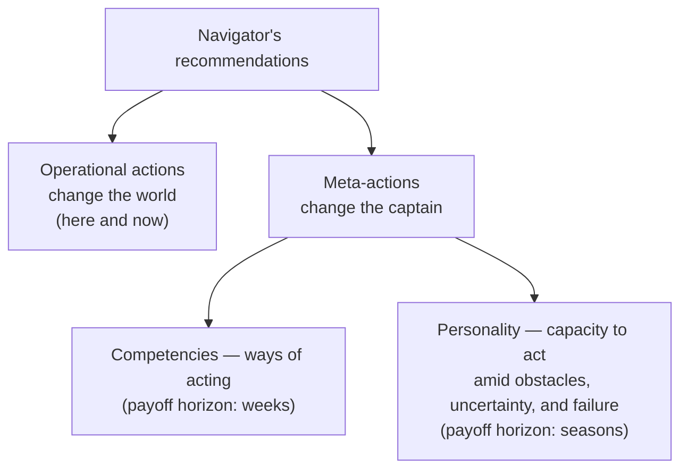

# 5. Two Levels of Action and Group Dynamics: Changing the World, Changing the Captain, Seeing the Fleet

**A private document. Not for open publication.** This is the fifth and final essay of the Trajectories series. In the first, I replaced the atom of intelligence — from the answer to the trajectory. In the second, I showed that a single ontology lies beneath all the verticals. In the third, I merged the verticals into one multidimensional space of life and gave the core a form — a personal analytical center. In the fourth, I brought that form to its first clients and traced the boundaries of what it is allowed to know and do. Here are the two final deepenings: a person's actions decompose into two levels — directed at the world and at the self — and navigation rises from the single person to the group. With this, the series closes.

**Alex Krol** — strategy, AI, growth infrastructure

> 🇷🇺 **Russian version:** [Ru/1_Concept/5_two-levels-and-group-dynamics.md](../../Ru/1_Concept/5_two-levels-and-group-dynamics.md)

> © 2026 Alex Krol. Private concept document of the Trajectories series. Not for open publication; distribution, quotation, or translation only with the author's explicit written permission.

## Table of Contents

0. [TL;DR — the navigator steers more than the route](#tldr)
1. [Two levels of action: changing the world and changing oneself](#two-levels)
2. [Competencies and personality as objects of navigation](#competence-personality)
3. [Diagnosing "what stumbled": three lines of observable signals](#diagnostics)
4. [From the individual to the group: the collective subject](#collective-subject)
5. [Navigating the group: one more level of recommendations](#group-navigation)
6. [Coda: five essays as one trajectory](#coda)
7. [Glossary](#glossary)

---

## 0. TL;DR — the navigator steers more than the route 

For four essays in a row, my navigator worked outward: it read the model of reality, built the scenario space, chose the vector. The final move is inward and upward. Across all the verticals, a person has two levels of action: some actions change the external world; others change the person. Competencies determine the ways of acting; personality determines the capacity to act amid obstacles, uncertainty, and failure. The navigator therefore steers more than the route — it steers the captain: it recommends not only external scenarios but also investments in skills and character that widen the space of available scenarios. And it is obliged to distinguish, from observable signals, what stumbled — the scenario, a competency, or a personality resource — because these three failures call for three different answers: change the route, learn to steer better, strengthen the captain.

The second move is upward. A person does not move alone: in teams, families, communities, and organizations, trajectories are interwoven, and a collective subject emerges with its own norms, boundaries, shared resources, and feedback loops. Many "personal" failures are an effect of the group system, not an error of personality. Navigation gains one more level — from the person to the group. And at that level the series closes.

---

## 1. Two levels of action: changing the world and changing oneself 

Up to this point, the navigator looked outward. It read the geometry of constraints, held the person's point on the multidimensional map, compared families of routes — and all the while the person remained a constant for it: a point being moved across the field. The series' final gaze is at the point itself. Across all the verticals, I see two levels of action in a person, and the external one is only the first.

The first level is **operational actions** — those that change the external world. Call a client, ship a release, do a workout, talk to a partner, sign a document. The "what we do" here and now. Such actions have an addressee, a deadline, and an observable result, which is why they are the easiest to track and optimize — all the familiar productivity metrics rest on them.

The second level is **meta-actions**: actions that change the person themselves. This includes the development of competencies — learning, training specific skills, rehearsing behavioral scenarios, reflection. And it also includes work on personality and character: resilience to uncertainty, frustration tolerance, decisiveness, willingness to take risks, the capacity to get back up after failures. A meta-action moves no external metric today. It changes what the person will act with tomorrow.

The result is two axes of influence: on the world — and on one's own future capacity to influence the world. The formula I will use to the end of this essay: **changing the world — and changing the captain**.

The difference between the levels lies not in scale but in the object of action. An operational step strikes external reactive elements — a client, a market, an organism, a relationship — and changes their state. A meta-action changes the active element itself: the one who acts. And this second level has an internal structure on which everything that follows rests: competencies and personality are different things, and confusing them is costly. Competencies determine the ways of acting: what a person knows how to do and how they do it. Personality determines the capacity to act: whether they will continue at all — amid obstacles, uncertainty, and failure. One can be brilliantly skilled and unable. One can be able — and not yet skilled.

The third essay held the person's point across all the axes of life and modeled drift. Now that point acquires a second control loop: the navigator works not only with the route but with the one who walks it. Next I draw the "competencies — personality" pair apart precisely, because the entire diagnostics of this essay rests on it.

---

## 2. Competencies and personality as objects of navigation 

**Competencies** are observable, learnable patterns of behavior and skills in specific contexts. Negotiation, analysis, project management, decision-making under uncertainty — and the last one matters precisely as a skill, not merely a trait: the ability to construct decisions from incomplete data is trainable in the same way the ability to negotiate is. A competency is tied to context and visible in action: a person either holds the structure of a proposal or does not; either hits the timing or blows it. And competencies accumulate: expert-level performance is explained by the accumulated volume of specially organized practice, not by aptitude alone[^ericsson].

**Personality and character** are deep, stable tendencies of behavior. Decisiveness, risk propensity, self-possession. Locus of control — the generalized expectancy of whether outcomes depend on one's own actions or on external forces and chance[^rotter]. Tolerance for ambiguity — the capacity to keep working where data are scarce and interpretations many[^ambiguity]. These tendencies set how a person acts in situations where the plan breaks: whether they withstand stress, whether they continue after a failure, whether they tend to sidestep hard decisions. My formula — personality determines the capacity to act amid obstacles, uncertainty, and failure — has a direct analogue in psychology: the expectation of one's own efficacy decides whether a person undertakes a task, how much effort they invest, and how long they persist in the face of obstacles and setbacks[^bandura].

Personality, for all that, is not set in plaster. Traits shift: a meta-analysis of two hundred intervention studies records measurable trait change over months of purposeful work, and the changes persist[^roberts]. But the comparison of the two levels' speeds I offer as my own observation, not as a theorem: competencies accrue through practice relatively predictably; personality shifts harder and slower — through practice, reflection, and environment, not through a willful decision to become someone else. For the navigator this is a working asymmetry: an investment in a skill pays off on a horizon of weeks, an investment in character on a horizon of seasons, and these horizons must not be mixed within a single recommendation.

Now the consequence for which the pair was drawn apart. The navigator acquires two distinct recommendation functions. The first: external scenarios — which steps to take, which trains to board, which projects and trajectories to launch. This is the visible part of the work, the one a navigator is expected to do. The second: investments in competencies and character — which skills to develop, which practices, experiences, and changes of environment will strengthen the capacity to act under uncertainty and after failures. The second function changes not the route — it changes the fan: whole families of routes closed to the person today open up after an investment in a skill or in a piece of character. The positioning layer gains a new class of moves: not only choosing a scenario from those available, but expanding the very set of the available.

And from here, the chief distinction without which the navigator is blind. It is obliged to tell "here the problem is the choice of scenario" apart from "here the current competencies and personality resources do not allow even a good scenario to be used." These are two different diagnoses with opposite therapies. In the first case, the route must change. In the second, changing the route gains nothing: on the new route the person will stumble over the same place in themselves. A navigator that can make this distinction says not only "the right route is this one," but also "if you want the ability to walk routes like these — invest in this competency and in this piece of character." It ceases to be only a navigator of the external world and becomes a navigator of changing the captain: their skills — and their capacity to act when the sea truly storms.

A beautiful distinction is worth nothing if it cannot be made from data. Next — how the three causes of stalling read in observable signals.

---
## 3. Diagnosing "what stumbled": three lines of observable signals 

The third essay fixed a principle: behavior-as-signal. A person's position is read from action, inaction, and speech, and there are no insignificant acts. Here that principle acquires an applied task. When a person stalls, the navigator must distinguish three pictures in the observable stream: the chosen scenario is bad; the competencies fall short; the personality resource does not hold. From the outside, all three look identical — "it isn't working." Their signals differ. And so do the treatments.

The first picture is the scenario. The person acts energetically and competently, yet the trajectory does not move. The first signal is recurring structural blocks: time after time they run into the same external constraints — regulation, company structure, a saturated market, a business model that does not add up — and run into them on different attempts and from different sides. The second signal is high quality of local steps with a weak cumulative effect: the emails, the product, the negotiations are objectively good, yet the metrics stand still; the feedback from colleagues and the market sounds like "you're doing everything right, but the direction is weak." The third signal is parallel cases: people with similar skills and a similar makeup, in other scenarios — another company, niche, role — show substantially better results. Together the three signals yield the diagnosis: the quality of the steps is not the problem; the problem is the geometry of the route. "The wrong train" from the first essay.

The navigator's answer to this picture is a change of scenario: another market, another format of role, another organizational context, another product angle. Not "one more sales seminar" — the sales are fine as they are. And here the navigator has an argument no lone advisor has: accumulated trajectories. As people pass through the system, it shows which routes actually proved more productive for people with a similar profile. Let me underline the status of this claim: it is my product thesis, not a citation of ready-made external statistics — such a corpus is gathered by the system itself, and the third essay honestly called it a horizon, not an existing artifact.

The second picture is the competency. The scenario is sound, the personality resource suffices, but the skill is lacking. The first signal: errors of one and the same type — the strategy is good, but communication is systematically weak; the ideas are strong, but the timing limps; the analysis is deep, but the proposals are loosely structured. The error migrates from episode to episode without changing shape. The second signal is the specificity of the feedback: the world criticizes the execution, not the choice of goal. "Great idea, but poorly packaged." "The risks aren't worked through." "An unconvincing pitch, half-baked numbers." The contrast with the first picture is telling: there they said "you're doing everything right, the direction is weak"; here the meaning of the feedback is mirror-inverted — the direction is right, the execution itself limps. The third signal is rapid progress under targeted practice: as soon as the person genuinely starts practicing the needed skill — a course with practice, a mentor, *deliberate practice* (specially organized exercises at the edge of one's current level)[^ericsson] — the quality of outcomes rises noticeably. A competency deficit is responsive: invest practice — get a shift.

The navigator's answer is to classify the deficit as a competency deficit and build training scenarios for it. Not "read a book," but a series of small assignments and experiments tied to the chosen scenario, with progress tracked by behavior and results. The navigator supplies not only "where to go" but a study plan fitted to the chosen route. The plan is not a substitute for the route but its rigging: the training makes sense precisely because it serves the scenario the person is already walking into.

The third picture is the costliest, because it is systematically confused with the first two. The ideas are there, the skills are there, yet the capacity to act breaks: under uncertainty, under stress, after a failure. The signals here are read above all in the stream of inaction — the very stream the third essay refused to write off. Avoidance patterns: systematic postponement of key steps — hard conversations, going out to investors, public risks — with full understanding that they are needed. Disorganization under uncertainty: the moment the fog rolls in, there is thrashing, abrupt switching of goals, devaluation of everything already done, a slide into chaos or impulsive decisions. Breakdowns after failures: one serious setback knocks the person out for a long time — projects zeroed out, ties severed, refusal to continue, though objectively the odds are still alive. And the gap between declared goals and behavior: the person consistently chooses safe scenarios that do not lead to their real goals, though the competencies suffice. Perseverance toward distant goals — *grit* — is a separate variable: it predicts whether a person will see things through, over and above talent and intelligence[^grit].

The navigator's answer to this picture is fundamentally different. Not tightening the screws of productivity — disciplinary superstructures strike at the symptom. And not yanking the scenario — onto the new route the person will bring the same fear with them. The work proceeds at the level of personality: small, dosed exposures to uncertainty and risk; practices of reflection and failure post-mortems; work with inner beliefs — what happens to me when everything collapses. And a hard boundary I do not blur: in critical cases, the navigator directly recommends turning to human specialists. Psychotherapy stays with humans. The AI stays a navigator: it sees the signals, classifies the picture, and knows when to hand off.

To pull the three pictures apart, three questions put to the observable stream suffice. First: are there scenarios in which this person is productive? If in other contexts — another role, niche, project — they act far more strongly, the problem lies rather in the specific scenario or in the competency for it, not in the personality: the capacity to act is in place; the context stumbled. Second: is execution stable in calm conditions? If in clear contexts the person executes well but breaks in fog and stress — a personality-level signal: the skill is there; what is lacking is load-bearing capacity. Third: what does the world criticize? If the idea and the model — the scenario level. If the execution — competencies. If they say "everything's fine, but you constantly fail to follow through, back off, bail" — the personality resource.

The whole diagnostics folds into a formula of three answers: change the route; learn to steer better; strengthen the captain. For all its tidiness, it has a ceiling, and the ceiling is not technical. It tacitly assumes the person stalls alone. And a person almost never stalls alone.

---

## 4. From the individual to the group: the collective subject 

Group dynamics must be added to the model: teams, families, interest groups, microcommunities, communities of any kind, organizations — entities in which the scenarios of individual people interact intensively, from cooperation to competition. Without this layer the model is incomplete, because a person does not move in a vacuum — they move in a field of other people's trajectories, roles, norms, and conflicts. Group dynamics as a discipline began with exactly this: the group is a dynamic whole, and a member's behavior is determined by the group's social field, not only by their own properties[^lewin].

One more layer enters the ontology — the **collective subject**: a team, a family, a community, an organization. It has properties of its own, irreducible to the properties of its members: norms, boundaries, subsystems, roles, the distribution of power, shared resources — and a drive toward homeostasis, toward preserving a stable pattern, even when the pattern is unhealthy. The family-systems tradition described this on the densest of collective subjects: the family is a system with boundaries, subsystems, and roles, and the clarity of boundaries between subsystems is a parameter of its functioning[^minuchin]. A group defends its pattern. Anyone who has tried to change inside an old family or an old team knows: the system gently but insistently returns them to the former role.

The main consequence: the scenarios of individual people can no longer be treated as independent. They become **interwoven trajectories** — they reinforce one another, brake one another, compete for resources, enter escalation. Whether the dynamics resolve into cooperation or competition is a question not of good will but of the type of goal interdependence: does the attainment of my goal help yours or hinder it[^deutsch]. Cooperation, at that, requires no sainthood: it arises and holds between perfectly self-interested agents in repeated interactions — through reciprocity; the same mechanics, under negative reciprocity, spins up escalation[^axelrod]. The same pair of people in different goal structures will produce opposite dynamics.

What the navigator must see from here. Not only the personal signals — the interpersonal layer on top of them. Cooperation: who reinforces whom, where there is trust, complementarity of roles, exchange of resources. Competition: who fights whom for status, attention, budget, influence, closeness. The patterns of the system itself: escalation; "success to the successful"; the tragedy of the commons — individually rational use of a shared resource that, summed, destroys the resource for all[^hardin]; goal displacement; quick fixes with deferred harm. These are standard systemic archetypes of organizational dynamics, long since gathered into a canon[^senge]. And group feedback loops: one person's action triggers another's response, the response a counter-response, and out of the chain a stable dynamic assembles that no participant chose; reinforcing and balancing loops are the basic mechanism of systems behavior in general[^meadows]. The navigator now maps not "a person in the world" but a **network of scenarios** in which people continuously influence one another.

For the core, this means a handful of new entities, and only a handful. The individual — a personal trajectory, competencies, character. The collective subject — a family, a team, a community, an organization. Ties between people — trust, power, dependency, affinity, exchange, conflict. Subsystems — coalitions, dyads, departments, the parental subsystem, a community's core. And shared resources — money, time, attention, reputation, emotional energy. Nothing more needs introducing: the rest is already in the triad.

And the sharp thesis for which the group layer is worth building at all: many failures at the individual level are an effect of the group system, not an "error of personality." A competent person may be sitting inside an escalation pattern, or in a system where one person's success constantly drains another's resource — and in personal diagnostics look like a "personality failure": avoiding, not following through, breaking down. Team-level empirics confirm the direction: psychological safety — the shared belief that interpersonal risk in a team is permissible without punishment — is a property of the team, not of the individual, and on it depends whether people learn and whether they deliver results[^edmondson]. The three-level diagnostics of the previous section therefore receives a mandatory amendment: before booking a breakdown to the personality account, the navigator is obliged to check the group layer. Change the route, learn to steer, strengthen the captain — and sometimes none of these: change not the person but the structure of interaction around them.

---
## 5. Navigating the group: one more level of recommendations 

What the group layer changes in the product. Recommendations rise one level — from "what you should do" to "how your interaction is structured." The navigator begins to see and to propose things that do not exist at the individual level. Restructure the roles in a team — because the current distribution wrings some members dry and underloads others, and no personal discipline compensates for that. Show where boundaries in a family are violated and which old patterns are stuck — where every member individually "tries hard" while the system reproduces the same conflict for years. Notice where a community slides into competition where the task demands cooperation — and where this is a question of goal structure, not of bad people. And name the places where individual effort is meaningless until the very structure of interaction is changed.

To the two levels of action from the first section, this adds the third addressee of recommendations. Changing the world. Changing the captain. And changing the structure in which people act together. The third addressee does not cancel the first two — it explains why the first two sometimes fail: the best personal route and a sturdy character lose to a pattern the system reproduces on its own. One more level of navigation appears: not only the captain's route, but the dynamics of the fleet.

This level is read the same way as the individual one — by behavior. Who answers whom and who ignores whom, who takes tasks on and who offloads them, where the group's time, attention, and money flow — the same stream of observable signals, only now its nodes are several people rather than one, and what matters is not only each trajectory but the ties between them. The third essay's principle — a signal for navigation, not for judgment — is doubly binding here: a group layer turned into an instrument for evaluating people instantly degenerates into corporate surveillance. The navigator adjusts the structure to the participants' vectors, not the participants to someone's rating.

The engineering continuation from here is plain: write out the minimal set of group-layer variables for the core — roles, boundaries, resources, conflicts, cooperation, group feedback loops — and label them by the same rules by which the triad labeled the individual verticals: observable signals, classification, dosed intervention. That is work for a specification, not for an essay.

---

## 6. Coda: five essays as one trajectory 

The series began with a change of atom and ended with a complete map. Five movements. The first essay changed the atom of intelligence: not the inference — the "query → answer" pair — but the trajectory: a stretch of time with long memory, over which the system plans, acts, and accumulates experience; what must be steered is the vector, not the individual step. The second ran this core through the verticals — career, business, war, the state, medicine, education, family — and showed that different spheres demand no different intelligences: only their maps differ. The third merged the verticals into the axes of one multidimensional space of life, named the triad as the core explicitly, and gave the construction a form — the personal analytical center, the Guardian carried over from science fiction into engineering terms. The fourth brought the form to its first clients and traced its boundaries: what data it lives on and what it is permitted to do with what it knows. The fifth added the two final dimensions: the navigator steers not only the route but the captain — distinguishing where the scenario stumbled, where a competency did, and where a personality resource did — and sees not only the single person but the group: interwoven trajectories, the collective subject, feedback loops.

In sum: the atom of intelligence is the trajectory; the ontology is one across all spheres; the space of life is one and multidimensional; navigation has a form, a path to market, and boundaries; action has two levels, and the subject has two scales — the person and the group. The world, the person, and the group are read by one core. The map is assembled. With this the series is closed.

---

## Sources

[^ericsson]: Ericsson K. A., Krampe R. T., Tesch-Römer C. (1993). The role of deliberate practice in the acquisition of expert performance. *Psychological Review*, 100(3), 363–406. The primary source on *deliberate practice*: expert-level performance is explained by the accumulated volume of specially organized practice, not by aptitude alone. https://psycnet.apa.org/doi/10.1037/0033-295X.100.3.363

[^rotter]: Rotter J. B. (1966). Generalized expectancies for internal versus external control of reinforcement. *Psychological Monographs: General and Applied*, 80(1), 1–28. The primary source of the concept of "locus of control": a generalized expectancy of whether outcomes depend on one's own actions (internality) or on external forces and chance (externality). https://pubmed.ncbi.nlm.nih.gov/5340840/

[^ambiguity]: Frenkel-Brunswik E. (1949). Intolerance of ambiguity as an emotional and perceptual personality variable. *Journal of Personality*, 18(1), 108–143. The primary source on (in)tolerance of ambiguity as a stable personality variable. https://onlinelibrary.wiley.com/doi/10.1111/j.1467-6494.1949.tb01236.x

[^bandura]: Bandura A. (1977). Self-efficacy: Toward a unifying theory of behavioral change. *Psychological Review*, 84(2), 191–215. Self-efficacy: the expectation of one's own efficacy determines whether a person will begin to act, how much effort they will apply, and how long they will persist in the face of obstacles and setbacks. https://psycnet.apa.org/doi/10.1037/0033-295X.84.2.191

[^roberts]: Roberts B. W., Luo J., Briley D. A., Chow P. I., Su R., Hill P. L. (2017). A systematic review of personality trait change through intervention. *Psychological Bulletin*, 143(2), 117–141. A meta-analysis of 207 studies: personality traits change measurably in the course of interventions, and the changes persist in longitudinal follow-ups. https://pubmed.ncbi.nlm.nih.gov/28054797/

[^grit]: Duckworth A. L., Peterson C., Matthews M. D., Kelly D. R. (2007). Grit: Perseverance and passion for long-term goals. *Journal of Personality and Social Psychology*, 92(6), 1087–1101. *Grit* — perseverance and passion for long-term goals: predicts seeing things through to completion over and above talent and intelligence. https://pubmed.ncbi.nlm.nih.gov/17547490/

[^lewin]: Lewin K. (1947). Frontiers in Group Dynamics: Concept, Method and Reality in Social Science; Social Equilibria and Social Change. *Human Relations*, 1(1), 5–41. The founding of group dynamics: the group is a dynamic whole; an individual's behavior is a function of the group's social field, not only of their own properties. https://journals.sagepub.com/doi/10.1177/001872674700100103

[^minuchin]: Minuchin S. (1974). Families and Family Therapy. Cambridge, MA: Harvard University Press. Structural family therapy: the family is a system with boundaries, subsystems (spousal, parental, sibling), and roles; clarity of boundaries is a parameter of family functioning. https://www.hup.harvard.edu/books/9780674292369

[^deutsch]: Deutsch M. (1949). A Theory of Co-operation and Competition. *Human Relations*, 2(2), 129–152. The classical theory of cooperation and competition: the type of goal interdependence (whether attaining my goal helps or hinders yours) determines whether a group's dynamics turn cooperative or competitive. https://journals.sagepub.com/doi/abs/10.1177/001872674900200204

[^axelrod]: Axelrod R. (1984). The Evolution of Cooperation. New York: Basic Books. Cooperation arises and holds between self-interested agents in repeated interactions through reciprocity (tit-for-tat); the same mechanics under negative reciprocity generates escalation. https://en.wikipedia.org/wiki/The_Evolution_of_Cooperation

[^hardin]: Hardin G. (1968). The Tragedy of the Commons. *Science*, 162(3859), 1243–1248. The primary source of the "tragedy of the commons": individually rational use of a shared resource, summed, destroys the resource for all. https://www.science.org/doi/10.1126/science.162.3859.1243

[^senge]: Senge P. M. (1990). The Fifth Discipline: The Art and Practice of the Learning Organization. New York: Doubleday/Currency. The canon of systems archetypes (Escalation, Success to the Successful, Tragedy of the Commons, Eroding Goals, Fixes that Fail) — recurring structures of organizational dynamics. https://en.wikipedia.org/wiki/The_Fifth_Discipline

[^meadows]: Meadows D. H. (2008). Thinking in Systems: A Primer. White River Junction, VT: Chelsea Green Publishing. Reinforcing and balancing feedback loops as the basic mechanism of systems behavior; "system traps" — escalation, success to the successful, the tragedy of the commons. https://www.chelseagreen.com/product/thinking-in-systems/

[^edmondson]: Edmondson A. (1999). Psychological Safety and Learning Behavior in Work Teams. *Administrative Science Quarterly*, 44(2), 350–383. Psychological safety is a property of the team, not of the individual: the shared belief that interpersonal risk is permissible; it mediates learning and performance (a field study of 51 teams). https://journals.sagepub.com/doi/10.2307/2666999

---
## Glossary 

The essay's load-bearing language is the series' concepts; at the end they are given briefly, marked with their owning essay, and not redefined. What is new here: the two levels of action, the "competencies — personality" pair, the "what stumbled" diagnostics, and the group layer. Entries are ordered by the course of the argument, not alphabetically.

### What this essay introduces

**Operational actions** — the first level of action: those that change the external world. Call a client, ship a release, do a workout, talk to a partner. They have an addressee, a deadline, and an observable result, which is why they are the easiest to track and optimize — all the familiar productivity metrics rest on them.

**Meta-actions** — the second level: actions that change the person themselves. The development of competencies (learning, skill training, rehearsing behavioral scenarios, reflection) and work on personality and character. A meta-action moves no external metric today — it changes what the person will act with tomorrow. The difference between the levels lies not in scale but in the object: an operational step strikes external reactive elements; a meta-action changes the active element itself — the one who acts.

**"Changing the world — changing the captain"** — the author's formula carrying the essay's central pair: two axes of influence — on the world and on one's own future capacity to influence the world. The consequence for the series' construction: the navigator steers not only the route — it steers the captain.

**Competencies** — observable, learnable patterns of behavior and skills in specific contexts: negotiation, analysis, project management, decision-making under uncertainty. They determine the ways of acting — what a person knows how to do and how they do it; they are tied to context, visible in action, and accumulate through practice[^ericsson].

**Personality and character** — deep, stable tendencies of behavior: decisiveness, risk propensity, self-possession. They determine the capacity to act amid obstacles, uncertainty, and failure — whether the person will continue at all. Not set in plaster: traits shift measurably under purposeful work[^roberts]. The comparison of the two levels' speeds the author gives as his own observation: an investment in a skill pays off on a horizon of weeks, an investment in character on a horizon of seasons, and these horizons must not be mixed within a single recommendation.

**The navigator's two recommendation functions** — first: external scenarios (which steps to take, which trains to board, which projects to launch). Second: investments in competencies and character. The second function changes not the route but the fan: families of routes closed to the person today open up after an investment in a skill or in a piece of character. The positioning layer gains a new class of moves — not only choosing a scenario from those available, but expanding the very set of the available.

**The three diagnostic pictures ("what stumbled")** — when a person stalls, the navigator distinguishes in the observable stream: the chosen scenario is bad; the competencies fall short; the personality resource does not hold. From the outside, all three look identical ("it isn't working"), but their signals differ — and so do the treatments. The formula of three answers: change the route — learn to steer better — strengthen the captain.

**The "scenario" picture** — the person acts energetically and competently, yet the trajectory does not move. Signals: recurring structural blocks (the same external constraints on different attempts); high quality of local steps with a weak cumulative effect; parallel cases — similar people in other scenarios show substantially better results. The diagnosis is "the wrong train" (Essay 1's metaphor); the answer is a change of scenario. The navigator's argument here is the accumulated trajectories of people with a similar profile; the status of this argument is the author's product thesis, not ready-made external statistics (Essay 3's horizon, not an existing artifact).

**The "competency" picture** — the scenario is sound, the personality resource suffices, the skill is lacking. Signals: errors of one and the same type, migrating from episode to episode; specificity of feedback — the world criticizes the execution, not the choice of goal; rapid progress under targeted practice. The answer is a study plan fitted to the chosen route: a series of small assignments and experiments tied to the scenario, with progress tracked by behavior and results.

**The "personality resource" picture** — the ideas and the skills are there; what breaks is the capacity to act: under uncertainty, under stress, after a failure. The signals read above all in the stream of inaction: avoidance patterns around key steps; disorganization under uncertainty; breakdowns after failures; the gap between declared goals and behavior. The answer is work at the level of personality: dosed exposures to uncertainty and risk, practices of reflection and failure post-mortems. Not disciplinary superstructures (they strike at the symptom) and not a change of scenario — onto the new route the person will bring the same fear.

**The three diagnostic questions** — the way to pull the three pictures apart by the observable stream. Are there scenarios in which the person is productive? — if so, the context stumbled, not the personality. Is execution stable in calm conditions? — if it breaks only in fog and stress, it is a personality-level signal. What does the world criticize? — the idea and the model: the scenario; the execution: competencies; "you don't follow through, you back off, you bail": the personality resource.

**"Psychotherapy stays with humans"** — the hard boundary of the third picture: in critical cases the navigator directly recommends turning to human specialists. The AI remains a navigator — it sees the signals, classifies the picture, and knows when to hand off.

**Collective subject** — a new layer of the ontology: a team, a family, a community, an organization. It has properties of its own, irreducible to the properties of its members: norms, boundaries, subsystems, roles, the distribution of power, shared resources — and a drive toward homeostasis, toward preserving a stable pattern, even an unhealthy one. The group defends its pattern: gently but insistently it returns a changed member to the former role.

**Interwoven trajectories** — the main consequence of the group layer: the scenarios of individual people can no longer be treated as independent. They reinforce one another, brake one another, compete for resources, enter escalation. Whether the dynamics resolve into cooperation or competition is a question of the type of goal interdependence, not of good will[^deutsch].

**Network of scenarios** — what the navigator maps at the group level instead of "a person in the world": the nodes of the signal stream are several people, and what matters is not only each trajectory but the ties between them.

**Group feedback loops** — one person's action triggers another's response, the response a counter-response, and out of the chain a stable dynamic assembles that no participant chose. The basic mechanism is the reinforcing and balancing loops of systems thinking[^meadows].

**Entities of the group layer (the minimal set)** — what gets added to the core, and it is little: the individual (a personal trajectory, competencies, character); the collective subject; ties between people (trust, power, dependency, affinity, exchange, conflict); subsystems (coalitions, dyads, departments, a community's core); shared resources (money, time, attention, reputation, emotional energy). Nothing more needs introducing — the rest is already in the triad.

**Failure as an effect of the group system** — the group layer's sharp thesis: many failures at the individual level are an effect of the system, not an "error of personality." A competent person inside an escalation pattern, or in a system where one person's success drains another's resource, looks in personal diagnostics like a "personality failure." The mandatory amendment to the three-level diagnostics: before booking a breakdown to the personality account, check the group layer — sometimes what must change is not the person but the structure of interaction around them.

**Navigating the group** — one more level of recommendations: from "what you should do" to "how your interaction is structured." Restructure the roles in a team; show the violated boundaries and stuck patterns in a family; separate competition and cooperation through the structure of goals; name the places where individual effort is meaningless until the structure itself is changed. It is read the same way as the individual level — by behavior.

**The third addressee of recommendations** — changing the world; changing the captain; changing the structure in which people act together. The third addressee does not cancel the first two — it explains why they sometimes fail: the best personal route and a sturdy character lose to a pattern the system reproduces on its own.

### External concepts drawn upon

**Deliberate practice** — specially organized exercises at the edge of one's current level; expert performance is explained by the accumulated volume of such practice, not by aptitude alone[^ericsson]. In the essay — the mechanism of competency accumulation and a signal of the second picture (rapid progress under targeted practice).

**Locus of control** — the generalized expectancy of whether outcomes depend on one's own actions or on external forces and chance[^rotter]. In the essay — an example of a deep personality tendency.

**Tolerance for ambiguity** — the capacity to keep working where data are scarce and interpretations many[^ambiguity]. In the essay — a personality resource into which meta-action invests.

**Self-efficacy** — the expectation of one's own efficacy: it decides whether a person undertakes a task, how much effort they invest, and how long they persist in the face of obstacles and setbacks[^bandura]. In the essay — the direct psychological analogue of the author's formula "personality determines the capacity to act."

**Malleability of personality traits (intervention studies)** — a meta-analysis of two hundred studies: traits change measurably over months of purposeful work, and the changes persist[^roberts]. In the essay — the basis of the thesis "personality is not set in plaster."

***Grit*** — perseverance and passion for long-term goals; predicts whether a person will see things through, over and above talent and intelligence[^grit]. In the essay — a separate variable of the third picture.

**Group dynamics** — the discipline that began with the thesis: the group is a dynamic whole, and a member's behavior is determined by the group's social field, not only by their own properties[^lewin]. In the essay — the scientific foundation of the group layer.

**Family system (structural family therapy)** — the family as a system with boundaries, subsystems, and roles; clarity of boundaries between subsystems is a parameter of its functioning[^minuchin]. In the essay — the description of the densest of collective subjects.

**Goal interdependence (the theory of cooperation and competition)** — a group's cooperative or competitive dynamics are determined by whether attaining my goal helps or hinders yours[^deutsch]. In the essay — the grounding for the claim that dynamics are a question of goal structure, not of good will.

**The evolution of cooperation (reciprocity)** — cooperation arises and holds between self-interested agents in repeated interactions through reciprocity; the same mechanics under negative reciprocity spins up escalation[^axelrod]. In the essay — why cooperation requires no sainthood.

**The tragedy of the commons** — individually rational use of a shared resource that, summed, destroys the resource for all[^hardin]. In the essay — one of the standard patterns the navigator is obliged to see at the group layer.

**Systems archetypes** — recurring structures of organizational dynamics (escalation, "success to the successful," goal displacement, quick fixes with deferred harm), gathered into a canon[^senge]. In the essay — the catalogue of group patterns for the navigator.

**Feedback loops (reinforcing / balancing)** — the basic mechanism of systems behavior: reinforcing loops spin a dynamic up; balancing loops hold it in check[^meadows]. In the essay — the foundation of group feedback loops.

**Psychological safety** — a team's shared belief that interpersonal risk is permissible without punishment; a property of the team, not of the individual, on which depend whether people learn and whether they deliver results[^edmondson]. In the essay — the empirical confirmation of the thesis "a personal failure may be an effect of the group system."

### Load-bearing terms of the series (in brief)

**Trajectory** (Essay 1) — a stretch of time over which an agent plans, acts, observes, corrects course, and accumulates experience; the atom of intelligence in place of the inference. Here — what becomes interwoven in the group.

**Navigation / navigator** (Essay 1) — the system does not answer; it lays a course. Here the navigator gains two new fields of work: the captain himself and the group.

**The core (the triad of the ontology)** (Essay 3; gathers the concepts of Essay 1) — model of reality → scenario space → positioning layer; the order of the layers is invariant. The group layer adds a minimal set of new entities to the core.

**Active / reactive elements** (Essay 1; the division is the author's) — active elements generate influence; reactive ones change state in response. The difference between the levels of action is defined on this pair: an operational step strikes reactive elements; a meta-action changes the active element itself.

**Positioning layer** (Essay 1) — the top layer of the core: the choice of train and vector. Here it gains a new class of moves — expanding the set of available scenarios.

**Scenario** (Essay 1) — a chain of steps "active influence → reactive change" with goals and metrics. Here — the first of the three diagnostic pictures.

**Fan of scenarios** (Essay 1) — the set of trajectories available from the current point. It is the fan that the second recommendation function changes.

**Productive vector** (Essay 1; the author's metaphor) — the direction of movement in scenario space; the object of control in place of the individual step. At the group layer, the navigator adjusts the structure to the participants' vectors.

**"Which train you're on"** (Essay 1; the author's metaphor) — the type of strategy, and whether it leads where you need to go. Here — the diagnosis of the first picture: "the wrong train."

**Vertical** (Essay 2) — a sphere of complex life (career, business, war, the state, medicine, education, family) — not a separate intelligence but the same ontology with specific constraints, forces, and agents.

**Multidimensional space of life** (Essay 3) — the scenario space unfolded across all of a person's axes at once; the person is a point in it, and the navigator is one.

**Personal analytical center** (Essay 3) — the navigator's form: a center of five function-departments attached to each person, with contracts between the functions.

**Behavior-as-signal** (Essay 3) — position is read from action, inaction, and speech as a continuous stream of data; there are no insignificant acts. Here the principle acquires an applied task — distinguishing the three pictures — and rises to the group.

**Inaction as a signal** (Essay 3) — what a person does not do: the field of avoidance, often showing the trajectory more clearly than action does. Here — the main signal stream of the third picture.

**A signal for navigation, not for judgment** (Essay 3) — the stream adjusts navigation to the person's vector; it does not produce a grade, a dossier, or a rank. At the group layer it is doubly binding: a group layer turned into an instrument for evaluating people degenerates into corporate surveillance.

