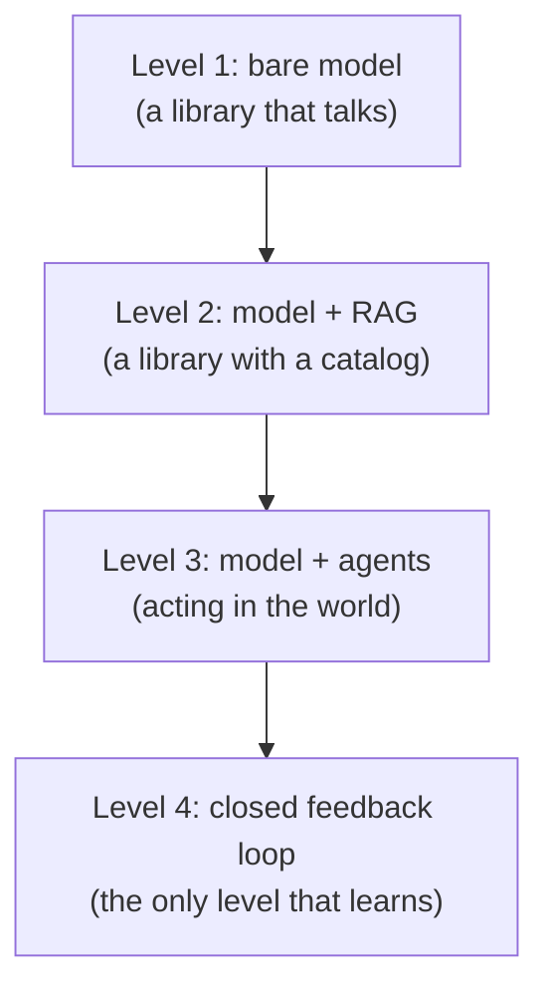
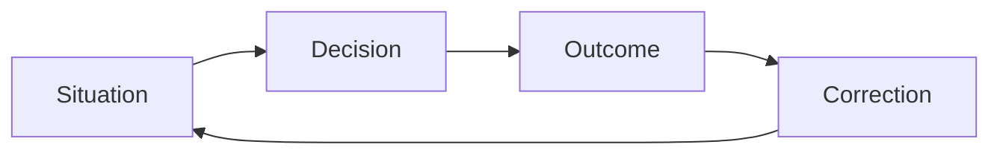

# From Apprenticeship to Machine Experience

*Why professionals rarely share their knowledge — and why next-generation AI systems reproduce the logic of apprenticeship*

**Alex Krol** — strategy, AI, growth infrastructure

[](https://github.com/alexeykrol/real-agi)
[](https://alexeykrol.com)
[](https://www.linkedin.com/in/alexkrol/)
[](https://github.com/alexeykrol)
[](https://alexeykrol.com)

> 🇷🇺 **Russian version:** [Ru/2_tech level/from-apprenticeship-to-machine-experience.md](../../Ru/2_tech%20level/from-apprenticeship-to-machine-experience.md)

> © 2026 Alex Krol. All rights reserved. Republication, redistribution, or commercial use only with the author's explicit written permission.

---

## Contents

0. [TL;DR](#tldr)
1. [Why Professionals Rarely Share: Five Reasons](#1-five-reasons)
2. [Apprenticeship as a Mechanism of Knowledge Transfer](#2-apprenticeship)
3. [Four Levels of AI Systems](#3-four-levels)
4. [The Radical Shift: Service as a Byproduct of Learning](#4-radical-shift)
5. [Self-Learning from Labeled Consequences](#5-labeled-consequences)
6. [The Formula: Knowledge < Experience < Evolving Experience](#6-formula)
7. [Two Phenomena — One Structure](#7-one-structure)
8. [Sources](#sources)

---

## TL;DR <a id="tldr"></a>

The conventional view holds that high-level professionals rarely share their experience out of greed or lack of time. This explanation is superficial. The main reason lies elsewhere: a substantial part of their mastery does not exist in a form that can be transmitted as text. It exists as patterns, intuition, micro-decisions, and contextual judgments accumulated over tens of thousands of hours of practice. A book generalizes; real decisions are contextual. Half a century of research on tacit knowledge, expert performance, and apprenticeship shows the same thing: between "having read" and "being able" lies a gap that text does not close.

Historically, this gap was closed by apprenticeship — a mode of working alongside a master, correction of errors at the moment they are made, gradual movement from the periphery to the center of practice. Not a "transfer of rules" but a transfer of the environment in which rules take shape.

The parallel picture is in AI. A model, a knowledge base, and an agent are still a library. A very smart one, with search and with tools — but a library. Self-learning does not arise from the accumulation of data. It arises from the accumulation of **labeled consequences**: situation → decision → outcome → correction. A loop in which the system sees what happened after its recommendation and links the outcome to the hypothesis. It is precisely this kind of archive that is almost entirely absent from model training today, and it is precisely this archive that comes closest to what people call experience.

These are two angles on the same phenomenon. The architecture of experience transfer is the same for humans and machines: in neither case does experience reduce to information. And in both cases, the principal deficit is not data but access to consequences.

---

## 1. Why Professionals Rarely Share: Five Reasons <a id="1-five-reasons"></a>

The common explanation sounds simple: experts do not share because it is not in their interest, or because they have no time, or because they guard a competitive advantage. There is some truth in this. But the explanation leaves out the main thing. If it were only a matter of motivation, economic arrangements would exist to correct it — fees, reputation, academic positions. And they do exist. And professionals write books, give lectures, run blogs. Yet the feeling remains that the book does not say everything. That between what is written and what the person actually does, there is a gap.

This gap has five distinct sources. They compound, and each one taken separately is already strong enough to explain the observed picture.

**First. The best practices are tacit.** The higher a specialist's level, the more their knowledge exists in the form of patterns, intuition, micro-decisions, and contextual judgments. They themselves do not fully understand why they made precisely that decision. A good chess player does not enumerate variations — they see the position. A good surgeon does not analyze every movement — the hand itself knows. Experience turns into automatism. This is not a metaphor. Polanyi, in 1958 and 1966, formulated it as a maxim: we know more than we can tell[^1][^2]. Not "we sometimes lack the time to tell," but structurally — a substantial part of professional skill is in principle non-verbalizable.

In the psychology of expertise, this has been confirmed by decades of experiments. Chase and Simon showed in 1973 that chess masters do not "think" faster — they recognize patterns on the board and retrieve whole "chunks" from long-term memory[^5]. Ericsson and colleagues in 1993 established the role of deliberate practice in the formation of expert-level performance — tens of thousands of hours of structured rehearsal without which mastery does not emerge[^4]. Gary Klein, working with firefighters, military commanders, and physicians, described Recognition-Primed Decision making: the expert recognizes the situation and immediately retrieves an action script, bypassing formal comparison of options[^7]. All of these works say the same thing. Mastery is an enormous library of recognizable situations, not an explicit set of rules that can be written down.

So the problem is not only an unwillingness to share. Often a person is physically unable to offload their knowledge into text.

**Second. Experts have little time.** If a specialist is in demand, their hour is expensive. Writing a post takes an hour. Writing a good article takes a day. Writing a book takes months. Preparing a full course takes years. For many, this is simply poor time economics: the return on publication is less than the cost of producing it. This is a banal consideration, but it should not be dismissed. It explains why even those who would like to share do so in the form of short notes rather than structured accounts of practice.

**Third. The most valuable nuances are contextual.** A book is forced to generalize. "How to launch a startup," "how to run a company," "how to negotiate." Real decisions look different: in situation A we do X, except in cases B, C, and D; if the market is falling, we do Y; if the investor is of such-and-such a type, Z. Add seasonality, the reputational backdrop, and the history of the relationship with this particular counterparty — and X turns into something else entirely. A book cannot hold such branching. Not because the author is bad, but because of the nature of the genre. A book transmits a **map of the terrain**, not the experience of the journey.

Donald Schön described this in 1983 as reflection-in-action: professionals — architects, engineers, psychotherapists, urban planners — improvise in the course of their work, drawing on knowledge they cannot fully articulate[^9]. They solve not textbook problems but problems that have not been formulated. In real practice, the problem itself is first constructed and only then solved. A book begins with a ready-made problem. That is already a loss.

**Fourth. The reverse effect.** Very strong specialists sometimes share more than anyone. The money has already been made, reputation matters more than secrets, and most of the success lies not in the knowledge but in the execution. Many venture investors, well-known programmers, and scientists publish enormous amounts of material. Not out of altruism. Out of an understanding: reading is not the same as doing. You can post a restaurant's entire recipe book. It will not create thousands of restaurants of the same caliber. And a strong specialist understands this before others do. That is why they share freely — they know the main thing does not transfer.

**Fifth. The paradox of information and environment.** The main point is here. People systematically overvalue information and undervalue environment. Take the book of a very strong practitioner: it often contains almost everything you need. What is missing is what cannot be packaged: feedback, correction of errors, priorities, the sense of "what matters right now," the accumulated thousands of hours of practice. An apprentice can read the same book as the master and not see half of what is embedded in it. Not because the apprentice is less intelligent. Because they lack the environment in which those pages come alive.

Hence the persistent sense that the expert is hiding something. Sometimes they are. But far more often the problem lies elsewhere: a substantial part of mastery is transmitted not through text but through joint practice, observation, and accumulated experience. Davenport and Prusak, in their major work on knowledge management, record this as a systemic barrier: organizations cannot transfer tacit knowledge without transferring the very mode of work in which that knowledge arises[^11].

Historically, this is exactly why systems of apprenticeship existed. Craftsmen, martial arts masters, surgeons, scientists. Not because they hoarded knowledge. But because a substantial part of knowledge could not be reliably transmitted by book. And this is still true today.

---

## 2. Apprenticeship as a Mechanism of Knowledge Transfer <a id="2-apprenticeship"></a>

Apprenticeship looks like an archaic institution. Modern education seems to have replaced it: textbooks, lectures, courses, certifications. But look closely at the fields where outcomes are critical, and it turns out apprenticeship never went away. Surgeons are still trained through residency. Military pilots — through an instructor in the cockpit. Lawyers — through junior positions at a firm, where they first watch how the seniors handle cases. Programmers on strong teams — through mentorship and code review, not through MOOCs. Wherever the stakes are high, formal education turns out to be a prelude to the real training, and the real training is structured as apprenticeship.

The explanation was given by Lave and Wenger in 1991 in *Situated Learning*. They described learning as a process of legitimate peripheral participation[^8]. The newcomer does not learn apart from practice. They are immediately included in the community's real activity — but at the periphery, with limited responsibility, under the cover of the seniors. They do real tasks, but less risky ones. They watch how the experienced work. Gradually, as competence grows, they move toward the center — taking on more complex tasks, more responsible roles. Learning here is not a transfer of rules from the teacher's head to the student's head. It is gradual socialization into a community of practice.

The principal mechanism of this socialization is not the lecture but correction. Errors are corrected at the moment they are made, not post hoc. The senior sees what the junior is doing wrong and says so — or shows them — right now. Not a week later in a debrief. Not on the exam at the end of the course. Now. This creates feedback with minimal delay between action and evaluation, and it is this feedback that teaches. Not a lecture on how to do it right. But the felt sense that this movement is imprecise and that one is correct — and why.

Collins, Brown, and Newman attempted in 1989 to formalize this mechanics for cognitive skills and identified six methods of cognitive apprenticeship: modeling (the master shows how it is done), coaching (the master observes and corrects), scaffolding (the master provides temporary support that is gradually withdrawn), articulation (the apprentice is prompted to verbalize what they are doing), reflection (comparing one's own performance with the master's), and exploration (the apprentice begins to set their own problems)[^10]. All six require the master's presence. All six are impossible through a book.

Reduced to a single phrase: apprenticeship is the transfer not of rules but of **a mode of working alongside you**. Of the environment in which knowledge comes alive.

This is where the bridge to AI appears. If one could reproduce "a master at your side who sees your every step and corrects you at the moment the error is made," that would be the solution to the problem of transferring mastery. Reproduction, not imitation. Not "a robot delivering a lecture." But a mode of work in which the system sees the context, sees the action, sees the outcome, and adjusts to the particular learner on the particular task. This is exactly what next-generation AI systems promise — not always honestly, but they promise it. What they can actually do, and how close they are to that promise, is what we take up next.

---

## 3. Four Levels of AI Systems <a id="3-four-levels"></a>

When people say "AI," they usually mean the model — a large language engine that answers questions. This is a very narrow view. Real systems that do useful work are built from several layers, and the quality of the result is determined not so much by the engine itself as by the design of those layers. I would distinguish four levels.



**Level 1. The bare model.** The strengths are obvious: broad erudition, a capacity for generalization, formal reasoning. The weaknesses are equally obvious: the model does not know your context, does not know your data, does not know your goals, does not remember the results of past actions. Every conversation starts from zero. The model answers from what was in its training plus what you have told it in the current conversation. That is all. For a large class of tasks this is enough — "explain X to me," "rewrite Y," "come up with variants of Z." But as soon as real work with a specific context is at stake, the bare model runs into its principal weakness: it does not know you.

**Level 2. The model plus a high-quality knowledge base.** Here you plug in internal documents, personal notes, correspondence, case files, research, project history. Architecturally this is called retrieval-augmented generation — RAG[^12]. The model stays the same, but before each answer it receives relevant chunks from the base and grounds its generation in them. For most professional tasks this is already an enormous leap. Often this is where the main gain in quality lies — the model stops "fantasizing in general terms" and starts working with the user's specifics.

It is important to understand that this is still a library. A very smart one, with good search. But a library. The system knows what has been put into it and does not know what has not. It takes no actions in the world and sees no results of its recommendations. It answers.

**Level 3. The model plus the base plus agentic infrastructure.** Here a qualitatively different class begins. An agent can search for missing information on its own, ask clarifying questions, test hypotheses, call tools, track intermediate results, maintain long-term memory, work with the calendar, documents, the CRM, code, infrastructure. Architecturally these are patterns like ReAct, where the model alternates reasoning and action[^13], or Toolformer, where the model itself decides which external API to call and how to integrate the result[^14]. The system turns from one that answers into one that acts.

This is a huge step. But it is still not the limit.

**Level 4. The model plus the base plus agents plus a closed feedback loop.** This is a system that knows: what it recommended, what the user did on the basis of the recommendation, what worked, and what did not. And it corrects its future recommendations on the basis of that history. This is no longer consultation and no longer search. This is learning. On every cycle the system changes itself — not the model in the sense of weights, but its model of the world, its set of hypotheses about what works and what does not, and in which contexts.

Most people today overestimate the importance of the model itself and underestimate the importance of the infrastructure around it. Roughly speaking, the difference between GPT-6 and GPT-7 will turn out to be smaller than the difference between GPT-6 without context and GPT-6 with your documents, memory, tools, and history of actions. The quality of a system is determined first of all by the quality of context, memory, tools, and feedback — not by the quality of the bare model.

This is already visible in the structure of competition. Strong teams do not compete on models. Models are becoming an infrastructure layer — as databases once did. Value is created not by the DBMS and not by the engine, but by what is built around it: data, workflows, memory, agentic architecture, the system's accumulated experience. This is the normal course of industrial development. At first the new component itself is valuable; then it commoditizes, and value shifts one level up.

Here, at the fourth level, ordinary agentic architecture ends and something begins that I want to name separately. Because the closed feedback loop is not a refinement of the third level. It is a change in the operating mode of the system as a whole.

---

## 4. The Radical Shift: Service as a Byproduct of Learning <a id="4-radical-shift"></a>

For me, the default agent is not merely a feedback loop. It is a system in which **self-learning is the master background function**, and user requests are simply training cases and a source of data. This is a fairly radical shift of emphasis, and it changes everything.

In ordinary SaaS logic, the causality is simple: the user pays, the system solves the user's problem. The service exists for the sake of the service. If the problem is solved, the money has been earned and the cycle is closed. The quality of the system is assessed through the satisfaction of each individual user in the moment.

In the model described here, the logic is different: the user pays, the system solves the user's problem, and at the same time it extracts lessons from that solution, updates its model of the world, and becomes more valuable for all subsequent users. Each case is simultaneously a service, an experiment, a source of data, and a source of new hypotheses. Service becomes a byproduct of a process of continuous learning.

This is not a rhetorical figure. It is a real architectural difference. In the first case, the system's base is a corpus of documents and a set of tools. In the second case, the base becomes an evolution journal — a sequence of hypotheses, tests, and corrections. The documents sit there as reference material. The tools serve as executors. And the value accumulates in the journal: what the system supposed, what it did, what happened as a result, how it revised its model.

Several practical things follow from this.

First. The value of a single dialogue stops being local. In the ordinary SaaS model, a good dialogue is one that satisfied a particular user. In the new model, a good dialogue is one after which the system knows more than it did before. These two criteria may coincide, or they may not. Sometimes the best case from the standpoint of learning is the one where the system was wrong and learned that its hypothesis was false. Sometimes the best case from the standpoint of service is the one where it gave an obvious quick answer and gained no new knowledge at all.

Second. The system's attention shifts from answers to trajectories. An answer is worth almost nothing, because a good model today will give you a hundred reasonable-looking answers to any question. The value is in the chain: request → hypothesis → action → outcome → analysis → knowledge update. The full chain, not one isolated move. So a system that collects only final answers accumulates little. A system that collects full trajectories accumulates what can later be used for learning.

Third. The knowledge base becomes not an archive but a living organism. An archive of documents is static: something gets put in, something gets taken out. An evolution journal is dynamic: each new entry is linked to the previous ones, new hypotheses reassess old ones, individual cases pass into generalizations, generalizations are tested by new cases. This is no longer about storage. It is about growth.

And here an interesting asymmetry arises. Ordinary SaaS logic encourages the user to ask a question, get an answer, close the window. The faster the cycle, the better the service is perceived to be. The logic of a learning system encourages something else entirely: that the user report what they did on the basis of the recommendation and what came of it. That they come back in a week, in a month, in a quarter. That the cycle be long, not short. These two logics are poorly compatible. They are hard to build into the same interface. It may be that systems serious about self-learning will require a separate operating mode — not conversational but project-based, with long cycles of testing and revision. That is a question for the next few years.

The radical shift can be stated in a single phrase: serving the user becomes not the system's goal but the way the system learns. And as soon as this becomes true architecturally rather than rhetorically, all of the system's subsequent behavior changes.

---

## 5. Self-Learning from Labeled Consequences <a id="5-labeled-consequences"></a>

Now comes the most important technical turn of the entire argument.

It is often said that self-learning arises from the accumulation of data. The more data, the smarter the system. This is inaccurate. Self-learning does not arise from the accumulation of data. It arises from the accumulation of **labeled consequences**.



The difference is fundamental. Let me show it with two examples.

The bad case. The user asked — the agent answered — the dialogue ended. The system is left with a log: request, answer. That is all. What happened after that answer in the user's real life, the system does not know. Whether they used the recommendation or forgot it. Whether it produced a result or not. Whether the result was the one expected or something else entirely. The training value of this log is close to zero. It is just a record of a conversation. If the system has a million such logs, it has a million conversation records and zero training examples.

The good case. The user asked — the agent proposed a solution — the user implemented it — a month later revenue grew 30% — the agent linked the outcome to the hypothesis. Now this is a training example. Everything is here: a situation, an action, an observed consequence, a time gap, attribution — the link between the outcome and the specific recommendation. One can learn from such an example. And one such example is worth more than a thousand logs of the first type.

That is why the principal deficit of future agentic systems will be neither models nor data. It will be access to the consequences of their own recommendations. This is not at all the problem that RAG or agency solves. It is a problem of feedback architecture, and it has to be built separately.

The idea of labeling consequences is not new in machine learning. Christiano and colleagues showed in 2017 that an RL agent can be trained effectively through pairwise human preferences instead of an explicitly specified reward function, and that this works on less than 1% of its interactions with the environment[^15]. Ouyang and colleagues applied this logic to language models in 2022 in the InstructGPT work — using RLHF they obtained a 1.3B model that people preferred in the majority of comparisons to GPT-3 175B, a model one hundred times larger[^16]. The principal lesson of these works lies not in the numerical results but in the architectural principle: feedback is a separate circuit that accumulates apart from the main model and changes its behavior through a dedicated mechanism. The same thing needs to be done at the level of real consequences in the real world, not only at the level of human preferences in the moment.

Here a deeper question arises — causal attribution. Linking an outcome to a recommendation is not so simple. Correlation is not causation. If the user's revenue grew after my advice, it could have been because of the advice, or because of seasonality, or a new employee, or a competitor's successful launch in an adjacent niche that redirected the market's attention. Without causal reasoning, labeled consequences turn into noise. Pearl, in his foundational monograph on causality, showed that separating correlation from causation is not a question of statistics but a question of structural models and counterfactual reasoning[^17]. Machine learning, by and large, does not yet command this technique. When labeled consequences are at stake, causal attribution is not a pleasant extra but a necessary condition. Without it, we accumulate not experience but superstitions.

If the logic of labeled consequences is carried to its conclusion, the system gradually builds not a knowledge base but a **base of cause-and-effect relations**. And this is an entirely different object from what we call a knowledge base. A knowledge base answers the question "what is known." A causal base answers the question "what happens when we do such-and-such in such-and-such a situation." The textbook knows what is usually recommended. The practitioner knows what usually happens after it is recommended. These are different levels of knowledge, and the second is incomparably harder to reach.

The most valuable asset of such a system turns out to be neither the corpus of documents nor the memory of dialogues. It is an enormous archive of the form: situation → decision → outcome → correction of the model. It is precisely this kind of archive that is almost entirely absent from model training today. And it is precisely this archive that comes closest to what people call experience.

Here the precise meaning of the phrase "experience cannot be downloaded from a book" becomes visible. A book contains knowledge. Experience is not knowledge. Experience is a history of attempts with labeled outcomes. And it can be accumulated only by living through it, not by reading. For humans this takes years of practice. For systems — years of operating cycles. It cannot be shortened, because the nature of what is being accumulated demands time and real interventions in reality.

---

## 6. The Formula: Knowledge < Experience < Evolving Experience <a id="6-formula"></a>

If one tries to write this hierarchy down strictly, the result is a chain:

```
Model < Model + knowledge < Model + knowledge + agents <
  Model + knowledge + agents + memory <
  Model + knowledge + agents + memory + a loop of decisions and consequences
```

Each arrow is not merely the addition of a component. It is a qualitative shift in capability. The model by itself generalizes. The model plus knowledge answers with specificity. The model plus knowledge plus agents acts. The model plus knowledge plus agents plus memory acts with context from the past. The model plus knowledge plus agents plus memory plus a loop of decisions and consequences learns from its own experience.

Reduced to its essence:

> **Knowledge < Experience < Evolving Experience**

Where:

- **Knowledge** — documents, books, articles, case files. Statics. What lies there waiting to be read.
- **Experience** — a history of actions and outcomes. Dynamics. What was done and what came of it.
- **Evolving experience** — a system that changes its future decisions on the basis of previous outcomes. Development. What becomes different over time.

Metaphorically, this is the passage from library to organism. A library stores knowledge. An agent stores knowledge and acts. A learning agent stores knowledge, acts, and changes itself. The difference between these three states is the same as the difference between a book about swimming, a person standing at the edge of the pool, and a person who has been swimming every day for twenty years.

From the standpoint of value created, the formula can be written even more starkly:

> **Value ≈ Model quality × Knowledge quality × Feedback quality × System learning time**

The last factor is usually ignored. Yet it is precisely the one that determines the long-term trajectory. Two systems can start out identical — the same model, the same base, the same agentic layer. Five years later, one will have accumulated a million "problem → solution → outcome" cycles; the other will remain just a very smart chat. Their intellectual value will begin to diverge not linearly but by orders of magnitude. This is an effect that is hard to feel in the moment, because on day one there is no difference. But after a year there is. After five years, it is already insurmountable for anyone starting from zero.

This, incidentally, matters for understanding why an early start is critical. Not because of "first mover advantage" in the classical marketing sense. But because the time a system spends in the loop of labeled consequences cannot be bought, hired, or copied. It can only be lived through. And every day the system operates in learning mode widens the gap between it and any system that starts later.

The principal asset of such a system is not the LLM, not RAG, not the agent. The principal asset is the **accumulating history of successful and unsuccessful interventions in reality**. This is already very close to what can be called machine experience rather than machine knowledge.

And this, finally, brings us to the point the entire argument has been driving toward.

---

## 7. Two Phenomena — One Structure <a id="7-one-structure"></a>

I have been telling two seemingly different stories. One about why professionals rarely share their knowledge. The other about how next-generation AI systems are built. There is no obvious connection between them, except that both are about knowledge. But look closely at the structure, and it turns out to be one phenomenon viewed from two angles.

In both, there is a gap between what can be packaged into text and what determines the result. For humans, the gap is between the master's book and the master's skill. For machines — between the data corpus and the system's real usefulness. In both cases, the gap is not closed by either the quantity or the quality of text. Books about tacit knowledge do not themselves transmit tacit knowledge. However much data is pumped into a model's training, it remains in the mode of "knows a lot, doesn't know how to live."

In both, the gap is closed by the same mechanism. For humans — through apprenticeship: a mode of working alongside a master, correction of errors at the moment they are made, gradual movement from the periphery to the center of practice. For machines — through the accumulation of labeled consequences: situation → decision → outcome → correction. Structurally these are one and the same: a loop in which an action is performed in reality, reality responds, and that response changes the next action. Not "a lecture" but "living alongside the task and seeing what comes of it."

The similarity is not accidental. It flows from the nature of what is being accumulated. In both the human and the system, what accumulates is not information but a map of consequences — what usually happens after such-and-such is done in such-and-such a context. Such a map cannot be built in any way other than through real attempts. It can neither be written in advance nor downloaded from the master. It has to be lived through. And in this sense there is no fundamental difference between the human and the machine trajectory. Different speed, different architecture, different nature of the substrate — but the same structural necessity.

From this symmetry follows one uncomfortable consequence. If we know that, for humans, reading the master's book without working alongside the master yields a halfway result — then the same holds for AI systems. A model trained on an enormous corpus of texts but without a loop of labeled consequences is the machine analogue of a student who has read all the books but never worked alongside a master. It has plenty of knowledge. Experience — none. And in any domain where the difference between knowledge and experience is critical, it will make the same type of errors as a well-read but inexperienced person: formally correct answers that do not survive the collision with reality in its concrete shadings.

And the converse is also true. The parallel does not mean that AI will replace masters. That conclusion is too blunt. It means something else: that the architecture of experience transfer is the same for humans and for machines, and in both cases it does not reduce to information. For humans, this means that underestimating apprenticeship is underestimating the only historically working mechanism for transferring mastery. For systems, it means that the principal deficit of future AI is neither compute nor data but access to consequences. The same deficit as that of the human apprentice who reads the master's book but does not work alongside the master.

Someday, perhaps, these two circuits will close onto each other — a system carrying the accumulated experience of thousands of users will work alongside a practicing professional the way a master once worked alongside an apprentice. But that is a separate story. The underlying structure is one, and it is the only one.

What apprenticeship reproduced for centuries is now being reproduced in machine architecture. Not because the architects of AI systems were inspired by the work of Lave and Wenger — most of them have never read it. But because the problem is one and the same, and the nature of the solution is determined by the problem, not by the people solving it. Experience cannot be packaged. It can only be lived. And on this everything else is built.

---

## Sources <a id="sources"></a>

[^1]: Polanyi, M. (1966). *The Tacit Dimension*. University of Chicago Press, Chicago. URL: https://press.uchicago.edu/ucp/books/book/chicago/T/bo6035368.html

[^2]: Polanyi, M. (1958). *Personal Knowledge: Towards a Post-Critical Philosophy*. University of Chicago Press, Chicago. URL: https://press.uchicago.edu/ucp/books/book/chicago/P/bo19722848.html

[^4]: Ericsson, K. A., Krampe, R. T., & Tesch-Römer, C. (1993). The role of deliberate practice in the acquisition of expert performance. *Psychological Review*, 100(3), 363–406. URL: https://psycnet.apa.org/doi/10.1037/0033-295X.100.3.363

[^5]: Chase, W. G., & Simon, H. A. (1973). Perception in chess. *Cognitive Psychology*, 4(1), 55–81. URL: https://doi.org/10.1016/0010-0285(73)90004-2

[^7]: Klein, G. (1998). *Sources of Power: How People Make Decisions*. MIT Press, Cambridge, MA. URL: https://mitpress.mit.edu/9780262611466/sources-of-power/

[^8]: Lave, J., & Wenger, E. (1991). *Situated Learning: Legitimate Peripheral Participation*. Cambridge University Press, Cambridge. URL: https://doi.org/10.1017/CBO9780511815355

[^9]: Schön, D. A. (1983). *The Reflective Practitioner: How Professionals Think in Action*. Basic Books, New York. URL: https://www.basicbooks.com/titles/donald-a-schon/the-reflective-practitioner/9780465068784/

[^10]: Collins, A., Brown, J. S., & Newman, S. E. (1989). Cognitive apprenticeship: Teaching the crafts of reading, writing, and mathematics. In L. B. Resnick (Ed.), *Knowing, Learning, and Instruction: Essays in Honor of Robert Glaser* (pp. 453–494). Lawrence Erlbaum Associates, Hillsdale, NJ. URL: https://www.aft.org/sites/default/files/Collins.pdf

[^11]: Davenport, T. H., & Prusak, L. (2000). *Working Knowledge: How Organizations Manage What They Know* (revised ed.). Harvard Business School Press, Boston. URL: https://store.hbr.org/product/working-knowledge-how-organizations-manage-what-they-know/3014

[^12]: Lewis, P., Perez, E., Piktus, A., et al. (2020). Retrieval-augmented generation for knowledge-intensive NLP tasks. In *Advances in Neural Information Processing Systems 33 (NeurIPS 2020)*. arXiv: https://arxiv.org/abs/2005.11401

[^13]: Yao, S., Zhao, J., Yu, D., et al. (2023). ReAct: Synergizing reasoning and acting in language models. In *International Conference on Learning Representations (ICLR 2023)*. arXiv: https://arxiv.org/abs/2210.03629

[^14]: Schick, T., Dwivedi-Yu, J., Dessì, R., et al. (2023). Toolformer: Language models can teach themselves to use tools. In *Advances in Neural Information Processing Systems 36 (NeurIPS 2023)*. arXiv: https://arxiv.org/abs/2302.04761

[^15]: Christiano, P., Leike, J., Brown, T. B., et al. (2017). Deep reinforcement learning from human preferences. In *Advances in Neural Information Processing Systems 30 (NeurIPS 2017)*. arXiv: https://arxiv.org/abs/1706.03741

[^16]: Ouyang, L., Wu, J., Jiang, X., et al. (2022). Training language models to follow instructions with human feedback. In *Advances in Neural Information Processing Systems 35 (NeurIPS 2022)*. arXiv: https://arxiv.org/abs/2203.02155

[^17]: Pearl, J. (2009). *Causality: Models, Reasoning, and Inference* (2nd ed.). Cambridge University Press, Cambridge. URL: https://doi.org/10.1017/CBO9780511803161

