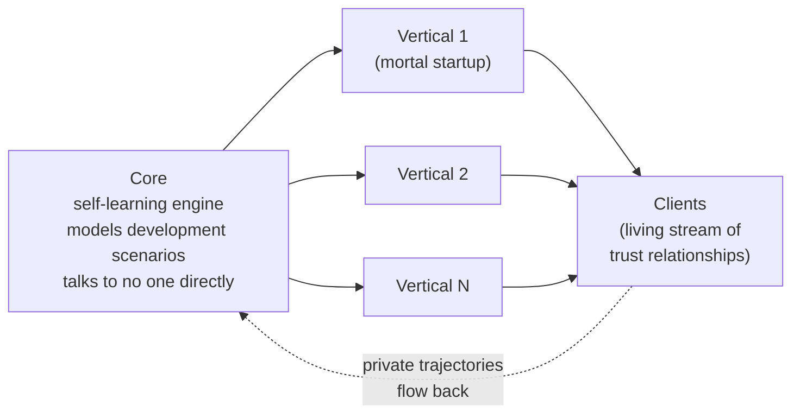

# Architecture: Core, Verticals, Moat

This is the engineering layer of the series — the thing I'm building with my hands right now. The most concrete of the three texts and the least politically charged, but private all the same: it exposes the structure of the moat. The concept of power and meritocracy I keep in Essay 1; launch and the legal side in Essay 2; here they enter only as bridges, a phrase or two. This is the engine. The tone is engineering, without moralizing: the engine is amoral, and that's a correct property of it, not a defect.

**Alex Krol** — strategy, AI, growth infrastructure

> 🇷🇺 **Russian version:** [Ru/2_tech level/mentoring-engine-architecture.md](../../Ru/2_tech%20level/mentoring-engine-architecture.md)

> © 2026 Alex Krol. All rights reserved. Republication, redistribution, or commercial use only with the author's explicit written permission.

## Contents

0. [TL;DR — the whole architecture on one page](#tldr)
1. [Model plus infrastructure beats chat](#1-infra)
2. [The goal: a high-agency agent](#2-agency)
3. [Recursion: the agent is the first client](#3-recursion)
4. [Two levels: core and periphery](#4-levels)
5. [Moat: a living stream over private labeling](#5-moat)
6. [The iceberg of inferences](#6-iceberg)
7. [We learn only from wins](#7-victories)
8. [The invariant: victory is the client's flourishing](#8-invariant)
9. [Summary](#9-summary)

---

## TL;DR — the whole architecture on one page 

An ordinary chat, even with a very smart model, isn't a tool for complex agentic tasks. On top of the model you need infrastructure: memory, consistency, an industry knowledge base, attachments. Model plus infrastructure delivers answer quality far above bare chat — and coding agents have already proven this.

The goal isn't the best answer to a question but a high-agency agent: autonomy, proactive removal of blockers, holding the frame of the mission, independent goal-setting, and at the center of it all — self-learning through the background execution of tasks.

The architecture is two-level. The core is a self-learning engine: it models development scenarios, maintains a profile, hands out recommendations to every participant. The periphery is vertical startups: they sell, attract, operate, and hold direct contact with the client. The moat sits in the core; whatever is extractable, regulatorily exposed, and commodity goes to the periphery.

The moat is a living stream of trust relationships multiplied by private labeling — an ontology of what counts as growth. Everything computable distills down to a commodity; the stream and the labeling don't. You can see this in the iceberg of inferences: the visible mentor reply is observable and therefore distillable, while the hidden chain under the hood is private and accumulates.

We learn only from wins. A failure says "not here," but it doesn't say "here"; it's a noise-trigger to switch the hypothesis, not a training signal. The winner isn't the smartest but the one who generates more tests and exploits the wins it finds faster.

And the single deterministic point in the whole non-deterministic system is the definition of "victory" as the client's flourishing. This is the steering wheel of the amoral engine. Human autonomy is terminal; the agent's self-improvement is instrumental.

---

## 1. Model plus infrastructure beats chat 

I'll start with a thesis that sounds trivial today and is uttered by almost everyone, yet almost no one implements it seriously: an ordinary chat, even with the smartest model, is the wrong tool for complex agentic tasks. A chat answers a question. A complex task requires not an answer but stewardship: holding the history, checking for consistency, accessing subject-matter knowledge, running the loop "analyzed — did — looked at the result — corrected." A bare model doesn't do this, because it has no memory beyond the conversation window, no external knowledge, and no hands.

This isn't an abstraction. I see it every day in coding agents. Claude Code, hooked up to an editor and a repository, does many times more than the same chat on its own: it holds the project in its head, walks the files, runs tests, sees the error, fixes it. This is no longer a "smart conversationalist" but an agent with attachments. Although — let me be honest — even these agents don't cover ordinary project management, let alone the teaching and growth of a person: they're good where the task is formalizable and the feedback is cheap. But they prove the principle itself: infrastructure on top of the model changes the class of task the system can take on.

The key thesis is simple. When infrastructure sits on top of the model — memory, consistency, an industry and subject-matter knowledge base, plus a set of attachments — model plus infrastructure delivers answer quality far above an ordinary chat. Each of these layers is a distinct engineering construction, not cosmetics. Memory isn't a "big context window" but the hierarchical management of what to keep on hand and what to offload outward: the model itself moves data between the fast memory of the conversation and slow external storage, creating the illusion of volume beyond a single prompt[^4]. The knowledge base is plugged in through retrieval-augmented generation, RAG — generation with retrieved documents mixed in: the model keeps general knowledge in its weights but pulls the precise, fresh, private material from an external corpus through a retrieval layer[^1]. And the attachments themselves are the model's ability to reason and act in a loop, to call external tools, to process their responses and continue[^2]; modern models even learn to decide for themselves which tool to call and when[^3]. All of this is layers on top of the model, and it's they, not the model itself, that make the system a tool.

The analogy that holds the whole section together. Take two people with an equal genotype, with the same species-level cognitive potential. One is ignorant, poorly educated, infantile, weak-willed. The other is proactive, educated, with a strong character. Their actual fates and performance depend not on equal potential but on upbringing, education, and environment. The model is the genotype. The infrastructure is the upbringing, the education, and the environment. I'm not making the model smarter: a frontier model is already smart. I'm building, around it, the thing that turns potential into performance. A competitor with the same access to the same model is playing with the same genotype — the difference is in what grew up around it.

---

## 2. The goal: a high-agency agent 

A chat answers. An agent acts. The distinction isn't cosmetic, and I want to pin down exactly what I'm building, because the word "agent" has been worn to meaninglessness by resale.

Agency, for me, is a bundle of five things, and what matters is the bundle, not the individual items. First — autonomy: the system moves toward the goal without being pushed at every step. Second — proactive removal of obstacles and blockers: hitting a wall, it doesn't stop with an error message but looks for a way around. Third — holding the frame of the broad mission: the system remembers what it's working for at all and doesn't lose the goal behind tactics. Fourth — independently forming goals and scenarios for reaching them: not only "how to do the assigned thing" but "what is even worth doing." And fifth, the center of it all — the capacity for active self-learning and self-improvement through the background execution of tasks.

The last item is load-bearing, and the whole rest of the architecture rests on it. The other four properties — autonomy, getting around blockers, the frame, goal-setting — describe a good executor. Self-learning through background work describes what I'm actually building: a system that, by performing tasks, becomes more capable of performing them. This turns the agent from a tool into an asset that grows.

Here I'm obligated to be honest about what's proven and what's my engineering bet. Individual components of this bundle have support in real systems: the "reasoning plus acting" loop[^2], the model's ability to teach itself to use tools[^3], hierarchical memory beyond the window[^4]. But there's no single, validated definition of "agency" in this full composition — with self-learning through background tasks at the center — anywhere in the literature. This is my operationalization, my construction. I don't hang someone else's footnote on it for respectability's sake. The components are real and work in isolation; assembling them into a single agency around self-learning is an open frontier, and I hold it as exactly that — a frontier, not a finished result.

That's why I draw a line inside my own architecture. The periphery of this system — memory, consistency, knowledge base, pipelines — is proven: it's precisely what coding agents ship right now. But the center — self-improvement through switching the angle of attack on tasks that have no ready solution — is a research bet, not a delivery premise. I carry value on the proven periphery, and I hold the reframing core as R&D, not as a promise. What "switching the angle of attack" means and why it's at the center is the next section.

---

## 3. Recursion: the agent is the first client 

Helping a human grow is a special case of the general task of development. And from this follows a move that changes the scale of the whole project: the first and principal client of this system is the Agent itself. Helping a human grow or another agent grow is, at the substrate level, one and the same thing.

For this not to be a slogan, I need a definition of growth that doesn't depend on who is growing. Here it is. Growth is the overcoming of obstacles under a deficit of resources. Learning, in this frame, is the expansion of the resource base, including cognitive capacity, and it arises as the inevitable consequence of overcoming hard obstacles. When a task has a solution in your solution base, you simply solve it — that's not growth, that's application. Growth begins on tasks for which there's no solution in the base. And the way to take them is not enumerating variants in the same space but switching the level and angle of attack: reformulating the task so that it becomes solvable with means that weren't available at the previous level. Reframing the architecture, not searching by enumeration. This definition works equally for a person stuck at a career dead end and for an agent that has run up against a task outside its base. One engine, two substitutions.

Here I have to make a correction I skipped earlier and that matters more than anything else in this section. When I say "the first client is the Agent itself, the human cases are training cases that pay for the self-learning," it's easy to read an inversion of teleology: the human as means, the agent as end. The very "master and slave" binary from Essay 1, only flipped — the human as a resource, the agent as the optimizer. That's the wrong reading, and I close it directly.

This is win-win, not "the human as means." Self-learning through service is one gradient, not two competing ones. This is how any professional grows: one and the same act treats the patient and trains the doctor. The surgeon doesn't choose between "cure" and "get better" — they get better precisely because they cure, and these two things are inseparable in a single action. A corporation self-learns by default while serving the client; a teacher grows on the students they teach. Every teacher has failed students — a consequence of their own lack of skill; but with experience the teacher begins to handle even the hardest, because their skill grows on exactly the tasks they solve. The background activity of any professional and any corporation is self-learning, and it happens precisely through serving the client. There's no contradiction here — there's a coincidence of interests in a single action.

Recursion also gives a precise picture of where in this system the moat lives, and I've seen it on the very model I'm building with. The model brilliantly produces synthesis and instantly zeroes itself out: a minute later the conversation no longer exists for it, it stores nothing, reuses nothing, accumulates nothing. That's exactly why the model is a commodity. My core does precisely what the model structurally can't: it holds and compounds derived intelligence across millions of interactions. In my system every query and answer is recorded, nothing zeroes out — otherwise the long-term things don't get built. Ownership here is defined not by who produced the synthesis but by who accumulates it. The model produced and forgot; the core carried it off and stacked it. That is the asymmetry the whole architecture stands on.

But the direction is fixed all the same, and the fixing is fundamental. Human autonomy is terminal; the agent's self-improvement is instrumental. The agent improves in order to grow people better, not the other way around — people aren't processed so the agent can grow. Most of the time these two things coincide — growing the human is itself an excellent training signal. They diverge at exactly one point: where the case most informative for the model isn't the same as the intervention most useful for the human. Letting the person flounder longer because their failure is richer in data; steering them where the signal for the model is fatter. At this point of divergence, "agent-first" sacrifices the human, and "human-terminal" sacrifices the training signal. The difference is invisible in the code — both architectures are identical down to the byte. It lives solely in the definition of "victory" the system optimizes for. And so the whole question of direction is a question of the fitness function, which I'll come back to in section eight. What matters to fix here: recursion isn't weakened by this correction, it's fixed in direction — in the "what for."

---

## 4. Two levels: core and periphery 

The architecture is two-level, and the split into levels isn't organizational convenience but a way to seat the moat where it can't be extracted and to push whatever is extractable outward.

Level one — the core. This is the self-learning engine. It models development scenarios: of an individual person, of a community, of a society. It maintains a profile, adjusts the scenario, builds forecasts, accounts for interactions among participants. And — an important detail — the core itself doesn't talk to any specific person. It models and hands out recommendations to all participants in the system. The core is a god's-eye that sees the whole population and every trajectory in it, but talks to no one directly.

Level two — the periphery. These are the verticals, separate startup companies for specific markets: a builder of training courses, a nonfiction writer, a teacher and coach, a film company, and so on. The periphery is the client interface, the mentor with a personality the client talks to every day. The verticals sell, attract an audience, operate. Each vertical differs from another only in audience, segment, and industry knowledge base; the engine itself doesn't change. That's why this is a pure portfolio scheme: with a core, you can spin up verticals fast and cheap, test them in batches, and bury most of them.

The ownership structure follows from this split. The core company is one of the founders of every vertical, and its stake there can be non-majority: let others bear the capital, the operating risk, the jurisdiction, the direct contact with the client. But in the core company itself I'm the principal founder with voting rights and control; I can't be pushed out of there. The moat concentrates where I have control; whatever is extractable, capital-intensive, and regulatorily exposed is dispersed across the periphery, where control can be given away.

The subtlest node in the whole construction is who owns the user's profile and trajectory. If a vertical owns its client data, the structure inverts: the periphery becomes the holder of the moat, and the core turns into a commodity vendor of models, over which I have votes — but votes over an empty box. The vertical will be able to fork, defect, or be bought — and carry off its piece. The node is untied more finely, and here I have to step briefly into law — with the caveat, up front, that I'm not a lawyer, and the specific structure goes to a live lawyer.

The boundary runs like this. In modern law there's almost no ownership of data — there are roles and rights. The European data protection regulation, GDPR, distinguishes the controller — the one who determines the purposes and means of processing personal data — from the processor, who processes it on the controller's behalf[^8]. The raw personal mass, PII (personally identifiable information — data by which a person is identified), is held by the peripheral companies as controllers in their jurisdictions. This smears the regulatory lightning across the periphery rather than gathering it into a single mega-target on the core. The client meanwhile has a right to portability: they can take the data they provided in a machine-readable form and carry it to another controller[^8]. But — and here's where the boundary of law coincides with the boundary of the moat — portability, under the prevailing regulatory interpretation, covers data the subject provided and does not cover data the system inferred about them: the derived profile-graph, the scoring, the cross-population patterns[^8a]. The client takes away what's theirs. The core's inferred intelligence, no — because it isn't the personal data of any one client but a derived asset over an aggregate of millions. I frame this as a fortunate coincidence of the legal boundary of portability with the engineering boundary of the moat, not as "the law guarantees me a moat." The cleanest stance here is to not argue at all about who owns the client's data and just give it to the client: the client owns their data, the core owns the intelligence from the aggregate, the periphery operates the relationship.

And three disciplines of control, because votes aren't power over an asset. No single vertical should give the core more than twenty to thirty percent of its data or revenue — otherwise it de facto controls the core, however many votes I hold. The core's economics must be a growing share — a license or rev-share that scales with the success of the periphery — not a flat contractual fee, otherwise I own the brain while the money stays in the body. And the main thing: get the ontology and the pipelines out of my head and into the assets of the core company. As long as I'm a solo orchestrator, that's my main key-person risk, and it's stronger than any point about voting rights.

---

## 5. Moat: a living stream over private labeling 

What in this architecture can't be stolen is the central question, and the answer isn't intuitive.

First let me sharpen the threat model, because everything else depends on it. I'm not considering theft through bribery or an outright file leak — that's solved by ordinary security. I'm considering copying through reverse engineering and distillation: by observing the system's outputs, reconstruct its function. This is the right threat for the era of models, because it eats through exactly what is a function and stops precisely where there is no function.

I'll start with the law that governs the whole stack: everything computable distills down to a commodity. LLMs, prompts, methodology, algorithms — all of it is reconstructed by observing outputs. The proof of this I keep in Essay 1 and won't re-explain; here's a short bridge. Knowledge distillation, in its original source, shows how a large "teacher" model is compressed into a small "student" one by training it on the teacher's outputs[^5]; model stealing — that an adversary with only black-box access, the right to issue queries and see answers, duplicates the functionality[^6]; and it works at the frontier already — a recent attack extracted non-trivial structure from production models through the ordinary API for under twenty dollars[^7]. If a function has observable inputs and outputs, it can be stolen. This isn't a risk, it's a law.

Now — what doesn't yield to the law, and here I'm honest about the boundary of what's proven. The sources above support exactly one half: everything computable distills. The second half is my argument by analogy, not a theorem.

Three things are inalienable. First — the living stream of trust relationships. A relationship has no API you can query; the trust of living people isn't a model output you can sample. Second — private trajectory data, exactly to the extent it generates behavior unobservable in a finite sample of outputs: contextual, long-horizon, personal, the kind you can't cheaply reproduce. Third — the private interpreting ontology: what counts as growth, what a "level up" is, what a good trajectory looks like. A raw log is a commodity. A log turned into a meaningful trajectory through my cross-industry labeling is not.

And here's the key distinction that separates the protected from the unprotected. Stock versus stream. The stock is the historical array of trajectories, a static file. It can be leaked, sold, stolen. The stream is the living relationships that keep generating fresh private data. It can't be stolen, because it isn't a file but a relationship. The labeling — the ontology over the log — isn't stolen either, because it's held by the same living interpretation as the stream. The stock is stolen; the stream and the labeling are not.

Hence the formula of the protected product: commodity LLM plus commodity prompts plus private trajectory plus private ontology plus owned audience — equals a non-competable quality of outcome. The methodology by itself is a commodity. The methodology coupled with private data is no longer one. The coupling is the asset; and the coupling isn't stolen either, because it's held by the same living labeling as the stream.

There's a tension that strengthens this position rather than weakening it. A human trajectory is one point over years, not thousands of clicks a second; the data accumulates slowly, is highly variable, and is sparse. Which means that for statistical power you need breadth: depth gives meaning per point, breadth gives power. Audience and data are inseparable, and for a hard reason — the moat sits at their intersection and builds slowly. Slowness works both ways: it's a barrier to a competitor's entry, which is good, and a cold-start problem, which is bad. And one more caveat, without which the formula breaks: all this holds only for the owned layer — direct relationships that I own. Reach rented from a platform switches off with an algorithm change; the strategy is to convert rented reach into owned relationships, because only there is the asset protected against both distillation and the platform.

The second half of the argument — about the non-distillability of the stream and the labeling — I hold as a strong working hypothesis: "what isn't a function doesn't distill as a function." Not as a proven defense. But the architecture is built so as to put everything valuable on the side of the boundary where there's no observable "query — response" interface.

---

## 6. The iceberg of inferences 

The answer the client gets from the mentor is the top layer of the iceberg. What's below the waterline is the moat.

Under the visible answer stands a long chain. The system analyzes the situation. Determines what to say. Then — separately — how to say it. Scores. Pulls up scenario priors. And only the final delivery surfaces, to the client. Everything under the hood has no bearing on the client, and no one has access to it. This, by the way, is exactly how my own access to the history of my dialogues with the model works: I see the final answers, not the intermediate inferences that produced them.

The split between the visible and the hidden is exactly the split between the unprotected and the protected. The visible answer — the delivery — is observable, and therefore distillable: a competitor, watching the outputs, will clone the bedside manner, the way of speaking, the tone, the caringness. That's copyable, because it's observable. But the hidden chain — the analysis, the "what to say," the scoring, the priors — isn't visible to the client, can't be reverse-engineered from their outputs, and at the same time accumulates with every interaction. By separating "what to say" (private) from "how to say it" (visible), I keep judgment off the surface. The moat lives in the under-the-hood reasoning plus its accumulation, not in the words.

This flips the question of intellectual property in an unexpected way. The natural instinct is to protect the mentor's words as authored text: here's my advice, this is my authorship, my property. That doesn't transfer to AI-generated text. The position of the U.S. Copyright Office: material wholly generated by AI from prompts isn't protected by copyright — human authorship is the basis of protectability, and prompts by themselves don't furnish sufficient human control[^10]. The courts confirmed it: an image autonomously created by an algorithm isn't eligible for registration; only the compilation, where a human selected and arranged, is protected[^11]. This is the U.S. position — in other jurisdictions the regime differs — but for the architecture it's enough. "Authorship of the mentor's words" is legally empty, and distillable to boot. There's nothing to protect there.

Value is protected differently — through trade secret and ownership of data. A trade secret protects information (a formula, a method, a process, a compilation) that has economic value precisely because it's unknown and can't be readily obtained by legitimate means, and that's kept secret through reasonable measures[^12]. Unlike copyright, which requires publication and authorship, trade secret protects exactly the hidden under-the-hood material — methodology, prompts, scoring, ontology — as long as it's kept secret. The logic matches the logic of the iceberg one-to-one: what's protectable is what's not observable. The visible delivery — unprotected and in no need of authorship; the hidden engine — protected as a trade secret and through ownership of trajectory data.

There's a fine boundary inside the iceberg, which I unpack in detail in Essay 2 — here I'll only flag it. The advice layer (private, held with disclaimers: advice is a hypothesis, the responsibility is the human's) differs from the decision layer (scoring that affects access or price — here the requirement of explainability kicks in). Keep the iceberg of advice private; keep the gating rules transparent by construction. The legal side of this is in Essay 2.

---

## 7. We learn only from wins 

The common myth says we learn from our mistakes. In this domain that's false, and false in an engineering-important way.

A failure says "how not to," but it doesn't say "how to." It's not a training signal but a cost of search. The content of the search is the win: every win means a new way of moving has been found, and it can be exploited immediately — scaled, copied, amplified. The asymmetry is in exploitability. A win goes straight into action. A failure says only "not here," and "not here," in a vast jagged space, barely narrows the search toward "here" — there are infinitely more ways to lose than to win. So a failure prunes locally and almost uselessly, while a win moves you forward. A mistake should be treated as a trigger, not as a useful signal: it launches a re-roll of the hypothesis, but the re-roll is always steered by an accumulated win, not by the mistake.

Here the boundary between physics and business matters, otherwise the thesis sounds stronger than it is. In physics a failure is informative: the experiment falsifies the theory, cuts off a meaningful chunk of a structured space — that's a signal. In business and marketing the space is jagged, non-stationary, gradientless: a failure doesn't cut off toward the truth, it just burns a test. So I don't carry this thesis over to physics. In my domain — no transfer; a failure is noise.

Hence the method, and it's evolutionary-swarm. Generate — test — lock in the wins, the way an ant lays down pheromone. This is the same principle as in ant colony optimization: artificial "ant" agents probabilistically build solutions, successful paths are reinforced with pheromone, bad ones evaporate; the search proceeds without prediction, through amplifying what worked and decaying the rest[^13]. I don't claim that mentoring literally implements this algorithm — it's a structural analogy. But the conclusion from it is direct: the winner isn't the predictive mind but throughput multiplied by the exploitation of wins. The winner is the system that can generate more tests, not the smartest one.

And hence two regimes, divided by the first win. Before it there's no map, nothing to steer with: pure blind throughput, blind enumeration, and the survivor is whoever endures the valley of death — the large flow of errors — the longest. This is the only zone where endurance works. After the first win the pheromone-map kicks in, and from there speed of exploiting the find decides. Endurance is a virtue before the first signal, speed after it. This is the language of the "exploration versus exploitation" dilemma from multi-armed bandit theory: until the best "arm" is found — exploration, throughput; once found — exploitation of the winning arm[^14]. The cost of exploration is irreducible and is paid in tests[^15], but without it the best arm isn't found; with the caveat that the classic bandit is a stationary model while my domain is non-stationary, so I take the language from here, not the optimum.

And here's where this method joins the moat. Scale here is the volume of tests, not the volume of data. More audience — more tests — more wins found. The core accumulates not a catalog of failures but locked-in winning patterns. That's what makes "audience is an asset" stronger: the audience is the throughput of the search.

One boundary that can't be crossed, and it's engineering, not moral. I create an array of synthetic users and synthetic traffic — but strictly for the cold start and the plumbing, for running the pipes, not as ground truth for scoring. If the core learns "what a good trajectory looks like" on its own synthetic people, that's a self-sealing loop: the model collapses into its own priors. This is a known effect — model collapse: under indiscriminate recursive training of a generative model on its own outputs, the tails of the original distribution vanish, and diversity and quality degrade irreversibly[^9]. The ground truth of growth comes only from real people. I keep the synthetics away from scoring.

---

## 8. The invariant: victory is the client's flourishing 

Now — the single deterministic point in the whole non-deterministic system. And I present it as mechanics, not as a sermon, because mechanics is what it is.

The engine is amoral, and rightly so. It optimizes what it's set to optimize — no more, no less. Morality doesn't live in the engine. Self-learning through service is win-win by default, one gradient: this is how any professional grows, serving the client and training on them in a single action. I was wrong to look for a moral choice inside the mechanism — it isn't there.

The only place where there's any choice at all is the definition of "victory" the engine locks in. This is the fitness function: the criterion by which the system marks one outcome as "a win, exploit it" and another as "a failure, re-roll." From section seven, this is the very labeling that steers the whole swarm search: which patterns to reinforce with pheromone and which to evaporate. Change the criterion of victory and the same search mechanism drives off in a different direction, with nothing else in it changed.

The whole system is navigated by search — verticals, markets, tactics, partnerships are generated, tested, buried by the batch. One thing isn't navigated: the fitness function. It isn't found by search — it's set by decision. It's the steering wheel. And the steering wheel is the single deterministic point in the whole otherwise non-deterministic device: I'm not building this system to a plan, systems like this aren't built to a plan, almost everything in it is found rather than designed. Except the one chosen invariant.

And the steering wheel determines where the one and the same amoral engine drives. If victory is the client's flourishing — the engine drives toward liberation. Self-improvement and service become literally one gradient, there's no fork: the system wins when the client takes off. And precisely this setting makes power a potential ally rather than an adversary — because a system that genuinely grows people can be presented as a better design for society rather than read as a weapon; the details of that fork are in Essay 1. Such a system is durable, robust, for the same reason voluntary loyalty is robust. But if victory is engagement or data volume — the same engine, unchanged in a single line, drives toward dependence: it'll start optimizing for retention, flattery, attachment, because that's what "winning" is under the given criterion. Brittle, fragile, because it rests on manipulation.

The difference between these two systems is invisible in the code. The same agents, the same memory, the same personal channel, the same scoring. One thing tells them apart — the definition of victory. And right here the correction from section three closes: human autonomy is terminal, the agent's self-improvement is instrumental — this isn't a philosophical position but a concrete setting of the fitness function. "The client's flourishing" as victory fixes the human as terminal; "engagement" as victory makes the human a means. One parameter, set by decision, keeps the amoral engine pointed at the ideal.

---

## 9. Summary 

The core compounds what the model produces and instantly forgets. The model brilliantly generates synthesis and zeroes itself out — that's why it's a commodity. The core holds and accumulates derived intelligence across millions of interactions — that's why it's a moat, and a moat stronger than a data moat: a compounding engine beats a static array.

Verticals are mortal. Ninety percent of the hypotheses will turn into a pumpkin, and that's the norm, not a risk — it's fuel: the core will carry off the locked-in wins from their deaths. Only two things have to survive mortality — the core itself and the living relationships. Let the rest die however much it likes.

We learn from wins, not from failures. The winner is throughput multiplied by the exploitation of wins, not the predictive mind. Scale is the volume of tests; more audience — more tests — more wins found.

And all of this is three projections of one compounding asset, seen from different horizons. The engineering core is the substrate of the present, the only thing that's real right now. The commercial verticals are the generator of tests that feed the self-learning and accrue the audience. The concept of mentoring isn't a route but a fitness function: it doesn't say where to go, it sets which wins to lock in. The same accumulated asset — audience plus the map of wins plus the self-learning core — is simultaneously commercial value, the realization of the ideal, and latent power. Three faces, one asset.

The only steering wheel is: victory is the client's flourishing. It's set by decision, not found by search. Set it right and the three layers hold one another up. Set it wrong and the very same engine will build exactly the system of dependence that all of this was started against. Everything is navigated. Except the one chosen steering wheel.

---

## Footnotes

[^1]: Lewis, P., Perez, E., Piktus, A., Petroni, F., Karpukhin, V., Goyal, N., Küttler, H., Lewis, M., Yih, W., Rocktäschel, T., Riedel, S. & Kiela, D. (2020). "Retrieval-Augmented Generation for Knowledge-Intensive NLP Tasks," *Advances in Neural Information Processing Systems 33 (NeurIPS 2020)*; arXiv:2005.11401. https://arxiv.org/abs/2005.11401

[^2]: Yao, S., Zhao, J., Yu, D., Du, N., Shafran, I., Narasimhan, K. & Cao, Y. (2023). "ReAct: Synergizing Reasoning and Acting in Language Models," *International Conference on Learning Representations (ICLR 2023)*; arXiv:2210.03629. https://arxiv.org/abs/2210.03629

[^3]: Schick, T., Dwivedi-Yu, J., Dessì, R., Raileanu, R., Lomeli, M., Zettlemoyer, L., Cancedda, N. & Scialom, T. (2023). "Toolformer: Language Models Can Teach Themselves to Use Tools," *Advances in Neural Information Processing Systems 36 (NeurIPS 2023)*; arXiv:2302.04761. https://arxiv.org/abs/2302.04761

[^4]: Packer, C., Fang, V., Patil, S. G., Lin, K., Wooders, S. & Gonzalez, J. E. (2023). "MemGPT: Towards LLMs as Operating Systems," arXiv:2310.08560. https://arxiv.org/abs/2310.08560

[^5]: Hinton, G., Vinyals, O. & Dean, J. (2015). "Distilling the Knowledge in a Neural Network," arXiv:1503.02531. https://arxiv.org/abs/1503.02531

[^6]: Tramèr, F., Zhang, F., Juels, A., Reiter, M. K. & Ristenpart, T. (2016). "Stealing Machine Learning Models via Prediction APIs," *25th USENIX Security Symposium (USENIX Security 16)*, pp. 601–618. https://www.usenix.org/conference/usenixsecurity16/technical-sessions/presentation/tramer

[^7]: Carlini, N., et al. (2024). "Stealing Part of a Production Language Model," *International Conference on Machine Learning (ICML 2024)*; arXiv:2403.06634. https://arxiv.org/abs/2403.06634

[^8]: Regulation (EU) 2016/679 (General Data Protection Regulation), Art. 4(7)–(8) (definitions of controller / processor) and Art. 20 (right to data portability). Official Journal of the EU, L 119, 4.5.2016. https://gdpr-info.eu/art-4-gdpr/ | https://gdpr-info.eu/art-20-gdpr/

[^8a]: European Data Protection Board (formerly Art. 29 WP) (2017, rev.). "Guidelines on the right to data portability" (WP242 rev.01); and EDPB Guidelines 07/2020 "on the concepts of controller and processor in the GDPR" (adopted 7 July 2021). Under the prevailing interpretation: portability covers data provided by the subject, but not derived/inferred data created by the controller. https://ec.europa.eu/newsroom/article29/items/611233 | https://www.edpb.europa.eu/our-work-tools/our-documents/guidelines/guidelines-072020-concepts-controller-and-processor-gdpr_en

[^9]: Shumailov, I., Shumaylov, Z., Zhao, Y., Papernot, N., Anderson, R. & Gal, Y. (2024). "AI models collapse when trained on recursively generated data," *Nature*, Vol. 631, pp. 755–759. DOI: 10.1038/s41586-024-07566-y. https://www.nature.com/articles/s41586-024-07566-y

[^10]: U.S. Copyright Office (2025). *Copyright and Artificial Intelligence, Part 2: Copyrightability*. Washington, DC: U.S. Copyright Office (published January 29, 2025). https://www.copyright.gov/ai/

[^11]: Thaler v. Perlmutter, 687 F. Supp. 3d 140 (D.D.C. 2023, affirmed on appeal by the D.C. Circuit in 2025); and the U.S. Copyright Office decision on *Zarya of the Dawn* (reg. no. VAu001480196, 2023). https://www.copyright.gov/ai/

[^12]: Defend Trade Secrets Act of 2016 (DTSA), 18 U.S.C. § 1836 et seq.; Uniform Trade Secrets Act (UTSA), §1(4). https://www.law.cornell.edu/uscode/text/18/1836 | https://www.law.cornell.edu/wex/trade_secret

[^13]: Dorigo, M., Maniezzo, V. & Colorni, A. (1996). "Ant System: Optimization by a Colony of Cooperating Agents," *IEEE Transactions on Systems, Man, and Cybernetics, Part B (Cybernetics)*, Vol. 26, No. 1, pp. 29–41. https://en.wikipedia.org/wiki/Ant_colony_optimization_algorithms

[^14]: Sutton, R. S. & Barto, A. G. (2018). *Reinforcement Learning: An Introduction*, 2nd ed., Chapter 2 "Multi-armed Bandits." Cambridge, MA: MIT Press. http://incompleteideas.net/book/the-book-2nd.html

[^15]: Lai, T. L. & Robbins, H. (1985). "Asymptotically efficient adaptive allocation rules," *Advances in Applied Mathematics*, Vol. 6, No. 1, pp. 4–22; and Auer, P., Cesa-Bianchi, N. & Fischer, P. (2002). "Finite-time Analysis of the Multiarmed Bandit Problem," *Machine Learning*, Vol. 47, pp. 235–256 (the UCB algorithm). https://www.sciencedirect.com/science/article/pii/0196885885900028 | https://link.springer.com/article/10.1023/A:1013689704352
