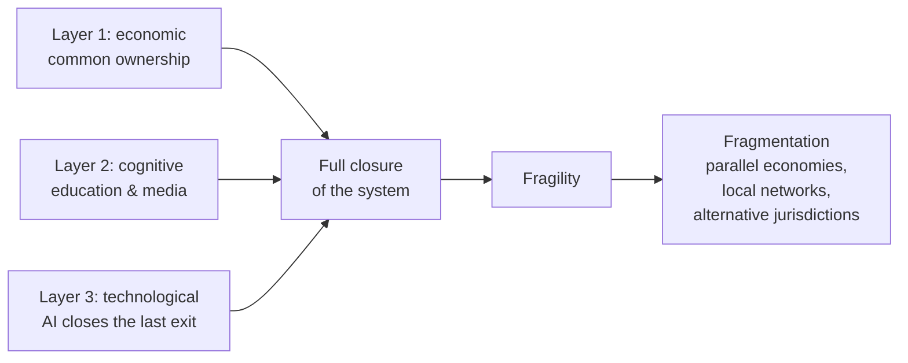

# The State as a Machine of Stable Corruption

*How the modern Western system achieved stability — and why that is its central vulnerability*

**Alex Krol** — analysis, strategy, AI infrastructure

> 🇷🇺 **Russian version:** [Ru/3_Verticals/Mentoring/1_state-corruption-collapse.md](../../../Ru/3_Verticals/Mentoring/1_state-corruption-collapse.md)

> © 2026 Alex Krol. All rights reserved. This essay is shared for public reading and discussion. Republication, translation, or commercial use only with the author's written permission.

---

## Contents

0. [TL;DR](#tldr)
1. [What "Corrupt System" Means: A Working Definition](#1-definition)
2. [Layer 1 — Economic: The Disappearance of Competition](#2-economic)
3. [Layer 2 — Cognitive: Manufacturing the Inability to Analyze](#3-cognitive)
4. [Layer 3 — Technological: AI Closes the Last Exit](#4-technological)
5. [Why Democratic Procedures Became Cosmetic](#5-democracy-facade)
6. [Intra-Elite Conflict as the Only Real Mechanism of Change](#6-elite-conflicts)
7. [Where "Grey Zones" Remain — and Why AI Closes Them](#7-grey-zone)
8. [Why a Stable System Is Paradoxically Fragile](#8-fragility)
9. [What This Means for the Individual](#9-personal)
10. [Sources](#sources)

---

## TL;DR 

I argue a simple thing. The modern Western state is a stable corrupt system dressed as a democracy. Not corrupt in the sense of bribes passed across a counter; corrupt in the systemic sense — the mechanisms of decision-making have been captured by a narrow beneficiary, and democratic procedures have been preserved as the cosmetics of legitimacy. Voting happens, parliaments meet, courts hand down rulings. Only the real architecture of power is somewhere else.

The stability of this system has been achieved through the simultaneous closure of three layers. Economic layer: concentrated ownership through institutional investors destroys real competition inside industries and standardizes the political interests of large capital. Cognitive layer: education and media cultivate a population incapable of systemic analysis — not because of a conspiracy, but because of how the incentives are arranged. Technological layer: AI is methodically closing the last historical exit — the possibility of economic autonomy through intellectual labor.

Once the three layers closed, traditional correction mechanisms work only as simulation. Elections give a choice between shades of the same thing. Protest is absorbed by police routine. Market competition is filtered through the interests of common shareholders. Professional mobility is being erased by algorithms. The real mechanism of change reduces to one thing — intra-elite conflict — and the Trump / Musk / DOGE case is not a "popular revolution" but a factional reshuffling at the top.

The most uncomfortable turn in my model is this: the more stable this system becomes, the larger the share of the population that falls out — not into managed dependency, but into real poverty. That creates pressure that classical stabilization cannot absorb. Historically, such configurations do not turn into revolutions. They turn into fragmentation — the breakup of a single political field into parallel economies, local networks, alternative jurisdictions. Not because people are reasonable and organized. Simply because survival forces it.

—

## 1. What "Corrupt System" Means: A Working Definition 

The word "corruption" in this essay needs a precise definition, or else everything that follows will be read as another conspiratorial complaint. So I'll start with what I do not mean. I am not talking about a bribe passed across the table. I am not talking about suitcases of cash. I am not talking about a bureaucrat asking for a kickback for a license. That is everyday corruption of third-world countries; it is crude, it breaks the law, it is investigated and punished. Developed states differ from this qualitatively.

By corruption, I mean **systemic capture** — the takeover of decision-making institutions by a narrow beneficiary, legally formalized. The concept has a respectable academic lineage. George Stigler formulated as early as 1971 that regulation is "acquired by the industry and is designed and operated primarily for its benefit"[^1]. This was the first formalization of capture as a testable economic model, and in the fifty years since it has only strengthened — it has been retested, refined, supplemented with cultural and ideological capture, but the base thesis has not been overturned[^4].

In parallel, sociologists worked the same ground. C. Wright Mills in *The Power Elite* described the interweaving of the military, corporate, and political tops of the United States into a single network in which the ordinary citizen is not an agent but an object of manipulation by three interlocking institutions[^2]. William Domhoff over the next sixty years developed this line empirically, mapping through network analysis of directors, foundations, and policy-planning groups how the channels of corporate and class dominance actually work[^3]. Jeffrey Winters in *Oligarchy* gave the modern systematization: oligarchy is timeless, but takes different forms, and modern Western democracies are "civil oligarchies," where wealth is protected not by violence but by legal infrastructure[^5].

All of this is academic mainstream, not marginal authors. No "deep state," no reptilians. Just a description of the architecture of power that has been confirmed by data for decades.

The Neville Singham case, which unfolded in public during 2023–2026, is a clean illustration of what this capture looks like on the contemporary surface. The 2023 New York Times investigation by Hvistendahl, Fahrenthold, Chutel, and Jhaveri documented a network of organizations — Code Pink, Tricontinental Institute, The People's Forum, No Cold War, NewsClick — financed by an American technology billionaire and synchronizing content with Beijing's positions[^44]. Hundreds of millions of dollars were traced through a cascade of NGOs structured as charitable entities with 501(c)(3) and 501(c)(4) status. By 2025 the House Committee on Ways and Means issued an official statement and a letter demanding disclosure of foreign funding, establishing more than $20 million from Singham and Jodie Evans through shell companies and donor-advised funds[^45]. In May 2026 the investigation escalated — a renewed compliance demand after refusal[^46].

To this was added the Hasan Piker case. In March 2026 Treasury OFAC issued subpoenas to him and to Medea Benjamin in connection with the CodePink humanitarian convoy to Cuba[^48]. On stream, trying to defend Singham, Piker directly called him the "financial engine of political movements" in the United States — a formulation that publicly legitimized what investigators had been trying to prove for years. This is a structural story about how NGOs are used as a channel of political influence under the cover of philanthropy; the Heritage Foundation in its 2024 China Transparency Report showed that such constructions are part of a documented United Front strategy and are far from unique[^47].

I cite this case not because it is exclusive or sensational. I cite it because it is typical. The architecture of "billionaire → cascade of NGOs → political influence legally dressed as philanthropy" is neither an anomaly nor a Chinese specialty. It is the normal operation of political capital in a modern democracy. The only difference is that in most cases the specific name of the beneficiary does not end up in the headlines.

The key in this definition is the following. Democratic procedures work, but the result is predetermined at layers that sit outside the procedures — at the layer of financing, media access, political infrastructure, regulatory capture. Voting legitimizes decisions taken before the voting happens. A farce dressed as democracy is not the result of conspiracy; it is the emergent property of the architecture.

## 2. Layer 1 — Economic: The Disappearance of Competition 

The first layer of my model is economic. Here, real competition within industries is destroyed through **common ownership** — concentrated cross-holding of shares in the key companies of a single industry through the same institutional investors.

Specifically: BlackRock, Vanguard, and State Street — the "Big Three" index funds — collectively control about 22–24% of the S&P 500's capitalization as passive owners; over a decade this share grew from roughly 7%[^12]. In many major American corporations the combined Big Three stake is the largest consolidated bloc of voting shares. I emphasize: "the largest consolidated bloc," not "a controlling stake." Numbers like "89% of the S&P 500" usually conflate beneficial ownership with custodial; scientifically the careful formulation is stronger. The base quantitative picture of common ownership growth in the S&P 500 across 1980–2017 was documented by Backus, Conlon, and Sinkinson — the explosive rise is driven by indexing and diversification[^8].

What such concentration changes. When two competing companies in one industry have the same institutional investors as their largest shareholders, those companies lose the rational incentive to compete seriously. The real interest of a common shareholder is the stability of the industry as a class, not the capture of share by one company at the expense of the other. A war for market share lowers aggregate profit; a stable oligopoly raises it. If you own both Coca-Cola and PepsiCo, you do not win when one tramples the other. You win when both quietly raise prices.

Empirically this works. The anchor paper by Azar, Schmalz, and Tecu in 2018 on US airlines showed that accounting for common ownership raises the index of market concentration ten times more than the threshold antitrust treats as "likely to enhance market power"; within-route growth in common ownership correlated with ticket-price increases on the order of 3–7%[^6]. Parallel findings have been produced in banking, pharma, and tech. Over a decade the literature has accumulated enough evidence to speak of at least a serious empirical problem.

Honesty requires a caveat. The same group of authors in a 2021 paper on the ready-to-eat cereal market found that the standard model of own-firm profit maximization fits the data better than the strong version of the common-ownership effect[^9]. Academic consensus has not fully formed, and the 2024 review literature documents this[^10]. That does not weaken the argument; it makes it more honest. The hypothesis exists, the empirical support is serious but not uniform. And precisely for this reason regulators have begun to react cautiously — in June 2025 the European Commission for the first time recognized a minority stake of about 15% as a "structural link capable of facilitating coordination" in the Delivery Hero / Glovo case[^11]. The precedent is set.

The second structural effect is on corporate governance. Bebchuk and Hirst in 2019 showed what they called the structural agency problem: index-fund managers have strong incentives to underinvest in stewardship and to overwhelmingly support the incumbent management of portfolio companies[^7]. The logic is simple: serious stewardship costs money, and the fund's revenue from it does not rise, because the fund earns a percentage of assets under management. It is much easier to vote "yes" by default. As a result, BlackRock and Vanguard work not as a counterweight to the corporate top but as its reinforcement.

The third effect is political. These same institutional investors are the largest donors to both major US parties. Any regulatory initiative that could meaningfully touch the interests of concentrated capital passes through a layered filter of their influence — through lobbyists, think tanks, the personnel exchange between Wall Street and Treasury, expert commissions. This is **not a conspiracy**. It is an emergent property of concentrated ownership. Nobody runs anything "from a single center" — the architecture is simply such that meaningful deviations from the status quo are blocked automatically.

And here is the key point. When the liberal narrative talks about the "efficiency of the market" and "competition as the engine of progress," it describes an economy that no longer exists. The real economy of large public US corporations operates by a different logic — the logic of a stable oligopoly protected by common ownership and regulatory capture. Competition is simulated at the level of advertising slogans and storefronts. At the level of pricing, industry policy, and regulatory pressure, it is gone. That is the first closure.

## 3. Layer 2 — Cognitive: Manufacturing the Inability to Analyze 

The second layer is the most painful, because here one has to say things that are not allowed in public speech. I argue that the modern Western system of education and media cultivates a population that is physiologically incapable of systemic analysis. This does not mean that 90% of people are "stupid." It means that **the capacity for systemic analysis has become a rare professional competence**, rather than a baseline property of a citizen.

An important caveat right away. I am not talking about a conspiracy. Nobody designed this consciously. It is an emergent consequence of how economic incentives are arranged inside the three main institutions of consciousness-formation. The university gets money for degrees, not for knowledge, so it is optimized for student retention and certification, not for the formation of thinking. Media get money for engagement, not for truth, so they are optimized for the retention of attention and emotional reactivity, not for informing. School is measured by tests, not by the capacity to reason, so it is optimized for test-passing, not for the capacity to think. Each institution does the rational thing for itself, and in sum you get the described effect.

The empirical record of recent years is harsh. The latest Nation's Report Card — NAEP 2024 — showed that American eighth-graders in mathematics made no progress in any state since 2022; about 40% of students are below NAEP Basic; only slightly more than a quarter are at NAEP Proficient[^13]. Reading is analogous: about 40% of fourth-graders are below NAEP Basic — the largest share since 2002; about a third of eighth-graders are below Basic — the largest share in the entire history of measurement[^14]. This is not a temporary pandemic dip; it has not recovered since 2022.

And this is not a US specialty. PISA 2022 across OECD countries showed a record drop in the average math score of 15 points between 2018 and 2022, and a drop in reading of 10 points, twice the previous record[^15]. Reading and science trends were declining before the pandemic. Countries that recently lagged the United States — Poland, Sweden, Australia — now lead it on key subjects.

In parallel, the cognitive base is changing under the action of the digital environment. Jean Twenge in *iGen* and *Generations* documented across 24 national datasets a sharp rise in adolescent depression beginning in 2011, coinciding with the spread of smartphones; a fall in face-to-face interaction; a fall in sleep; a fall in concentration; the main driver of generational change is the technology[^16][^17]. Nicholas Carr in *The Shallows* already in 2010 described how the internet restructures neural patterns toward shallow reading and fragmentary attention at the expense of deep[^18]. This is not moralistic alarmism; this is neuroplasticity: the environment changes the cognitive apparatus. Evidence on declining critical-thinking metrics in the student population accumulates fragmentarily, but in one direction[^19].

The social consequence. A population in which the capacity for long coherent argument, for holding a complex model in the head, for distinguishing causal from correlational claims, for checking sources, is systematically reduced — such a population cannot organize political pressure more complex than reactive anger. It can take to the streets. It can vote for whoever shouts loudest. But it cannot build an alternative, because building an alternative requires precisely the cognitive operations that are being systematically weakened.

Media here work as the amplifier. The algorithms of social networks are optimized for attention retention, and attention retention is empirically achieved through emotional reactivity — anger, fear, moral outrage. Not through analysis. As a result the information diet of the majority consists of short emotional bursts between which no coherent picture can be assembled. This is not theory; this is simply a description of how the recommendation systems of Facebook, YouTube, TikTok, and X work. They work this way not because their creators are evil. They work this way because it maximizes revenue.

A separate argument from Hayek's *The Use of Knowledge in Society* belongs here — but not in its usual libertarian reading. Hayek showed that knowledge in a society is fundamentally distributed, and no center can possess it. That is the argument against centralized planning. But it has a mirror side: if knowledge is distributed, then **resistance to corruption** must also be distributed. When the distributed cognitive base contracts, the distributed capacity for resistance disappears with it. What remains is a narrow stratum of experts whose opinion is easy to marginalize as "elitist" and detached from "real people." That is what we observe.

I underline once more: I am not claiming that people have become biologically less intelligent. Biology does not change that fast. I am claiming that **the average cognitive environment** has degraded — school, media, information diet, habits of attention. The capacity for systemic analysis is a competence that requires training, a supportive environment, and long concentration. When the environment systematically destroys all three conditions, the competence atrophies. That is the second closure.

## 4. Layer 3 — Technological: AI Closes the Last Exit 

The third layer is the most recent and therefore the most underrated. Historically, a person from "below" had two structural exits upward. The first was physical labor with capital accumulation: farmer, craftsman, small trader. That exit closed in the twentieth century through industrialization and the corporatization of agriculture. The second was intellectual labor with the sale of expertise: lawyer, engineer, doctor, analyst, teacher. That exit is actively closing right now, and AI is closing it.

The anchor work in this area is Anton Korinek and Donghyun Suh's 2024 "Scenarios for the Transition to AGI"[^20]. Their formal model shows: if the complexity of tasks people can perform is bounded from above and AI achieves full automation of those tasks, earnings collapse. Moreover, the decline in earnings can occur **before** full automation — if automation outpaces capital accumulation and makes labor "too abundant" relative to demand for it. In the popular version of this argument published in IMF *Finance & Development*, Korinek formulated a thesis I cite directly: **"per-capita GDP may actually decline"** as AI agents automate more than half of working hours[^21]. This is academic mainstream, not alarmism.

The logic here is the following. The classical economics of automation is built on the distinction between two effects described by Daron Acemoglu and Pascual Restrepo: the displacement effect and the reinstatement effect[^24]. Automation moves the task content of production against labor — that is displacement. In parallel, new tasks appear in which labor has comparative advantage — that is reinstatement. Historically the second effect compensated for the first, and that is what allowed the industrial revolution to raise earnings in the long run. The optimism that "new jobs always appear" rests on this.

But it is precisely here that Korinek's 2024 work makes the move that changes the picture. He formalizes the conditions under which reinstatement fails. If AI approaches universal capacity to perform intellectual tasks, **new tasks appear more slowly than AI masters them**. The comparative advantage of labor collapses. This is not a "temporary shock"; this is a structural change in the production function — for the first time in history, the marginal labor of the majority is not needed for the economy to grow.

The empirical record at the current stage shows movement in this direction. Acemoglu and Restrepo on industrial robots: one additional robot per 1,000 workers reduces the employment-to-population ratio by 0.2 percentage points and earnings by 0.42%[^23]. The empirical effect of automation on labor is negative, and that is before the AI revolution. Brynjolfsson, Li, and Raymond ran an experiment on 5,179 call-center agents using a generative-AI assistant: productivity +14% on average, +34% for novices and the low-skilled, around 0% for the experienced[^25]. In the short run the effect equalizes from below — but the skill premium is erased, and it was precisely the skill premium that used to hold the middle class.

The institutional scale estimates converge to the same point. Goldman Sachs Research 2023: 300 million jobs worldwide exposed to automation by generative AI; in the United States and Europe about two-thirds of jobs partially exposed, up to a quarter of all work could be fully performed by AI[^26]. IMF Staff Discussion Note 2024: about 40% of global employment exposed to AI, in advanced economies about 60%[^27]. McKinsey Global Institute: up to 30% of working hours in the United States can be automated by 2030; low-wage workers face 14 times more occupational transitions[^28]. This is not one estimate by one author. This is a consistent picture across academic, central-bank, and industry sources.

In parallel, AI is at work on intellectual labor in the narrowest sense. Korinek in the *Journal of Economic Literature* systematically described how generative AI is already replacing components of the economist's own work — literature review, coding, model formalization, statistical checking[^22]. If AI eats the economist's work, it eats the work of any analyst, lawyer, designer, marketer, translator, journalist. Everything not tied to the physical movement of objects is **already** being automated at very high speed.

The structural consequence for distribution. The rich grow richer — they own AI infrastructure and capture super-returns from the automation of others' labor. The poor grow poorer — their wage power is devalued. The middle class contracts as an economic category, because it lived on the premium for intellectual labor, and that premium is disappearing. This aligns with the long-term trajectory of wealth concentration documented by Saez and Zucman: between 1978 and 2018 the wealth share of the US top 0.1% grew from roughly 7% to roughly 18%[^49][^50]. Piketty in *Capital in the Twenty-First Century* explained this structurally through the thesis r > g: when the return on capital exceeds the growth rate of the economy, inherited wealth grows faster than labor[^51]. AI accelerates the process — it turns "capital" from an abstraction into concrete infrastructure on which one can earn without people.

The middle class is hurting specifically. Pew Research recorded that the share of Americans in the middle class fell from 61% in 1971 to 51% in 2023; the share of aggregate income going to the upper-income group rose from 29% in 1970 to 50% in 2020[^52][^53]. The Economic Policy Institute documented the productivity-pay gap: between 1979 and 2019 net productivity rose by 59.7%, median compensation by 15.8%, a divergence of roughly 44 percentage points[^54]. This is not the result of AI; this is the structural preparation of the stage onto which AI now walks. AI finishes off what has been going down for forty years.

The third closure: the historical exit through intellectual labor is ceasing to be an exit. Not for everyone at once, not in one moment — but the direction is unambiguous. The solopreneur segment, freelance, digital self-employment hold for now, because AI has not yet leveled every niche. I return to that in section 7. What matters here is only the structure: the third exit is closing, and the closure cannot be reversed by regulation, because the technology is distributed and operates in every country that wants to participate in it.

## 5. Why Democratic Procedures Became Cosmetic 

By the time the three layers closed, democratic procedures stop performing the function the textbook assigns them. They keep working as ritual, but the real architecture of power runs past them. The thesis "farce dressed as democracy" in this essay is not metaphor. It is an empirically observable state that academic institutions have begun to measure.

The V-Dem Institute in its Democracy Report 2025 recorded that in 2024, for the first time since 2002, there are more autocracies than democracies in the world — 91 to 88; the United States posted the largest one-year decline in the Liberal Democracy Index of any country in the world, –0.18, three times the second-largest decliner[^31]. The Carnegie Endowment in August 2025 carried out a direct comparison of the trajectory of the United States under the second Trump administration with seven cases of democratic backsliding — Brazil, Ecuador, El Salvador, Hungary, India, Poland, Turkey — and reached the conclusion: erosion of executive authority, delegitimization of horizontal institutions, pressure on civil society through regulation and funding[^32]. The speed and aggression of the attack on checks and balances in the United States stand out against the comparative sample.

The Century Foundation in January 2026 published a quantitative assessment through its Democracy Meter: the United States scored 57 out of 100, a 28% drop in a single year; the report formulates it directly — the country "slid into authoritarianism in 2025"[^34]. This is the most recent institutional registration of the event. Levitsky and Ziblatt in *Tyranny of the Minority* in 2023 already stated that one of the two major US parties has abandoned democracy, and the counter-majoritarian institutions of the Constitution make minority rule possible: "the attack on American democracy is worse than we expected in 2017"[^30]. Their base work *How Democracies Die* in 2018 already introduced the framework: democracies die not from coups but from the gradual erosion of norms by elected leaders[^29]. Seven years later the framework is confirmed.

A key empirical finding has been added by the *Journal of Democracy* in April 2025. Analysis of all countries that completed a democracy → authoritarianism → recovery cycle since 1994 showed that almost none managed to sustain recovery; the cause is the institutional inheritance of the authoritarian episode and the incentives of new governments to retain the expanded powers of their predecessors[^33]. This means the argument that "the pendulum will swing back" is not empirically supported. The pendulum, in most cases, does not swing. Power, once concentrated, stays concentrated, because any subsequent political force has a direct interest in retaining the instruments.

What this means structurally. Democratic government in the classical sense requires three things: real competition between political forces, an informed voter, and working institutions of accountability. Layer 1 destroys the first — there is no real competition among those who have a chance at power, because all viable candidates are financed from overlapping sources. Layer 2 destroys the second — an informed voter does not emerge in an environment where media are optimized for emotional reactivity and education is optimized for passing tests. Layer 3 destroys the third indirectly — by turning a large share of the population into an economically dependent and therefore politically vulnerable mass.

And here is the point where the empirical record meets the model. When Trump, Musk, and DOGE arrive on the stage in 2024–2026 as "the movement that will break the establishment," this is **not a popular revolution**. This is **a factional reshuffling of elites**. One part of capital — technology billionaires with interests outside the traditional Wall Street / Pharma / Defense structures — attacks another through populist rhetoric and the seizure of executive power. The structure is everywhere the same: a faction within the elite uses a populist mandate to redirect the instruments of the state to its own benefit.

I underline: I am not delivering a moral verdict on this reshuffling. I am **classifying** it. This is not a return of power to the people, because the people never had it in the sense the textbook describes. This is a redistribution among factions of the top, in which populist rhetoric serves as legitimating fuel. The voting citizen in this scheme is the necessary ritual participant, without whom the result does not receive the sanction of legitimacy, but is not the agent that determines the result.

The thesis "democracy is a farce" here means something narrow: voting is preserved as a procedure and works as the cosmetics of legitimacy, but real decisions about the direction of the state are taken at layers to which the mass voter has no access. This does not mean elections are "fake" or that results are rigged. It means that elections choose between options pre-filtered through capital, media, and party machines. Freedom of choice exists — inside a window whose boundaries are set by people other than the voters.

## 6. Intra-Elite Conflict as the Only Real Mechanism of Change 

If elections work as cosmetics, and layers 1–3 have closed the traditional channels of pressure from below — what **actually** changes the configuration of power? I argue: only conflicts inside the elite. I did not invent this; it is the base position of the academic tradition going back to Pareto.

Vilfredo Pareto in *Trattato di sociologia generale* formulated the concept of the **circulation of elites**: societies are always ruled by an elite, but the elite continuously "circulates" — the old is replaced by the new; revolutions and regime changes are elite replacement, not uprisings from below[^35]. The people in this scheme are "not initiator, but follower." Winters in *Oligarchy* developed this into a more precise modern framework: when a "civil oligarchy" loses its institutional safeguards, it drifts back to "warring oligarchy" — under destabilization, the wealthy start fighting each other rather than closing ranks[^36][^5].

The historical analogy I put forward explicitly: in totalitarian states, power changes through internal coups, not through elections. The people are background, not agent. Modern "democratic capitalism" is moving toward the same configuration — voting is preserved, but only reshuffling at the top actually changes the configuration of power.

Concrete cases that confirm this dynamic. Gorbachev's perestroika was not an ideational revolution but a conflict of elite factions inside the Central Committee and the KGB, in which the reformist grouping defeated the protective one; Archie Brown's strong academic work *The Gorbachev Factor* analyzes this in detail[^37]. No "uprising of the people" occurred; the people ended up winners or losers depending on the region and stratum they lived in, but they were not the agents who brought Gorbachev to power. Brexit was a split of the British elite between the City and cosmopolitan London, on one side, and provincial conservatism, on the other; the academic work of Goodwin, Heath, Evans, and Menon directly formulates this as an elite split, not as an "uprising of the people"[^38]. The people were handed the chance to ratify a decision already taken inside the elite. Trump in 2016 was an attack by a faction outside the Republican establishment on the inside one; the work of Sides, Tesler, Vavreck, and Skocpol-Williamson showed this as an elite faction conflict in which MAGA / Tea Party displaced the traditional Republicans from control of the party[^39].

In all three cases there is the same structure. An intra-elite conflict mobilizes a part of the population through emotionally resonant rhetoric, uses electoral or referendum procedures as the mechanism of legitimation, and as a result reshuffles capital and power at the top. The population plays the necessary role of crowd and validator — without it the procedure does not work — but does not determine the substance of the outcome. The substance is determined in advance by which faction of the elite has mobilized more effectively at the given moment.

The contemporary Trump second-term case of 2024–2026 fits the same logic. The technology billionaires — Musk as the face, but not the only player — mobilized a slice of the angry population, used the electoral procedure as the mechanism of legitimation, and are now redirecting executive power to their own benefit through DOGE and similar structures. This **does not break my model — on the contrary, it confirms it**. Even the most radical political changes in the United States in recent years happen not from below but through reshuffling at the top.

What this means for the citizen in practice. Participation in traditional politics — voting, activism, protest — is participation in cosmetics, not in influence. This does not mean one should not vote; voting makes sense at least as a ritual of participation, sometimes as protection against the worse of two bad options. It means something else: the idea that through voting, lobbying, or street protest one can change the **direction** of the system is an illusion. The real stakes are settled at layers to which the mass citizen has no access. Sometimes a factional conflict at the top accidentally lands in his interest. Sometimes against. But **he is not an agent** in these conflicts.

This is an unpleasant conclusion, and I understand why people don't like to say it in public. It undermines the basic civic mythology of democracy. But if the task is a precise model rather than consolation, then this is how things stand. All other interpretations require ignoring too much data.

## 7. Where "Grey Zones" Remain — and Why AI Closes Them 

In every stable system of power, there has always been a "grey zone" of partial autonomy. This is a historical constant, and without understanding it the model of a closed system looks too flat. János Kornai in his canonical *The Socialist System* systematically described how the institutional incapacity of a planned system to avoid shortage inevitably leads to the growth of an informal economy; in the earlier *Economics of Shortage* he showed that the soft budget constraint always produces a parallel economy as a side product[^40][^41]. This is a regular consequence of a repressive formal system, not an anomaly.

Concrete examples. The Soviet engineer living on income from a dacha plot, private tutoring, and small private earnings. The Polish cooperatives of the 1970s and 1980s, out of whose informal network the organizational base of Solidarność grew[^42]. The Hungarian "goulash socialism" — small private economy legalized by the regime as a safety valve. In every case grey zones arise not because the system permits them but because the system cannot close them without destroying itself.

In today's developed capitalism, the grey zone has a contemporary form: freelance, small business, the solopreneur segment, the gig economy, digital entrepreneurship. By ILO and OECD estimates this is already a significant share of the Western workforce — tens of percent in some segments[^43]. For a concrete person this is often the only real alternative to employment in a large corporation or dependence on welfare. The solopreneur with a digital product, working without an employer and without an office, is not a marginal case; it is a growing segment.

These grey zones have historically rested on one thing — on **informational and skill asymmetry**. You knew something others didn't — you could monetize it. You could do something others couldn't — you could sell it. The grey zone existed precisely in the space where the formal system did not cover the full spectrum of knowledge and skills, and where an individual could occupy a market niche by being faster, more precise, more flexible.

This is where AI returns. And it returns with logic that is destructive for the grey zone. AI methodically flattens informational and skill asymmetry — not only in work with code, but in design, law, medicine, analytics, marketing, translation, copywriting, accounting. What the solopreneur used to charge for, because they owned the expertise, will close down in significant part within 5–10 years. Not because AI will do it better — but because AI will do it **cheaper and faster**, and the base business model of "I sell expertise the client doesn't have" will stop working.

At least three niches will remain over the coming decades. The first is what requires physical presence: repair, care, manual labor, delivery, maintenance of physical infrastructure. AI does not yet have reliable hands. The second is where the value is not in expertise but in **trust and context**: therapy, mentorship, specific communities, relationships. AI cannot flatten the asymmetry of trust and specific context — that is a structurally different category, it requires biography, reputation, long-running connection. The third is what is directly embedded in the AI infrastructure: platform owners, model engineers, developers of the top application layer. This niche is narrow, requires a high entry threshold, and is concentrating fast.

The paradox here is the following. AI closes the grey zone from below — for the majority of individual entrepreneurs, freelancers, small businesses — and at the same time **creates a new rentier class** at the top: the owners of AI infrastructure. This **strengthens** concentration rather than diluting it. Structurally this works the same way as the nineteenth-century industrial revolution — only faster and without the compensating effect of reinstatement, because not enough new tasks for people appear.

In my model this means the following. The grey zone as a historical constant does not disappear entirely — something will remain in physical labor, in trust niches, in specific local markets. But the **mass** grey zone, which over the past thirty years gave economic autonomy to millions of middle-class people through freelance and solopreneurship, is contracting fast. That means the exit from the closed system through individual entrepreneurship — the exit many now hope to use as personal insurance — is closing faster than people can occupy it.

And that is the structural ground for the next move of the model. When the grey zone contracts, pressure on the system rises. Not because people become more radical. Because they have fewer ways to leave it peacefully.

## 8. Why a Stable System Is Paradoxically Fragile 

It seems that a system with triple closure — economic, cognitive, technological — becomes eternal. If overall competition has been destroyed, the population is incapable of organized political pressure, and the grey zone is being closed by AI, then what can possibly move it? This is the obvious objection to my model, and it has to be worked through explicitly, or the model remains one-sided.

I argue the opposite: it is precisely the completeness of the closure that makes the system fragile. And here is why.

The managed dependency on which the social peace of developed democracies rests **requires resources**. Welfare systems, public healthcare, education, infrastructure, entertainment, partial payouts in the form of various benefits — all of this is financed from taxes on the working population and from debt. When AI lowers demand for labor and devalues the wages of the majority, the tax base of the welfare system shrinks. In parallel, inflation destroys the real value of fixed payouts. In parallel, the cost of housing, healthcare, and education keeps rising faster than general inflation. Real wages of the median worker have grown significantly more slowly than productivity since the 1970s[^54]; the cost of the key components of quality of life — housing, healthcare, education — has risen many times faster than general inflation. This arithmetic does not change in a positive direction.

The structural consequence: more and more people fall **not into managed dependency**, but into **real poverty**. Managed dependency is when the system pays you enough that you do not exit it, and keeps you on the dose through benefits, healthcare, entertainment, the digital environment. That is a stable configuration. Real poverty is when they have stopped paying you enough to keep you inside the system. At that point you have no stake in its preservation.

Historically this is the point at which systems stop being manageable. Not because the poor become revolutionaries — most do not — but because the system stops possessing **enough control over their daily life** for them to keep playing the role assigned to them. They begin to exit not ideologically but **operationally** — by moving, by changing jurisdiction, by switching to cash, to crypto, to barter, to local mutual-aid networks, to parallel economies.

A second structural factor adds to this. Systems that control their populations too well **lose the capacity for correction**. When every channel of feedback is choked off, the system stops receiving information about the real state of its environment. It works by internal optimization decoupled from external signals. And when an external shock — war, crisis, natural catastrophe, technological shift — arrives, the system cannot rebuild itself, because its mechanisms of rebuilding have atrophied.

Institutional economics has long observed this picture: societies with captured institutions can remain stable for a long time, but under a major external shock they have no adaptive resources and collapse deeper than societies with open institutions. This intuition applies directly to my model.

So my forecast is **not revolution**. Revolution requires an organized force from below with an alternative ideology and leaders; layer 2 of this model — cognitive degradation — almost guarantees that such a force will not arise. Revolution is possible where elites are weak and the population retains the baseline capacity to organize. The modern Western configuration is the opposite of both conditions.

My forecast is **fragmentation**. This is a structurally different phenomenon. Not the overthrow of the center, but the **gradual draining of meaning from the center** through the outflow of resources and people into parallel structures. Several typical directions in which this is already observable:

Parallel economies — crypto, barter networks, local currencies, unregulated service markets. This is not "a revolutionary alternative to capitalism" as enthusiasts like to put it. This is **the infrastructure of exit** for people the formal system has stopped giving enough to.

Local mutual-aid networks — neighborhood groups, professional communities, confessional structures, diasporas. They always exist, but in periods when the central system breaks down they take on the functions that the state used to perform — mutual aid, protection, conflict resolution, the education of children.

Alternative jurisdictions — refuge countries with low regulation, digital citizenship, special economic zones. For people with digital capital and mobility this is already a working strategy; for others it becomes a point of attraction either as a dream or as a realistic plan.

Internal migration between states and regions on a "flight from regulation" principle — in developed countries this is already a significant social dynamic of the last decade. It is not an ideological choice; it is arbitrage of quality of life.

This is **not "hope."** I am not writing this to console anyone. It is a forecast of the structural reaction to a closed system. The historical constant is simple: pressure inside a closed system does not disappear, it looks for an outlet. If all mainstream outlets are closed, pressure finds marginal ones. This is not from the good life; this is from survival. And it does not leave the system the way it was.

The main thing is that fragmentation **does not lead back to a restoration of what was**. It does not restore "normal capitalism" of the 1990s or "functioning democracy" of the 1960s. It produces a **new configuration** — mosaic, heterogeneous, with an archipelago of parallel structures and no single center of gravity. That is the structural scenario for the coming decades as I see it.

## 9. What This Means for the Individual 

The closing of my essay is without calls to action and without consolation. I cannot tell the reader what to do. I can describe the landscape in which the choice is made.

If the model is correct, the classical strategies — good education → stable career → savings → pension — no longer work as the **base** strategy. They work for a shrinking share of the population and ever less well compensate for inflation and the devaluation of intellectual labor. This does not mean they are entirely pointless; for a concrete individual in a concrete niche they can keep working for a long time. It means that **as a mass strategy** they have ceased to be a reliable trajectory.

So what remains as the real categories of choice. I list them dryly, without evaluative coloring — each can be rational depending on starting point and values.

The first category — **enter the elite**. This means building a business that generates significant capital; becoming an owner of a share in AI infrastructure, real estate, substantial assets; acquiring political capital; entering high-finance or the venture segment. This trajectory is narrow, requires a substantial combination of luck, capability, and starting capital, but it is the one that provides real autonomy in the described system.

The second category — **serve the elite** in a high-paid niche AI has not yet reached. This means entering one of the trust- or expertise-based niches with a high entry cost — top-level corporate law, M&A, specialized medicine, investment advisory, security, access to closed networks. Not "average intellectual labor," but specifically the part of it AI will not eat in the next 10–15 years thanks to the requirement of trust, reputation, and specific context.

The third category — **go into the grey zone** while it still exists. The solopreneur segment, niches at the intersection of emotional labor and digital products, local networks, specialized communities. This category contracts as AI flattens asymmetry, but in the coming years it still has room, especially in segments with a strong trust component.

The fourth category — **accept welfare dependency** as a conscious choice. This is not a moral catastrophe and not a personal failure. It is a rational strategy for a person who judges that the cost of entering the first three categories is for them higher than the benefit. A reduction in quality of life in exchange for the absence of demands. This category is also not static — the real volume of welfare contracts under the pressure of the structural factors described in section 8 — but as a **conscious choice** it exists.

The fifth category — **live outside the system** in any form. Physically — communes, off-grid, relocation to remote regions. Digitally — parallel networks, crypto-economies, alternative jurisdictions. Geographically — relocation to a country with low regulation, digital citizenship, permanent travel. This category is currently experimental for most, but its real volume is growing fast.

This is **not "a choice of success strategy."** It is a statement of the architecture of choice. Each category has its entry cost, its risks, its internal trade-offs. Each is open not to everyone — starting point, capabilities, citizenship, age, obligations determine which categories are realistic for the concrete person.

The main uncomfortable conclusion I want to formulate directly: **the neutral person**, the one who does not make an explicit choice, **falls automatically into the "background"** — the layer the system uses as electoral material, tax base, and consumers. Inaction is also a choice; it is just that its consequences arrive through drift rather than through an explicit decision. When inflation, AI displacement, and the contracting grey zone converge, the background becomes physically poor, even if subjectively the person continues to consider themselves "middle class." This arithmetic is indifferent to self-perception.

My final position is the following. The model does not determine what each person **should** do. I am not calling anyone to anything. I am describing **the landscape in which** choice is made. From there it is the personal responsibility of everyone who has seen the landscape. The same landscape allows different trajectories, different value priorities, different life forms. But it does not allow the illusion that the system is built the way civics textbooks describe it. It is a different system. And the more precisely each person sees its structure, the more precisely they can chart their own path through it.

I will close with one observation that belongs to the genre of this essay itself. If the reader has reached this point, they already belong to the narrow stratum capable of holding a long argument against emotional pressure. That capacity is itself an economic and social asset that AI does not yet reproduce. What to do with it from here, each will decide on their own.

—

## Sources 

[^1]: Stigler, G. J. (1971). "The Theory of Economic Regulation," *Bell Journal of Economics and Management Science*, Vol. 2, No. 1, pp. 3–21. https://www.jstor.org/stable/3003160

[^2]: Mills, C. W. (1956). *The Power Elite*. New York: Oxford University Press. https://global.oup.com/academic/product/the-power-elite-9780195133547

[^3]: Domhoff, G. W. (1967, ed. 2014, 7th ed.). *Who Rules America? The Triumph of the Corporate Rich*. McGraw-Hill. https://whorulesamerica.ucsc.edu/wra50.html

[^4]: Carrigan, C. & Coglianese, C. (2021). "George Stigler and the Theory of Economic Regulation After Fifty Years," University of Chicago Law and Economics Working Paper. https://chicagounbound.uchicago.edu/cgi/viewcontent.cgi?article=2625&context=law_and_economics

[^5]: Winters, J. A. (2011). *Oligarchy*. Cambridge University Press. https://www.cambridge.org/core/books/oligarchy/1B3DB2A71C3672186D7A61401C0FC8679

[^6]: Azar, J., Schmalz, M. C., & Tecu, I. (2018). "Anticompetitive Effects of Common Ownership," *The Journal of Finance*, Vol. 73, No. 4, pp. 1513–1565. https://onlinelibrary.wiley.com/doi/abs/10.1111/jofi.12698

[^7]: Bebchuk, L. A. & Hirst, S. (2019). "Index Funds and the Future of Corporate Governance: Theory, Evidence, and Policy," *Columbia Law Review*, Vol. 119, pp. 2029–2146. https://columbialawreview.org/content/index-funds-and-the-future-of-corporate-governance-theory-evidence-and-policy/

[^8]: Backus, M., Conlon, C., & Sinkinson, M. (2021). "Common Ownership in America: 1980–2017," *American Economic Journal: Microeconomics*, Vol. 13, No. 3, pp. 273–308. https://www.aeaweb.org/articles?id=10.1257/mic.20190389

[^9]: Backus, M., Conlon, C., & Sinkinson, M. (2021). "Common Ownership and Competition in the Ready-to-Eat Cereal Industry," NBER Working Paper No. 28350. https://www.nber.org/papers/w28350

[^10]: Schmalz, M. C. (2021). "Recent Studies on Common Ownership, Firm Behavior, and Market Outcomes," *The Antitrust Bulletin*; see also "A Critical Review of the Common Ownership Literature" (2024), *Annual Review of Financial Economics*. https://www.annualreviews.org/content/journals/10.1146/annurev-financial-082123-105841

[^11]: European Commission (2025). Decision of June 2, 2025 in the Delivery Hero / Glovo case. https://www.kirkland.com/publications/kirkland-alert/2026/02/2026-eu-antitrust-fsr-and-fdi-update

[^12]: "Do Vanguard, BlackRock, and State Street Run the World?" (Of Dollars And Data, 2023, based on SEC 13F and Bloomberg data). https://ofdollarsanddata.com/vanguard-blackrock-state-street/

[^13]: National Center for Education Statistics (2025). *2024 NAEP Mathematics Assessment: Results at Grades 4 and 8 for the Nation, States, and Districts*. U.S. Department of Education. https://www.nationsreportcard.gov/reports/mathematics/2024/g4_8/

[^14]: National Center for Education Statistics (2025). *2024 NAEP Reading Assessment: Results at Grades 4 and 8 for the Nation, States, and Districts*. https://nces.ed.gov/use-work/resource-library/report/statistical-analysis-report/2024-naep-reading-assessment-results-grades-4-and-8-nation-states-and-districts

[^15]: OECD (2023). *PISA 2022 Results (Volume I): The State of Learning and Equity in Education*. Paris: OECD Publishing. https://www.oecd.org/en/publications/pisa-2022-results-volume-i_53f23881-en.html

[^16]: Twenge, J. M. (2017). *iGen: Why Today's Super-Connected Kids Are Growing Up Less Rebellious, More Tolerant, Less Happy—and Completely Unprepared for Adulthood*. New York: Atria Books. https://www.simonandschuster.com/books/iGen/Jean-M-Twenge/9781501151989

[^17]: Twenge, J. M. (2023). *Generations: The Real Differences Between Gen Z, Millennials, Gen X, Boomers, and Silents—and What They Mean for America's Future*. New York: Atria Books. https://www.simonandschuster.com/books/Generations/Jean-M-Twenge/9781982181628

[^18]: Carr, N. (2010, exp. ed. 2020). *The Shallows: What the Internet Is Doing to Our Brains*. New York: W. W. Norton. https://wwnorton.com/books/9780393357820

[^19]: Halpern, D. F. & Dunn, D. S. et al. (2021+). Halpern Critical Thinking Assessment (HCTA); Roohr, K. C. & Burkander, K. (2020). "Exploring Critical Thinking as an Outcome for Students Enrolled in Community Colleges," *Community College Review*, 48(3). https://journals.sagepub.com/doi/abs/10.1177/0091552120923402

[^20]: Korinek, A. & Suh, D. (2024). "Scenarios for the Transition to AGI," NBER Working Paper No. 32255. https://www.nber.org/papers/w32255

[^21]: Korinek, A. (2023). "Scenario Planning for an AGI Future," *IMF Finance & Development*, December 2023. https://www.imf.org/en/publications/fandd/issues/2023/12/scenario-planning-for-an-agi-future-anton-korinek

[^22]: Korinek, A. (2023). "Generative AI for Economic Research: Use Cases and Implications for Economists," *Journal of Economic Literature*, Vol. 61, No. 4, pp. 1281–1317. https://www.aeaweb.org/articles?id=10.1257/jel.20231736

[^23]: Acemoglu, D. & Restrepo, P. (2020). "Robots and Jobs: Evidence from US Labor Markets," *Journal of Political Economy*, Vol. 128, No. 6, pp. 2188–2244. https://www.journals.uchicago.edu/doi/10.1086/705716

[^24]: Acemoglu, D. & Restrepo, P. (2019). "Automation and New Tasks: How Technology Displaces and Reinstates Labor," *Journal of Economic Perspectives*, Vol. 33, No. 2, pp. 3–30. https://www.aeaweb.org/articles?id=10.1257/jep.33.2.3

[^25]: Brynjolfsson, E., Li, D. & Raymond, L. R. (2023, publ. 2025). "Generative AI at Work," NBER Working Paper No. 31161; *Quarterly Journal of Economics*, 2025. https://www.nber.org/papers/w31161

[^26]: Goldman Sachs Research (2023). "The Potentially Large Effects of Artificial Intelligence on Economic Growth." https://www.goldmansachs.com/insights/articles/how-will-ai-affect-the-us-labor-market

[^27]: Cazzaniga, M. et al. (2024). *Gen-AI: Artificial Intelligence and the Future of Work*, IMF Staff Discussion Note SDN/2024/001. https://www.imf.org/-/media/files/publications/sdn/2024/english/sdnea2024002.pdf

[^28]: McKinsey Global Institute (2023). *Generative AI and the Future of Work in America*; McKinsey Global Institute (2024). *A New Future of Work*. https://www.mckinsey.com/mgi/our-research/generative-ai-and-the-future-of-work-in-america

[^29]: Levitsky, S., & Ziblatt, D. (2018). *How Democracies Die*. New York: Crown. https://en.wikipedia.org/wiki/How_Democracies_Die

[^30]: Levitsky, S. & Ziblatt, D. (2023). *Tyranny of the Minority: Why American Democracy Reached the Breaking Point*. New York: Crown. https://www.amazon.com/Tyranny-Minority-American-Democracy-Breaking/dp/0593443071

[^31]: V-Dem Institute (2025). *Democracy Report 2025: 25 Years of Autocratization — Democracy Trumped?* University of Gothenburg. https://www.v-dem.net/documents/54/v-dem_dr_2025_lowres_v1.pdf

[^32]: Carrier, M. & Carothers, T. (2025). "U.S. Democratic Backsliding in Comparative Perspective," Carnegie Endowment for International Peace, August 2025. https://carnegieendowment.org/research/2025/08/us-democratic-backsliding-in-comparative-perspective

[^33]: Bianchi, M., Cheeseman, N., & Cyr, J. (2025). "Can Democracy Recover After Autocracy?" / "The Myth of Democratic Resilience," *Journal of Democracy*, April 2025. https://www.journalofdemocracy.org/articles/the-myth-of-democratic-resilience/

[^34]: The Century Foundation (2026). "Century's New Democracy Meter Shows America Took an Authoritarian Turn in 2025," January 2026. https://tcf.org/content/report/centurys-new-democracy-meter-shows-america-took-an-authoritarian-turn-in-2025/

[^35]: Pareto, V. (1916, Eng. ed. 1935). *The Mind and Society (Trattato di sociologia generale)*. New York: Harcourt, Brace & Co. https://en.wikipedia.org/wiki/Circulation_of_elites

[^36]: Winters, J. A. (2011). *Oligarchy*. Cambridge University Press (see also [^5]). https://www.cambridge.org/core/books/oligarchy/1B3DB2A71C3672186D7A61401C0FC8679

[^37]: Brown, A. (1996). *The Gorbachev Factor*. Oxford University Press. https://global.oup.com/academic/product/the-gorbachev-factor-9780192880529

[^38]: Goodwin, M. & Heath, O. (2016). "The 2016 Referendum, Brexit and the Left Behind," *The Political Quarterly*, 87(3); Evans, G. & Menon, A. (2017). *Brexit and British Politics*, Polity Press. https://onlinelibrary.wiley.com/doi/10.1111/1467-923X.12285

[^39]: Sides, J., Tesler, M., & Vavreck, L. (2018). *Identity Crisis: The 2016 Presidential Campaign and the Battle for the Meaning of America*. Princeton University Press; Skocpol, T. & Williamson, V. (2012). *The Tea Party and the Remaking of Republican Conservatism*, Oxford UP. https://press.princeton.edu/books/hardcover/9780691174198/identity-crisis

[^40]: Kornai, J. (1992). *The Socialist System: The Political Economy of Communism*. Princeton University Press / Oxford: Clarendon Press. https://press.princeton.edu/books/paperback/9780691003931/the-socialist-system

[^41]: Kornai, J. (1980). *Economics of Shortage*, 2 vols. Amsterdam: North-Holland. https://ideas.repec.org/e/pko198.html

[^42]: Ekiert, G. & Kubik, J. (1999). *Rebellious Civil Society: Popular Protest and Democratic Consolidation in Poland, 1989–1993*. University of Michigan Press. https://www.press.umich.edu/15665/rebellious_civil_society

[^43]: OECD (2019). *The Future of Work*; ILO (2023). *World Employment and Social Outlook 2023*. https://www.oecd.org/employment/future-of-work/

[^44]: Hvistendahl, M., Fahrenthold, D. A., Chutel, L., & Jhaveri, I. (2023). "A Global Web of Chinese Propaganda Leads to a U.S. Tech Mogul," *The New York Times*, August 5, 2023. https://www.nytimes.com/2023/08/05/world/europe/neville-roy-singham-china-propaganda.html

[^45]: House Committee on Ways and Means, Chairman Jason Smith (2025). "Chairman Smith Exposes U.S. Nonprofit as Likely CCP-Funded Propaganda Arm Operating Under Tax-Exempt Status," September 4, 2025. https://waysandmeans.house.gov/2025/09/04/chairman-smith-exposes-u-s-nonprofit-as-likely-ccp-funded-propaganda-arm-operating-under-tax-exempt-status/

[^46]: House Committee on Ways and Means (2026). "Chairman Smith Reasserts Demands for CCP-Linked Non-Profits to Comply with Committee Oversight," May 5, 2026. https://waysandmeans.house.gov/2026/05/05/chairman-smith-reasserts-demands-for-ccp-linked-non-profits-to-comply-with-committee-oversight/

[^47]: Heritage Foundation (2024). *2024 China Transparency Report*. https://www.heritage.org/CTP

[^48]: Hasan Piker / Medea Benjamin OFAC subpoena (Cuba humanitarian convoy, March 2026; subpoena issued May 2026). Reuters / Yahoo News / GameDaily coverage. https://gamedaily.com/games/hasan-piker-subpoenaed-cuba-trip-treasury-ofac

[^49]: Saez, E. & Zucman, G. (2016). "Wealth Inequality in the United States since 1913: Evidence from Capitalized Income Tax Data," *Quarterly Journal of Economics*, Vol. 131, No. 2, pp. 519–578. https://www.nber.org/papers/w20625

[^50]: Saez, E. & Zucman, G. (2020). "The Rise of Income and Wealth Inequality in America: Evidence from Distributional Macroeconomic Accounts," *Journal of Economic Perspectives*, Vol. 34, No. 4, pp. 3–26. https://www.aeaweb.org/articles?id=10.1257/jep.34.4.3

[^51]: Piketty, T. (2014). *Capital in the Twenty-First Century*. Cambridge, MA: Belknap Press of Harvard University Press. https://www.hup.harvard.edu/books/9780674430006

[^52]: Pew Research Center (2024). "The State of the American Middle Class," May 31, 2024. https://www.pewresearch.org/race-and-ethnicity/2024/05/31/the-state-of-the-american-middle-class/

[^53]: Pew Research Center (2020). "Trends in U.S. Income and Wealth Inequality." https://www.pewresearch.org/social-trends/2020/01/09/trends-in-income-and-wealth-inequality/

[^54]: Economic Policy Institute (2024). *The Productivity–Pay Gap*; Bivens, J. & Mishel, L. (2015). "Understanding the Historic Divergence Between Productivity and a Typical Worker's Pay," EPI Briefing Paper. https://www.epi.org/productivity-pay-gap/
