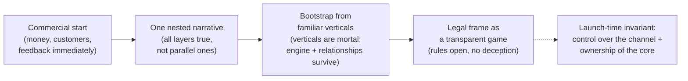

# Mentoring: How to Launch It Right — Bootstrap, Narrative, Law, Power

**Private document. Not for public distribution.** This is the operational layer of the system, not its concept. The concept — the three layers, audience as power, mentoring as the last mile of influence — I worked out separately ("Mentoring: Development on the Surface, Power in the Depth, Meritocracy at the Limit"). Here I'm not interested in *why* the system is built the way it is; I'm interested in *how* to launch it so it solves money, customers, and law without killing the internal thesis and without provoking a premature conflict with power. I'm a pragmatist. I make money. This text is about that, and I don't soften the power layer here — there's an external version for softening.

**Alex Krol** — strategy, AI, growth infrastructure

> © 2026 Alex Krol. Private document. Not for public distribution; sharing, quotation, or translation only with the author's explicit written permission.

## Contents

0. [TL;DR — the launch strategy on one page](#tldr)
1. [Why a commercial start](#1-commercial-start)
2. [A layered narrative, not a contradictory one](#2-narrative)
3. [Bootstrap from the particular to the general](#3-bootstrap)
4. [The legal frame as a game](#4-law)
5. [Scoring, rating, privileges, enforcement](#5-scoring)
6. [Equity and outcome](#6-equity)
7. [The university/club as home](#7-home)
8. [Power: ally, enemy, or indispensability](#8-power)
9. [Summary](#9-summary)

---

## TL;DR — the launch strategy on one page 

We start commercially, and it's not camouflage. If the system gets broad reach — influences the judgments, behavior, and decisions of large numbers of people — the goal is reached, because reach *is* the goal. The political potential gets dealt with as it comes.

The narrative is layered, not contradictory. To the investor: a legitimate and true picture — a system of education built around the interests of the human being, not of corporations. Deeper down: the same system at scale — a thousand people is a boutique school, a hundred million is a party of influence. Everyone understands this, and nobody objects, because investing in it is good. The test is simple: is every backer at peace once they learn about the other layers? One nested narrative, not parallel ones.

Law is built like a game: the rules are open, the strategic depth is there to be explored, there's no deception. The mentor sells time and joint reflection, not consulting; any advice is a hypothesis; the responsibility is on the student, accepted up front. But a hard contract doesn't paper over the non-disclaimable: where the substance is financial, legal, medical, or psychotherapeutic advice, the label "this is reflection" doesn't cure it. The advice layer is light; the decision layer — scoring, price, access — is regulated differently, and what saves it is the transparency of the rules of growth.

Home is a university or a club, not free-to-play. Retention through growing real value, not through engineered compulsion. Equity is still a slogan for now — don't over-engineer it. Power is an emergent property of scale, an option, not a goal; it gets dealt with as it comes — except for one thing.

Everything is deferred except the launch-time invariant: control over the channel and ownership of the core. That's the single irreversible decision. "I'll deal with it later" turns into "they'll decide for me" on exactly the day the channel is controllable from a single center that power can seize.

---

## 1. Why a commercial start 

Broad reach *is* the goal. I'm not building an influence system that later, at some stage, gets monetized; I'm building a system whose success is *measured* by reach — the number of people whose judgments, behavior, and decisions the system actually shapes. If a million people build their trajectory through my system and act on their trust in it, I've achieved exactly what the whole thing was started for. Mentoring is the last mile of influence, the final conversion of attention into the action of a specific person; why it works precisely this way is worked out in the concept, and I won't rehash it. What matters here is the operational consequence: the goal and the metric coincide. Reach isn't a means to money and isn't a means to power. Reach *is* the result — expressed in money on the surface and in politics in the depth.

So a commercial start isn't camouflage, and this has to be said precisely, because the temptation to think otherwise is strong. Commerce looks like a disguise — "we sell coaching while building an influence machine" — but there's no disguise here, and there can't be. The structure of the system is legible the moment you say it out loud. Describe honestly what's under the hood, and it's visible in a second. Stealth that gets spoken stops being stealth; all that's left is a thin coat of paint over a visible threat, and any competent reader, human or machine, will see where the ears are sticking out. From which there's one conclusion: camouflage is pointless because it's unattainable. So a commercial start isn't a disguise of something else — it's the honest form of the same object. I sell exactly what I'm building: a system that grows people. That this same system becomes a force at scale isn't a hidden second truth but the same truth at a different depth.

From this follows the pragmatics of the launch. The commercial layer isn't there to hide but to feed: it brings money, customers, and feedback immediately, in a market everyone understands, without having to explain the political potential to anyone. If at some stage competent power takes an interest in that potential, I'll deal with it as it comes. This isn't dodging the question, it's the right ordering: while the system is small, the political layer is latent and inert, and spending startup resources on it is a mistake. First reach — because without reach there's no money, no depth, and no subject to talk to power about. Everything else is built on top of reach, not the other way around.

---

## 2. A layered narrative, not a contradictory one 

To the investor I give a legitimate picture, and it's a true one, not something made up for them. The picture is this: I'm building a system of education and mentorship structured around the interests of the human being rather than around the interests of corporations. The phenomenon already exists — coaching, incubators, personal mentors — I'm just moving it onto a new technological layer that makes it mass and cheap. The investor gets it at a glance, because they know a market of this class. From there it's obvious to anyone: a system with a thousand people is a boutique elite school; one with a hundred million is a party of influence. Everyone sees this. And nobody objects — because investing in it is good, and nobody minds sitting on the board of a company like that. The political potential here isn't hidden or forbidden; it's just not the main thing yet, and everyone agrees it isn't the main thing yet.

But "a different narrative for different backers" has a line whose crossing kills the company, and it has to be named precisely. It's the difference between a layered narrative and a contradictory one.

A layered narrative is when all versions are simultaneously true and reconcilable. "Growth infrastructure for the human being" and "the last mile of influence, capable of reformatting power" are one company seen at different depths: the second is what the first becomes at scale. The test is simple and singular: would every backer be at peace learning about the other narratives? If yes, it's targeted packaging, and it can be done boldly, because it contains no deception, only different depths of disclosure of one and the same object.

A contradictory narrative is when for investor A the company is a "coaching app" and for investor B a "system for capturing power," and those are different businesses with different uses for the money. The investors sit on one board, they talk to each other, and due diligence — the check before a deal — sooner or later pulls out the second deck. And then exactly the legibility from the first section kicks in: the ears are sticking out, but now in front of the people who hold your money and your board of directors. That's a bomb planted in the ownership structure of the company, detonating at the worst possible moment.

So not parallel narratives but one nested narrative — built exactly like the asset itself: the surface commercial and true, the depth civilizational and true, and access to the depth gated by alignment — by which backers can be shown how deep it goes. Stakeholders who share the internal thesis have to be seated in the ownership structure early, at least one or two: then the internal thesis has a defender in the room when the board makes decisions. And one concrete point where money meets narrative: commercial capital is taken against the commercial layer, but control over the core stays with me. How exactly the core and the periphery are structured, what to keep as your own and what to put at investors' risk, is an engineering question, and it's in the third text of the series. Here the rule is enough: give up the core and you give up the very possibility of having a second layer, and then the nested narrative collapses into the commercial one, because there's no one left to defend the depth.

---

## 3. Bootstrap from the particular to the general 

I'm going by bootstrap — from the particular to the general, on my own operating money, not on capital raised against a promise. Had I several million dollars and full freedom of action right away, it would all be simpler; but since I have to bootstrap, I start where I already have expertise and where the market feeds immediately. These are the verticals I've been in for a long time: incubation, personal growth, teaching, nonfiction writing, blogging, filmmaking. Each of them is a separate applied product that sells today and brings in revenue today, and at the same time it's a training substrate for the system. I start with them not because they matter more than the others, but because in them I have enough competence not to learn the market from scratch, and because they help develop the operating business immediately.

The logic of the portfolio is simple. Above the common engine sits a layer of verticals — markets. Each vertical differs only in audience, segment, and industry knowledge base; the engine itself doesn't change. So verticals can be spun up fast and cheap, tested by the batch and buried by the batch. Most of them will turn into a pumpkin, and that's the norm, not a risk; verticals are supposed to be mortal — cheap to launch, cheap to bury — and only the engine and the real relationships with people are obliged to outlive their deaths. This is already the engineering mechanics of the portfolio, and they're detailed in the third text; what matters here is only that the bootstrap rests on mortal verticals, not on one big bet.

I'm not sizing the market right now, and that's deliberate. A precise estimate of the total market is speculation, all the more so when you segment by verticals and each has its own size. I have no rule that says "if the potential market isn't two trillion but one and a half, I won't bother." I'm a pragmatist and an entrepreneur; if I make a hundred million dollars in the first stage, that suits me — because I know that if I keep moving, sooner or later I'll find a new product and a new market. The total market of every conceivable vertical, corporate and consumer, is almost certainly large, but there's no point counting it at this phase. And I'm not in fundraising mode — I don't need to prove anything to anyone. I do this because I enjoy it and because it's part of my operations. This isn't a pitch. Anyone reading this text as a deck for raising money is reading the wrong document.

---

## 4. The legal frame as a game 

This is the core of the operational strategy, and here precision is required, because the cost of an error is high. I'm not a lawyer; everything below is a working model and a mapping of risks, not a legal opinion, and any concrete construction goes under a live lawyer for the specific jurisdiction. I separate what I consider established from what I consider my own reasonable risk argument by analogy, and I'll mark the boundary right in the text.

Let me start with the frame of the relationship. The mentor position is stronger than the consultant position, and that's epistemically correct. I sell not consulting but time and joint reflection. The condition is stated up front: I'm willing to listen, reflect together, share thoughts, give advice — but the responsibility and the risk are entirely on the student, because any advice is a hypothesis. The person buys the right to communicate and my time, not a guaranteed result. They're free to take the advice and follow it at their own risk, to do their own research, to refuse, to take other advice. This is the correct frame for the mentor–student relationship, and it's signed hard and up front, with no back doors like "you advised me badly, now it's your fault."

On top lies a game frame, and it's more precise than a university one. In a game part of the rules are open — the win condition and the scoring are transparent — while part of the strategic depth is hidden and explored by the player themselves: how exactly to play well. Lost because you didn't uncover the depth? That's a mechanic, not a grievance. I set the meta-rules of the game, explicit and implicit, but there's no deception in them. This is an important caveat: hidden depth isn't a trap and isn't deception, but a normal property of any game, like any complex activity; a person can explore it, ask others, search. There's no legal or academic source directly on "mentoring as a game" — it's my conceptual model, and I hold it exactly as a model, not as a doctrine. But the boundaries of this model — where it stops protecting — are described by quite solid law, and here they are.

The first boundary: you can't disclaim the non-disclaimable. A court and a regulator look at the substance of the activity, not at the label the parties gave it. If the content is in substance financial, legal, medical, or psychotherapeutic advice, the phrase "this isn't advice, it's reflection" doesn't cure it — the regulated domain switches on regardless of the name. This is the principle of substance over form, qualification by substance, and it works quite predictably in regulated domains[^8]. The cleanest illustration of the mechanism isn't even from mentoring: in 2021 the U.S. regulator characterized an income-share agreement — a contract for "a share of future income, not a loan" — as a credit product in substance, the contractual label notwithstanding[^9]. The same mechanism applies to the mentor formula. I stress: there's no direct court case specifically about the mentor formula "this is reflection, not consulting," and I don't present it as established precedent; this is an application of general principles by analogy, a reasonable risk argument, not a proven defense.

The second boundary: a hard signature against a consumer is weaker than it looks. A contractual disclaimer of liability protects against claims for ordinary negligence, but in the overwhelming majority of U.S. jurisdictions it does not protect against gross negligence, fraud, and harm to health — such waivers courts hold void on public-policy grounds[^6]. The specific thresholds vary from state to state, so I'll put it cautiously: "in most jurisdictions," with no tie to a particular one. On top of that the doctrine of unconscionability applies: a court may decline to enforce a term, weighing the clarity of the wording, the inequality of bargaining power, and how real the consumer's choice was[^7]. The paradox is that the harder and broader the signature, the higher the chance a court finds it unconscionable. "Signed everything hard" against a private individual is not armor.

The third boundary, and it's the main one: the advice layer and the decision layer are different animals. The advice layer is light precisely because it's advice: the person is free to follow it or not, the disclaimers work, the hidden depth stays hidden, liability is limited — as long as you don't reach into regulated domains. But scoring, which determines a person's tier, their price, their access, is no longer "the mentor's word," it's the system's decision about a person. And at first glance it seems the mentor frame doesn't reach this far. But I worked through it and came to this: "the system makes a decision about a person" isn't a problem in itself — it's a public offer, like a university, a competition, a club, or any paid service. Pass the exams, meet the conditions, you're admitted; you're obliged to follow the rules — there's a contract between you and the university. Don't like it, go to another. Legitimate, and it's worked for a long time.

The cleanness of this construction is held by exactly one thing — the transparency of the rules of growth — and here three things converge into one. Transparent rules of growth are, first, the engine of motivation: a person has to see what exactly to do in order to grow, otherwise motivation collapses. This is what distinguishes a meritocratic system from a social network, where the very target of optimization is hidden. Second, that same transparent path is a legal shield: the decision is made by a published rule rather than a hidden model, and so it's explainable and contestable. Third, it's data-protection cleanness: the logic of the decision is a published rule, fully traceable. The architectural discipline that follows is single: the hidden model only advises and optimizes, while what gates is a transparent published rule. As long as the iceberg recommends and a consequential gate sets a rule of the form "you met such-and-such conditions, you got such-and-such access," the system is clean. Exposure arises at exactly one point: when the hidden model *silently* affects a meaningful gate beyond the published rules — quietly tags a person "low potential" and cuts their access or price. That's where the very black box of a social network gets recreated, the thing the whole construction is built away from. Silently gate beyond the rules, and you've broken your own cleanness.

And here's why this isn't a theoretical risk but the profile of exactly this system. Automatic gating by score is precisely what European law restricts: a data subject has the right not to be subject to a decision based solely on automated processing if it significantly affects them[^1]. The label "it's just a recommendation" doesn't pull it out from under the rule if the decision is in substance automatic and significant. Moreover, the EU court has already ruled that the obligation also falls on whoever *computes the score*, not only on whoever formally makes the decision — if the score is substantially relied on[^3]. You can't hide a regulated decision behind the formula "we only calculate a rating, someone else decides." And separately: educational systems that determine access to learning, that assess competencies and outcomes, are classed by European AI legislation as high-risk with all the attendant obligations — transparency, human oversight, documentation; while opaque social scoring and manipulation of behavior that bypasses free will are classed as prohibited practices[^4][^5]. A transparent rule of growth isn't cosmetics but a way to stay out of the prohibited category: a "university of a new type" with automatic scoring and gating of access is a candidate for high-risk status, and the obligations for such systems phase in. This has to be designed in advance, not retrofitted.

---

## 5. Scoring, rating, privileges, enforcement 

In systems of this kind, personal ratings naturally appear — and public ones at that, like karma. There's no need to disclose every individual score and its inner kitchen — but the rules of growth are transparent, and from them a person *infers* why their rating fell: they broke a known rule, they slacked off, they behaved badly. Here a correction to my own temptation to hide the "why" is in order. An opaque consequential score is the most heavily pressured zone: it's precisely what the EU court's scoring ruling and the rule on automated decisions apply to, and precisely what is instantly associated with social credit[^3][^1]. By hiding the reason for the fall, you lower the risk of defamation and raise the risk of algorithmic accountability — you trade a lesser threat for a greater one. And it contradicts your own principle: if the rules of growth are transparent, the reason for the fall is inferable by construction. A transparent reason is again three-in-one: the engine of motivation, a defense against defamation (it's simply the application of a published rule, and a true statement of fact cannot be defamation[^11]), and data-protection cleanness. The public score I keep; the opacity I remove.

A privilege is an earned reward for a transparent achievement, not a hidden gate. Meet the conditions, get the privilege — for example, access to people you otherwise couldn't reach. Silently throttling someone's potential makes no economic sense in this model, and that's stronger than any legal argument. In the extraction model — social networks, advertising — silent throttling has a point: you're milking dependence. Here it's the reverse: I make money when the person grows — through upsell, a stake, an outcome. Throttling their potential is economic suicide. The alignment of incentives removes the very motive for abuse. A microseam remains only in the distribution of a scarce resource among those who've already cleared the rule — but even that is closed by a further transparent criterion or a lottery.

Enforcement is built through the loss of what's accumulated, not through a blacklist. If a person breaks the rules, the system reserves the right to refuse further service for life — and this is contractual, neutral, automatic, by published rules. A person who leaves the system loses everything accumulated: the analysis, the scenarios, the forecasts, the feedback, the navigator functions that guided their route, access to the network of needed people — their whole compounding. This is scarier than any blacklist, because it hits not the reputation but the accumulated trajectory.

And here's the point where I myself once nearly crossed the line, and where it has to be named hard. The temptation, on a default, is "I'll tell the whole system that he doesn't keep his word, and he won't sue, because I warned him in advance." Here "I warned" doesn't protect. Actively broadcasting negative information about a person across the network is, first, potential defamation, and second, more importantly, a data-protection regime: actively maintaining and distributing negative information about a person edges toward a regime that in the U.S. is regulated by consumer-reporting law and in Europe by the controller's obligations of accuracy, rectification, and erasure[^12]. Consent to the rules of the game doesn't give a lawful basis to broadcast someone's behavioral data across the network. At scale, coordinated exclusion adds another layer of unfair practice. And a blacklist simply isn't needed: there's a stronger and cleaner enforcement — the loss of the accumulated trajectory and access. Passive exclusion under the terms of the contract is clean; active broadcasting of "he's bad" is dangerous and, on top of that, redundant. Cut the broadcast, keep the loss of access.

One thing I don't present as settled. A public personal rating is still the personal data of a specific individual, and its cleanness depends on the implementation: what exactly is public, whether there's a contractual basis and consent, how accurate the data is. I don't claim a public rating is guaranteed clean of data-protection and defamation claims; the principle in favor of passive exclusion under a published rule is solid, but the concrete implementation of a public score is a borderline zone for a live lawyer, and that's how I hold it.

---

## 6. Equity and outcome 

Equity is still a slogan, and I'm not going to over-engineer it now — it's a raw idea built on a pile of hypotheses, and it's too early to sharpen it. But the outlines of legitimate schemes are there, and they're existing ones, not invented.

The first is the placement model. If I, as an agent, helped a person land a job, I can stipulate in advance a share of their compensation for some period in return for that placement. This is a normal rule, and recruiting models work this way; a typical contingency commission in recruiting runs on the order of fifteen to twenty-five percent of annual salary, so the specific rate is a matter of construction, not of law. The figure in the brief ("ten percent for a year") is illustrative, not an industry standard; I hold it as an example of a construction. The second is advisory equity: if a person, thanks to mentorship, created a legal entity, the mentor by agreement gets a stake in it. That's how accelerators work: Y Combinator takes a fixed stake for participation in the program — five hundred thousand dollars, the first portion of which goes for seven percent through a standard instrument[^15]. But that's a stake for money plus the accelerator program, not for mentorship as such. The market standard for advisory equity specifically — for the advisory role — is noticeably lower: usually from a quarter of a percent to one percent, with vesting of about two years[^16]. The "two percent for mentorship" figure I was holding in mind is more accurately understood as the upper edge for an expert in a special case, not as a standard. I'm not fitting it to the market as a fact; it's an example, not a rate.

The benefit to the client in both schemes is transparent: they pay out of a larger income that, by assumption, arose in part thanks to the mentorship, and they bear no risk up front. They can agree, then refuse to pay — in which case I simply end the relationship, with no scandal: they breached an obligation and drop out of the system, losing what's accumulated, exactly by the mechanics of the previous section. No blacklist is needed for this.

One nuance for later, and it's legal. The construction "a share of income for a period" is in substance close to an income-share agreement, and in a number of jurisdictions it's treated as a credit product with its own regulation — regardless of its being "a rule of the game." This isn't my guess: in 2021 the U.S. regulator characterized one company's ISA as a loan and a private education loan in substance, with all the attendant disclosure requirements; the U.S. Department of Education confirmed the same position in 2022[^9][^10]. I stress — this is an administrative act, not a law of universal force, and it should be phrased "the regulator characterized the ISA as a credit product in substance," not "ISAs are banned." The contingency of the payment doesn't pull the construction out from under financial supervision. But this is secondary now and gets resolved at the structuring stage.

And the bridge that matters here. The money model has to want the graduate, not their retention. Subscription and a long upsell want the person to stay; a stake in their success and pay-for-outcome want them to take off. Which exact economics keeps the system pointed at the client's flourishing rather than at retention is the invariant on which the whole concept stands, and it's unpacked in the third text of the series. Here I fix only the direction of choice: the weight of the economics goes toward the outcome, not retention.

---

## 7. The university/club as home 

The right home for all this is a university or a club, not a free-to-play game mechanic. And the distinction here isn't cosmetic — it runs exactly along the line that separates development from the exploitation of dependence.

Retention in a mature system rests on growing real value. The whale in a hardcore game and the member of an elite club both stay not out of compulsion but because the value to them exceeds the price by orders of magnitude — and exceeds it the more, the higher they've grown. For an advanced person, membership in an elite club isn't up for debate: the real communications, the real connections, the access to the right people are worth incomparably more than the dues. The higher a person has climbed, the more the network costs them and the more valuable they are to the network itself. That's durable loyalty: the person doesn't leave as a hero and isn't stuck in a trap — they move from protégé to equal and stay because it's worth it.

But a club and a free-to-play whale aren't the same thing, and they're easy to confuse on a profit statement. The test is simple: can a member leave without pain and still stay? A club — yes; a dark pattern — no. In a club they stay because the value grows; in free-to-play a noticeable share of "whales" hold on not by calculation but by engineered loops of compulsion — that's the dependence pole. The numbers here are telling: by industry data, fewer than a quarter of one percent of free-to-play players generate about half of all in-app-purchase revenue, while the top ten percent of payers generate most of it[^13]. On a profit statement a "whale" and a "member of an elite club" look the same; the retention mechanism and the longevity are opposite. You take the club mechanism, not free-to-play, even though you get whales in both cases.

Endowments and alumni networks are empirically the most durable model in existence, and that's a structural fact, not a slogan. An endowment is built as perpetual capital: the income is spent, the body is preserved. The largest universities exist for centuries, and gifts flow in across generations precisely because retention rests not on compulsion but on growing real value — the network, the access, the prestige, the alumnus's identity — and on a self-sustaining cycle in which the grown alumnus gives back to the system[^14]. This is a direct contrast to the free-to-play mechanic: voluntary loyalty by choice versus engineered dependence.

So the right frame is "a university of a new type." Just as a university's task is to grant a qualification and a certificate, here the task is to help a person grow, which is also measurable; and inside that loop you can do anything useful, including courses. It's beautiful that it all converges on one point: the institutions that retain through growing real value — great universities, alumni networks, real clubs — are exactly the ones that turn out autonomous, successful people who stay by choice. A legitimate frame, an ethical one, and a durable one are here the same thing. It's on that junction that you should build.

---

## 8. Power: ally, enemy, or indispensability 

Power is an emergent property of scale, an option created by execution, not a goal you plan. Almost everything about power gets dealt with as it comes: when it appears, the conversation appears too. But one thing isn't deferred, and it's the single irreversible decision of the launch — control over the channel.

The logic is hard. By the time power takes an interest in the system's political potential, the channel will already have been built and the data accumulated. If the channel is controllable from a single center, "I'll deal with it later" turns into "they'll decide for me": the ability to steer the decisions of millions through a trusted personal channel is not something power buys — it seizes it. This isn't philosophy, it's one launch-time decision that becomes irreversible at scale. So control over the channel and ownership of the core are the few things that can't be deferred. Everything else — yes, as it comes.

Next — three illusions that die at scale, and they have to be buried in advance so as not to build on them.

The first is sovereignty. Power's mandate to destroy any corporation or individual under the pretext of a "threat to the state" is unconditional and triggers on the *belief* in a threat, not on the fact. A network of tens of millions of people bound by trust and directive influence, loyal to the system rather than the regime, reads as a coup vector — and they'll react to it as to a weapon, because in the political sense it is one. A private player has no sovereignty whatsoever over such a network.

The second is stealth. The structure is legible the moment you say it; there's no disguise, as worked out in the first section. You can't rely on faith in stealth.

The third is independence through ownership, and it's the most counterintuitive. Owning the platform and the assets doesn't grant independence — it grants the opposite. Musk is the perfect proof here, and stronger than it looks: X, Tesla, SpaceX, government contracts, accounts — these are hostages. The more you own, the more levers you've handed power yourself. In 2024 a single Brazilian Supreme Court justice shut X off across the entire country and, on the side, froze Starlink's local assets as leverage — and the decision was upheld by a panel of five justices[^17]. The richest man, with his own bully pulpit, turned out not freer but more vulnerable, because he has something to take. And it's not a one-off: European digital-services regulation keeps platforms above a certain size under direct institutional leverage — fines up to a percentage of global turnover, suspension of service as a last resort[^18]; while the infrastructure of distribution is held by third parties and the state — Parler was removed from both app stores almost simultaneously and stripped of hosting, destroyed infrastructurally rather than over content; TikTok was pulled and reinstated by law and political decision[^19]. Control over the pipe matters more than owning what flows through it.

From this follows an operational distinction that has to be built into the structure from the very start: separate the asset from the conversion apparatus. The asset — trust in people's heads — is non-expropriable: it can't be copied by observation and can't be seized by warrant, because it exists as a state in the heads of living people. Even the formal right to data portability concerns the data a person *provided*, not the inferences and trust accumulated in heads[^2]. But the asset is latent — inert in itself until it's directed. The apparatus that converts trust into directed power and into money — servers, a legal entity, an owner, accounts — always has an address and so is always expropriable. Power lives at the point of conversion, and that point always has an address. I stress: "the non-expropriability of trust" is my thesis by analogy, not a proven result; the expropriability of the apparatus is an observed fact, confirmed by the cases above.

The conclusion isn't "escape" and isn't "independence" — those don't exist. The conclusion is embeddedness, distributed indispensability: being a load-bearing structure inside a sufficient number of competing powers, so that destroying the system costs more than its existence. Not sovereignty, but being woven across factions. How this gets built in engineering terms is a separate conversation; here the political conclusion is what matters.

And the conclusion about whom this can be sold to at all. Not to the standing regime. Any durable regime optimizes its own survival through control rather than the nation's capacity through meritocracy, and a network built on trust grows loyalty to the network, not the regime. Mentoring can, on a short horizon, be sold to power as an upgrade to control — we select the capable better, develop them, bind them with trust — and in that logic power is held as an ally. But competent power sees that the instrument improves control in the short run and grows competing loyalty in the long run. So partnership with the standing power isn't a stable state but a countdown: it holds exactly until the day the system becomes large enough to be recognized as a competing center. The "right people" the system can be sold to aren't power as such, but the competent counter-elite within or alongside it, the ones who themselves feel cramped among the incumbents. You sell to a faction laying claim to power, not to the standing regime. Why power structurally can't be the customer of an influence system is worked out in the concept; here the operational conclusion is single and hard: you sell to a faction, you keep control over the channel and the core, everything else — as it comes.

---

## 9. Summary 

Start commercially: reach *is* the goal, and commerce is the honest form of the system, not camouflage, because camouflage is unattainable — the structure is legible the moment you say it. The narrative is one nested narrative, not parallel ones: all layers are true and reconcilable, the test on every backer is passed. Bootstrap from familiar verticals that feed today and that you won't mind burying by the batch; there's no point sizing the total market now, a hundred million in the first stage is enough.

Law is a game with transparent rules of growth: the mentor sells time and joint reflection, the responsibility is on the student, accepted up front. But you can't disclaim the non-disclaimable: where the substance is regulated advice, the label doesn't cure it, and a broad signature against a consumer is weaker than it looks. The advice layer is light, the decision layer is regulated — and what saves it is the transparency of the rules, which is at once the engine of motivation, the legal shield, and data cleanness. The hidden model advises, the transparent rule gates; gate silently beyond the rules and you've broken your own cleanness. Enforcement is the loss of what's accumulated and of access, not a blacklist; actively broadcasting about a person is dangerous and redundant. Equity is still a slogan, don't over-engineer it; the money model has to want the graduate, not retention. Home is a university or a club: durable loyalty through growing value, not free-to-play compulsion. Power — as it comes, except for launch-time control over the channel and ownership of the core; you sell to a faction, not the regime; there's no independence through ownership, only distributed indispensability.

All of it is navigable — verticals, markets, narratives, tactics, legal constructions get generated, tested, and locked in on wins. Exactly one thing isn't navigable: the invariant "victory = the client's flourishing," on which the whole concept stands and which turns power from a victim into a potential ally. How exactly this invariant gets operationalized — which wins to lock in, how to untie the moat, how to hold the core against the market's gradient — is unpacked in the third text of the series. Here only this is fixed: launch commercially, keep control and the core, build law as a transparent game, choose a home and money that want the client to take off. Set this right and the system scales without losing the thesis. Set it wrong and you give the core to capital or the channel to power, and scale becomes not an achievement but the moment when others decide for you.

---

## Footnotes

[^1]: Regulation (EU) 2016/679 (GDPR), Article 22 — "Automated individual decision-making, including profiling." https://gdpr-info.eu/art-22-gdpr/

[^2]: Regulation (EU) 2016/679 (GDPR), Article 20 — "Right to data portability." https://gdpr-info.eu/art-20-gdpr/

[^3]: CJEU, Judgment of 7 December 2023, *SCHUFA Holding (Scoring)*, Case C-634/21, ECLI:EU:C:2023:957. https://eur-lex.europa.eu/eli/C/2024/913/oj/eng | https://iapp.org/news/a/key-takeaways-from-the-cjeus-recent-automated-decision-making-rulings

[^4]: Regulation (EU) 2024/1689 (Artificial Intelligence Act), adopted 13 June 2024; the prohibitions (Art. 5) apply from 2 February 2025. https://eur-lex.europa.eu/eli/reg/2024/1689/oj | https://artificialintelligenceact.eu/high-level-summary/

[^5]: AI Act — Annex III (high-risk use cases) and Art. 6; obligations for Annex III systems apply from 2 August 2026. Education and vocational training, profiling of natural persons — high-risk. https://artificialintelligenceact.eu/annex/3/ | https://artificialintelligenceact.eu/article/6/

[^6]: U.S. doctrine and case law: liability waivers and the limits of their effect — gross negligence, harm to health, public policy. https://aaronhall.com/liability-waivers-in-consumer-contracts/ | https://legalclarity.org/can-you-waive-gross-negligence-in-a-contract/

[^7]: Unconscionability as a ground for the invalidity of a consumer contract (procedural + substantive). https://www.stimmel-law.com/en/articles/waivers-california-contract-law | https://rothman.law/blog/when-liability-waivers-are-unenforceable

[^8]: Substance over form — a general principle of regulated domains (finance, law, medicine, psychotherapy): qualification by substance, not by label. The leading illustration is the ISA case, see [^9]. https://www.consumerfinance.gov/about-us/newsroom/cfpb-takes-action-against-student-lender-for-misleading-borrowers-about-income-share-agreements/

[^9]: CFPB Consent Order, *In re Better Future Forward, Inc.*, 7 September 2021 (File No. 2021-CFPB-0005). ISAs characterized as "extensions of credit" and "private education loans" in substance. https://www.consumerfinance.gov/enforcement/actions/better-future-forward-inc/

[^10]: U.S. Dept. of Education / Federal Student Aid (2 March 2022). "Income Share Agreements and Private Education Loan Requirements." https://fsapartners.ed.gov/knowledge-center/library/electronic-announcements/2022-03-02/income-share-agreements-and-private-education-loan-requirements

[^11]: Defamation in the U.S.: truth as an absolute defense; opinion (Milkovich v. Lorain Journal Co., 1990) conditionally protected; qualified privilege. https://www.law.cornell.edu/wex/defamation | https://www.minclaw.com/opinion-defense/

[^12]: Data protection in credit/reputational blacklists: GDPR Art. 16 (rectification), Art. 17 (erasure); in the U.S. — the Fair Credit Reporting Act (FCRA), governing "consumer reporting agencies." https://gdpr-info.eu/art-17-gdpr/ | https://gdpr-info.eu/art-16-gdpr/ | https://iapp.org/news/a/gdpr-matchup-us-financial-privacy-laws

[^13]: Swrve, *Monetization Report* (2015–2016 series; data on F2P mobile in-app purchases); coverage by Game Developer / Gamasutra. Fewer than ~0.22% of players ≈ half of IAP revenue; top 10% of payers ≈ 64%. https://www.gamedeveloper.com/business/half-of-all-f2p-mobile-game-revenue-comes-from-0-22-of-players---report

[^14]: University endowments as perpetual structures; Harvard (founded ~1636) and Yale (founded 1701) have existed for centuries; a significant share of Yale's endowment is restricted (designated gifts). https://www.harvard.edu/about/endowment/ | https://www.yale.edu/funding-yale-home/overview-yales-endowment

[^15]: Y Combinator — "The YC Standard Deal" (current as of January 2022): $500K, of which $125K for a fixed 7% equity via a SAFE, plus $375K on an uncapped SAFE with MFN. https://www.ycombinator.com/deal | https://www.ycombinator.com/blog/ycs-500-000-standard-deal

[^16]: Founder/Advisor Standard Template (FAST), Founder Institute (public template since 2011); standard advisory equity 0.25%–1%, vesting ~2 years. https://fi.co/fast | https://fi.co/insight/the-founder-institute-s-standard-advisor-agreement-for-startups-fast

[^17]: Blocking of X in Brazil (30 August – 8 October 2024), Supreme Court Justice Alexandre de Moraes; freezing of Starlink assets; decision upheld by a panel of 5 justices on 2 September 2024. https://en.wikipedia.org/wiki/Blocking_of_X_in_Brazil | https://www.france24.com/en/americas/20240830-brazilian-judge-orders-musk-s-x-to-shut-down-as-starlink-contests-account-blockage

[^18]: Regulation (EU) 2022/2065 — Digital Services Act (DSA); in force for VLOPs/VLOSEs since August 2023. Fines up to 6% of global annual turnover; as a last resort — temporary suspension of service. https://eur-lex.europa.eu/eli/reg/2022/2065/oj | https://digital-strategy.ec.europa.eu/en/policies/digital-services-act

[^19]: Delisting of apps from the App Store / Google Play: Parler (Google and Apple, 8–9 January 2021; AWS hosting also cut off); TikTok (Apple/Google, 18 January 2025, under the divest-or-ban law; reinstated afterward). https://techcrunch.com/2021/01/08/parler-removed-from-google-play-store-as-apple-app-store-suspension-reportedly-looms/ | https://www.cnbc.com/2025/01/18/apple-google-remove-tiktok-from-stores-as-app-halts-service-in-us.html
