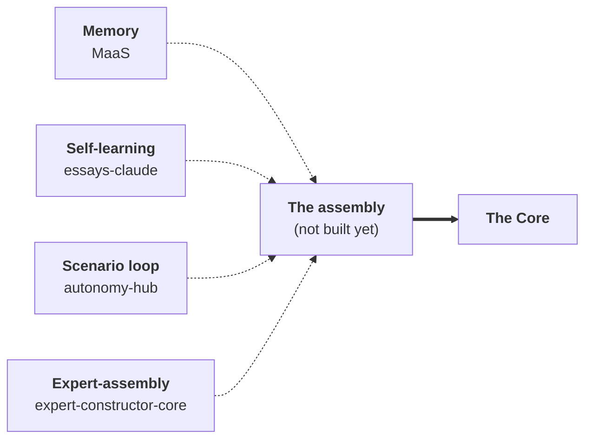

# Verticals — The Architecture, Confirmed in Practice

> **Russian counterpart:** [`Ru/3_Verticals/README.md`](../../Ru/3_Verticals/README.md)

The rest of this corpus designs the navigator on paper. This section does the opposite: it reads roughly a hundred working code projects backward, to ask whether the architecture the essays describe actually shows up when a person sits down and builds something to solve a real problem.

It does. And it shows up in a specific shape.

---

## 1. The method: particular → general

The corpus argues the architecture top-down — from the metaphysics of unique trajectories down to a self-learning engine and its markets. This section runs the other direction. Over several years the author kept building applied tools, each one starting from a concrete, personal problem: produce a course, grow a channel, plan a trip, validate an idea, diagnose an organization, decide where to spend the week. **None of them set out to "build AGI."** They were launched at different times, for different reasons, and most were never meant to be more than what they were.

And yet, whenever a tool got serious, its solution kept converging on the same figure: **an expert that does not answer but leads** — a navigator with memory, a goal, a fan of routes, and a domain. The early projects were where the common patterns first became visible; the ones that keep developing are the ones drifting toward that figure. So the catalog below is read as an inductive proof of what the essays assert deductively: the same construction, reached from many starting points, without anyone aiming for it.

A word on how to read it. **These projects are not sorted into rigid boxes.** Every one of them is, to some degree, part of the one concept; they simply sit at different points on the path from particular to general, and at different stages of maturity. Some are full verticals; some are pieces of the core engine; some are single-purpose utilities that nonetheless rehearse one move of the larger figure. The groupings further down are *reading lenses, not a taxonomy* — several projects could sit under two of them. What matters is the stage each is honestly at, stated on its own card.

To make the reading mechanical rather than impressionistic, each project is placed against one ladder:

> **A utility** is one step. **A pipeline** is many steps aimed at a goal — some steps run code, some call a model. **An agent** = a pipeline **+** feedback **+** self-learning. **A vertical** = an agent whose end consumer is a *human with a goal*, plus a domain knowledge base, plus a market.

The single fundamental test is the **pipeline**: is there a goal reached through a multi-stage scenario, or just a one-shot tool? Everything above a pipeline is at minimum a candidate. (The full rubric and the raw per-project profiles live in the author's private intake notes, kept out of this repo.)

---

## 2. The finding: one architecture, many markets — and a core that exists in pieces

Two things show up that paper alone cannot establish.

**The same architecture, across wildly different markets.** Life and career mentoring, founder validation, creator growth, personal travel expertise, organizational AI transformation, and time-strategy are very different businesses. They share one engine: *reality model → scenario fan → positioning*, learning from labeled consequences. That is precisely the corpus's claim — **one core, interchangeable verticals** — observed rather than asserted. And the stages are real: you can watch the architecture thicken from a conversational mentor with no pipeline yet, to a two-loop pipeline with a designed learning contour, to an end-to-end machine with content already shipped. The ladder is not a taxonomy invented after the fact — it is the growth path these projects actually took.

**The core already exists — but in pieces, never yet assembled.** No single project is "the engine." The core is built in fragments across the portfolio, and each fragment happens to implement a different organ:

Memory ([maas](maas/README.md)), self-learning ([essays-claude](essays-claude/README.md)), the scenario/anti-paralysis loop ([autonomy-hub](autonomy-hub/README.md)), and the expert-assembly platform ([expert-constructor-core](expert-constructor-core/README.md)) exist **apart**. Fusing them — one memory feeding one scenario engine that learns from its own logged consequences — is "the project where the core itself is realized." On paper it is the center of the corpus. In the portfolio it is the one thing not yet built. That absence is not a weakness of the analysis; it is its most useful output — it names the next thing to build.

---

## 3. The catalog

A top-level concept document sits alongside the project folders:

- [`0_ideal-client-trillion-market.md`](0_ideal-client-trillion-market.md) — the external frame for partners: the ideal client (the minority with non-latent demand for growth), the mechanics of hardcore games and elite accelerators, a market measured in the trillions, the growth-scoring model as the moat.

Each project below has its own folder and a product description. The lenses are reading aids, not boxes.

### Verticals that lead a person to a goal

| Project | What it is | Ladder / stage |
|---|---|---|
| [mentoring](mentoring/README.md) | The canonical first vertical: a navigator for a life/career transition; a working but thin mentor exists, plus the corpus's deepest concept essays. | mentor figure, pre-pipeline · working, thin |
| [founder-pipeline](founder-pipeline/README.md) | Leads a founder from a raw feeling to a validated, fundable thesis; the most complete single-project agent in the portfolio. | full agent · prototype |
| [ai-video-pipeline](ai-video-pipeline/README.md) | An "automated film company" that grows a creator's channel; the card closest to a real market. | agent, market-ready · prototype, shipping |
| [saved-downloader](saved-downloader/README.md) | Turns your saved posts into a personal domain expert that leads you to a plan (first vertical: travel). | full agent · prototype |
| [tracking](tracking/README.md) | The navigator turned on itself — ranks the author's own bets by where time should go. | agent · working, personal |
| [ai-test01](ai-test01/README.md) | Idea Intake: a smart admission interview for raw founder ideas; donor of core machinery (Learning Orchestrator, Synthetic User Lab). | agent · working prototype (legacy line) |

### Organizational AI transformation

| Project | What it is | Ladder / stage |
|---|---|---|
| [questions](questions/README.md) | A structured intake engine that builds a reality model from people — the diagnostic front end. | pipeline · working, one client |
| [fastbank](fastbank/README.md) | An AI capability-transfer program for an enterprise, packaged as a repeatable consulting pipeline (run by a human, not yet an agent). | pipeline · drafts |

### The core engine, assembled in pieces

| Project | What it is | Ladder / stage |
|---|---|---|
| [maas](maas/README.md) | Memory as a Service — the core's long-term memory, built as standalone infrastructure. | core layer (memory) · prototype |
| [essays-claude](essays-claude/README.md) | A self-learning agent organization — the decision→result→correction loop, actually running. | core layer (self-learning) · prototype |
| [autonomy-hub](autonomy-hub/README.md) | The anti-paralysis engine — the scenario loop that keeps a project moving through blockers. | core layer (scenario) · design-stage |
| [expert-constructor-core](expert-constructor-core/README.md) | A constructor for grounded domain expert AI-chats — the platform verticals are assembled on. | core layer (assembly) · working prototype |

### Creator / expert-economy production

| Project | What it is | Ladder / stage |
|---|---|---|
| [course-producer](course-producer/README.md) | Turns an expert's raw material into a finished, deployed course. | agent · working tool |
| [course-distributor](course-distributor/README.md) | The publishing engine that puts finished courses on live platforms. | pipeline · working |
| [news](news/README.md) | Curate → comment → publish: an author's news-digest production pipeline. | pipeline · working |
| [ai-support-chat-plugin](ai-support-chat-plugin/README.md) | A knowledge-bound support assistant that diagnoses rather than guesses. | agent (narrow) · working release |
| [simple-cutter](simple-cutter/README.md) | Automated post-production for recorded talks — a single-purpose utility. | pipeline / utility · working |

### Content & knowledge bases

| Project | What it is | Ladder / stage |
|---|---|---|
| [agibook](agibook/README.md) | A book on the concept, written through (and as) a self-improving writing pipeline. | agent (writing) · working |
| [aibook](aibook/README.md) | A quest-game book that teaches AI mastery and ends in a personal Mentor. | content + pipeline · early drafts |
| [ontology](ontology/README.md) | A fictional universe as a knowledge base — the proto-language of the core. | domain knowledge base · drafts |
| [strategy](strategy/README.md) | The author's "where to bet" archive — content of the positioning layer, without the machine. | knowledge base · working |

---

*Source of record: the author's private intake notes (kept out of this repo). These cards are abstractions of the author's own projects; no private data is reproduced.*
