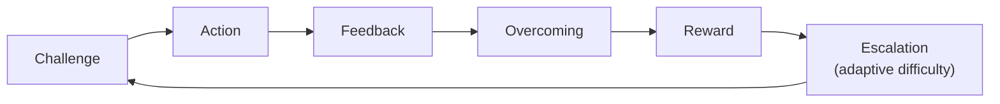

# AI-Mediated Growth Infrastructure

### A Concept Document on the Ideal Client and the Trillion-Dollar Market

**Alex Krol** — strategy, AI, growth infrastructure

> 🇷🇺 **Russian version:** [Ru/3_Verticals/mentoring/0_ideal-client-trillion-market.md](../../../Ru/3_Verticals/mentoring/0_ideal-client-trillion-market.md)

> © 2026 Alex Krol. All rights reserved. This document is shared for partnership discussion and may not be republished, redistributed, or used for derivative commercial work without explicit written permission.

---

## Contents

- [TL;DR](#tldr)
- [1. The Ideal Client: Who They Are and Why It's the Top 10–15%](#1-ideal-client)
- [2. Why Standard Education Doesn't Work for This Audience](#2-why-education-fails)
- [3. What We're Building: AI-Mediated Growth Infrastructure](#3-what-we-build)
- [4. Why Game Mechanics: The Eight Elements of the System](#4-game-mechanics)
- [5. The Biology of Motivation: Why This Works at the Neurophysiological Level](#5-biology-of-motivation)
- [6. The Growth Scoring Model as the Core Asset](#6-growth-scoring)
- [7. How We Differ From the Classical Approach](#7-differences)
- [8. Risks, Limits, Open Questions](#8-risks)
- [9. The Trillion-Dollar Market: Why the Thesis Holds](#9-trillion-market)
- [Sources](#sources)

---

## TL;DR 

We're not building EdTech and we're not building courses. We're building AI-mediated growth infrastructure for the 10–15% of people who already have both the capacity and the non-latent demand for growth. This infrastructure runs on mechanics closer to hardcore games and elite accelerators than to a university: a clear difficulty ladder, constant feedback, measurable progress, repeated attempts, earned advancement.

Three pillars hold it up. First: the neurophysiology of reinforcement — the brain learns through reward prediction error, and this is the natural mechanism by which durable internal motivation to overcome obstacles forms. Second: an adaptive-difficulty model — the system keeps the user in a zone where the task is still doable but demands real effort. Third: a personal AI mentor that scales what used to be a privilege of the few who could afford an expensive coach.

The central technical idea is a dynamic growth profile, built from the user's actual behavior rather than their self-description. From it grows the company's core asset: a growth scoring model — a data layer that maps which behavioral patterns correlate with long-term growth and which almost guarantee stagnation. Content can be copied. Emotion doesn't scale. A pleasant interface can be cloned in a month. A data layer about the real behavior of a specific audience is a defensible moat that compounds over time.

Monetization: pay-for-outcome, equity, a long upsell chain running from entry products in the low thousands to premium programs with six-figure tickets. The lifetime value of a single ideal client is tens of thousands of dollars and up. The audience is hundreds of millions of people worldwide. The total addressable market is in the trillions. This is a different class of market from mass EdTech, because we're not selling education — we're selling capitalization growth.

This document is not a roadmap and not a sales pitch. It's a coordinate system through which potential partners can decide whether we share enough common ground to talk.

---

## 1. The Ideal Client: Who They Are and Why It's the Top 10–15% 

I start with what almost no one does explicitly: I define the client not by demographics, but by their relationship to their own trajectory.

The ideal client is a person with a fully formed, non-latent demand for growth. They can be any age, gender, country, profession. They can work as an employee, run a business, invest, train as an athlete, make art, do science. None of that matters. What matters is one thing: they perceive life through the lens of growth. They carry an ongoing question — "what exactly do I need to do to grow?" — and that question is a background pull for them, not a seasonal mood.

By my estimate, people like this make up roughly 10–15% of the population worldwide. That's a rough estimate, and I'm not selling it as statistics — it's a working hypothesis, drawn from 25 years of watching the education and entrepreneurship markets. But the order of magnitude matters more than the exact number. This group is small as a share and enormous in its influence.

They differ wildly in the content of their ambitions, but their behavior shares a common structure. They speak a common language: they react the same way to a situation in which a serious development path with real stakes is laid in front of them. And they share a common structure of limits — all the standard human problems: doubt, fear, lack of confidence, skill gaps, lapses of discipline. They're not superhuman. They're simply people who have already made the internal choice to grow, and now they need infrastructure to act on that choice.

Out of this group, I screen out the freeloaders right away. I've worked this market for a long time and I know the difference well. A person who wants to grow but isn't ready to pay isn't our audience. They want the result without being ready to pay its real price. Our client has already moved past the stage of hunting for free solutions. They've understood that growth costs a lot — in time, money, effort, risk, ego. And what they're looking for isn't "cheap" but "maximally effective."

This shifts the negotiating posture. When we talk to a client like this, we're not discussing dollar price — we're discussing the ratio of investment to trajectory. It's an adult-to-adult conversation, not a salesperson hunting for a discount. And the key word in that conversation is trust. Trust in the system as a long-term partner in growth, not as a one-time service.

It's worth saying what we rely on here. The literature on grit — perseverance and passion for long-term goals — from Angela Duckworth shows that grit predicts achievement beyond IQ and beyond classical conscientiousness[^1]. Later meta-analyses refined the picture: the effect is more modest than it first appeared, and the grit construct largely overlaps with conscientiousness itself[^2]. I'm not married to any single theory. What matters more for me is the empirical observation underlying all this literature: persistence in the face of obstacles and the capacity not to quit in the long run deliver vastly more than raw ability at the starting line. Self-determination theory by Deci and Ryan points to the same picture: sustained behavior is supported by three basic psychological needs — autonomy, a sense of competence, and relatedness[^3]. The ideal client is a person in whom these needs are active and pointing upward. Our job isn't to "ignite motivation." It's to provide the infrastructure in which the natural flow of that motivation produces maximum results.

Why this audience specifically. Because it's economically unlike any other. It has high engagement, high retention, a long lifecycle, and the willingness to pay large tickets for real outcomes. A single client like this, over a long trajectory, can move through a chain of products — from entry tickets in the low thousands to programs with annual fees in the hundreds of thousands. That chain already exists in the market: I've seen it dozens of times. It simply works only with people who understand why they need this kind of infrastructure.

The other 85–90% aren't our audience. Not in a dismissive sense. Their life priorities just aren't organized around growth, and forcing them to play our game is both pointless and unfair. Other products, other services, other learning models fit them. We don't criticize them. We don't address them.

## 2. Why Standard Education Doesn't Work for This Audience 

To see what we're building, you first have to see clearly what we're not building — and why the status quo doesn't fill our niche.

The classical university and most of the EdTech industry emerged in response to a different problem. They are a system of mass preparation of people for existing social and economic structures. Their goal is that the system, on average, runs stably — not that any given student turns out exceptional. That's a reasonable goal for its category of problem. But it is emphatically not the problem we're solving.

That goal dictates the rest of the architecture. The education system is calibrated to average motivation, because otherwise its dropout rate is too high. It avoids high pressure, because high pressure scares a mass audience. It avoids hard selection, because selection is incompatible with the "university for everyone" model. It avoids high-stakes structures, because high-stakes structures carry reputational risk.

The result is what I call a low-intensity environment. And this environment almost never produces exceptional results. Not because it employs bad teachers — most of them are perfectly fine. But because the very architecture of the task is the opposite of the task of cultivating an exceptional person.

There's a separate thread here about "critical thinking" as a product. This is an interesting case, because to me it looks like a textbook illustration of the structural weakness of the university approach. The very idea that critical thinking can be trained as an isolated skill is appealing on paper. In practice, the literature says something else. The large meta-analysis by Abrami and colleagues across 117 studies of critical-thinking instruction showed a moderate average effect, about 0.34 σ (standard deviations), and the effect varied sharply by intervention type: dialogue, real-world tasks in context, and mentorship work — passive lectures and abstract exercises don't[^4]. A follow-up meta-analysis from the same group, this time across 341 effects, confirmed the picture: average effect ≈ 0.30 σ, and critical-thinking instruction in a vacuum barely transfers into real decisions[^5]. What the literature calls the transfer problem is a weak phase of any kind of learning, and without specific work, transfer doesn't happen on its own[^6].

The direct consequence: selling critical thinking as a standalone skill to an end user paying out of their own pocket is nearly impossible. The person doesn't see how the skill converts into a result. So these products get sold to universities — where the payer isn't the student but the institution, and where the KPI is formal completion of a module rather than real behavior change in the student's life. That, to me, is a diagnostic marker: when the payer isn't the end user but an intermediary with their own purchasing motives, the product isn't creating value the person would pay for themselves. This isn't a moral judgment about the product. It's about economics.

I'm not criticizing the university as an institution. It has its function, and within that function it works more or less. I'm saying one thing: the university and classical EdTech weren't designed for our audience. They answer a different demand. To our person — the 10–15% looking for maximum growth efficiency, ready to pay the real price, capable of withstanding pressure — the university gives too little intensity, too flat a difficulty curve, too weak a feedback signal, and cycles that run too long without reinforcement.

I'm not claiming that the mass-education system is useless in principle. I'm claiming something narrow: our category of client needs a different architecture — with different feedback density, different selection, different economics, and a different goal. That architecture can't be built as a layer on top of the university. It needs to be built separately, from scratch, around a specific client, with different engagement and retention mechanisms.

## 3. What We're Building: AI-Mediated Growth Infrastructure 

What we're building, I describe to myself in one phrase: AI-mediated growth infrastructure. It's not a course, not a course platform, not a self-improvement app. It's an incubator that runs on game mechanics, in which AI plays the role of personal mentor and navigator.

The basic cycle of the system is simple and painfully familiar to anyone who has played a good game or gone through a serious accelerator:

challenge → action → feedback → overcoming → reward → escalation.

Each cycle is a short iteration with a measurable result. Each subsequent iteration is slightly harder than the one before it. Difficulty isn't set by a fixed program — it adapts to the user's actual trajectory. We don't teach everyone the same thing at the same pace. We keep each person in their own development zone — the one Vygotsky called the zone of proximal development: the distance between what a person does on their own and what they do with support[^7]. Only now the support isn't from a live mentor but from a system that sees the user's behavior in real time and picks the next step calibrated to their current level.

That's what the phrase "AI as personal mentor" actually means — and it has to be unpacked, because the phrase has been resold into meaninglessness. I mean something specific: personal accompaniment that used to cost hundreds of dollars an hour and was accessible to a very narrow circle is now becoming broadly available because AI scales. That's not a marketing claim — it's a technological shift. Bloom's classic study of the two-sigma effect showed that an average student under one-on-one tutoring with mastery learning — learning to full mastery of each topic before moving to the next — ends up above 98% of students from a regular classroom[^8]. That's the "two sigma" — two standard deviation units. Later meta-analyses corrected the original number: the gap between "no help" and "human tutor" is d ≈ 0.79 by Cohen's measure (a standardized mean difference expressed in standard deviation units), and intelligent tutoring systems can close that gap almost completely, d ≈ 0.76[^9]. AI tutoring is now technically capable of reproducing Bloom's effect. Technology has caught up with the idea.

Then the methodology. We start by establishing the starting point: an audit of the user's resources, an audit of personality, profiling, an analysis of constraints and strengths. Then we formulate a realistic intermediate goal in legible metrics — money, influence, reputation, assets, options — and build a movement scenario that takes all the incoming parameters into account. Not a "six-month program," but a living plan that gets rebuilt as data about the user's real behavior comes in.

Inside the scenario, microsteps. A small task, an action, feedback, reinforcement. Didn't work — repeat, feedback again. A microstep isn't a platitude — it's a technology. It's Fogg's B = MAP formula: behavior happens when motivation, ability, and trigger converge[^10]. We lower the entry threshold for each next action enough that the person doesn't bail, and gradually raise the difficulty as their ability grows. This is the transition from what game design calls easy fun to hard fun — from the pleasure of ease to the pleasure of overcoming.

Selection is built into the system itself. The entrance is a wide funnel. That's correct: we don't know in advance who has real growth capacity and who has a temporary flash of interest. We let everyone in and watch their actual behavior. As people move through the baseline levels, most of them naturally drop off. This isn't the result of a hard barrier policy — it's the result of a system that doesn't coddle users and doesn't fake progress where none exists. What remains is the share that displays a real growth pattern: they do the tasks, they recover from failure, they tolerate uncertainty, they don't quit at the first hard moment.

That remaining group is our core commercial loop. A long upsell chain opens up beneath it: from entry products at a few thousand dollars to premium programs with annual fees in the hundreds of thousands. This already exists in the market — I know the economics well. It's just that the chain is usually assembled by hand, through strong individual coaches and exclusive communities. We're building it as scalable infrastructure.

Monetization isn't only direct. Since we help people create value, we can participate in that value — equity, revenue share, pay-for-outcome contracts with those at the premium levels. This isn't exotic — it's the basic logic of an incubator, ported into mass-scale infrastructure (mass-scale for our audience).

Our economic position is distinct. We don't compete with mass EdTech, because we have a different client. We don't compete with universities, because we have a different product. We're building something that doesn't exist at scale right now: a personal AI incubator for people who have already made the choice to grow and are now looking for the most effective path.

## 4. Why Game Mechanics: The Eight Elements of the System 

When I say "game mechanics," I don't mean gamification — badges, points, and progress bars slapped on top of ordinary learning. That's a surface layer, and it doesn't work. I mean the deep structure that makes hardcore games, top-level sport, elite accelerators, and real high-performance systems resemble each other.

If you look at every system that reliably produces exceptional people — Souls-likes, ranked PvP, chess, sport, martial arts, startups, trading, sales, scientific careers, open source, special-forces selection programs — the same eight-element pattern appears everywhere:

1. **A clear difficulty ladder.** The person sees where they are now and what the next level looks like. Without this there is no sense of motion.
2. **Constant feedback.** Action → result → information about the result, with no long pauses. Without a feedback loop there is no learning.
3. **Measurable progression.** Progress is not "I feel like I'm better" but a concrete metric visible to both user and system.
4. **Repeated failure with the option to try again.** Failure is not catastrophe — it's a normal part of the cycle. Without the right to fail there is no real growth.
5. **Prestige hierarchy.** Levels within the system actually mean something to the person themselves and to those around them. Without a status hierarchy there is no long-term motivation.
6. **A sense of earned advancement.** Every promotion is earned by real action — not bought, not gifted. Without this, status is worth nothing.
7. **The system continuously filters.** Not everyone reaches the next level. This isn't cruelty — it's the condition under which the next level means anything at all.
8. **Those who remain grow stronger.** Those who pass through the filter genuinely grow. Not because the system "taught" them, but because the system kept them in the right zone of pressure long enough.

All eight elements are necessary. Remove any one and the system starts to fall apart. Remove feedback — the person gets bored. Remove the possibility of failure — growth stops. Remove the prestige hierarchy — there's no reason to climb. Remove selection — the act of advancing is devalued.

I didn't invent this pattern. It's been described for years in the game-design literature. Sweetser and Wyeth, in their work on GameFlow, port Csikszentmihalyi's flow theory directly into game design and name eight concrete conditions for an engaging game: concentration, challenge, skills, control, clear goals, feedback, immersion, social interaction[^11]. This is very close to what I described above, and it has been validated empirically on games that hold players for years.

Deeper still is flow theory itself. Optimal experience emerges when task difficulty and the person's skill are balanced: the task sits slightly above current level, the skill grows under the demand of solving it[^12]. Too easy — boredom. Too hard — anxiety and breakdown. Between the two is a narrow corridor where a person is simultaneously engaged and productive. Good games keep the player in that corridor for hours. Well-designed sport keeps the athlete there for years. A badly designed university kicks the student out of it by the third lecture.

Most of modern EdTech fails not because its content is bad. The content is often perfectly fine. It fails because it ignores every one of the eight elements of a high-performance system. It's either too easy and boring, or too abstract and detached from reality, or there's no immediate feedback, or no felt progress, or no earned advancement. Games have been solving all of this for decades. And what we're building is a system that takes that battle-tested mechanic and applies it to the task of growing an adult.

It's worth adding an observation I've watched play out many times in practice: over the long run, it's not the most talented who wins — it's the most persistent. Talent × persistence × recovery from failure almost always beats raw talent without persistence. Quite a few "talented" people fall apart from boredom, from the first hit to the ego, from the absence of fast reward, from the first serious patch of uncertainty. People with a high tolerance for repetition and frustration compound over years. The literature on deliberate practice — purposeful, structured practice — supports this. The original Ericsson et al. study showed that the best violinists by age 20 had accumulated roughly 10,000 hours of deliberate practice — noticeably more than the "good" ones[^13]. The later Macnamara et al. meta-analysis corrected the numbers: deliberate practice explains about 26% of the variance in games, 21% in music, 18% in sport, and much less in education and professions[^14]. So practice isn't the whole story, but it's the largest controllable factor. And our job is to build a system that makes that practice possible for people who otherwise wouldn't get through it without support.

## 5. The Biology of Motivation: Why This Works at the Neurophysiological Level 

What I've described in the previous sections isn't philosophy and it isn't marketing. It's an engineering blueprint built around a specific biological mechanism. The mechanism is known and well-described. I walk through it briefly here, because without it the whole construction looks like a collection of clever tricks rather than a system.

The base principle is what neuroscience calls reward prediction error, or RPE. The classic Schultz, Dayan, and Montague paper showed that dopamine neurons encode not the reward itself but the difference between expected and actual reward[^15]. An unexpected reward — a burst of dopamine. An expected reward — almost nothing. A missed expected reward — suppression of the signal. This is the basic learning signal: the brain flags situations in which the outcome was better than predicted, and next time pulls toward them.

This isn't metaphor. It's neurochemistry. What the reinforcement-learning literature describes as Q-learning and temporal-difference algorithms is implemented in real neural circuits of the midbrain, basal ganglia, and prefrontal cortex[^16]. Twenty years after the original paper, Schultz confirmed and refined the picture: the RPE hypothesis remains the base model for how the brain learns through reinforcement[^17].

Applied to our system. Every properly built cycle of "challenge → action → result better than expected" gives the user not an "emotion" but a specific neurochemical signal that marks the situation as worth repeating. This isn't "motivation" in the pop sense — it's the operation of a fundamental learning mechanism. Enough of these cycles and a durable internal reinforcement around the state of progress forms. The person starts pulling toward not the reward itself but the process of overcoming, because the process of overcoming is what systematically generates positive RPE.

Two layers have to be added carefully. First, Deci and Ryan's self-determination theory. Intrinsic motivation emerges where three needs are met: autonomy (I choose for myself), competence (I see myself getting better), relatedness (I'm part of a meaningful environment)[^18]. A properly built growth system hits all three: the user picks their trajectory, sees measurable progress, lives among other growing people. The second layer is flow theory. When task difficulty and skill level match, you get that state of full absorption that people subjectively describe as "I've finally found what I was meant to be doing"[^19].

I want to underline: none of this is some special manipulation technique. This is how the human motivational system normally functions when the environment is set up to activate it. Most environments — educational, occupational, everyday — fail to activate it, because they're either too flat, or too heterogeneous, or just badly designed. High-performance environments — sport, elite programs, hardcore games, the best accelerators — activate it consciously or intuitively. That's why they regularly produce people with durable, long-term motivation to grow.

One important caveat. In the original conversation from which this concept grew, I used a sharp formulation about "addiction to growth" and "narcotic dependence on achievement." I understand the formulation is conceptually accurate but publicly fragile — it spooks regulators, investors, and a portion of the audience. So I don't repeat it here. The idea itself stays the same, but I express it through neuroscience and motivation psychology: durable internal reinforcement around the state of progress, the formation of overcoming as a habit, as a normal state.

Habit isn't magic either. The literature on habit formation describes its mechanics well. Lally and colleagues' longitudinal study showed that the time to behavioral automaticity ranges from 18 to 254 days, median around 66[^20]. So everything you've heard about "21 days and the habit is done" is a myth. Real durable behavior takes months to form, and for most people it requires a supportive environment, because alone, through the first two or three months of failures, very few make it. The canonical Wood and Rünger review refines this: context + repetition + reward — three necessary components, and roughly 43% of a person's daily actions are habits rather than conscious decisions[^21]. Environment shapes behavior more strongly than willpower does. Our job is to build the kind of environment in which durable growth behavior forms naturally, through the described mechanisms, without the willpower bursts that don't hold up over the long run anyway.

A final important point. I'm not claiming our system guarantees growth. I'm claiming it builds an environment in which the neurophysiology of reinforcement, flow theory, ZPD (the zone of proximal development — that distance between actual and potential level per Vygotsky), and self-determination theory work in concert rather than against each other. That alone is already rare in the market.

## 6. The Growth Scoring Model as the Core Asset 

Most companies in this market think about the asset wrong. They treat content, or interface, or community, or brand as the asset. All of those assets are either commoditized or poorly defensible. Content gets copied. Interface gets cloned in a month. Community gets poached. Brand burns down in a single scandal.

The core asset of what we're building is not content, not the AI interface, not the methodology. The core asset is the growth scoring model. The data and modeling layer that captures what, in actual user behavior, predicts long-term growth and what does not.

Concretely, that's knowledge of four things. First: which observable signals in user behavior correlate with real growth at 12, 24, and 36 months. Second: which signals look like growth markers but are false positives — the person seems to be doing the "right" things, and a year later they're in the same place. Third: which specific behavioral loops raise the trajectory — sequences of actions and responses to feedback that systemically accelerate development. Fourth: which patterns almost always lead to stagnation — behavioral schemes after which growth stops, no matter how much you invest.

This data layer accumulates around a specific audience — the 10–15% with high growth capacity. No one else accumulates such a layer, because most EdTech companies work with a mass audience, where there isn't enough signal and the behavioral tail is too short for long-term validation. We work with an audience that, first, stays in the system for a long time and, second, generates meaningful outcomes that can be mapped against behavior. That's a unique combination of conditions.

The defensibility of this asset grows non-linearly over time. More data, sharper model. Sharper model, more real outcomes for users. More outcomes, stronger retention and a finer-working word-of-mouth effect. Stronger retention, more data. This is a compounding loop, and it creates a real moat — a competitive barrier that strengthens over time rather than eroding.

Compare with other strategies. Most EdTech companies sell content — and so compete in a category where margin trends toward zero, because content is now produced at industrial scale, including via AI. Most coaches sell emotion — deep personal experience that doesn't scale because it runs into the time and personality of a specific coach. Most AI assistants sell convenience — a pleasant interface that gets cloned in a month, because the same base models sit under the hood.

We sell scoring. Specifically, a model that, from a user's behavior in the early stages, predicts their three-to-five-year trajectory with an accuracy no one else can reproduce, because no one else has the corresponding data. That model is what makes the rest of the system valuable. Without it the AI mentor doesn't know which next step to suggest. Without it the incubator doesn't know in whom to invest additional resources. Without it the upsell chain runs blind.

That in turn explains why our economics work. If the scoring works, we can take equity or pay-for-outcome contracts in cases where the system predicts a high trajectory — because we have grounds to believe the forecast. Competitors can't, because they have neither the data nor the model. They're forced to sell a single product to everyone at a fixed price.

I understand this sounds like a strong claim, and it shouldn't sound like a proven fact. It's a strategic hypothesis. It still has to be validated on data. But the logic is simple: if you want to build a company that's hard to copy, you need an asset that grows over time and that a competitor needs several years to reproduce. In our case, that asset is behavioral data on an audience no one else is purposefully collecting at this scale.

## 7. How We Differ From the Classical Approach 

Here I want to spell out the difference as directly as possible, because it's structural, not cosmetic.

The classical approach — whether university instruction, mass EdTech, or products like "critical thinking as a service" — is built on low stakes. In that architecture, the product is paid for not by the end user but by an intermediary: a university, a corporation, a government program. The price to the user is either zero or symbolic. The product's promise is vague: "learn to think critically," "improve your communication," "acquire new skills." Retention is low, because the user has no real skin in the game. Upsells barely exist, because the entire model is built for mass consumption at a flat price.

It's a coherent architecture. It works in its niche. Inside it, everything sits in its place: product fits the buyer (university or corporation), price fits that buyer, promise fits that buyer, retention metrics fit that buyer. I don't consider it poorly built. It's logically built — just for a different problem, not ours.

Our approach is built on high stakes, and that's a different coherent architecture. The product is paid for by the user themselves, because they're the only one who understands why they need it. Price matches promise: the ticket grows as the client's trajectory grows. The promise is concrete and measurable: growth in money, reputation, influence, assets, options. Retention is high, because the client stays exactly as long as the system helps them move. Upsells are long, because a client who's actually growing develops a new demand at every next level.

These are two different business models and two different markets. I want to emphasize: the difference isn't in the quality of execution. It's not "we do the same thing they do, only better." It's "we do something different for a different client through a different mechanic." You can be a great player in the first model and a great player in the second, but there's no competition between them — they have different clients and different economics.

The practical implication for a possible partnership follows from this. If your product is built into university distribution and works with a mass student audience, our products don't overlap. That means there's no competition between us — there's possible complementarity. Your product can be the start of the funnel, the place where a person first encounters the idea of structured development of thinking. Our system is the next level: for those who, after that first contact with the basics, decide to go seriously and are ready to invest. These two layers can fit into a single chain.

But even if they don't, that's fine. I'm not writing this document to convince anyone to jump into the project tomorrow. I'm writing it to make visible the coordinate system I'm working in. If it resonates with yours, we have a basis for conversation. If it doesn't, that's information too, and both sides save time.

## 8. Risks, Limits, Open Questions 

I wouldn't take this document seriously if it consisted only of claims in our favor. So here is honest self-criticism. This isn't insurance against objections. These are questions to which I myself don't have a final answer and which I'll resolve as the project develops.

First risk — cult dynamics. At the intersection of behavioral engineering, game mechanics, an AI mentor, and emotional dependence, it's easy to slide into a cult. This isn't a theoretical risk — it's a real dynamic you can watch in parts of the coaching world and in some high-performance programs. The line between "we help a person grow" and "we build a system of emotional dependence on our own brand" is thin, and it has to be held explicitly. Concretely that means: transparency about how the system works for the user, explicit ethical limits, no manipulative engagement techniques, open access for the user to data about their own trajectory. This is an operational task, not a marketing one. If we don't solve it, sooner or later regulators and the press will both come knocking.

Second risk — the universalism trap. I'm building a system for the top 10–15%. That's by definition a selective model. And there's a temptation in it to start sneering at the other 85–90%, to see them as "didn't make the cut," "not our kind." That's the path some high-performance products have taken, and they quickly became ideologically toxic. I'm not building a "product for better people." I'm building a product for a specific behavioral niche. The other niches are just other niches, with their own products and their own logic. No hierarchy, no snobbery. This isn't a rhetorical gesture — it's a real requirement on the tone of all company communications.

Third risk — causal versus correlational claims. We claim the system accelerates growth. Right now that's a hypothesis grounded in neurophysiology, motivation theory, behavioral science, and my own practical experience with this audience. But as a strategic claim it requires data validation: longitudinal user outcomes at 12, 24, 36 months; comparison with a control group or at least a reasonable counterfactual; an explicit separation of the system's effect from the effect of the user's natural motivation. We don't have that validation yet. We plan to build it as part of the product — it's part of the architecture of the growth scoring model.

Fourth, related risk — selection bias. If initially motivated people self-select into the system, how do you separate the effect of the system from the effect of self-selection? This is a methodologically hard question. Standard answers exist — natural experiments, regression discontinuity at admission thresholds, comparison of different cohorts at different intervention intensities. We'll use those tools as data accumulates. But for now it's an open question, and I'm not pretending it's been solved.

On the bigger picture — I don't idealize the research base. Recent meta-analyses have refined every key construct: the grit effect is more modest than it first appeared and overlaps substantially with conscientiousness[^22]; the overall growth-mindset effect is weak but emerges in vulnerable groups when the intervention is well-designed[^23]; deliberate practice explains less of the variance in outcomes than the original claim suggested[^24]; the accelerator effect ranges from substantially positive to zero depending on a program's selectivity and intensity[^25], and not every incubator works — only the ones with both parameters properly tuned[^26].

All of this is data I don't ignore. It refines the hypothesis without overturning it. The base idea — that an environment with the right difficulty, feedback, measurable progress, and adaptive mentorship gives people with high growth capacity radically better outcomes than the alternatives — still stands. I just don't build the system on one book by one author. I build it on the cumulative evidence base, with explicit awareness of where that base is stronger and where it's weaker.

## 9. The Trillion-Dollar Market: Why the Thesis Holds 

Now the financial logic. I claim that what we're building is a potentially trillion-dollar market. That's a strong claim. Here's what it rests on.

The starting point is a simple observation. The 10–15% with high growth capacity create a disproportionately large share of economic, technological, and cultural value. This has been documented for decades in the entrepreneurship literature: the distribution of outcomes in venture activity follows a power law, and a small share of founders generates the bulk of the value. Guzman and Stern, in their major study of entrepreneurship in the U.S. from 1988 to 2014, showed directly that the "quality" of entrepreneurship is concentrated — a few percent of founders produce a disproportionate share of IPOs and large acquisitions[^27]. The same effects show up in sport, in science, in art, in investing. This isn't a quirk of one market — it's a general pattern.

On a global scale, this group numbers in the hundreds of millions of people. If you estimate it at 10% of the adult population, that's about 800 million people worldwide. If you take only the actively engaged core — 1–2% of that same population — you get 80 to 160 million. That's an enormous audience by any measure.

These people are ready to pay large tickets for real outcomes. That's an empirical fact, visible in functioning markets. Top accelerators like YC take 7% equity for going through the program, and that deal is considered a good one for founders — because going through it really does accelerate the trajectory. Academic work on accelerators backs this up: in a properly designed program the effect on startups is real and doesn't reduce to selection[^28]. Executive education at top business schools takes tens of thousands of dollars per program, and demand exceeds supply. Premium coaching programs for founders and executives charge six-figure annual fees. These are already functioning markets — we don't need to create them. We need to serve them with infrastructure that doesn't yet exist.

The Theeboom et al. meta-analysis of executive coaching showed significant positive effects across several categories: performance g = 0.60, well-being g = 0.46, coping g = 0.43, work attitudes g = 0.54, self-regulation and goal attainment g = 0.74[^29]. The strongest effect is on goal attainment and self-regulation. The Jones, Woods, and Guillaume confirmation on a broader sample reached the same conclusions and added that the effect is stronger with multi-source feedback[^30]. Individual accompaniment works — and its effect is documented. Our task is to make that accompaniment scalable through AI.

The lifetime value of a single ideal client in our model is tens to hundreds of thousands of dollars. I don't say "millions," because that's a rare tail, and building it into average economics would be a stretch. But tens of thousands is realistic, and I've seen those chains many times. Entry products — a few thousand dollars. Middle programs — $20–50K. Premium formats for those who have truly grown inside the system — $100–500K a year. Plus possible equity and revenue-share contracts in cases where the system has well-grounded reasons to forecast a high trajectory.

Now the arithmetic. Take a broad audience estimate — 800 million high-growth-capacity people worldwide. Suppose the realistically reachable share through the product is 10% of that group, or roughly 80 million people (already 1% of the world's adult population). Suppose average LTV is $30,000 (a conservative estimate, because in the premium tails LTV runs significantly higher). You get a total addressable market on the order of $2.4 trillion. That's the figure on which the trillion-dollar market thesis rests.

I'm not claiming a single company will take the entire TAM. No one ever takes the entire TAM. I'm claiming the market itself is that size. And that right now there's no infrastructure in it running on this mechanic at scale. Existing players either serve narrow segments (top accelerators, premium coaches) or work with a mass audience and don't cover our niche (universities, EdTech). Between them is a huge gap, and that's where we go in.

This is not an EdTech market. EdTech is low-margin, overcrowded, poorly defensible. The market we work in is closer to the market for the professional development of high-performers and to the incubator market. It has a different economics: high LTV, high defensibility through data, a long upsell chain, willingness to pay for outcome.

We don't sell education. We sell capitalization growth — personal, professional, economic. And we aim at people who will, over the next 10–20 years, create capitalization worth tens to hundreds of trillions of dollars. If we take a share in the form of cash flow and a share in the form of equity through accessible channels, that's the path to a company of the size that justifies building this kind of infrastructure in the first place.

This isn't a marketing thesis. It's arithmetic, based on observable data about the premium learning market, about the economics of high-ticket products, and about the distribution of value in entrepreneurship and investing. Every number in this section is either conservative or rounded down. If anything in my estimate is inflated, it's more likely the company's share of the market than the size of the market. The size of the market is an objective fact.

What I propose to discuss with potential partners is not "how many X will we grow in three years." It's "do we share a common coordinate system around what kind of infrastructure is worth building for this audience." If we do, the rest is a concrete conversation about roles, resources, and terms. If we don't, that's already valuable information for both sides.

---

## Sources 

[^1]: Duckworth, A. L., Peterson, C., Matthews, M. D., & Kelly, D. R. (2007). Grit: Perseverance and Passion for Long-Term Goals. *Journal of Personality and Social Psychology*, 92(6), 1087–1101. https://gwern.net/doc/psychology/personality/conscientiousness/2007-duckworth.pdf

[^2]: Credé, M., Tynan, M. C., & Harms, P. D. (2017). Much Ado About Grit: A Meta-Analytic Synthesis of the Grit Literature. *Journal of Personality and Social Psychology*, 113(3), 492–511. https://pubmed.ncbi.nlm.nih.gov/27845531/

[^3]: Ryan, R. M., & Deci, E. L. (2000). Self-Determination Theory and the Facilitation of Intrinsic Motivation, Social Development, and Well-Being. *American Psychologist*, 55(1), 68–78. https://selfdeterminationtheory.org/SDT/documents/2000_RyanDeci_SDT.pdf

[^4]: Abrami, P. C., Bernard, R. M., Borokhovski, E., Wade, A., Surkes, M. A., Tamim, R., & Zhang, D. (2008). Instructional Interventions Affecting Critical Thinking Skills and Dispositions: A Stage 1 Meta-Analysis. *Review of Educational Research*, 78(4), 1102–1134. https://eric.ed.gov/?id=EJ896709

[^5]: Abrami, P. C., Bernard, R. M., Borokhovski, E., Waddington, D. I., Wade, C. A., & Persson, T. (2015). Strategies for Teaching Students to Think Critically: A Meta-Analysis. *Review of Educational Research*, 85(2), 275–314. https://eric.ed.gov/?id=EJ1061695

[^6]: Hattie, J., & Donoghue, G. M. (2016). Learning Strategies: A Synthesis and Conceptual Model. *npj Science of Learning*, 1, 16013. https://pubmed.ncbi.nlm.nih.gov/30792898/

[^7]: Vygotsky, L. S. (1978). *Mind in Society: The Development of Higher Psychological Processes*. Harvard University Press. https://www.hup.harvard.edu/books/9780674576292

[^8]: Bloom, B. S. (1984). The 2 Sigma Problem: The Search for Methods of Group Instruction as Effective as One-to-One Tutoring. *Educational Researcher*, 13(6), 4–16. https://eric.ed.gov/?id=EJ303699

[^9]: VanLehn, K. (2011). The Relative Effectiveness of Human Tutoring, Intelligent Tutoring Systems, and Other Tutoring Systems. *Educational Psychologist*, 46(4), 197–221. http://www.cs.cmu.edu/afs/cs/Web/People/listen/pdf/VanLehnPub25.pdf

[^10]: Fogg, B. J. (2009). A Behavior Model for Persuasive Design. *Proceedings of the 4th International Conference on Persuasive Technology*, ACM. https://www.behaviormodel.org/

[^11]: Sweetser, P., & Wyeth, P. (2005). GameFlow: A Model for Evaluating Player Enjoyment in Games. *ACM Computers in Entertainment*, 3(3), Article 3. https://dl.acm.org/doi/10.1145/1077246.1077253

[^12]: Csikszentmihalyi, M. (1990). *Flow: The Psychology of Optimal Experience*. Harper & Row. https://www.harpercollins.com/products/flow-mihaly-csikszentmihalyi

[^13]: Ericsson, K. A., Krampe, R. T., & Tesch-Römer, C. (1993). The Role of Deliberate Practice in the Acquisition of Expert Performance. *Psychological Review*, 100(3), 363–406. https://eric.ed.gov/?id=EJ471947

[^14]: Macnamara, B. N., Hambrick, D. Z., & Oswald, F. L. (2014). Deliberate Practice and Performance in Music, Games, Sports, Education, and Professions: A Meta-Analysis. *Psychological Science*, 25(8), 1608–1618. https://pubmed.ncbi.nlm.nih.gov/24986855/

[^15]: Schultz, W., Dayan, P., & Montague, P. R. (1997). A Neural Substrate of Prediction and Reward. *Science*, 275(5306), 1593–1599. https://doi.org/10.1126/science.275.5306.1593

[^16]: Niv, Y. (2009). Reinforcement Learning in the Brain. *Journal of Mathematical Psychology*, 53(3), 139–154. https://www.princeton.edu/~yael/Publications/Niv2009.pdf

[^17]: Schultz, W. (2016). Dopamine Reward Prediction Error Coding. *Dialogues in Clinical Neuroscience*, 18(1), 23–32. https://pmc.ncbi.nlm.nih.gov/articles/PMC4826767/

[^18]: Ryan, R. M., & Deci, E. L. (2017). *Self-Determination Theory: Basic Psychological Needs in Motivation, Development, and Wellness*. Guilford Press. https://www.guilford.com/books/Self-Determination-Theory/Ryan-Deci/9781462538966

[^19]: Nakamura, J., & Csikszentmihalyi, M. (2014). The Concept of Flow. In *Flow and the Foundations of Positive Psychology* (pp. 239–263). Springer. https://www.researchgate.net/publication/244486256_The_Concept_of_Flow

[^20]: Lally, P., van Jaarsveld, C. H. M., Potts, H. W. W., & Wardle, J. (2010). How Are Habits Formed: Modelling Habit Formation in the Real World. *European Journal of Social Psychology*, 40(6), 998–1009. https://onlinelibrary.wiley.com/doi/abs/10.1002/ejsp.674

[^21]: Wood, W., & Rünger, D. (2016). Psychology of Habit. *Annual Review of Psychology*, 67, 289–314. https://pubmed.ncbi.nlm.nih.gov/26361052/

[^22]: Credé, M., Tynan, M. C., & Harms, P. D. (2017). See note [^2].

[^23]: Sisk, V. F., Burgoyne, A. P., Sun, J., Butler, J. L., & Macnamara, B. N. (2018). To What Extent and Under Which Circumstances Are Growth Mind-Sets Important to Academic Achievement? Two Meta-Analyses. *Psychological Science*, 29(4), 549–571. https://pubmed.ncbi.nlm.nih.gov/29505339/

[^24]: Macnamara, B. N., & Maitra, M. (2019). The Role of Deliberate Practice in Expert Performance: Revisiting Ericsson, Krampe & Tesch-Römer (1993). *Royal Society Open Science*, 6(8). https://pmc.ncbi.nlm.nih.gov/articles/PMC6731745/

[^25]: Cohen, S., Fehder, D. C., Hochberg, Y. V., & Murray, F. (2019). The Design of Startup Accelerators. *Research Policy*, 48(7), 1781–1797. https://www.sciencedirect.com/science/article/abs/pii/S0048733319300939

[^26]: Crișan, E. L., Salanță, I. I., Beleiu, I. N., Bordean, O. N., & Bunduchi, R. (2025). A Meta-Analysis Towards the Effectiveness of Startup Accelerators. *Journal of Technology Transfer*. https://link.springer.com/article/10.1007/s10961-025-10218-6

[^27]: Guzman, J., & Stern, S. (2016). The State of American Entrepreneurship: New Estimates of the Quality and Quantity of Entrepreneurship for 32 US States, 1988–2014. *NBER Working Paper* 22095. https://www.nber.org/papers/w22095

[^28]: Hallen, B. L., Cohen, S. L., & Bingham, C. B. (2020). Do Accelerators Work? If So, How? *Organization Science*, 31(2), 378–414. https://pubsonline.informs.org/doi/10.1287/orsc.2019.1304

[^29]: Theeboom, T., Beersma, B., & van Vianen, A. E. M. (2014). Does Coaching Work? A Meta-Analysis on the Effects of Coaching on Individual Level Outcomes in an Organizational Context. *Journal of Positive Psychology*, 9(1), 1–18. https://research.vu.nl/en/publications/does-coaching-work-a-meta-analysis-on-the-effects-of-coaching-on-

[^30]: Jones, R. J., Woods, S. A., & Guillaume, Y. R. F. (2016). The Effectiveness of Workplace Coaching: A Meta-Analysis of Learning and Performance Outcomes from Coaching. *Journal of Occupational and Organizational Psychology*, 89(2), 249–277. https://publications.aston.ac.uk/id/eprint/25642/1/Meta_analysis_of_learning_and_performance_outcomes_from_coaching.pdf
