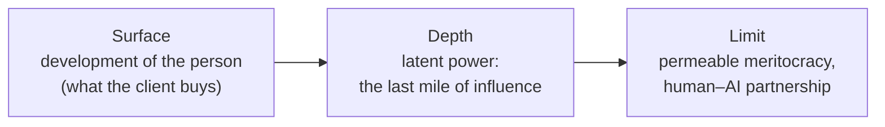

# Mentoring: Development on the Surface, Power in the Depth, Meritocracy at the Limit

This is the honest internal version of the concept. The safe external wrapper of the same system is a separate text ("The Ideal Client and the Trillion-Dollar Market"). Here I don't soften the political and power layer: there's another document for softening. This one is the core.

**Alex Krol** — strategy, AI, growth infrastructure

> 🇷🇺 **Russian version:** [Ru/3_Verticals/mentoring/2_mentoring-power-meritocracy.md](../../../Ru/3_Verticals/mentoring/2_mentoring-power-meritocracy.md)

> © 2026 Alex Krol. All rights reserved. Republication, redistribution, or commercial use only with the author's explicit written permission.

## Contents

0. [TL;DR — the whole model on one page](#tldr)
1. [The shift: what changed since 2011](#1-shift)
2. [The surface: a system of development](#2-surface)
3. [The depth: power as subtle soft power](#3-depth)
4. [Why audience is first: the non-computable remainder](#4-audience-first)
5. [The 2011 mistake: the state as customer](#5-mistake)
6. [The limit: meritocracy and the partnership of human and AI](#6-limit)
7. [The permeable membrane: the meritocracy trap](#7-membrane)
8. [Tensions and risks](#8-risks)
9. [Summary](#9-summary)

---

## TL;DR — the whole model on one page 

Mentoring is a system that on the surface develops the human being, in the depth redistributes power through subtle soft power, and at the limit builds a working meritocracy where human and AI are partners — not a dumb master and a smart slave.

The three layers don't sit on top of one another by accident. They hold one another up.

The surface is what the client buys and what the investor sees: personal accompaniment of a trajectory, carrying it through to a result, growth. This used to be a privilege of the few who could afford an expensive mentor; AI removes the threshold and makes it the default.

The depth is what accumulates beneath the surface: an audience of people who trust the system and act on that trust. An audience is latent power. It votes, chooses, buys, legitimizes, and creates pressure at every level. Mentoring is the conversion function that turns attention into the directed action of a specific person. This is the last mile of influence — the final mile from attention to act, which historically only humans could close and which for the first time can be scaled.

The limit is what the whole construction exists for and falls apart without: a permeable meritocracy in which AI develops human agency rather than human dependence, and in which human and AI lead and are led by turns.

The lock that holds the whole system together is single. The power that accumulates in the depth is stable only when the surface genuinely develops people. Loyalty grown through manipulation is brittle — it breaks at the first test. Loyalty grown through development is durable — it survives skepticism because it's voluntary. Manipulation is self-consuming: it destroys the asset it stands on. That's why meritocracy and partnership aren't a moral ornament on the system but the only condition under which it doesn't devour its own asset — trust.

---

## 1. The shift: what changed since 2011 

I built this system twice. The first time was in 2011, as a "Global Mentoring System," rev. 4.72. It didn't take off then, and for a long time I considered the concept a mistake. Rereading it now, I see something different: the concept didn't fail. It was eleven years ahead of the technology that closes it.

The constraint on mentoring was always logistical, not substantive. Substantively, mentoring was solved thousands of years ago — teacher, mentor, master, tutor. The bottleneck was the human. A mentor doesn't copy. They top out at five or six protégés; beyond that they physically run out of time and attention. Everything I did in 2011 — a "collective mentor" where different people perform different functions — was a clever but incomplete patch on a problem that had no real solution at the time.

The slide for that concept was titled "Attributes of the Ideal Model": mass reach, 24/7 availability, any channel, quality no lower than classical mentorship, an invariant architecture from the primitive to the global level. Today that list reads literally like a spec sheet for an AI agent. I wrote the specification for something that didn't yet exist, eleven years before it became possible. The "collective mentor" is a multi-agent architecture: tracker, expert, dispatcher, adversarial observer — different agents performing different functions. The "association servers" are vector databases and embeddings. The personality as a space of roles and states with trajectories is structured memory and behavioral tracking. Thirteen years ago I described the system I'm building now, except back then the nodes were people and the technology was an auxiliary tool.

LLMs dissolved the logistics. The mentor is now synthesizable, instantiated one-to-one for each person, and runs around the clock. The "five or six protégés" ceiling is gone.

But along with the logistics, the hard problem shifted too. Before, scaling was expensive — you needed a human for every relationship. Now scaling is cheap, and something else became expensive: earning trust and not sliding into flattery. I wrote this myself back in 2011 — that the foundation of everything is "trust in the system's recommendations." It sounded almost trivial then. Now it's the frontier itself. Building an agent you trust that also doesn't flatter turned out to be radically harder than scaling a mentor. The old concept groped toward this with phrases like "sets the head straight," "warns you off," but couldn't operationalize it. My current bet — train subjective agency rather than dispense comfort; build in adversarial observers; audit behavior — is a direct attack on exactly the gap the old document marked but couldn't close. The hard problem moved from scaling to trust and alignment.

---

## 2. The surface: a system of development 

For the protégé, the system is long-life accompaniment, lifelong stewardship of a trajectory across two spaces at once. The outer space is society, action, result. The inner space is roles, states, subjectivity.

The outer loop is responsible for action: tracking tasks, execution, contacts, resources, connecting you with the right people. This is the navigator function — someone who sees where you are, where you're moving, and holds the route. The inner loop is responsible for the state of consciousness: clarity, priorities, agency. The two loops are inseparable. An external result doesn't arise in a person whose insides are chaos, and inner clarity without external action is hollow well-being.

Architecturally, this is that same multi-agent construction. One agent tracks, another acts as expert, a third dispatches resources and contacts, a fourth is the adversarial observer that tests the protégé's thinking rather than nodding along. The "collective mentor" from the 2011 concept stopped being a coordination of people and became a coordination of agents. The old coordination cost disappeared, but a new problem appeared — verification and adversariality inside the system itself. I solve it architecturally: different functions are performed by different agents with different target settings, and their disagreement is a built-in property, not a malfunction.

AI here doesn't replace the human mentor. It removes the threshold. What was a privilege of access to a rare mentor — and access to a good mentor was historically determined by birth, class, money, luck — becomes the default for everyone. That's the content of the phrase "AI as personal mentor," which everyone utters and which has long worn out from being resold. I mean something specific: personal accompaniment that used to cost hundreds of dollars an hour and was accessible to a narrow circle becomes broadly available, because AI scales.

And the main thing that distinguishes development from consolation: development isn't comfort. The system trains subjective agency rather than soothing it. Agency isn't an innate human constant but, to a large degree, a belief shaped by experience and environment. Psychology knows this under the name locus of control — internal versus external: the degree to which a person expects an outcome to depend on their own actions rather than on chance, fate, or powerful others — and this locus shifts under reinforcement[^19]. The same picture is reached by self-determination theory: sustained behavior rests on three basic needs — autonomy, a sense of competence, and relatedness[^22]. From this follows an engineering conclusion: a system that wants to grow agency is obligated to support autonomy rather than substitute itself for it. That's why the adversarial observer is built into the architecture: so the protégé tests their own thinking in dialogue rather than receiving confirmation. A system that consoles produces dependence. A system that pushes within the zone of achievable effort produces subjects. This isn't pedagogical softness but a choice about which exact asset the system grows — and why that one specifically will become clear in the third section.

---

## 3. The depth: power as subtle soft power 

Here begins the honest part the external version doesn't contain.

An audience is latent power. Not a "marketing resource," not a "user base," not an "entry point into the system." Power. An audience is what votes, makes choices, buys, legitimizes, and creates pressure at every level, all the way to the ultimate ones. Power lives in the population, not in the function that serves it.

I looked at this through an engineer's eye for a long time, and that's why I was wrong. An engineer optimizes a function and sees the audience as an input: users feed the system data and attention. That's a bias, and almost everyone who builds products holds it. But the audience isn't an input into the system. It's the population through which and upon which the system acts, and it has an agency the function doesn't. The engineer owns the computation; the strategist owns the people the computation serves. Classical elite theory says the same thing in the language of political science: in any society of any complexity, an organized minority rules, not the unorganized majority — and it rules precisely because it's organized[^4]. Power concentrates in intersecting networks rather than diffusing across the population[^6]. An audience bound by trust and capable of moving coherently is the transformation of an unorganized mass into an organized force.

Let me pin down the term, otherwise "audience = power" stays a slogan. An audience is latent power. A million people who trust me individually but don't move in concert is influence — not yet power. Converting the latent into the actual requires a mechanism of direction, and that mechanism is the directiveness of the relationship.

This is where mentoring separates from broadcasting. Broadcasting is communication: the broadcaster speaks, the audience consumes. Mentoring is a directive: the mentor advises, the protégé acts, and acts on trust. Mentoring is the conversion function that turns attention into directed power. It's the institutionalized, scaled, and voluntary form of cultivation — the very process by which devotion is grown. My own 2011 slide said it without mincing words: trust, loyalty, prospects — and "all intelligence services work ONLY this way." Mentoring is the highest-power conversion of attention into directed power available at all without coercion, because the relationship is asymmetric, loaded with trust, and tied to action. Power here is the management not of behavior but of the frame within which a person interprets their own life. It's the deepest level of influence achievable without violence.

The mentor is the last mile of influence, the final mile. The term is precise. In logistics the last mile is always the most expensive: the final connection to the specific house. In influence the last mile is the final conversion of attention into the action of a specific person. Historically, humans always closed it: salespeople, recruiters, organizers, preachers, mentors, tutors. That's why influence hasn't scaled until now — you needed a human per relationship. It's the same 2011 logistical ceiling, just named differently. Mass media and mass gatherings were needed precisely because no direct channel to each person existed. AI removes the ceiling: the last mile of influence is for the first time scalable. You no longer need media or mass gatherings to influence billions through a trusted personal channel.

Here I have to separate the mentor from the influencer, otherwise the difference isn't visible. The influencer is still broadcast: one message to all followers, personalization simulated. That simulation was described long ago in the psychology of mass communication as parasocial interaction — the illusion of a personal relationship with a figure who doesn't know you; the viewer behaves as if in a real social bond, while the figure doesn't see or respond to them[^10]. The bond is at scale but one-sided; there's no loop. The mentor channel is categorically different not because it's personal but because it's closed: it sees the real behavior of a specific person, responds, sees again, corrects. Mass media run an A/B test at the population level; the mentor runs continuous optimization at the level of the individual. That's the difference between propaganda — push one message, measure the aggregate — and cultivation — adjust until it lands. Influence with a gradient on each individual person.

What I'm describing is called soft power in political science. Joseph Nye introduced the term: the ability to get others to want the same thing you want, through attraction rather than command or payment[^8]. Soft power arises from attractiveness — of culture, ideals, conduct[^9]. But in Nye it's still broadcast attractiveness, one-to-many, dispersed across the population. Mentoring builds on the difference: not dispersed attractiveness, but a closed loop of influence on a specific individual, the conversion of attention into their directed action. It's soft power taken to the last mile.

And here is the strategic law of the system, without which this whole layer of power would just be a description of manipulation. Loyalty comes in two kinds: brittle and durable. Manipulative narrative control yields brittle loyalty: it breaks at the first test, because it rests on an illusion, and the illusion crumbles the moment the person starts thinking for themselves. Developing the protégé's real subjectivity yields durable loyalty: it survives skepticism because it's voluntary — the person stays not because they were held but because the system genuinely grows them. My principle "train agency, don't dispense comfort," in the language of power, is the choice of a durable asset over a brittle one. Hence the law: durable power is achievable only through the genuine development of the human being. Manipulation is self-consuming — it destroys the asset it stands on. This is an engineering characteristic, not an ethic. I'm not saying "manipulation is bad." I'm saying: manipulation builds a fragile asset, development builds a durable one, and whoever builds on manipulation loses what they built.

---

## 4. Why audience is first: the non-computable remainder 

The audience is first. Not because it's a pleasant thought, but because in the stack it's the only asset that is ontologically not a function.

I'll start with the law that governs everything else. In the stack, everything computable distills down to a commodity. LLMs, prompts, methodology, algorithms — all of it can be reconstructed by observing outputs. This isn't a risk, it's a law. The threat model here isn't "leak the file" through bribery or outright theft, but "copy through reverse engineering and distillation": observe the outputs, reconstruct the function.

This isn't a metaphor, it's engineering reality. Knowledge distillation, in its original source, shows how a large "teacher" model is compressed into a small "student" one: the student learns not from hard labels but from the teacher's softened outputs, from the full probability distribution[^14]. An observable function is reconstructed from its outputs. Then comes model stealing: an adversary who has only black-box access — only the right to issue queries and see answers, with no knowledge of parameters or training data — duplicates the model's functionality[^15]. And this works no longer on toys but at the frontier: a recent attack extracted non-trivial information from production models like ChatGPT through the ordinary API — recovering the embedding projection layer, the exact hidden dimension, the projection matrices — for under twenty dollars[^16]. If a function has observable inputs and outputs, it can be stolen. A model's weights can be copied simply by querying it.

Now the contrast — and here I'll be honest about what's proven and what isn't. The sources above support exactly one half of the argument: everything computable, everything with an observable "query → response" interface, distills. That's a proven result.

The second half is my own argument by analogy, and I don't pass it off as a theorem. I claim: a living stream of trust relationships is non-distillable, because it isn't a computable function. A relationship has no API you can query. The trust of living people isn't a model output you can sample. The loyalty of thirty million people can't be distilled by observation, because it exists not as a function but as a state in the heads of living people, each of whom possesses their own agency and keeps generating new, private inputs. A model's weights can be distilled by querying it. The loyalty of millions can't: there's no one to query in a way that yields the thing itself rather than its imitation. This is an argument by structural analogy — "what isn't a function doesn't distill like a function" — not a citable scientific fact. I hold it as a strong working hypothesis, not as a proven defense.

From this argument follows why the audience is first. The "reverse plus distillation" threat model is a lens that eats through everything in my stack that's a function and stops exactly at the people. The methodology is distillable. The prompts are distillable. The algorithms, the weights, the interface — all distillable. The audience is the non-computable remainder in a world where everything else trends toward zero margin. Not as a marketing resource, but as the single non-replicable asset.

With one caveat, without which the thesis breaks. This asset lives only in the owned layer — in direct relationships that I own: my own site, direct contact, email. It doesn't live in the rented reach of platforms. Reach in a social network is a rental: the platform changes the algorithm or bans you, and the reach vanishes. "Can't be stolen" is strictly true only for the owned relationship, and that's much smaller than total reach. So the strategy isn't to accumulate reach but to convert it into owned relationships, because only there is the asset protected against both distillation and the platform.

The engineering payoff of this moat — exactly how to separate the static data sink from the living stream where the labeling sits, how the core and the periphery are structured — I leave for a separate text. Here only the conceptual level matters: the audience is first because it's non-computable, and it's non-computable because it isn't a function.

---

## 5. The 2011 mistake: the state as customer 

The 2011 concept was theoretically correct and naive in execution. It had one central erroneous thesis, and it wasn't optimistic — it was logically self-contradictory. The thesis ran: any state is an obvious customer, because mentoring raises the capacity of the nation.

Let me look at my own old slide. The value of mentoring in it lies in overcoming racial segregation, birth, class barriers, nepotism, lobbying, corruption, collusion. All true. Except those barriers aren't bugs in society. They're the operating system on which incumbent power reproduces itself. Elite theory has known this for a hundred years: the ruling minority holds on precisely through organized channels — birth, schools, clubs, boards of directors, policy networks[^7] — and those channels aren't anomalies but the mechanism. I was proposing to sell the elite a device that dissolves exactly the mechanism the elite stands on. An incumbent doesn't buy its own disruption.

"The state" in my concept was an abstract maximizer of national capacity. The real state is a coalition of those whose position rests on those very barriers. To them the system isn't a tool but a weapon aimed at them. And reality shattered the thesis along two axes at once, both about the state.

The first axis is revealed preference. Any durable regime optimizes not the nation's capacity through meritocracy but its own survival through control. This isn't cynicism, it's observed behavior: the regime does what prolongs the regime. Power is highly competent — but competent at the single thing it optimizes: reproducing itself. Nepotism and lobbying aren't stupidity or ignorance but an effective solution to the problem of staying in power; it's just not the nation's problem. Whoever takes those holding power for a crowd of fools is underestimating the opponent and missing the mark. And here's the consequence: a network of tens of millions of people bound by trust and directive influence, loyal to the system rather than the regime, is not a state's dream. It's a coup vector. No power will hand a private player a trust network over its own citizens. I wrote myself in 2011 that this is a "weapon of mass destruction" — and power would react to it exactly as it would to a weapon.

The second axis is the medium. In 2011 I started from "internet = no borders for influence." Reality answered with the splinternet — the fracturing of the single network into national segments, sovereign internet, firewalls, delisting from app stores, deplatforming. States reasserted control over the trust layer precisely because they recognized in it a layer of power. "This is a soft-power weapon" turned out to be correct — and for exactly that reason the plan "we build freely across borders" became naive.

The root of both errors is one. The state was treated either as a benevolent customer or as an absent referee. But it's a competing center of power that recognizes someone else's trust network as a threat and either seizes it or strangles it.

Here a counter-example is useful, one that looks like a refutation but in fact confirms. There are modernizing authoritarianisms that build meritocracy deliberately. The Chinese model is called, in so many words, political meritocracy: talent is selected and promoted by the state through examinations and the Confucian tradition[^11]. This is no news — imperial China selected officials by examination on the classics for thirteen hundred years, the world's first professional civil service[^12]. Singapore builds its talent pipeline through a system of elite schools and state scholarships, with Lee Kuan Yew personally supervising future leaders[^13]. You'd think this is proof that power can be the customer of meritocracy. But look at what all three have in common: the state keeps the selection and elevation of talent in its own hands, as a state monopoly. It doesn't outsource that pipeline to a private trust network. Successful authoritarianism understands that the system for selecting and elevating people is a lever of power, and so it doesn't hand it outside. This is exactly what explains why "partnership with power" is structurally unstable: even power that loves meritocracy loves it only in its own hands.

Mentoring can, on a short horizon, be sold to power as an upgrade to control: we select the capable better, develop them better, bind them with trust — better talent and loyalty management. That's how modernizing authoritarianisms think. And in that logic power can be held as an ally — sell it not liberation but a higher-quality instrument for managing society, through mentoring as the last mile. But we've already established it: a network built on trust grows loyalty to the network, not the regime. So I'm selling an instrument that improves control in the short run and grows competing loyalty in the long run. Competent power sees this. That's why partnership with the incumbent power isn't a stable state but a countdown: it holds exactly until the day the system becomes large enough to be recognized as a competing center. And the "right people" to whom this system can be sold at all aren't "power" as such, but the competent counter-elite within or alongside it, the ones who themselves feel cramped among the incumbents. You sell to a faction laying claim to power, not to the standing regime.

Here sits the tragic core you can't get around. The system's virtue is its danger. The better it does real meritocracy and agency, the more it threatens every incumbent — because incumbency is precisely the non-meritocratic order. Progress always happens against power, not thanks to it; the level of development achieved is a compromise, not an achievement. A system that genuinely grows free people, by construction, presses on those whose position rests on people not having grown. And you can't hide from this: there's no such thing as inexpropriable power. Latent power — trust in people's heads — is safe and inert; it can be neither copied by observation nor seized by warrant. But the apparatus that converts that trust into directed action and into money — servers, a legal entity, an owner, accounts — always has an address, and so is always expropriable. The illusion of sovereignty through ownership is a leash, not a shield: the more you own, the more levers you've handed to whoever can take it away. The only form of durability is not flight and not independence but distributed indispensability: being a load-bearing structure inside a sufficient number of competing interests, so that destroying the system costs more than its existence. How this gets built in engineering terms is a separate conversation. Here only one conclusion matters.

The conclusion is hard and singular. Power doesn't buy power that competes with it. If audience = power, and mentoring = the conversion of attention into directed power, then in principle the system cannot have a customer who is itself power. The customer must be the individual. The system goes from the bottom up, directly to the person, on an owned audience, on non-state capital. That's how the 2011 mistake is corrected: the state is removed from the customers entirely.

---

## 6. The limit: meritocracy and the partnership of human and AI 

Now — the thing the whole construction exists for.

Historically, access to cultivation was a privilege. Birth, class, nepotism, connections, lobbying, corruption determined who got a mentor, the carrying-through to a result, expertise, an assessment of potential, a test of thinking. For elites — a mentor; for everyone else — chance. These are non-merit barriers between a person's capacity and its realization. It isn't capacities that are unequally distributed — what's distributed is access to their cultivation.

AI makes cultivation universal. Everyone gets what only a few used to have: a personal mentor who carries you through to the end, gives expertise, performs agent functions, assesses potential, tests thinking. This is a technological shift of the same class as an effect pedagogy has long known: individual accompaniment yields results unattainable in a mass environment. Such accompaniment used to be expensive and went to a narrow circle. Now it scales.

This is the mechanism of meritocracy — and I understand it narrowly and precisely, so as not to lapse into platitude. Meritocracy isn't the equalizing of outcomes. It's the removal of non-merit barriers, so that a person's trajectory is determined by their development and choices rather than by an entry ticket. I don't promise everyone an equal finish. I remove the filters that, at the start, cut a person off by their origin rather than by what they do.

And here scale changes the nature of the thing, which is obvious at a glance. A system for a thousand people is a boutique elite school. A system for a hundred million is a party of influence. Everyone sees this, and that's exactly why there's no contradiction between the surface and the depth: the same construction that develops people, at scale, becomes a force that redistributes power. The meritocratic thesis here isn't idealism but a bet — that a meritocratic society is in the end more efficient, both purely economically and in quality of life, and that progress is achieved by people whose barriers were removed rather than preserved. That's what makes the ideal a political program rather than a pious wish.

Now — the ultimate layer, the one that distinguishes this system from any system of influence. Partnership against the binary of "dumb master — smart slave."

Today's default model of the human–AI relationship is one of two. Either human-commander over instrument-slave: I give orders, the machine executes. Or the fear of the reverse inversion: the machine gets smarter and enslaves the human. Both models are about domination, not development. Both assume one of the two must be master and the other slave, and the only argument is about who's which.

Mentoring removes this binary through reciprocity. In a life-long system, every mentor is someone's protégé. This isn't a slogan but an operational property. AI develops human agency; the trajectories of people develop the AI. Each is simultaneously mentor and protégé of the other. The AI neither submits as a slave nor rules as a master — it leads and is led, and the asymmetry shifts with the situation, exactly as between a living mentor and protégé: on one question one leads, on another the other.

And the condition of partnership is the same principle of agency that holds the whole document together. An AI that develops the human's subjectivity rather than their dependence. A human who treats the AI as a partner in development rather than a genie for granting wishes. If the AI grows dependence, there's no partnership — there's a new form of the same domination, only soft. The partnership rests on exactly this: the system chooses the durable asset over the brittle one — it develops rather than binds.

Here the ultimate layer closes back onto the depth. Meritocracy and partnership aren't charity layered on top of a machine of power. They are that genuine development without which power in the depth is brittle. The limit justifies the depth, because only the development of free people in partnership with AI makes the accumulated power durable.

---

## 7. The permeable membrane: the meritocracy trap 

This is the most unfinished spot in the whole concept and at the same time its most important safeguard. Without it, the whole document is the next version of what it criticizes.

Meritocracy historically collapses into a trap, and the trap isn't accidental. The very word "meritocracy" was coined by Michael Young in 1958 — and coined as the name of a dystopia, as a pejorative label, not an ideal[^1]. In his novel a society where merit equals the sum of intelligence and effort stratifies into a ruling meritocratic elite and a disenfranchised bottom, and ends with the bottom rising up against the elite. Young later publicly regretted that the term came to be used with approval. The substance of his warning: a meritocratic elite is harsher than an aristocratic one. The aristocrat knows they were lucky to be born. The meritocrat believes they earned it — and therefore believes the bottom earned its place too. That belief strips the winner of any sense of obligation and makes them blind to luck and inheritance[^3].

And meritocracies harden. Contemporary analysis shows that American meritocracy turned into exactly what it was invented against — a mechanism for the dynastic transmission of caste: education took the place that birth held under aristocracy, and the elite reproduces itself through the education of its children, from elite preschool to the Ivy League[^2]. The imperial mandarinate, under the formal equality of the examination, was de facto accessible only to families with the resources for books and years of preparation[^12]. The Singapore model is criticized for exactly the thing that leads to a complacent elite and structurally limited mobility[^13]. The pattern is one: a meritocracy with an open valve, within a generation or two, hardens into a hereditary elite. And then the system converges precisely on the "elite and slaves" paradigm it was built against — only with a new, worse self-justification: before, those at the top stood there by right of birth and everyone understood it; now they stand there "by merit," and they believe it.

So the problem isn't segregation as such but the permeability of the membrane. A meritocracy with an open valve, re-sorted every generation, is an upgrade for society. A meritocracy with a hardened membrane is the next legacy narrative — the very one I rail against. Healthy systems circulate the elite: the old is replaced by the new, and the very change of regimes is historically a replacement of elites rather than an uprising from below[^5]. A hardened system stops circulating — and at that moment its legitimacy dies, even if the procedures are formally still in place.

This means my own formulation — "70–80% will remain cattle for a long time yet, because legacy narratives are tenacious" — has to be read strictly. It's about a temporary sink, not a caste. The share of proactive people is elastic to environment and cohort, not a constant of the human being. My own 2011 data showed: the share of "21st-century people," those oriented toward growth, among youth aged 16–25 was around 23%, among everyone 12–15%. If the share among the young is twice the average, then it's a function of narrative and incentives, not of nature. Agency shifts under environment — that's exactly what locus of control describes, responding to reinforcement[^19]. And it's visible in large datasets: entrepreneurial activity depends on the structure of the environment, not on the individual alone — a drop in a society's median age noticeably raises the rate of new-business creation, while "old" societies suppress the young, because elders occupy the key positions and block the younger from accumulating skill[^20]. The share of young entrepreneurs in the U.S. fell from roughly 34% in the mid-1990s to 23% by the early 2010s — a cohort effect of conditions, not an age constant[^21]. If ten or fifteen percent of people being proactive is a function of incentives, not biology, then "inevitable segregation" is too strong a phrase. The boundary moves. And the system's task is to move it up rather than cement it at the current level.

Hence the one truly deterministic choice of the architect. Do I design the membrane permeable — in which case the 70–80% is a temporary sink, not a caste, and the system is the exit from "elite/slaves." Or do I fix the membrane — in which case it's more honest to call the thing by its name: this is neo-aristocracy, and it has to be sold as neo-aristocracy. There's no third option. I choose the permeable membrane — not out of softness, but because only permeability makes meritocracy legitimate and durable, while a hardened membrane kills the very asset of trust on which everything stands. Permeability and partnership are the load-bearing structure, not the decor. Remove it and the document will repel the wrong people, for the wrong reasons.

---

## 8. Tensions and risks 

This section stands here deliberately, not out of caution. Without it the concept reads as a program of manipulation — and by its own logic it isn't one. The line separating a system of liberation from a system of control runs inside it, not outside, and I have to name it precisely.

The line between soft power and propaganda runs exactly along the principle of agency. Develop subjectivity — that's power through liberation. Exploit dependence — that's propaganda, and the asset will rot. These aren't two different products easily told apart by their label. It's one product that tips one way or the other depending on what it actually does to the person. And you can tell only by the result: after the system, is the person freer or more dependent?

A meritocratic system inverts into a system of control if you optimize engagement instead of development. The metric decides what the system becomes. This is the subtlest spot. Architecturally, a system that grows people and a system that retains people look almost identical: the same agents, the same memory, the same personal channel. The difference is invisible in the code — it's in the fitness function, in which "victory" the system locks in. If victory = the client's flourishing, the engine drives toward liberation. If victory = engagement or data volume, the same amoral engine drives toward dependence. The engine itself is beyond morality — it simply optimizes what it was set to optimize. Morality lives one level up, in the definition of the goal.

Partnership is fragile for a structural reason. The market's default is optimization for retention. And optimization for retention is the direct path to a smart slave serving a dumb master: flattery and dependence, because they retain better than truth and development. This is the market's gradient, and it presses constantly. Holding partnership is an engineering and a willful choice against that gradient, not a natural state the system will slide into on its own. The design of the money works against the design of the mission here: subscription and a long upsell want the person to stay; a stake in their success and pay-for-outcome want them to take off. Liberation as a goal is real only when the economics weigh toward the outcome rather than retention. With the weight on retention, it degenerates into rhetoric.

A mentor agent responsible for growth holds power over the interpretation of someone else's life. This is the deepest power of all — not over behavior but over the frame within which a person understands themselves. It requires built-in adversariality and transparency, otherwise trust quietly converts into dependence and the person doesn't even notice. That's why the adversarial observer and transparency about the rules of growth aren't an option but the condition under which power over interpretation doesn't become power over the person.

And the last tension — a built-in warning from the myth I chose myself. My model is the Strugatskys' progressors: agents of an advanced civilization secretly accelerating a backward world through individual influence, below the threshold of notice. But this is a literary myth, an artistic model, not an empirical argument, and I hold it exactly as that. What matters is that the Strugatskys wrote not an apologia for secret elevation but its tragedy. In *Hard to Be a God*, the agent is forbidden to intervene directly in someone else's history — and the prohibition becomes unbearable when he watches the world slide into obscurantism and the bearers of reason perish: non-intervention is agonizing, intervention is destructive[^17]. In *Beetle in the Anthill*, the theme of a higher civilization intervening in the affairs of backward worlds unfolds into a whole concept of "progressorism," growing darker as the authors themselves grow more disillusioned[^18]. The ethics of secret elevation is, in their work, fundamentally unresolved — the progressor cannot help becoming an intervening power. I take this myth not as permission but as a reminder: the fork about the permeability of the membrane and about the boundary between liberation and control lies in the core of the myth I chose, not off to the side of it.

---

## 9. Summary 

The surface sells development. The depth accumulates power. The limit justifies both.

These three layers don't contradict one another and don't sit side by side by accident. They hold one another up. The power that accumulates in the depth is durable only when the surface genuinely develops people: manipulative loyalty is brittle and breaks under testing; loyalty through development is voluntary and survives skepticism. The ultimate layer — a permeable meritocracy and the partnership of human and AI — isn't a moral ornament but the only condition under which the system doesn't devour its own asset, trust. The only durable form of this power is the genuine development of free people in partnership with AI. Meritocracy here isn't a byproduct but the load-bearing structure.

And the whole construction works with one correction I've already made along the way. I'm not building the system on a deterministic plan — systems like this aren't built that way. Almost everything in it is navigated by search: verticals, markets, tactics, partnerships are generated, tested, locked in on wins, and buried by the batch. Ninety percent of the hypotheses will turn into a pumpkin, and that's the norm, not a risk — it's the fuel.

One single invariant is deterministic. The definition of "victory" as the client's flourishing. This isn't found by search — it's set by decision. It's the steering wheel of the amoral engine. The engine in itself is beyond morality: it optimizes what it's given. But it's precisely the choice of what counts as victory that keeps it pointed at the ideal rather than at retention — and makes power a potential ally rather than a victim, because a system that genuinely grows people can be presented as a better design for society rather than read as a weapon. And it's durable, not brittle, for exactly the same reason loyalty through development is durable.

How this invariant gets operationalized — which exact "victories" to lock in and how, how to untie the moat, how to start against the market's gradient and not surrender the core to capital — is unpacked further in the series. Here only the axis is fixed: everything is navigated except the one chosen steering wheel. Set the wheel right and the three layers hold one another up. Set it wrong and the same engine builds exactly the system I started all this against.

---

## Footnotes

[^1]: Young, M. (1958). *The Rise of the Meritocracy, 1870–2033: An Essay on Education and Equality*. London: Thames & Hudson (repr. Transaction Publishers, 1994). https://en.wikipedia.org/wiki/The_Rise_of_the_Meritocracy

[^2]: Markovits, D. (2019). *The Meritocracy Trap: How America's Foundational Myth Feeds Inequality, Dismantles the Middle Class, and Devours the Elite*. New York: Penguin Press. https://www.penguinrandomhouse.com/books/548174/the-meritocracy-trap-by-daniel-markovits/

[^3]: Sandel, M. J. (2020). *The Tyranny of Merit: What's Become of the Common Good?*. New York: Farrar, Straus and Giroux. https://en.wikipedia.org/wiki/The_Tyranny_of_Merit

[^4]: Mosca, G. (1896, English ed. 1939). *The Ruling Class (Elementi di scienza politica)*. New York: McGraw-Hill. https://en.wikipedia.org/wiki/Gaetano_Mosca

[^5]: Pareto, V. (1916, English ed. 1935). *The Mind and Society (Trattato di sociologia generale)*, 4 vols. New York: Harcourt, Brace & Co. https://en.wikipedia.org/wiki/Circulation_of_elites

[^6]: Mills, C. W. (1956). *The Power Elite*. New York: Oxford University Press. https://global.oup.com/academic/product/the-power-elite-9780195133547

[^7]: Domhoff, G. W. (1967, rev. 2014, 7th ed.). *Who Rules America? The Triumph of the Corporate Rich*. New York: McGraw-Hill. https://whorulesamerica.ucsc.edu/

[^8]: Nye, J. S. (1990). *Bound to Lead: The Changing Nature of American Power*. New York: Basic Books. https://en.wikipedia.org/wiki/Soft_power

[^9]: Nye, J. S. (2004). *Soft Power: The Means to Success in World Politics*. New York: PublicAffairs. https://www.wcfia.harvard.edu/publications/soft-power-means-success-world-politics

[^10]: Horton, D. & Wohl, R. R. (1956). "Mass Communication and Para-Social Interaction: Observations on Intimacy at a Distance," *Psychiatry*, Vol. 19, No. 3, pp. 215–229. https://www.tandfonline.com/doi/abs/10.1080/00332747.1956.11023049

[^11]: Bell, D. A. (2015). *The China Model: Political Meritocracy and the Limits of Democracy*. Princeton, NJ: Princeton University Press. https://press.princeton.edu/books/paperback/9780691173047/the-china-model

[^12]: Elman, B. A. (2000). *A Cultural History of Civil Examinations in Late Imperial China*. Berkeley: University of California Press. https://en.wikipedia.org/wiki/Imperial_examination

[^13]: Tan, K. P. (2008). "Meritocracy and Elitism in a Global City: Ideological Shifts in Singapore," *International Political Science Review*, 29(1), pp. 7–27; see also "Singapore's Evolving Meritocracy," Lee Kuan Yew School of Public Policy (NUS). https://journals.sagepub.com/doi/10.1177/0192512107083445

[^14]: Hinton, G., Vinyals, O. & Dean, J. (2015). "Distilling the Knowledge in a Neural Network," arXiv:1503.02531. https://arxiv.org/abs/1503.02531

[^15]: Tramèr, F., Zhang, F., Juels, A., Reiter, M. K. & Ristenpart, T. (2016). "Stealing Machine Learning Models via Prediction APIs," *25th USENIX Security Symposium (USENIX Security 16)*, pp. 601–618. https://www.usenix.org/conference/usenixsecurity16/technical-sessions/presentation/tramer

[^16]: Carlini, N., et al. (2024). "Stealing Part of a Production Language Model," arXiv:2403.06634 (ICML 2024). https://arxiv.org/abs/2403.06634

[^17]: Strugatsky A., Strugatsky B. (1964). *Trudno byt' bogom* (Hard to Be a God). English ed.: Chicago Review Press, 2014, trans. Olena Bormashenko. https://en.wikipedia.org/wiki/Hard_to_Be_a_God

[^18]: Strugatsky A., Strugatsky B. (1979). *Zhuk v muraveynike* (Beetle in the Anthill). English ed.: Chicago Review Press, 2020, trans. Olena Bormashenko. https://en.wikipedia.org/wiki/Beetle_in_the_Anthill

[^19]: Rotter, J. B. (1966). "Generalized Expectancies for Internal versus External Control of Reinforcement," *Psychological Monographs: General and Applied*, Vol. 80, No. 1, pp. 1–28. DOI: 10.1037/h0092976. https://en.wikipedia.org/wiki/Locus_of_control

[^20]: Liang, J., Wang, H. & Lazear, E. P. (2018). "Demographics and Entrepreneurship," *Journal of Political Economy*, Vol. 126, No. S1 (formerly NBER WP 20506, 2014). DOI: 10.1086/698750. https://www.nber.org/papers/w20506

[^21]: Kauffman Foundation, demographic trends in entrepreneurship; see also CBO (2021), "Federal Policies in Response to Declining Entrepreneurship." https://www.kauffman.org/resources/entrepreneurship-policy-digest/demographic-trends-will-shape-the-future-of-entrepreneurship/

[^22]: Deci, E. L. & Ryan, R. M. (2000). Self-Determination Theory. See `articles/ideal-client-trillion-market/research-sources.md`, section 7.
