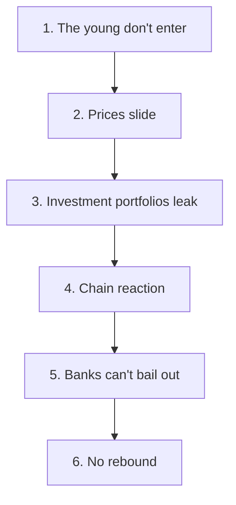

# The End of Real Estate as an Investment. Why Your Home Could Turn Into a Pumpkin in 5–7 Years

**Alex Krol** — strategy, AI, growth infrastructure

> 🇷🇺 **Russian version:** [Ru/3_Verticals/mentoring/4_real-estate-ai-collapse.md](../../../Ru/3_Verticals/mentoring/4_real-estate-ai-collapse.md)

> © 2026 Alex Krol. All rights reserved. Republication, redistribution, or commercial use only with the author's explicit written permission.

## A Hard Forecast

Within the next 4–7 years, the real estate market in developed countries will collapse as a mass investment asset. Not in a one-day crash on some Monday, but in a long correction with no rebound. Housing will stop being a "retirement plan" and a "safe haven" for the middle class. Only a thin premium layer will retain investment value — the best locations, genuinely unique properties. Everything else will either get cheaper or sit in stagnation for years, slowly eating away its owners' capital through inflation and taxes.

I'm saying this not as an outside observer and not as a prophet of doom. For the past four years I've been working on artificial intelligence 24/7 — building products, dissecting other people's pilots, seeing what the models can already do and where they're headed. And that's exactly why I know: the main factor that will decide the fate of real estate in the coming years is almost entirely absent from realtor reports and the analytics of the big consultancies. And when they do account for it, they wrap it in such cautious language that the meaning gets shaken out of the text.

This text is for a specific person. If you have a 20-year mortgage — you are the target audience. If you own two or three rental apartments bought "for retirement" or "for the kids" — you are the target audience. If you're right now running the numbers on "grabbing one more, let it sit, it'll appreciate anyway" — you are especially the target audience.

Let me state the genre up front. This is a forecast, not a report. Forecasts get things wrong. I'm not claiming things will play out exactly this way and exactly by this year — I'm claiming that the probability of this scenario is fundamentally higher than what we're currently being told. And that the cost of being wrong in one direction (you sold the investment apartment and it later gained a bit) is incomparably lower than the cost of being wrong in the other (you sat tight until the moment when there was no one left to sell to).

What follows is why I'm confident in this. With numbers, with sources, without academic bowing and scraping.

## No Magic. Prices Rose Because a Machine Was Running

The first thing to shake out of your head is the idea that real estate appreciates "by its nature." That land is finite, houses are forever, the population keeps growing, and therefore housing is as reliable as the law of gravity. It is not the law of gravity. It is a machine assembled from four parts, and it runs only while all four parts run at the same time.

Part one — the state and the banks. After World War II, governments in the US and other developed countries deliberately and systematically turned their citizens into homeowners. The FHA programs (Federal Housing Administration — government mortgage insurance that reduces banks' risk) and VA (mortgage guarantees for veterans) sharply lowered the barrier to buying a home. Tax deductions on mortgage interest made credit cheaper than rent. The homeownership rate in the US jumped over the two postwar decades — and that was not "natural demand," it was a deliberate political construction[^1][^2][^3].

Part two — the financialization of the 1970s–2000s. Banks figured out that a mortgage isn't just a loan, it's raw material for another business. Mortgages started getting molded into securities (mortgage-backed securities — the thing that eventually blew up in 2008). Underwriting standards were softened. Tax breaks were expanded. Housing started to be treated not as a roof over your head but as a class of financial assets — a phenomenon the academic literature calls the "assetization of housing"[^4][^5][^6]. Housing stopped being housing in the old sense. It became an accumulation point through which the middle class saved for retirement and banks collected fees.

Part three — demographics. The baby boom, urbanization, growth in the number of households. Studies of long-run housing market dynamics show: purely demographic factors — population growth, shifts in the age structure, increases in household counts — can explain up to 40–50% of long-run housing price growth from the 1970s through the 2000s[^7]. When more new families enter the market each year than leave old apartments, prices rise simply because there are physically more buyers.

Part four — credit and its expansion. This is the most interesting piece. MIT's research on the 2000s market shows it directly: changes in credit conditions — looser borrower requirements, higher allowable LTV (loan-to-value, the loan's share of the home's value), new mortgage products like subprime — explain from a third to most of the price growth in the pre-crisis period[^8]. Without easy credit, you cannot inflate a bubble. Prices rise not because housing has become worth more, but because the buyer is willing to pay more, because they were lent more money.

Add it all up. More people plus higher wages plus cheap credit plus a relentlessly hammered-in belief in eternal growth — and prices climb for decades. That's not magic and not a property of brick. It's a mechanism standing on four legs. Saw at any one — the chair wobbles. Saw at two — the chair falls.

And this is where the unpleasant part begins. The legs are already being sawed.

## The Machine Is Creaking. The Middle Class Can No Longer Carry the Prices

Before we get to AI, we need to pin down the state of the market right now. No forecasts whatsoever, just facts.

Housing in developed countries is already unaffordable for a significant share of the middle and lower-middle class. Rent takes 30–50% of income — not in isolated hardship cases, but as the average condition in many major cities[^9]. Buying your own home without help from parents, without an inheritance, or without a miracle is becoming practically impossible for an entire generation. Young people with a normal job, a normal salary, normal qualifications — cannot put together a down payment in any reasonable time. This is no longer just Twitter chatter. It's documented in affordability crisis research, and it's being documented almost everywhere — in the US, Canada, the UK, continental Europe[^9][^10].

In parallel, the price growth of recent years is increasingly being pulled by the top income layer — highly paid professionals, investors, funds. Average income grows roughly one-to-one with prices, while affordability falls — because the distribution is skewed and the median family simply doesn't fit the averages[^9][^10]. Prices are set by deals at the top, yet they drag the entire market along.

Out of this, a political crack is already growing — and it will only be torn wider. On one side — owners, often with two to five mortgaged properties. On the other — renters handing over half their paycheck for someone else's apartment. Any measure favoring one side is a blow to the other. Rent control — a collapse in owners' yields. Tax incentives for buyers — prices spike and the door slams shut for everyone else. Politicians are stuck. And they'll get stuck deeper.

All of this — without AI. This is simply the arithmetic of prices having drifted so far from incomes that the system is held up by good faith and the fear of missing out on growth. One serious structural shock is enough for the structure to start folding.

That shock will be AI. And it's already knocking.

## The Main Factor Nobody Accounts For: AI Knocks Out the Very Foundation of the Mortgage

This is where the usual realtor forecasts and most macroeconomic analysis walk right past. So let's go slowly.

A long mortgage requires one single assumption. Not "real estate is expensive." Not "demand is growing." One: that millions of people will have a stable income for the next 20–30 years. Not necessarily growing — stable. Without that, no 30-year mortgage works, psychologically or financially. No one in their right mind signs up for a payment spanning a third of a century unless they're confident there will be somewhere to work for that third of a century.

The classic economic fairy tale about technology goes like this. New machines kill some jobs but create others. The weaver became a machine operator. The operator became a machine setter. The setter became an engineer. Over the long run, the economy restructures, new professions appear, and on average the standard of living rises. This scheme worked for nearly two hundred years; every consulting report — McKinsey, Goldman, BCG — leans on its track record. And on its basis they say: AI will probably also remove something old and create something new, and the balance will roughly net out.

The trouble is that this argument rests on one hidden assumption that no longer holds in the case of AI. Before, technology always left a layer *above* itself. Above the machine — the operator. Above the operator — the setter. Above the setter — the engineer. The machine couldn't tune itself. Couldn't decide what to produce. Couldn't talk to the customer. So there was always a "ladder" of people on top — a rung above the technology — and old work converted into new work, one level up.

AI is built fundamentally differently. For the first time, it removes all the levels at once. It can write code — it takes part of the programmer's job. It can analyze data — it takes part of the analyst's job. It can guide a client, prepare documents, answer emails, coordinate processes — it takes part of the office middle layer's job. And most importantly — it can learn. Every month it can do a bit more than the month before. Steps that took decades in the evolution of development tools now happen in six months.

I watch this live. What took me a week of manual work a year ago now takes half an hour. That's not marketing and not enthusiasm — it's a dry fact from my own desk. And it's happening in every industry where the core work is text, numbers, and negotiations through a screen.

The numbers on this already exist, and they're harsh. Dario Amodei, CEO of Anthropic — one of the leading AI labs — says it directly: within one to five years, AI could knock out up to half of *entry-level* (junior, early-career) positions in the white-collar sector and push unemployment to 10–20%[^11]. That's not Reddit alarmism; it's the public position of a person who builds these very models and sees their capabilities from the inside.

Forrester, an analyst firm far from radical in tone, estimates: by 2030, 6.1% of all US jobs will be fully destroyed by automation and AI, and roughly another 20% will be radically changed[^12]. 6.1% is millions of people. Goldman Sachs estimates that up to 300 million full-time-equivalent jobs worldwide are under direct exposure to AI; a quarter of routine tasks are fully automatable; two-thirds of occupations — partially[^13]. Anthropic, in its publications on labor market impact, shows that highly paid white-collar professions — programmers, marketing analysts, finance specialists, lawyers — have the maximum "exposure" to next-generation models[^14]. Not because they're "dumber" — but because a large share of their working time goes into text, spreadsheets, and template-driven decisions.

The Dallas Fed, in a recent study, states it plainly: AI simultaneously helps and replaces workers, and in sectors with active adoption, the structure of employment and wage dynamics already appear to be shifting[^15]. That's no longer a forecast — that's an observation.

It's only fair to show the more cautious estimates too, so it doesn't look like I'm picking only the scary ones. Goldman Sachs, in its baseline scenario, puts displacement at 6–7% of workers over ten years and an unemployment rise of just 0.6 percentage points, with new jobs created wherever AI is used as a complement[^13]. The World Economic Forum draws a balance: 92 million jobs disappear, 170 million new ones are created — but the authors themselves admit that the quality of those new jobs and their distribution across countries and social classes is an open question[^25]. In other words, even the most conservative institutions aren't disputing that the re-assembly is underway; they're disputing how harsh it will be.

Here it's important to answer an objection I hear constantly. "But MIT recently showed that 95% of corporate AI pilots never reach measurable ROI. So AI doesn't actually work." That study does exist[^16]. But it's being interpreted exactly backwards. 95% produce no result — while 5% do, and those 5% gain a disproportionate advantage. That doesn't mean "AI doesn't work." It means: the payoff from AI concentrates in the hands of those who know how to deploy it, while the other 95% of companies are, for now, imitating activity. Yesterday you competed with ten peers like yourself in your neighborhood; tomorrow one of them goes in with AI — that's not safety. That's death for the other nine.

And one more important note about these consulting numbers. They're all calibrated on past waves of automation — on that same fairy tale of the weaver and the machine setter. That is, they have built into them the assumption that this time, too, new industries will create enough jobs to cover the loss of the old ones. Strip out that assumption — and I have not a single living reason to keep it, because I work in those new industries every day and see that they grow precisely by employing fewer people — and Forrester's cautious 6.1% turns into a floor, not a ceiling. The real number could be several times higher. Nobody is modeling this yet, because to do so you'd have to admit that the classic model of "destroyed jobs get replaced by new ones" no longer works. Nobody is ready to admit that — too much of the public economic rhetoric hangs on it.

My personal picture for the next five years goes like this. Today the office is built as "one manager plus ten employees." In a year or two it becomes "one manager plus one AI instead of ten employees." In three or four — "one manager plus ten AIs coordinating a million AI agents." This isn't science fiction; it's simply the unfolding of what I already see in the product I'm building. Entire industries, in terms of their use of human labor, will be cannibalized. Not "transformed," not "restructured" — cannibalized. There will objectively be no place for a human there.

If a significant share of office, "knowledge" work becomes automatable, stable 20–30-year careers for the middle class become the exception, not the norm. And without such careers, the mass mortgage doesn't work.

That is the main mine under the real estate market. Not Fed rates. Not geopolitics. Not migration. But the fact that the foundation on which the whole idea of mass homeownership through long credit rests is starting to come apart at the base.

## The Second Blow: AI Eats the Real Estate Industry Itself

Suppose I've overrated the previous argument, and AI removes not half but a quarter of white-collar jobs. Even that is a catastrophe for the mortgage market. But the trouble is that AI doesn't hit only the buyer. It also hits the very industry that has spent the past decades inflating prices and feeding off this bubble.

What is the "real estate market" in developed countries today? It's not just houses and apartments. It's an enormous service layer: realtors, mortgage brokers, transaction attorneys, appraisers, insurers, marketing agencies, developer sales departments, property management companies, MLS platforms, bank back offices. Millions of people. Tens of billions in commissions and markups a year. It's this very infrastructure that justified "the 6% realtor rent" — the standard agent commission in the US, layered onto every transaction — and sustained the feeling that buying a home is something terrifyingly complex, requiring intermediaries at every step.

All of that work is — what? Texts, negotiations, documents, data, marketing. Matching properties to a client's profile. Comparing options. Calls. Showings. Drafting contracts. Title checks. Risk assessment. In other words, exactly what AI already does today faster and markedly cheaper than a human.

What we're seeing right now. AI systems match properties to clients, analyze the market, build price forecasts, run correspondence with dozens of potential buyers at once[^17]. Virtual tours, automated condition and risk assessment, generation of legally sound contracts, inspection coordination — all of this already exists and runs in pilots[^18][^19]. Morgan Stanley's analysis estimates that about 37% of tasks at large REITs (real estate investment trusts — publicly traded real estate funds) and commercial real estate companies are automatable with technologies that already exist; the expected effect — tens of billions of dollars in labor savings by 2030[^20]. Industry reviews go further: by 2028–2030, from 30 to 80% of typical realtor and real estate back-office tasks could be automated with existing and maturing solutions[^17][^21].

Concrete cases already exist. In developer pilots, AI agents cut the apartment sales cycle by 30% or more, removed human agents from the transaction entirely, and more than halved the commission[^22]. That's not a slide deck. That's a deal that closed. Platforms and AI agents are gradually running deals peer-to-peer (directly between seller and buyer, with no human intermediary): finding the buyer themselves, negotiating themselves, doing dynamic pricing themselves, drafting and verifying the contracts themselves, leaving the human only the final signature.

Commissions are falling. The "6% realtor rent" model becomes economically and psychologically unbearable when AI platforms can run a deal for a fraction of a fraction. And once commissions fall, so do the incomes of hundreds of thousands of people who lived on those commissions. Each of them has just dropped out of the category "potential homebuyer" and moved into the category "need to cut expenses urgently."

Market transparency is rising. The bubble rests in large part on information asymmetry — the seller knows more than the buyer, the realtor knows more than the client, the developer knows more than everyone. AI services that show honest valuations, forecasts, risks, property condition, and real comparisons in real time eat that asymmetry down to the minimum. The buyer stops overpaying the "uninformed premium." Prices deflate toward a more honest level.

And — the most unpleasant part for everyone. Thousands of jobs inside the real estate industry itself disappear or are radically devalued. That's not an indirect effect; it's one more direct hit to solvent demand. A former realtor with a collapsed income is not a buyer and often not a mortgage payer. A former mortgage consultant — same thing.

A strike from two directions at once. AI removes income from the end buyer — and simultaneously removes income from those who serviced this market and pushed it upward. Demand sags from above and from the side, in sync.

## The Mechanics of the Catastrophe. Six Steps Down

Now — how all of this assembles into a scenario. Not in one blow, not in a month. Gradually, step by step, and that's precisely why most people won't manage to react. When a fall is slow, at first it doesn't look like a fall. Only when it's already too late does it become clear that that's what it was.

Step one. New generations don't enter the game. The young see it: housing is unaffordable, rent is suffocating, nobody is promising stable work, and AI gains new capabilities every year. In that reality, a 30-year mortgage is not a "reliable path to a home" but a bet a reasonable person will not make. And already isn't making. The share of young first-time homebuyers in the US is at a historic low — slowly washing the baseline inflow of buyers out of the system[^9].

Step two. Prices stop rising, then start sliding. Without a constant inflow of new buyers and investors ready to jump in "at any price, just don't get left behind," the bubble stops being fed. In overheated markets, where prices departed from fundamental incomes long ago, a gradual decline begins. At first it's invisible — a discount here, a discount there, a house sits on the market not three weeks but three months. Then — the county statistics. Then — the news headlines.

Step three. Investment portfolios start leaking. People and funds holding 2–5 properties "for rent and appreciation" see it: prices no longer rise, rents are being squeezed downward by tenants, yields are falling, AI platforms are eating commissions and making it easier for tenants to search. Taxes on investment property are getting softer nowhere. Some investors begin to lock in profits or limit losses and exit the asset. They sell — which increases supply and puts additional pressure on prices.

Step four. A chain reaction kicks in. As the decline proceeds, classic market psychology fires. "I bought at the peak." "If I wait another six months, it'll be cheaper." "Why pay a mortgage on an asset that's losing value." Owners of multiple highly leveraged properties — and in developed countries there are millions of them — start dumping so they don't end up holding a mountain of debt against assets no longer worth that debt. This is not panic. It's the rational behavior of each individual owner. But added together, it produces a crash.

Step five. Banks and regulators don't ride to the rescue. Here the reader should be asking — why won't they just repeat 2008? Cut rates, pump the market with cheap credit, save the banks, and in two years the market grows back. They won't repeat it, for several reasons at once. Household and government debt loads in developed countries are no longer what they were in 2008 — the room for another credit pump is far narrower. Regulation is tighter — after the last crisis, mortgage lending requirements were strengthened, and that doesn't roll back in a single motion. Political trust in "saving banks at taxpayers' expense" is already near zero — try explaining to today's voter why his taxes are rescuing a man with five investment apartments. Regulators will pull toward tightening, not toward handing out cheap credit left and right[^8][^23].

Step six. The main one. There will be no rebound.

After 2008 the market eventually grew back — and that works in collective memory as a promise. We'll wait, we'll endure, in five years everything comes back. The trouble is that the rebound of the 2010s stood on three supports that no longer exist.

The first support — demographics. In the 2010s, the millennial generation was entering its prime years en masse in the US — creating a constant inflow of new households. Every year, more first-time buyers entered the market than sellers left it. Now demographic growth is weak or negative in many developed countries, birth rates are falling, and the number of new households is declining[^7][^24].

The second support — middle-class incomes. In the 2010s the middle class had not yet been wrung dry by the prices of the time — there was still a gap between wages and home prices into which growth could be squeezed. That gap is gone. The middle class is already handing over half its income for a roof and can give no more[^9][^10].

The third support — job stability. In the 2010s, AI was not yet standing over every office chair. You could still believe that in five years your salary would be at least the same. Now that belief looks more and more like a prayer.

The machine that delivered the rebound last time has been disassembled. Its parts lie in different places. It can't be put back together — not because of someone's particular ill will, but because the fundamental conditions are different. This is not a cyclical dip. This is a transition to a different regime.

## What Will Survive. And a Direct Question for You

So that this text doesn't sound like pure apocalyptics you can simply choose not to believe — let me say honestly what will survive. A narrow layer of genuinely unique real estate will retain its investment appeal. Top locations in the major global centers. Properties with truly limited supply — a historic building in the historic part of a city, a house on a lot that cannot be reproduced anywhere else, a view apartment on a floor they no longer build. That will be — like owning rare art or a stake in a unique business today. Not a retirement plan for millions, but a privilege of the minority that has capital and knows how to deploy it.

The bulk of housing — no. The standard two-bedroom in a standard suburb, the ordinary apartment in an ordinary new build, the cookie-cutter house in a cookie-cutter neighborhood — will stop being a vehicle of accumulation. It will be priced off the real incomes and real demographics of its area, not off the myth that "land always appreciates."

And here I want to speak directly to the person who has a portfolio right now.

If you own 2–5 apartments bought "for the future" on mortgages. If you're carrying a long mortgage on your primary home that you're straining to the limit to pay. If you're right now putting together a down payment for one more investment apartment because "money in the account loses value, and real estate always grows." You should sit down once, honestly, and ask yourself one question. Not your realtor. Not your bank manager. Yourself.

What if, in 5–7 years, my properties are worth noticeably less, AI has cut my income or someone else's, and the market doesn't bounce back — what am I prepared to do about that now?

All the data we have today on the history of bubbles, on demographics, on the labor market, on AI adoption, and on the real estate industry itself says: this is not a fringe scenario but more likely the baseline[^7][^8][^9][^11][^12][^14][^15][^17][^20]. You can dislike it. You can argue with it. You can say the forecast is built on one person with four years of experience building AI products, and that's hardly an authority.

You can. And then wake up seven years later and discover that the three apartments that were supposed to be your retirement are worth noticeably less, and the tenants have moved out, because half of them now work remotely from a city where housing is several times cheaper. And the mortgage on them is still ticking.

I'm not offering a solution. I don't have one. Nobody honestly knows what capital is now worth putting into, in a world where AI takes over most of humanity's productive work. But I am sure of one thing. Whoever is sizing up their next move right now based on the rules of the past fifty years is planting a mine under their own future.

The rules are changing. Quietly, for now. Soon it will be loud.

—

## Sources

[^1]: HUD User. *Housing at 250: The History of Federal Housing Policy*. https://www.huduser.gov/portal/pdredge/pdr-edge-housingat250-article-071025.html

[^2]: NBER Working Paper 18821. https://www.nber.org/system/files/working_papers/w18821/w18821.pdf

[^3]: Federal Reserve. *Homeownership and Housing Equity in the Mid-Twentieth Century*. https://www.federalreserve.gov/econres/notes/feds-notes/homeownership-and-housing-equity-in-the-mid-twentieth-century-20250924.html

[^4]: Minneapolis Fed. *Solving Asset Market Riddles*. https://www.minneapolisfed.org/article/2009/solving-asset-market-riddles

[^5]: Gallent et al. *The assetisation of housing*. UCL Discovery. https://discovery.ucl.ac.uk/10143184/7/Gallent_09697764221082621.pdf

[^6]: Real Estate Decoded. *The Debt Shift Theory of the Global Financial Crisis and the Great Real Estate Bubble*. https://realestatedecoded.com/the-debt-shift-theory-of-the-global-financial-crisis-and-the-great-real-estate-bubble/

[^7]: ScienceDirect. Demographic factors in housing prices, long-run analysis. https://www.sciencedirect.com/science/article/abs/pii/S0166046221000946

[^8]: MIT Sloan. *How credit conditions affect housing prices: lessons from the 2000s*. https://mitsloan.mit.edu/ideas-made-to-matter/how-credit-conditions-affect-housing-prices-lessons-00s

[^9]: Fortune. *Housing affordability crisis: home prices, income inequality, supply growth, population* (Feb 2026). https://fortune.com/2026/02/07/housing-affordability-crisis-home-prices-income-inequality-supply-growth-population/

[^10]: Kevin Erdmann. *The Effect of Income and Income Growth on Housing Prices*. https://kevinerdmann.substack.com/p/the-effect-of-income-and-income-growth

[^11]: Axios. *AI jobs: white-collar unemployment — Anthropic's Dario Amodei warning* (May 2025). https://www.axios.com/2025/05/28/ai-jobs-white-collar-unemployment-anthropic

[^12]: Forrester. *AI and Automation Will Take 6% of US Jobs by 2030*. https://www.forrester.com/blogs/ai-and-automation-will-take-6-of-us-jobs-by-2030/

[^13]: Goldman Sachs. *How will AI affect the US labor market*. https://www.goldmansachs.com/insights/articles/how-will-ai-affect-the-us-labor-market

[^14]: Anthropic. *Labor Market Impacts of Claude (Anthropic Economic Index)*. https://www.anthropic.com/research/labor-market-impacts

[^15]: Dallas Fed. *AI and labor markets: helping and replacing workers in exposed sectors* (2026). https://www.dallasfed.org/research/economics/2026/0224

[^16]: LinkedIn. *Why only 5% of enterprises win generative AI projects* (MIT-related analysis). https://www.linkedin.com/pulse/why-only-5-enterprises-win-generative-ai-projects-1fhdc

[^17]: AssetSoft. *The 2026 Reality Check: AI's Impact on Real Estate Jobs*. https://www.assetsoft.biz/blogs/post/the-2026-reality-check-ai-s-impact-on-real-estate-jobs

[^18]: Matterport. *AI in Real Estate*. https://matterport.com/blog/ai-real-estate

[^19]: Home Buying Institute. *The Future of AI in Real Estate*. https://homebuyinginstitute.com/mortgage/future-of-ai-in-real-estate/

[^20]: Morgan Stanley. *AI in Real Estate 2025*. https://www.morganstanley.com/insights/articles/ai-in-real-estate-2025

[^21]: Ylopo. *What real estate jobs are most at risk from AI*. https://www.ylopo.com/ask-ylopo/what-real-estate-jobs-are-most-at-risk-from-ai

[^22]: YouTube/case study. AI agents in condo developer pilot — sales cycle reduction and commission collapse. https://www.youtube.com/watch?v=hnZLakYmTNU

[^23]: AEA Web. *Housing prices, demography and credit* — long-run analysis. https://www.aeaweb.org/conference/2023/program/paper/Hn52BBn8

[^24]: St. Louis Fed. *House Prices, Homeownership Rise: Historical Perspective*. https://www.stlouisfed.org/timely-topics/house-prices-homeownership-rise

[^25]: World Economic Forum. *Four Futures for Jobs in the New Economy: AI and Talent in 2030*. https://reports.weforum.org/docs/WEF_Four_Futures_for_Jobs_in_the_New_Economy_AI_and_Talent_in_2030_2025.pdf
