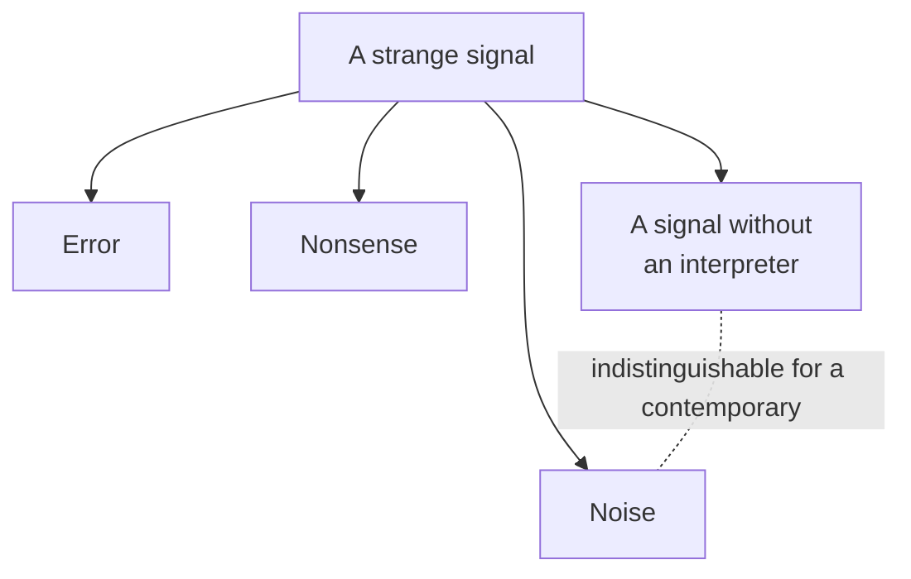

# Hallucination as a Filter Mechanism

*Why the term "hallucination" is an observer's judgment, not a property of the signal*

**Alex Krol** — strategy, AI, growth infrastructure

> 🇷🇺 **Russian version:** [Ru/4_MetaFoundation/hallucination-as-filter.md](../../Ru/4_MetaFoundation/hallucination-as-filter.md)

> © 2026 Alex Krol. All rights reserved. Republication, redistribution, or commercial use only with the author's explicit written permission.

---

## Table of Contents

0. [TL;DR](#tldr)
1. ["Hallucination": a judgment disguised as a property](#1-evaluation-vs-property)
2. [Noise, error, nonsense, and a signal without an interpreter](#2-four-things)
3. [The substitution of formulations as a mechanism for closing thought](#3-substitutions)
4. [The method vs. the psychology of the scientific community](#4-method-vs-psychology)
5. [The logistical nature of the filter](#5-logistical-filter)
6. [A radical consequence: "impossibilities" as artifacts of scarcity](#6-impossibilities-as-artifacts)
7. [Sources](#sources)

---

## TL;DR 

The word "hallucination," as applied to a large language model, contains a judgment passed off as a description. Inside the model there is no distinction between a "correct answer" and a "hallucination": the model produces a probabilistically plausible sequence of tokens. The classification happens on the outside—on the side of the interpreter, who checks the model's output against his own picture of the world. What looks to one person like a hallucination may seem to another like an ordinary statement, because the boundary between "meaningful" and "meaningless" lies not in the signal but in the observer. Moreover, the formal result of Kalai and Vempala shows that a statistically calibrated model is *obligated* to hallucinate, and the lower bound on this rate corresponds to the proportion of facts that appear in the training data exactly once[^3]. This turns hallucination from a defect into an inevitable consequence of the architecture.

The same structure operates in science. The claim "this is impossible," made under knowingly limited knowledge, is logically dubious—yet it is made routinely. There are three working substitutions: "we have no resources to investigate this" is substituted with "this is nonsense"; "the probability is low" with "this is impossible"; "the mechanism is unknown" with "there is no mechanism." These three formulations are outwardly indistinguishable, but they assert entirely different things.

The critique is not aimed at the scientific method—the method is modest—but at the psychology of the scientific community. At a deeper level, this is a critique of the logistics of knowledge: under finite resources, any filter on hypotheses is a set of assumptions about the future, and these assumptions are more often made by culture, authorities, the grant system, and inertia than by data. The principal constraint on knowledge is not epistemological but logistical. Not "we cannot find out," but "we cannot afford to test everything." The whole problem is hidden in that trade-off.

---

## 1. "Hallucination": a judgment disguised as a property 

The term "hallucination," as applied to a large language model, linguistically evokes the image of a subject who sees something that does not exist. This is anthropomorphism, and it produces a false picture. The model has no internal authority that mistakes a hallucination for perception. The model produces a sequence of tokens that is statistically plausible in light of the training distribution. No "I made a mistake" takes place within the model—because there is no "I."

Canonical surveys in the literature cautiously register this in their technical definitions, yet they retain the term itself. Ji and colleagues divide "hallucinations" into intrinsic ones (the generation contradicts the input) and extrinsic ones (the generation cannot be verified against the input)[^1]. Huang and colleagues expand the taxonomy: factuality hallucinations versus faithfulness hallucinations, with causes sought in the data distribution, the transformer architecture, the objective function (next-token prediction), and sampling strategies at inference[^2]. Bender and colleagues, in their celebrated work on "stochastic parrots," pose the terminological question directly: what looks like understanding or judgment is a statistical approximation of the distribution of language, not semantic work[^4]. If there is no understanding, there is no hallucination in the human sense. There is no subject who sees something that does not exist. There is a machine stitching together plausible forms.

What follows is the move that changes the entire frame. In 2024, Kalai and Vempala proved a theorem: for a statistically calibrated language model there exists a lower bound on the hallucination rate, and this bound is approximately equal to the proportion of facts that appear in the training data exactly once—what is called the Good–Turing estimate in statistics[^3]. If the model honestly reflects the data distribution, it is *obligated* to fabricate facts on the rare tails. This cannot be "fixed" by engineering means without losing calibration. Hallucination is not a bug of the architecture but its operating regime. The empirical work of McCoy and colleagues points in the same direction: the behavior of models is determined by the task on which they were trained—next-token prediction; "possible" and "impossible" for the model are statistical, not ontological, categories[^5].

A simple thing follows from this. The model does not distinguish a "correct answer" from a "hallucination." That distinction is produced on the outside. The interpreter takes the model's output, checks it against his own picture of the world, and attaches a label. If it matches—a correct answer. If it does not match—a hallucination. The label itself says nothing about the model. It speaks about the interpreter and his picture of the world.

From this an uncomfortable question arises at once. What happens if there are two interpreters with different pictures of the world? One and the same answer from the model will be called true by one and a hallucination by the other. The picture of the world is a variable. The boundary, too, becomes a variable. The history of science is full of cases in which an idea, at the moment of its appearance, looked like a hallucination relative to the prevailing picture—and a generation later became the norm. This does not mean that every strangeness is a hidden discovery. It means that the boundary between the meaningful and the meaningless depends on the interpreter's context, not on the properties of the signal.

And here the term "hallucination" treacherously closes off thought. It forces us to believe that the problem is inside the model—that it "sees something that does not exist." But if the boundary is set from the outside, then the technical problem has been described inaccurately. More precisely: the model produces a signal, the observer evaluates it, and the evaluation often says more about the observer than about the signal. The very same thing, in mirror image, happens in science—and that comes next.

## 2. Noise, error, nonsense, and a signal without an interpreter 

The central difficulty of any filter is that it must distinguish things that are visually indistinguishable. When a strange signal is before you, it has at least four natures, and to a contemporary they all look the same.

The first is noise. A random fluctuation carrying no structure. Mere interference.

The second is error. The signal carried structure, but it was distorted in transmission or in production. There was structure, but not the one there should have been.

The third is nonsense. There is structure, it is internally coherent, but it refers to nothing beyond itself. A self-sustaining form without a referent.

The fourth is a signal for which there is as yet no interpreter. There is structure, there is a referent, but the language in which it could be read has not yet been built. The signal awaits its reader.

These four natures are visually indistinguishable to a contemporary. All four look like "something strange, unlike the familiar." In hindsight everything seems obvious: well, there it is, the theory of relativity; well, there it is, alchemy. But at the moment when something new appears, no one knows what they are looking at—the physics of the future or ritual nonsense. This is the fundamental problem not only of AI but of human cognition in general. Kuhn described it in terms of paradigms: within a paradigm an anomaly at first is not "seen" at all—it lies in the community's blind spot[^7]. Lakatos showed the technical mechanism: around the hard core of a theoretical program a protective belt of auxiliary hypotheses is built, and a signal that threatens the core is fended off by this belt before it is considered on the merits[^8].

From this follows a tension that must be held in mind simultaneously. Most strange signals are indeed noise. That is a statistical fact. If you let everything in, you will drown in garbage. But: some of the most important signals in history also looked like noise at first. In the 1920s American geology rejected continental drift as impossible—not because of bad data, but because the idea did not fit the community's standards of practice; the mechanism was found later, in the 1960s, and what had been a "hallucination" became plate tectonics[^15]. The bacterial nature of stomach ulcers was rejected—"bacteria cannot live in an acidic environment." Marshall drank a culture of H. pylori to force the hypothesis to be taken seriously; the Nobel Prize came more than twenty years later[^16]. Prusiner's prion hypothesis was called heretical[^17]. And so on.

The tension between "most are noise" and "the most important sometimes also looked like noise at first" is precisely the working condition of any knowing community. This tension cannot be removed. It can only be managed. The trouble is that management here happens not through the method but through a social filter—which turns out to be cruder than the method and systematically biased.

## 3. The substitution of formulations as a mechanism for closing thought 

The most interesting part of this picture is exactly how the filter is triggered in actual speech. Not in a textbook on epistemology, but in living public discussion. And here three substitutions are at work, which I want to examine directly.

**The first substitution.** "We have no resources to investigate this" is substituted with "this is nonsense." These are two entirely different propositions. The first is about the state of the research apparatus. The second is about the state of the world. The second does not follow from the first. But in public rhetoric they often sound the same and indistinguishable: "well, this is rubbish, nobody seriously works on it." The very fact that nobody works on it turns into an epistemological argument. The syllogism is concealed, but it is there, and it is vicious: "nobody invests resources → this does not deserve resources → this has no content." Between the first and second step lies a chasm filled with the inertia of the grant system.

**The second substitution.** "The probability is low" is substituted with "this is impossible." Low probability and impossibility are different categories. The first permits the event; the second excludes it. From the fact that an event is improbable, it does not follow that it will not occur. But in discussion "low probability" is uttered with the intonation of "forget about it," and the listener no longer distinguishes whether he was told "this is excluded" or "this is improbable." Popper insisted that scientific status belongs only to a statement that is in principle falsifiable[^6]; "this is impossible" in most cases means "I have no model in which this would happen"—and that is a criterion about the speaker, not about the world.

**The third substitution.** "We do not understand the mechanism" is substituted with "there is no mechanism." The observer's absence of a model is passed off as a property of the phenomenon. This is perhaps the most frequent error. When science encounters a reproducible effect for which there is no accepted explanation, the community's reaction usually passes through a stage of denial: "this cannot be, because we do not understand how." But "we do not understand how" is a statement about our limitations. "This cannot be" is a statement about the world. Between them—again a chasm.

What do all three substitutions have in common? All three turn a statement about the state of knowledge into a statement about the state of reality. All three conceal, behind a confident formulation, an admission of one's own limitation. And all three work for one and the same psychological reason: the human brain very poorly tolerates uncertainty.

This is not an abstract idea but something easily observed in people and in communities. Scientists are no exception here. Very often people—and communities—prefer false certainty to honest ignorance. "This is impossible" closes the question. "We do not understand the mechanism, and we have no resources to investigate it" leaves it open. A closed question is psychologically more comfortable. It creates the sense that the picture of the world is consistent. An open one creates an irritation that demands energy.

And here, at this very point, I want to draw a distinction that seems to me key to the entire essay.

## 4. The method vs. the psychology of the scientific community 

When people say "science rejected this" or "science accepted that," they imply that the subject of the action is some single authority—the scientific method. This is not so. The scientific method is a formal procedure: hypothesis, test, data, revision. The method in itself is modest. It does not issue final verdicts. It does not say "this is impossible." It says "this hypothesis was not confirmed under such-and-such conditions by such-and-such measurements." The method leaves room for revision, because any confirmation within it is temporary, and a refutation is substantive only under specified conditions.

The actual judgments are passed by a different authority—the community. And the community has different properties. The community consists of people with careers, attachments, reputations, grant histories, personal faith in their own previous work. The community says not "this hypothesis has not yet been confirmed" but "this is rubbish, because I am sure." This is not the same thing. It is altogether a different genre of statement.

The sociology of science long ago recorded this difference. Bloor's program in the Edinburgh School was built on the principle of symmetry: one and the same type of cause must explain why the community accepts true ideas and why it rejects false ones[^10]. Latour and Woolgar, in their ethnography of the laboratory, showed exactly how a statement turns into a "fact"—through a chain of records, references, grant decisions, negotiations; a "fact" takes shape when the cost of disputing it exceeds the benefit, not when it "corresponds to reality"[^11]. Merton described the *Matthew effect*: recognition is distributed not in proportion to contribution but in proportion to status already accumulated[^12]. Lee and colleagues gave a systematic review of the biases of peer review—gender, institutional, national, and paradigm-conforming[^13]. Feyerabend, in radical form, declared that the major advances of science were made *in spite of* the norms of the community of the time[^9].

The combination of these lines yields a stable picture. The method and the community are different machines. The method is about the procedure of verification. The community is about the distribution of legitimacy. They operate on different principles, and the second is systematically broader and more inertial than the first. When a new idea is rejected, it is almost never the method that rejects it—it is the community that denies it access to the procedures of the method. The idea is discarded before the method is given a chance to consider it.

And here the nontrivial parallel with the LLM becomes clear. The question is usually posed thus: why does the model generate so many strange things? This is a question about the production of the signal. But there is a mirror question that changes the frame: why does a human so quickly classify most strange things as nonsense? That is already a question about the filter, not about production.

Both systems—the model and the human—have their own limitations. The model poorly distinguishes signal from noise because it has no external criterion of truth, only the statistics of language. The human sometimes filters everything unusual too aggressively, because the cognitive cost of revising the picture of the world is high, and the psychological cost of "I don't know, but it's interesting" is higher still. The model produces too much. The human lets in too little. And the real question is not "which of them is right" but where the optimal boundary lies between credulity and skepticism.

On one side of this boundary lies the world of superstitions. Any strange signal is taken for meaning; reality drowns in hallucinations, in the primitive sense of the word—ascribing structure where there is none. On the other side lies a world in which new knowledge does not appear at all, because everything new is declared impossible before it is considered. This is a paralyzed science, defending the hard core of its program at any cost, in a degenerative phase in Lakatos's terms.

The boundary is not settled once and for all. It must be constantly revised—and that revision is made not by the method but by the community, with all its biases. This is exactly what explains why science periodically passes through Kuhnian revolutions: the accumulated bias of the filter reaches a threshold at which anomalies become impossible to ignore, and then the community abruptly switches to a new picture—often denying its existence the day before the switch.

The fault in this cycle lies not with the method. Nor with science as an idea. The fault lies with the concrete social machine through which science operates at a given historical moment. And this machine is built such that its decisions about "possible/impossible" depend on resources far more than is customarily admitted.

## 5. The logistical nature of the filter 

Here I make the radical turn for the sake of which all the preceding was written.

In the ordinary understanding, the main question of science is how to distinguish a true hypothesis from a false one. Epistemology is built around criteria of truth: correspondence to data, predictive power, falsifiability, consistency with accepted theory. All of this is correct—but it is a second-order question. The main question arises earlier: **who decided in the first place which hypotheses would reach consideration.**

If resources are infinite, no answer is needed. The strategy is obvious: generate a million hypotheses, test a million hypotheses, look at the result. No filter. But resources are finite—laboratories, time, grants, the community's attention, pages in journals, slots at conferences. And as soon as resources become finite, a filter appears. And any filter is a set of assumptions about the future. Even before the investigation begins, we have already made a bet: some directions are more promising than others. The bet itself is made not by data—by definition we do not yet have any, since we have not yet investigated. The bet is made by something else.

By what, exactly? By the culture of the community—what is considered interesting, what is considered "real science," what is considered unserious. By authorities—who decides what is important. By fashion—which topics are now hot, which are cold. By the grant system—what is funded, what is not. By career incentives—on what a career can be built, on what it cannot. By historical inertia—what was done for the last twenty years is what will be done going forward.

Paula Stephan, in her work on the economics of science, shows this on a mass of data with utmost concreteness: laboratories are staffed with cheap temporary labor, universities shift grant risk onto workers, and a hypothesis outside the current grant agenda receives no funding[^14]. This is not a moral failing of individual scientists. This is the working construction of the machine. It *cannot* fund everything; it is forced to choose; it chooses by signals that come not from epistemology but from economics and sociology. Lee and colleagues, in their review of peer review, add: even at the stage of evaluating already-written work, the filter is systematically biased in favor of novelty conforming to the paradigm and against the radical[^13]. Merton's Matthew effect completes it: already-published works from prestigious institutions are cited disproportionately more often, which strengthens the filter on the next turn[^12].

From all this follows my main thesis.

**The constraint on knowledge is often not epistemological but logistical.**

It is not so much that we cannot find out. We cannot afford to test everything in turn. And then begins the trade-off—the choice of priorities under a scarcity of resources. In this trade-off lies hidden the whole real problem of modern science. Not in the method. Not in the fundamental unknowability of some questions. In the fact that between a hypothesis and its testing stand economics, sociology, and culture—and they determine which hypotheses survive to be tested at all.

This inverts the usual picture. When we say "science has proven that X is impossible," what is in reality often meant is: "the research establishment did not direct resources toward testing X, because X did not fit the current agenda." These are not the same thing. The first is a statement about reality. The second is a statement about the state of the research machine. They are blended into a single formulation.

Here an unexpected connection with AI appears—and not the one usually expected. Throughout the whole history of humanity, the cost of the preliminary analysis of hypotheses, of modeling, criticism, and the generation of alternatives, was enormous. It required the time of experts, access to the literature, years of training. Now, for the first time in history, a situation arises in which the cost of this stage falls by orders of magnitude. Not the cost of the final empirical test—there, real experiments and real money are still required. But the cost of the pre-test stage: formulation, working through, the search for analogies, the generation of counterarguments, the literature review. It was precisely this stage that logistically clogged the filter. And it is precisely this stage that AI is beginning to unburden.

Not the entire logistical barrier. A part. But this part is the critical one.

## 6. A radical consequence: "impossibilities" as artifacts of scarcity 

If the logic of the preceding section is taken to its limit, the following emerges.

Many scientific "impossibilities" are not conclusions drawn from knowledge but artifacts of a scarcity of research resources. Not "it has been proven that it cannot be," but "we could not afford to test it." These two formulations sound the same, but they describe entirely different situations. In the first, the problem lies in reality—it is constructed such that something is excluded. In the second, the problem lies in us—we are constructed such that we cannot reach it.

I do not claim that all rejected ideas will turn out to be true. The overwhelming majority are indeed garbage. That is statistics, and it is against them. But I claim something else: the historical boundary between "impossible" and "we cannot afford to investigate this" ran far less sharply than is customarily believed. And this blurred boundary was systematically passed off as a sharp one—because a sharp boundary is psychologically simpler, and the community, as we have seen, poorly tolerates uncertainty.

And here the parallel with the LLM's hallucination becomes exact. When we say "the model generated nonsense," in a significant share of cases the real claim sounds different: "we have no effective way to extract value from this." That is an entirely different claim. In the first case the problem lies in the signal—it carries no information. In the second case the problem lies in our mechanism for processing the signal—we do not know how to read it. These two diagnoses require different responses. The first—filter more strongly. The second—learn to read.

The same logic works in the reverse direction, in science. When the community says "this hypothesis is meaningless," often the real content of the claim is this: we have no logistics to test it, and no language to formulate it rigorously. This is a statement about our machine, not about the hypothesis. And it requires a different response: not "discard," but "record as awaiting logistics."

I deliberately do not propose a "solution." The boundary between credulity and skepticism is not settled once and for all. Any attempt to fix it is a surrogate, inevitably inclined toward one of the sides. Too open a filter—the world of superstitions. Too closed—a world where new knowledge does not appear. This boundary must be moved constantly, and it must be moved by the community, with the awareness that it moves the boundary on logistical, not epistemological, grounds.

What changes in the moment in which we live is the logistics itself. The cost of the preliminary phase (analysis, modeling, criticism, the formulation of alternatives) is falling by orders of magnitude for the first time in history. This means that the logistical filter of the first stage becomes less rigid. Hypotheses that were previously discarded because they were "too expensive even to consider" can now be worked through in minutes. This does not make them true. But it changes the composition of what reaches the empirical test.

And one last thing. The term "hallucination," as applied to a language model, is a small illustration of a large error. The error consists in passing off a property of the observer as a property of the observed. The model "hallucinates" because its output does not coincide with our picture. A hypothesis is "impossible" because it does not fit our program. In both cases the formulation sounds like a description of the world, while it describes the interpreter. To separate these two levels is not a cosmetic correction of terminology. It is a different discipline of thinking about how our filters are constructed in the first place. And this discipline now—against the backdrop of unburdening logistics—is becoming not abstract philosophy but a working question for everyone who tries to distinguish signal from noise.

---

## Sources 

[^1]: Ji, Z., Lee, N., Frieske, R., Yu, T., Su, D., Xu, Y., Ishii, E., Bang, Y. J., Madotto, A., & Fung, P. (2023). Survey of Hallucination in Natural Language Generation. *ACM Computing Surveys*, 55(12), Article 248, 1–38. DOI: [10.1145/3571730](https://doi.org/10.1145/3571730). arXiv: [2202.03629](https://arxiv.org/abs/2202.03629).

[^2]: Huang, L., Yu, W., Ma, W., Zhong, W., Feng, Z., Wang, H., Chen, Q., Peng, W., Feng, X., Qin, B., & Liu, T. (2023). A Survey on Hallucination in Large Language Models: Principles, Taxonomy, Challenges, and Open Questions. *arXiv preprint* [arXiv:2311.05232](https://arxiv.org/abs/2311.05232).

[^3]: Kalai, A. T., & Vempala, S. S. (2024). Calibrated Language Models Must Hallucinate. *Proceedings of the 56th Annual ACM Symposium on Theory of Computing* (STOC '24), 160–171. DOI: [10.1145/3618260.3649777](https://doi.org/10.1145/3618260.3649777). arXiv: [2311.14648](https://arxiv.org/abs/2311.14648).

[^4]: Bender, E. M., Gebru, T., McMillan-Major, A., & Shmitchell, S. (2021). On the Dangers of Stochastic Parrots: Can Language Models Be Too Big? *Proceedings of the 2021 ACM Conference on Fairness, Accountability, and Transparency* (FAccT '21), 610–623. DOI: [10.1145/3442188.3445922](https://doi.org/10.1145/3442188.3445922).

[^5]: McCoy, R. T., Yao, S., Friedman, D., Hardy, M. D., & Griffiths, T. L. (2024). Embers of Autoregression Show How Large Language Models Are Shaped by the Problem They Are Trained to Solve. *Proceedings of the National Academy of Sciences*, 121(41), e2322420121. DOI: [10.1073/pnas.2322420121](https://doi.org/10.1073/pnas.2322420121). arXiv: [2309.13638](https://arxiv.org/abs/2309.13638).

[^6]: Popper, K. R. (1959). *The Logic of Scientific Discovery*. Routledge, London (German original: *Logik der Forschung*, 1934). [Routledge edition](https://www.routledge.com/The-Logic-of-Scientific-Discovery/Popper-Popper/p/book/9780415278447).

[^7]: Kuhn, T. S. (1962). *The Structure of Scientific Revolutions*. University of Chicago Press, Chicago. [UChicago Press](https://press.uchicago.edu/ucp/books/book/chicago/S/bo13179781.html).

[^8]: Lakatos, I. (1978). *The Methodology of Scientific Research Programmes: Philosophical Papers Volume 1* (J. Worrall & G. Currie, Eds.). Cambridge University Press, Cambridge. [Cambridge Core](https://www.cambridge.org/core/books/methodology-of-scientific-research-programmes/3CEA865F766E9F313A1FF5582B28E943).

[^9]: Feyerabend, P. (1975). *Against Method: Outline of an Anarchistic Theory of Knowledge*. New Left Books (Verso), London. [Verso Books](https://www.versobooks.com/products/1041-against-method).

[^10]: Bloor, D. (1976). *Knowledge and Social Imagery*. Routledge & Kegan Paul, London (2nd ed., University of Chicago Press, 1991). [UChicago Press](https://press.uchicago.edu/ucp/books/book/chicago/K/bo3684600.html).

[^11]: Latour, B., & Woolgar, S. (1979). *Laboratory Life: The Social Construction of Scientific Facts*. Sage, Beverly Hills (2nd ed., Princeton University Press, 1986). [Princeton UP](https://press.princeton.edu/books/paperback/9780691028323/laboratory-life).

[^12]: Merton, R. K. (1968). The Matthew Effect in Science. *Science*, 159(3810), 56–63. DOI: [10.1126/science.159.3810.56](https://doi.org/10.1126/science.159.3810.56).

[^13]: Lee, C. J., Sugimoto, C. R., Zhang, G., & Cronin, B. (2013). Bias in Peer Review. *Journal of the American Society for Information Science and Technology*, 64(1), 2–17. DOI: [10.1002/asi.22784](https://doi.org/10.1002/asi.22784).

[^14]: Stephan, P. E. (2012). *How Economics Shapes Science*. Harvard University Press, Cambridge, MA. [Harvard UP](https://www.hup.harvard.edu/books/9780674088160).

[^15]: Oreskes, N. (1999). *The Rejection of Continental Drift: Theory and Method in American Earth Science*. Oxford University Press, New York. [Oxford UP](https://global.oup.com/academic/product/the-rejection-of-continental-drift-9780195117332).

[^16]: Ahmed, N. (2008). *Helicobacter pylori: A Nobel pursuit?* PubMed Central. [PMC2661189](https://pmc.ncbi.nlm.nih.gov/articles/PMC2661189/).

[^17]: Keyes, M. E. (2007). The Early History of the Protein-only Hypothesis: Scientific Change and Multidisciplinary Research. In *Multidisciplinarity and Translation in Pharmaceutical Research*. Palgrave Macmillan, London. [Springer](https://link.springer.com/chapter/10.1057/9780230524392_2).
