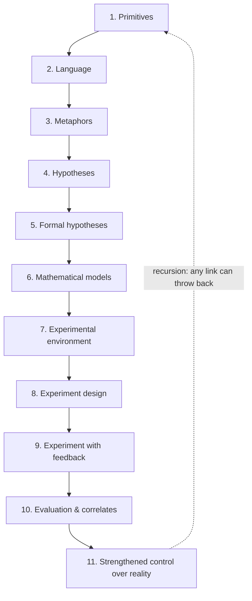

### Chapter 7. From Metaphysics to Experiment

**Alex Krol** — strategy, AI, growth infrastructure

> © 2026 Alex Krol. All rights reserved. Republication, redistribution, or commercial use only with the author's explicit written permission.

The hypothesis of a different physics of reality has already been stated. The next step is not to persuade anyone. The next step is to figure out how to handle a hypothesis like this so that it becomes work, not a conversation going in circles.

The first reaction of an educated person to any new ontology — that is, to any new picture of what reality is made of — is standard and almost automatic. He says: that's metaphysics. Meaning: that's unscientific. And if it's unscientific, there's no need to discuss it seriously. You can nod politely and move on to something that speaks in formulas.

This reaction looks rigorous. In fact, it confuses levels.

"Metaphysics" in this everyday usage sounds like a slur. But in the strict sense of the word, "metaphysics" is simply reasoning about reality for which no testable model exists yet. What lies beyond current physics — not because it resides in some mystical dimension, but because we don't yet have the apparatus to catch it. The boundary between "metaphysics" and "physics" does not run along some objective frontier. It runs where we drew it ourselves — where we already have a language, a formula, an experiment. Where the apparatus doesn't exist yet, we stamp the label "metaphysics" on it and consider the question closed. Where the apparatus appears, we swap the label for "physics" and pretend it was that way all along.

This boundary is instrumental, not sacred. It moves every time science claims a new piece of territory. Electromagnetic phenomena were metaphysics two hundred years ago. The atom was metaphysics. Genes were metaphysics. Black holes were metaphysics — and remained so long after the equations had already been written down. Today all of it is textbook material.

That is why brushing a hypothesis aside with the word "metaphysics" is a dishonest move. It masks the real question. The real question is not "is this metaphysics or not," but something else: does this metaphysical intuition have a trajectory toward testing. Can it be dragged through the tightening chain. If it can — it is not "unscientific." It is the early stage of science, the stage where science always began.

I want to say this directly, because without it there is no point in going further.

> **[from the dialogue]**
>
> **Me:** *Any scientific theory, even the most rigorous one, always begins with some utterly murky narratives in someone's head. First, images are born in the mind, often completely unverbalizable. Then comes verbalization in the form of metaphors. And these metaphors can be very poetic, strange, and absolutely unformalizable. Then, gradually, these metaphors get transformed into something formalizable. Only then comes the attempt to give it a mathematical apparatus. Only after that can you build some kind of model, move on to experiment design, run experiments, get some results, and interpret them without committing a million logical errors. So if you trace this whole chain of transformations, at the foundation there is always pure metaphysics, which simply, at certain stages, got converted into what we call a theory.*

This is the honest view of the pre-formal layer. The layer where there is no theory yet — only a murky image. No theory was ever born from a formula. They all began with a picture circulating in someone's head, a picture that this someone couldn't even properly explain, but saw.

And the strongest example of this comes not from a textbook but from a story everyone knows and no one is surprised by.

At first, Ra was born as a dream, as science fiction. I'm talking about the black hole at the center of the galaxy, not the Egyptian god — but the name turned out to be the same. Before Ra acquired a precise name, coordinates, a measured mass, an image — it was a speculative construct. At first just a thought experiment: what would happen if a gravitational field compressed so far that light could no longer escape it. The idea circulated for a long time with the status of science fiction. Serious physicists chuckled at it. Then it entered the equations. Then the observations. Then — the photograph. Today it is part of the standard picture of the world.

Between the "dream" and the "photograph" lies that very tightening chain without which metaphysics remains just words. And this is not a compliment to Ra. It is the typical story of practically every theory that works.

Now this chain needs to be written out explicitly. Not because it's pretty to look at, but because without it there is nothing further to talk about.

> **[from the dialogue]**
>
> **Me:** *I think we've reached the phase where it's worth discussing the workflow and pipeline itself — how we get from metaphysics to something. I've identified the following stages, talked about them a little, but I've already laid them out. Primitives. Language. Metaphors. Hypotheses. Formal hypotheses. Mathematical models. Experimental environment. Experiment design. Running the experiment with a feedback loop, self-learning. Evaluating results, searching for correlates. Searching for strengthened control over reality.*

This chain is the working axis of the entire chapter. Every theory that eventually reaches testing passes through it. A theory that hasn't passed through it remains an image in someone's head.

I'll unfold it in prose, so that each step is visible as a real link of engineering work, not as an item on an academic list. Each next link is a tightening of the previous one. At each one, a theory can fall off. And that is not a malfunction — that is the whole point.

The beginning is primitives. These are pre-linguistic distinctions. Not concepts, but raw signals: something here repeats rhythmically, here there's a break, here something holds, and here it falls apart. Before words. Anyone who has worked hands-on on a hard problem knows this state: you can't yet explain what exactly is wrong with the system, but you already feel that something is. This is the raw material of thinking, and without it there is nothing to build from. Next comes language: the raw distinctions are given names. It becomes possible to hold a primitive in your head and pass it to someone else. Without language, primitives scatter like a handful of sand. Half the history of science is the history of introducing a new word, after which it suddenly became possible to see what the eye previously couldn't distinguish at all.

Out of language grow metaphors — the first splicing of distant domains. Electric current as water flowing through pipes. The atom as a solar system. A metaphor is a transfer machine: take the machinery of one domain, drape it over another, see what keeps working. A metaphor is almost always wrong in the details. But it makes a phenomenon discussable for the first time, and without it not a single theory would have emerged from the fog. The metaphor condenses into a hypothesis: no longer just an image, but a directed claim that things are arranged thus-and-so. This is the first claim to explanation, and from this moment on, you can start arguing on the merits.

The hypothesis is then refined — variables are introduced, relations, the conditions under which the hypothesis counts as false. The result is a formal hypothesis. This is the first point where a theory allows itself to be killed. And that is its virtue, not its weakness: only here does it enter the mode where it can be tested rather than admired. From the formal hypothesis, it is one step to a mathematical or structural model. A frame appears that you can turn over in your hands. By itself it doesn't prove anything yet — for now it's a schematic. But it can be compared with other schematics, run through different regimes, examined for what it predicts.

Then the theory meets reality for the first time. First — through the experimental environment: the place where the model can be collided with reality at all. This step gets underestimated more than any other. Sometimes the environment simply doesn't exist, and the theory has to wait decades until one gets built. Without an environment there is no testing, and the theory hangs in the air. Next — experiment design: what we measure, what we vary, what we hold constant, where the signal is, where the noise is, what result counts as a refutation. Without honest design you can confirm any nonsense by cherry-picking convenient data. And then — the experiment itself, with feedback. This is no longer a one-shot check but iterative work: the result feeds back into the design, into the environment, sometimes into the hypothesis itself. This feedback is not commentary from the outside — it is built into the construction from within.

After the experiment — evaluation of results and the search for correlates. Not "it matched / it didn't," but a search for stable connections: what changes along with what, which variables behave the same way, where the hidden regularity is. Often the main work happens precisely here, after the experiment has already run its course. And the final link — strengthened control over reality. A theory counts as mature not when it sounds beautiful, and not when it gets published, but when it lets you steer a piece of the world: predict, reproduce, transfer into technology. Radio did not emerge from Maxwell's publications. It emerged when the equations turned into a transmitter you can tune and that works.

Here is the chain in full: primitives → language → metaphors → hypotheses → formal hypotheses → mathematical models → experimental environment → experiment design → experiment with feedback → evaluation of results → strengthened control over reality. Eleven links. Each one a tightening, not a repetition.

Here the temptation arises to picture this chain as a linear assembly line: murky image in, technology out. Load it, crank it, collect. The temptation is false. The chain is not linear. It is recursive.

The experiment throws you back to the beginning. A failed experiment design shows that the hypothesis was formulated crookedly. A mathematical model falling apart shows that the hypothesis is about something other than what you thought. A strange experimental result forces you to change the primitives — to notice that you'd been cutting reality in the wrong places from the very start. The technological packaging — the final step — can expose the hidden falsity of everything that came before: the theory seems tested, the model seems beautiful, and yet in the technology it doesn't work, and you have to go back to the language and reformulate everything from scratch.

This is not a flaw. This is precisely how the chain works. It is not an assembly line but a cyclic machine in which every link knows how to throw back and rewrite the previous one. Remove this recursiveness — and the machine stops being a selection machine and becomes a confirmation machine. That is, an imitation.

Now the main thing. What is this machine even for.

The easy answer: to turn vague ideas into tested theories. That's true, but it's not the most important answer. The most important one is different.

> **[from the dialogue]**
>
> **Me:** *In the end, the question is not actually about insights, but about the nature of reality. Because my main thesis is not that humans are so super-smart because of insights. It goes differently: humans are capable of insights, while artificial intelligence and ordinary computational systems are not, because the nature of reality is not what we believe it to be when we build artificial intelligence and evaluate humans. That is the main thesis. Accordingly, the task here is to test fundamental hypotheses about the nature of reality.*

Here the emphasis has to be rearranged, or all the previous work will be understood crookedly. The question is not about insight. Insight is a working link of the chain, not its goal. The question is about the nature of reality.

This has to be said out loud, because after several chapters about insight, the leap, and connectedness, the reader naturally comes away with the impression that insight is the protagonist of this book. No. Insight is a symptom. A symptom that our computational picture of the world — that is, the notion that everything, including thinking, in principle reduces to enumerating states according to rules — may be incomplete. If a human is capable of insight and a computational machine, as currently understood, is not, that is not a compliment to the human. It is a pointer to the fact that there is something in reality itself that our picture of the world does not describe.

And then the eleven-step machine is needed not for a cult of insight. It is needed to test competing pictures of reality. Which of them withstands collision with the world, and which does not.

In this sense, the pipeline is not a machine of cognition. It is an ontology selection machine.

What does "ontology selection" mean. Several pictures of the world are alive at the same time right now, and they are competing to become the working frame for the next generation of science. One says: everything is computation; intelligence is a complex algorithm; AGI will sooner or later reproduce everything a human does. This is the picture today's industry stands on, the one with hundreds of billions of dollars pumped into it. Another says: computation is a special case; reality is wider; intelligence may include modes that simply don't reduce to the computational frame. Almost no one is building this picture today.

There is no arbiter between them. You can't settle it in a debate — each is internally consistent. You can argue for decades and not move an inch. This is not a question of rhetorical skill.

The pipeline proposes something else. Not "which picture is prettier." But: which one withstands passage through all eleven tightenings to the end. Which one reaches the experiment and comes back from it with confirmation. Which one, in the finale, yields strengthened control over reality — that is, lets you do things to the world that couldn't be done without it. That is the criterion. Not the beauty of the reasoning. Not the authority of the speaker. Not the number of citations. Strengthened control.

In physics everyone knows this criterion. If a new theory lets you send a rocket where the old one couldn't, or build an instrument the old one considered impossible — the old one gets discarded. Not because it sounds worse. Because the new one works where the old one doesn't.

Exactly the same criterion works for ontologies. Not "which picture of the world is more correct in a debate." But: which one, after a run through the chain, gives us control over a piece of reality that was uncontrollable without it. If the computational ontology gives us working LLMs and doesn't give us insight — that's a signal. If another ontology manages to deliver something the computational one doesn't — that's an even stronger signal. If neither measures up — then neither is good enough yet.

That is what "selection machine" means. Not "we pick the correct one and discard the false ones," but "we run them all through the same tightening chain and see which one survives." Competing pictures are not declared true or false before the run. They earn their status by the result. And that status gets revised as soon as new evidence appears.

Here one caveat has to be made honestly. AGI — a system comparable to a human in general cognitive breadth and consistently superior to 90% of people in the quality of decisions — does not yet exist. So a formal proof that one ontology is better than another cannot be given today: there is nothing to test on. This is a limitation, not an excuse. It does not nullify the work. It simply means that right now we are building a machine for a future comparison, not delivering a final verdict. Designing the machine before the thing it will test exists is normal. The microscope, too, was designed before anyone saw a cell through it.

By this point, the conversation about metaphysics and physics is already very different from where this chapter began. Not "metaphysics is bad, physics is good," but exactly one machine through which every picture of the world passes, and in which some survive and others don't. Not a pedestal for insight, but a machine tool for selection. The boundary between a "murky image" and a "working theory" is not spiritual but engineering: eleven links and a feedback loop between them.

This is the frame. The principle. A principle by itself doesn't do anything yet — it only describes what shape the machine must have. For the machine to start working on our particular case, it has to be assembled. And to assemble it, you have to understand what it even runs on.

That is a different conversation.

