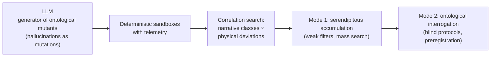

### Chapter 8. The Ontological Search Machine

**Alex Krol** — strategy, AI, growth infrastructure

> © 2026 Alex Krol. All rights reserved. Republication, redistribution, or commercial use only with the author's explicit written permission.

In the last chapter I talked about the principle. That we need a pipeline every picture of the world has to pass through to prove its right to exist — not with words, but with traction against reality. That was the outline of the principle. The outline without which you can't move any further. But a principle by itself does nothing. A principle is the shape of a machine. And the machine has to be built.

This chapter is about what that machine could be. Not "what it should be in some ideal world." But: what can be built today, on available hardware, on available software, with no new physics and no new grants. An ontological search machine — that is, a rig that mass-runs different pictures of the world through traction with reality and watches which one survives.

First — the material it works on.

There's an old parable. Ten blind men feel an elephant. One touches the trunk and says: an elephant is a thick snake. Another touches a leg and says: an elephant is a pillar. A third touches an ear and says: an elephant is a flat sheet. A fourth touches the flank and says: an elephant is a wall. Each is right within his own touch. And each is wrong the moment he declares his touch a complete description of the elephant.

Usually this parable gets told as a lesson in humility. As in, don't judge the whole by your part. I want to turn it a different way. Not about humility — about engineering.

Each of these descriptions is neither a "correct" nor an "incorrect" representation. It is an **angle of view** on one and the same reality. The trunk really is a snake, if all you care about is how it moves. The leg really is a pillar, if you care about how the elephant stands. A metaphor is not a literary ornament and not a compressed hint. It's a working operation: take the machinery of one domain, bolt it onto another, see what keeps working and what falls off. A metaphor defines a *projection*. Reality is one. The angles on it are many, and they conflict with one another, and it is precisely out of that conflict that nontrivial knowledge is born.

Here I have to clarify, otherwise everything will blur into fog. When I say "metaphor," I don't mean "a figurative comparison, like in poetry." I mean a transfer of structure from one object to another that forces us to see the second object differently. Electric current as water flowing through pipes. The atom as a solar system. Memory as a warehouse. None of these metaphors is correct in the details. All of them worked at some point and helped build an apparatus that turned out to be correct. Metaphor is the early transfer machine, and without it no theory ever comes out of the fog. I wrote about this in the last chapter — I'm repeating it here only because without this bridge the next step makes no sense.

The step is this. If every picture of the world can be sat on like a separate description of the elephant, and if not one of them covers reality whole on its own, — then the sensible strategy is not to "pick the single true one" but to **run through as many angles as possible** and see which of them get traction with the world and which are empty words. Not choose. Enumerate.

And this is where the machine comes in.

The strangest thing about this machine is that we already have it. It's the computer. Not "the computer as a metaphor for thinking," not "the computer as a model of the brain," not "the computer as a philosophical assumption." A real, ordinary computer. The one I'm typing this line on.

What makes it interesting. On the computer's upper floor live symbols. Code, text, narrative, formal language, architecture. On the computer's lower floor lives physics. Electric currents, heat flows, transistor switching, latencies, frequencies, power draw. These are not two different worlds describing the same thing. This is one world, in which the symbolic and the physical are coupled rigidly and literally. A symbol changes on the upper floor — a current changes on the lower one. The structure of a program changes — the load profile changes, and with it the temperature, the processor frequency, the pattern of memory accesses. This is not my metaphysics. This is engineering reality that any systems programmer reads off hardware counters every single day.

In this sense the computer is not a "model" of a laboratory — it is the cheapest universal laboratory humanity has ever come up with. An environment where symbolic output can be placed at the same point as physical response, and both can be measured. Where you can run not one experiment a day, as in a physical lab, but millions an hour. Where a deterministic background process — the most ordinary cryptographic hash or the grinding of some long formula — gives a smooth, reproducible signal, deviations from which can be caught with high precision.

If there is a machine in which narrative and physics live at the same time — then we have an environment in which we can test whether the former affects the latter. Not philosophically. Measurably.

Now the main question. What do we feed this machine.

The obvious answer is to select "meaningful" narratives that have passed through the human censorship of common sense. To feed in what we've decided in advance is worth attention. Assumptions, working hypotheses, tidy models. That is the standard engineering position. And it's exactly the one I want to break here.

Take a fresh proposal. Today we have an abundant and nearly free source of narratives — large language models. They produce terabytes of text a day, and a sizable share of that text is what's conventionally called hallucinations. That is, statements with no relation to facts, to human meaning, or to existing knowledge. This is considered a bug. A multibillion-dollar industry is busy suppressing hallucinations, filtering them, trimming them, penalizing them. They're considered garbage. The fewer, the better — or so the thinking goes.

I propose flipping the view.

> **[from the dialogue]**
>
> **Me:** *Essentially, what's happening right now? Language models hallucinate, and we humans try to pick, out of all the possible hallucinations, whatever we consider meaningful. But for a language model, the concept of a hallucination doesn't exist. In effect, a language model is, to some degree, performing enumeration. If you bring this down to practice, the question is that maybe all these hallucinations have value too. We're just focusing on the wrong thing. We're looking for meaningful things, when maybe what we need to look for is where hallucinations produce physical phenomena.*

Here the emphasis needs to be rearranged. The standard objection goes like this: a hallucination is an incorrect statement. It should be culled by the criterion "true — false" or "meaningful — meaningless." That objection is reasonable if the system's job is to report facts. If the job is different, it stops working.

If the job is the *search for ontologies*, then the "true — false" criterion is premature. We don't yet have the instrument on which truth can be separated from falsehood. More precisely, we have an instrument for only one picture of the world — the one we already live in. And with that instrument we confirm exactly that picture. Any thought that falls outside it automatically lands in the category of "nonsense." That's convenient for living, but it's a broken filter for searching.

An LLM in this context is not a broken thinker. The only thing that makes it broken is our attempt to use it as a thinker. In fact, it is an enumeration machine over an enormous space of symbolic constructions. It doesn't "make mistakes" — it *stirs* the space of representations in places where human common sense refuses to stir. If you judge the output not by its semantics but by its ability to leave a physical trace in an environment — every hallucination becomes one of the attempts. Most are empty. Some are ordinary noise. But if there is even one class of such constructions whose execution in the environment systematically deflects a physical process from what's expected — that class we will be able to catch. And catch cheaply.

That is how an LLM turns from defective intelligence into a cheap generator of ontological mutants. Mutations across the space of representations. Most mutations are useless. That is a normal property of any mutational process in nature. Biological evolution works exactly this way: millions of attempts, a handful of survivors. Not because biology is stupid, but because under high uncertainty, mass enumeration is cheaper than smart selection.

The key here is not to confuse re-evaluation with the encouragement of drivel. I am not proposing to consider every hallucination valuable. I am proposing to change the *selection criterion* — to a physical (not semantic) selection criterion.

> **[from the dialogue]**
>
> **Me:** *The criteria of ecological productivity are the ability to influence physical reality. That's how I see it, though there can be many approaches — this is just one of the ideas. Imagine we run some number of regular, repeating processes on a machine. Well, some simple algorithm that computes some formula, some hash... And this algorithm is deterministic... if these hallucinators of ours, so to speak — narratives, as I prefer to call them — turn out to be ontologically productive, then we can detect correlations between the production of these hallucinations of ours and some anomalous deviations in those periodic processes. Effectively, our first goal is to establish that this correlation exists at all. We're not judging what's nonsense and what isn't. We're judging the very fact of such a correlation.*

This is the central methodological move of the whole chapter, and it has to be spelled out separately, otherwise everything will turn to mush.

We don't ask the LLM: "do you understand the world correctly." We don't ask the LLM anything at all. We put the LLM in one corner of the room, put a running sandbox with a deterministic process in the other corner, and ask the environment: did anything change. Not the narrative's author. Not an expert. The environment. The environment either answers with a measurable deviation, or it doesn't.

A cartoonish image: a voltmeter on a table. Next to it stands a man uttering incantations. The needle either moves or it doesn't. And we do not evaluate *what exactly* he is muttering there. We evaluate only one thing — the deflection of the needle. Whether the muttering is meaningful, right now we couldn't care less. What we need is the bare fact of correlation — there or not there.

The image is deliberately cartoonish. Not because I'm proposing to literally race LLMs and stare at a voltmeter. But because the caricature drags the *type of measurement* out into the open. The type is this: we look not at the content of what's said, but at the deviation in a deterministic process nearby. It's a different mode of operation. Not semantic. Physical. Incomparably cruder than the evaluation of meaning we're used to — and for exactly that reason, fit for a zone where meaning hasn't taken shape yet.

There is no magic in this. Magic begins when the incantation is declared effective before the measurement. Here it's the other way around. An incantation here is the name for any symbolic construction, the output of an enumeration machine, unfiltered by human meaning. And the effect is what we catch with the instrument, or don't. The instrument doesn't lie. The instrument doesn't understand incantations. The instrument registers a physical deviation or its absence. A voltmeter and incantations — this is an engineering scheme, not an occult one.

Now — concretely. How the machine is built.

At the bottom — a large number of cheap sandboxes on ordinary servers. In each one, a deterministic background process spins. Some hash being computed, a long formula being evaluated, a simple regular loop turning over. Something whose behavior we know in advance with high precision. Telemetry is pulled from every sandbox: CPU load, frequency, temperature, power draw, latencies, memory access patterns. We get a baseline curve. We know how this process "sounds" in physical metrics when nobody touches it.

At the top — the stream of narratives the LLM pours out. Not selected for meaning. It pours out everything: hallucinations, meaningful texts, syntactic garbage, long structures, short replies, poetry, instructions, incoherent combinations. This stream gets executed in the environment. Between these two layers, one thing is searched for — correlation. Do there exist *classes* of narratives after whose execution the deterministic background process systematically deviates from its normal curve more strongly than ordinary load can explain.

Let me underline: the task of the first phase is not "to prove new physics." The task is to catch a signal. To find the bare fact that between narrative production and physical response there is a stable correlation that exceeds standard error and is not explained by trivial computational channels. Not "what does it mean," but "is it there at all." Discovery, not validation. First see, then figure out.

Here comes the standard engineering objection. If you're churning through millions and billions of variants, then by the law of large numbers you will *inevitably* find strange correlations. Out of pure noise. Without hard statistical discipline from the very start, you are guaranteed to "discover" something that isn't there. That's true. It's a serious objection, and it has to be answered honestly, not waved away.

> **[from the dialogue]**
>
> **Me:** *Actually, that is the plan, because we are intruding into a reality of absolute uncertainty. I mean, you can impose hard discipline, and it still won't guarantee anything. You see — how do I put this? We are in a situation of no data. Which means that at the first stage, having a stream of data at all matters far more than the process of normalizing and filtering it. This situation is called serendipity. In truth, we don't know what we'll find, and all our initial hypotheses will most likely change completely. But the experiment itself, it seems to me, would be interesting precisely because its outcome can be unpredictable.*

The answer to the objection is two-mode logic. One operating mode won't cut it for this machine. There have to be two, and they must not be confused.

Mode one — serendipitous. Maximum generation, maximum enumeration, weak filters, a deliberate acceptance of enormous noise. The goal is not to filter but to *accumulate*. To build a map of oddities. Without that map there is no next step. In a zone where there's no data at all, what matters is not signal purity but the bare fact that the environment reacts in any way whatsoever. The serendipitous mode is the operating mode for conditions of total ontological blindness, and in it false positives are not a bug — they're the price of admission. This needs to be said out loud, because otherwise everything collapses into standard methodological pedantry, which in this zone is simply useless.

Mode two — ontological interrogation. From the accumulated stream, rare, repeating, stable families of anomalies are singled out. The ones that don't vanish when conditions are tightened. The ones that carry over from one machine to another. The ones that remain after the ordinary channels of influence are subtracted out. Only these get put through the wringer of discipline. Blind protocols, preregistration of metrics, separation of discovery and validation, control groups, corrections for multiple comparisons. Everything proper science calls for.

The trouble with the usual criticism of this approach is that it tries to switch on the second mode before the first has done its work. That kills the first. If you demand strict validation at the pure-search stage, the stream simply never builds up — all the rare dynamics get cut off as "unreliable" before anyone has even seen them in the first place. First the stream of oddities, then discipline over whatever caught hold in that stream. Not the other way around.

Next — the cost.

A separate objection, the last in this series: the probability of success here is almost mathematically zero. Why bother, then. The answer is short. The cost of the experiment is almost zero too. The LLMs already exist. The servers already exist. Sandboxes cost pennies. Telemetry is collected with standard tooling. One developer puts together a working rig in a month. No new hardware, no new mathematical apparatus, no new grants. This is not the Large Hadron Collider. This is a couple of VMs and a Python script.

And now — about the asymmetry of the outcome. A negative result here proves almost nothing. It can mean we looked in the wrong place, that the primitives were wrong, that the class of metrics was wrong, that the telemetry was too crude, that the scale was too small. It can mean the effect exists but isn't visible in this particular ontology of measurement. A negative result does not close the base hypothesis of a link between the symbolic and the physical at some level of reality. It closes one specific detector.

A positive result is another matter. If this rig suddenly turns up a stable, reproducible signal not explained by standard channels — that changes the scale of everything. It's not an "interesting finding." It's a new page. Because it would mean: between the structure of representation and the structure of physical dynamics there is a link for which we currently have no language. Where it came from is a separate, long conversation. First we have to understand that it exists at all.

That is the formula of near-zero cost. A low prior probability, multiplied by a low cost per attempt, multiplied by a colossal asymmetry in the outcome — yields a rational bet. Not a "plausible" one — a *rational* one. Those are different things. A plausible hypothesis is one you believe in. A rational bet is one you make even without believing, because the cost of testing is so small that refusing to test costs more. Taking flak from the professional community for "wasting time on nonsense" is far cheaper here than never finding out whether there was something to it.

That's the whole machine. A source of narratives on top. Deterministic sandboxes below. Between them — a search for correlations. First the mode of serendipitous accumulation, then the mode of strict interrogation of whatever caught hold during the accumulation. The architecture is simple to the point of indecency. That is its virtue, not its flaw. The simpler the architecture of the first trial, the fewer artifacts it has, and the easier it is to honestly admit whether it worked or not.

What I have just described is not a proof of the hypothesis. It is its *first attempt to reach the point of being tested*. Between the formulated program and a working rig still lies all the usual engineering work: pick the specific deterministic process, write up the blind protocol, isolate the trivial channels of influence, subtract out the standard load effects. This is not philosophy. This is a clear task list for a few people over a few months.

And behind that list — another list, longer still. What to do if the signal turns up. How to interpret it. How to carry it beyond the computational environment, into an ordinary physical apparatus. Those questions have their own place, further along in the book.

Here I stop at one thing. The machine has been formulated. It is waiting for its first trial.
