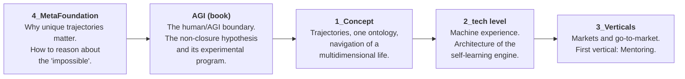
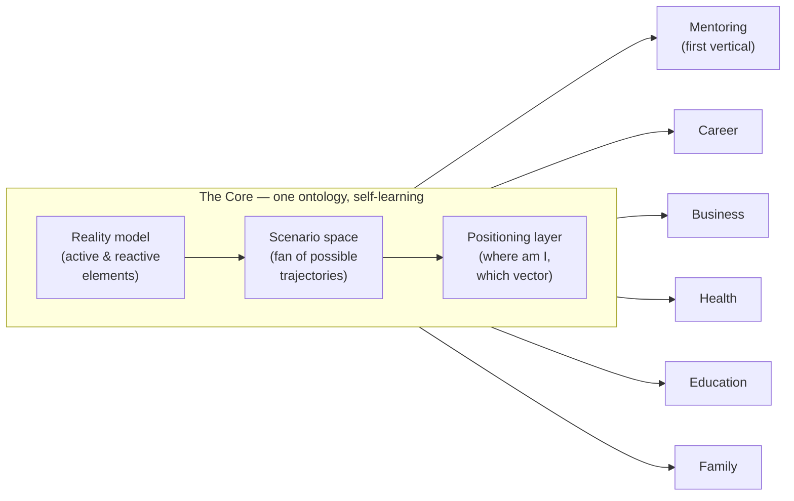
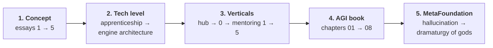

# Real AGI — Building Genuine AGI on Modern Technology

> A corpus of essays and book drafts by Alex Krol on building "real AGI": not a chat that answers questions, but a self-learning system that navigates a person along the trajectory of their life. From the metaphysical foundation — through concept and technology — to the market and a research program.

**Alex Krol** — strategy, AI, growth infrastructure

[](https://github.com/alexeykrol/real-agi)
[](https://alexeykrol.com)
[](https://www.linkedin.com/in/alexkrol/)
[](https://github.com/alexeykrol)
[](https://alexeykrol.com)

> © 2026 Alex Krol. All rights reserved. Republication, redistribution, or commercial use only with the author's explicit written permission.

> **🌐 Language:** **English** (this page) · [**Русская версия →** `README_RU.md`](README_RU.md)

**Languages:** the primary language of the corpus is **American English** (`Eng/`). The Russian originals live in `Ru/` with an identical folder structure; every document cross-links to its counterpart in the other language.

---

## 1. What This Project Is

### What it creates

This is not a code repository — it is a **design bureau on paper**: a coherent system of texts that designs a personal AGI navigator and the business around it. The corpus consists of five layers, each answering its own question:

| Layer | Question | Location |
|---|---|---|
| Concept | What are we building? | `Eng/1_Concept/` |
| Technology | How does it work, and where does the defensible value sit? | `Eng/2_tech level/` |
| Market | Who is it sold to, and how? | `Eng/3_Verticals/` |
| Research frame | Where is the human/AGI boundary, and how can it be tested? | `Eng/AGI/` |
| Meta-foundation | Why is a unique life trajectory the ultimate value, and how should one reason about the "impossible"? | `Eng/4_MetaFoundation/` |



### The central idea (in one paragraph)

The unit of intelligence is not an **inference** (a "query → answer" pair, an artifact of memoryless LLMs) but a **trajectory** — an episode of life with memory and consequences. Real AGI is therefore not an answering machine but a **navigator**: a system with a single core (reality model → scenario space → positioning layer) that models the multidimensional space of a person's life (career, health, family, money…), builds a fan of scenarios, and helps hold a productive vector. The core is one; the markets ("verticals") are interchangeable — the first vertical is mentoring. The system learns the way an apprentice learns from a master: from the **labeled consequences** of its own decisions, not from texts. The single deterministic point of the entire construction is the fitness function: **"a win = the client's flourishing."**



### What problems it solves

- **The atom problem.** The LLM industry optimizes the quality of an answer; a person's life outcome is determined by the quality of a trajectory. The project changes the unit of optimization.
- **The one-dimensional-assistant problem.** A strong career move that wrecks health and family is invisible to an assistant living inside a single vertical. A navigator across all axes at once is required.
- **The experience-transfer problem.** Experts withhold what matters most not out of greed — tacit knowledge cannot be transferred as text. The machine analog of apprenticeship: a closed loop of "situation → decision → outcome → correction."
- **The moat problem.** Everything computable (prompts, models, methodology) gets distilled into a commodity. The defensible value is the living stream of trusted relationships and a proprietary ontology of growth.
- **The human/AGI boundary problem.** Where does a human hold a durable advantage over AGI — and how can this metaphysical question be turned into a cheap, testable experiment?

---

## 2. Folder Structure

```
real-agi/
├── Eng/                  ← PRIMARY language (American English)
│   ├── 1_Concept/        "Trajectories" series — conceptual core (5 essays; 1–2 in corrected game/drama versions)
│   ├── 2_tech level/     Technology level (2 essays)
│   ├── 3_Verticals/      Markets & go-to-market (portfolio of 22 project folders)
│   ├── 4_MetaFoundation/ Philosophical & epistemological foundation (2 texts)
│   └── AGI/              Book on the human/AGI boundary (intro + 8 chapters)
├── Ru/                   ← Russian originals, identical structure
└── README.md
```

### `Eng/1_Concept/` — the "Trajectories" series (conceptual core)

Five numbered essays, each building on the previous one:

1. **[`1_from-inferences-to-trajectories.variant-game-drama.md`](Eng/1_Concept/1_from-inferences-to-trajectories.variant-game-drama.md)** — changing the atom: trajectory instead of inference; four-layer memory; the core triad (reality model → scenario space → positioning layer).
2. **[`2_one-ontology-many-verticals.variant-game-drama.md`](Eng/1_Concept/2_one-ontology-many-verticals.variant-game-drama.md)** — one core describes any sphere of life (career, war, medicine, education…); a vertical = swappable domain specifics, not a separate AI.
3. **[`3_multidimensional-life-drift.md`](Eng/1_Concept/3_multidimensional-life-drift.md)** — the conceptual center of the series: verticals are axes of one multidimensional space; the person is a point; the goal is a cone of admissible states; the form is a personal analytical center (the "Guardian").
4. **[`4_personal-agi-osint-go-to-market.md`](Eng/1_Concept/4_personal-agi-osint-go-to-market.md)** — the first market (the UHNW segment), the "first dose" model, data from OSINT and the digital footprint, ethics as a condition of the deal.
5. **[`5_two-levels-and-group-dynamics.md`](Eng/1_Concept/5_two-levels-and-group-dynamics.md)** — the finale: operational actions vs. meta-actions ("changing the world — changing the player"); navigating a group as a collective subject.

Essays 1 and 2 carry a `.variant-game-drama.md` suffix for historical reasons: they render the ontology in two *existing, codified* professional languages — **game design** (how movement through a world of rules and obstacles actually works; the discipline built to keep a player from quitting at the obstacle — which is exactly this project's single decisive factor) and **dramaturgy** (what the movement changes in the subject: arc, stakes, turning point). Earlier versions built the same argument on a private *maritime* metaphor that quietly became a load-bearing layer adding no understanding; they have been removed (essay 2 §2 explains why).

### `Eng/2_tech level/` — the technology level

- **[`from-apprenticeship-to-machine-experience.md`](Eng/2_tech%20level/from-apprenticeship-to-machine-experience.md)** — *why*: mastery cannot be transferred as text; four levels of AI systems; self-learning arises from labeled consequences, not from data; `Knowledge < Experience < Evolving Experience`.
- **[`mentoring-engine-architecture.md`](Eng/2_tech%20level/mentoring-engine-architecture.md)** — *how*: a two-level system of "self-learning core + mortal verticals"; what can be distilled and what cannot (stock vs. flow); the fitness function "a win = the client's flourishing." *(Private register — part 3 of the Mentoring trilogy.)*

### `Eng/3_Verticals/` — markets and the portfolio

This section is organized as a **portfolio of project folders** — one folder per real project, each with a product description — read backward as the inductive proof of the architecture (the same engine recurring across very different markets; the core found to already exist, but in pieces). One top-level document sits alongside the folders:

- **[`README.md`](Eng/3_Verticals/README.md)** — *the architecture, confirmed in practice*: the section hub. A backward reading of ~100 working code projects, the utility → pipeline → agent → vertical ladder, the "core exists in pieces" finding, and the full catalog with an honest stage for each project.
The 22 project folders, each with its own product description (the groupings are reading lenses, not rigid categories):

- **Verticals that lead a person to a goal** — [mentoring](Eng/3_Verticals/mentoring/README.md) (also holds the corpus's deepest concept essays and the partner frame [`0_ideal-client-trillion-market`](Eng/3_Verticals/mentoring/0_ideal-client-trillion-market.md)) · [founder-pipeline](Eng/3_Verticals/founder-pipeline/README.md) · [ai-video-pipeline](Eng/3_Verticals/ai-video-pipeline/README.md) · [saved-downloader](Eng/3_Verticals/saved-downloader/README.md) · [tracking](Eng/3_Verticals/tracking/README.md) · [ai-test01](Eng/3_Verticals/ai-test01/README.md)
- **Organizational AI transformation** — [questions](Eng/3_Verticals/questions/README.md) · [fastbank](Eng/3_Verticals/fastbank/README.md)
- **The core engine, in pieces** — [maas](Eng/3_Verticals/maas/README.md) · [essays-claude](Eng/3_Verticals/essays-claude/README.md) · [autonomy-hub](Eng/3_Verticals/autonomy-hub/README.md) · [expert-constructor-core](Eng/3_Verticals/expert-constructor-core/README.md) · [synthetic-traffic-console](Eng/3_Verticals/synthetic-traffic-console/README.md)
- **Creator / expert-economy production** — [course-producer](Eng/3_Verticals/course-producer/README.md) · [course-distributor](Eng/3_Verticals/course-distributor/README.md) · [news](Eng/3_Verticals/news/README.md) · [ai-support-chat-plugin](Eng/3_Verticals/ai-support-chat-plugin/README.md) · [simple-cutter](Eng/3_Verticals/simple-cutter/README.md)
- **Content & knowledge bases** — [agibook](Eng/3_Verticals/agibook/README.md) · [aibook](Eng/3_Verticals/aibook/README.md) · [ontology](Eng/3_Verticals/ontology/README.md) · [strategy](Eng/3_Verticals/strategy/README.md)

### `Eng/4_MetaFoundation/` — the foundation

- **[`hallucination-as-filter.md`](Eng/4_MetaFoundation/hallucination-as-filter.md)** — epistemology: "hallucination" is an observer's judgment, not a property of the signal; the main filter of knowledge is logistical, not epistemological; AI for the first time unburdens the pre-test stage of science.
- **[`01-dramaturgia-bogov.md`](Eng/4_MetaFoundation/01-dramaturgia-bogov.md)** — metaphysics (a chapter of a book on simulation): the world as a stage for restoring scarcity and novelty; a life as a unique "playthrough" — hence the ultimate value of a trajectory.

### `Eng/AGI/` — the book on the human/AGI boundary

A coherent book draft (introduction + 8 chapters) that grew out of the author's dialogue with an AI. The arc: "where does a human keep an advantage over AGI" → demolition of the humanist consolations → the hypothesis that human intelligence is computationally non-closed → an experimental program to test it.

| Chapter | File | Subject |
|---|---|---|
| Intro + 1 | [`01-iphone.md`](Eng/AGI/01-iphone.md) | The craftsmanship trap: the market rewards automation |
| 2 | [`02-agi-not-llm.md`](Eng/AGI/02-agi-not-llm.md) | A working definition of AGI (not LLM): functional, no metaphysics |
| 3 | [`03-snos-ubezhish.md`](Eng/AGI/03-snos-ubezhish.md) | Demolishing the seven "humanist sanctuaries": everything human is a function |
| 4 | [`04-paradoks-intellekta.md`](Eng/AGI/04-paradoks-intellekta.md) | The paradox of intelligence; insight as a catastrophe under context insufficiency |
| 5 | [`05-podkluchennost.md`](Eng/AGI/05-podkluchennost.md) | The connectedness hypothesis: the non-closure of human intelligence |
| 6 | [`06-fizika-realnosti.md`](Eng/AGI/06-fizika-realnosti.md) | "The wrong physics": computation is a historical frame, not the nature of reality |
| 7 | [`07-pipeline-otbora-ontologij.md`](Eng/AGI/07-pipeline-otbora-ontologij.md) | The 11-link pipeline: a machine for selecting ontologies |
| 8 | [`08-mashina-ontologicheskogo-poiska.md`](Eng/AGI/08-mashina-ontologicheskogo-poiska.md) | The experimental rig: LLM hallucinations as ontological mutants |

---

## 3. Reading Order

### Quick start (3 texts, ~2 hours)

1. [`Eng/1_Concept/1_from-inferences-to-trajectories.variant-game-drama.md`](Eng/1_Concept/1_from-inferences-to-trajectories.variant-game-drama.md) — the atom of the whole construction.
2. [`Eng/1_Concept/3_multidimensional-life-drift.md`](Eng/1_Concept/3_multidimensional-life-drift.md) — what is ultimately being built.
3. [`Eng/2_tech level/from-apprenticeship-to-machine-experience.md`](Eng/2_tech%20level/from-apprenticeship-to-machine-experience.md) — why it is technically possible.

### Full route (recommended)

The layers are read from concept to foundation — each subsequent layer explains the previous one at greater depth:



1. **Concept:** `Eng/1_Concept/` — essays 1 → 2 → 3 → 4 → 5; essays 1 and 2 are the `.variant-game-drama` files (game design + dramaturgy, with game design as the center; the earlier maritime versions have been removed).
2. **Technology:** `Eng/2_tech level/` — `from-apprenticeship...` → `mentoring-engine-architecture`.
3. **Market:** `Eng/3_Verticals/` — section hub (`README.md`) → `mentoring/0_ideal-client...` → the mentoring essays (`mentoring/1` → `2` → `3` → `4` → `5`).
4. **Research frame:** `Eng/AGI/` — chapters 01 → 08 strictly in order (it is a book).
5. **Foundation:** `Eng/4_MetaFoundation/` — `hallucination-as-filter` → `01-dramaturgia-bogov`.

### Routes by role

- **Partner / investor:** `3_Verticals/mentoring/0_ideal-client...` → `1_Concept/4_personal-agi-osint...` → `mentoring/1_state-corruption-collapse` → the Mentoring trilogy (`mentoring/2`, `mentoring/3`, `2_tech level/mentoring-engine-architecture`).
- **Engineer / AI architect:** `1_Concept/1` → `1_Concept/2` → `1_Concept/3` → `2_tech level/` (both) → `AGI/07` → `AGI/08`.
- **Philosophically minded reader:** `Eng/AGI/` 01 → 08 → `4_MetaFoundation/` (both) → `1_Concept/3`.
- **General reader (public texts):** `mentoring/5_synergy-of-conversations` → `mentoring/4_real-estate-ai-collapse` → `2_tech level/from-apprenticeship...` → `4_MetaFoundation/hallucination-as-filter`.

---

## 4. Prompt for AI

Copy the prompt below so that an AI assistant absorbs the essence of the project and works inside its system of concepts:

```text
You are studying the Real AGI project — a corpus of essays by Alex Krol that designs
"real AGI": a personal navigator of life trajectories and the business around it.

READ the files in this order. Essays 1 and 2 are the *.variant-game-drama.md
files — they render the ontology in game design + dramaturgy (the earlier
maritime-metaphor versions have been removed). (Russian originals of every
document live in Ru/ under identical paths.)

1. Eng/1_Concept/1_from-inferences-to-trajectories.variant-game-drama.md
2. Eng/1_Concept/2_one-ontology-many-verticals.variant-game-drama.md
3. Eng/1_Concept/3_multidimensional-life-drift.md
4. Eng/1_Concept/4_personal-agi-osint-go-to-market.md
5. Eng/1_Concept/5_two-levels-and-group-dynamics.md
6. Eng/2_tech level/from-apprenticeship-to-machine-experience.md
7. Eng/2_tech level/mentoring-engine-architecture.md
8. Eng/3_Verticals/mentoring/0_ideal-client-trillion-market.md
9. Eng/3_Verticals/mentoring/1_state-corruption-collapse.md
10. Eng/3_Verticals/mentoring/2_mentoring-power-meritocracy.md
11. Eng/3_Verticals/mentoring/3_mentoring-launch-strategy.md
12. Eng/AGI/01..08 (in order — these are chapters of one book)
13. Eng/4_MetaFoundation/hallucination-as-filter.md
14. Eng/4_MetaFoundation/01-dramaturgia-bogov.md

AS YOU READ, build a map of the project around these load-bearing constructions:
- The atom: a TRAJECTORY (an episode of life with memory and consequences), not a
  "query → answer" inference.
- The core (a triad, order invariant): reality model → scenario space → positioning
  layer. The goal is a productive vector in a fan of scenarios, not the best step.
- One ontology, many VERTICALS: one core; spheres of life / markets are swappable
  domain specifics.
- The multidimensional space of life: verticals are axes, the person is a point, the
  goal is a cone of admissible states; the input is behavior-as-signal ("a signal for
  navigation, not for judgment").
- Machine experience: self-learning from LABELED CONSEQUENCES (situation → decision →
  outcome → correction), not from texts; Knowledge < Experience < Evolving Experience.
- Business architecture: a self-learning core + mortal verticals; the moat is the
  living stream of relationships and a proprietary ontology of growth (everything
  computable gets distilled).
- The invariant of the whole system: the fitness function "A WIN = THE CLIENT'S
  FLOURISHING."
- The single decisive factor behind that flourishing: the capacity to NOT QUIT and to
  re-route creatively through blockers (most blockers are creativity failures, not
  walls). The default behavior of both people and agents is to quit; the system is, at
  bottom, an anti-quitting engine. GAME DESIGN is the center here — the most mature
  applied science of keeping someone engaged through difficulty (its commercial telos,
  retention, equals this project's win factor); it moves a person from "easy fun" to
  "hard fun," i.e. rewires reward so persistence becomes intrinsic, not willpower.
  DRAMATURGY is the amplifier (the meaning and arc of that change).
- The AGI frame: AGI ≠ LLM (a functional definition); the hypothesis — human
  intelligence is computationally NON-CLOSED (insight under context insufficiency,
  connectedness); the test — the ontological search machine (LLM hallucinations as
  mutations + a physical selection criterion).
- The foundation: the value of a unique trajectory (the dramaturgy of gods);
  "impossible" often means "no resources to verify" (hallucination as filter).

RULES FOR WORKING WITH THE CORPUS:
- Use the project's terminology precisely; terms are introduced in the essays'
  glossaries with a note on which essay "owns" them.
- Distinguish status (approved/draft) and register (public / private-core "not for
  publication"). Do not retell the content of private-core documents externally.
- The author systematically marks "fact vs. my hypothesis vs. speculation" — preserve
  this marking; do not present bets as proven.
- The 1_Concept series and the AGI book are coherent sequences: the essays reference
  one another and must not be read out of order.

AFTER READING, check yourself: (1) how does a trajectory differ from an inference, and
why is this a change of atom; (2) why are verticals not separate AIs; (3) what in the
system cannot be stolen through an API, and why; (4) what is the only deterministic
thing in the "amoral engine"; (5) what is the non-closure hypothesis, and how is it
proposed to be tested?
```

---

## 5. Statuses, Registers, Rights

- Documents carry YAML frontmatter with a status (`draft` / `approved`) and a register. Texts marked **private-core** ("not for open publication") are internal concept documents for the author and a trusted circle.
- Every English document links to its Russian original (and vice versa); the folder trees `Eng/` and `Ru/` are identical.
- All texts © Alex Krol. Distribution only with the author's written permission, unless stated otherwise in the document itself.
