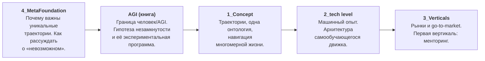
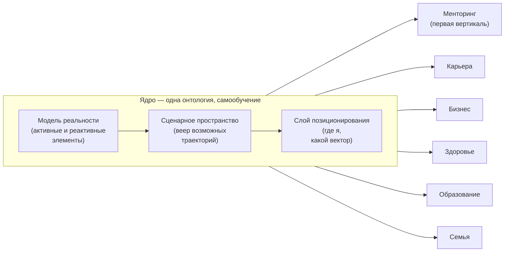
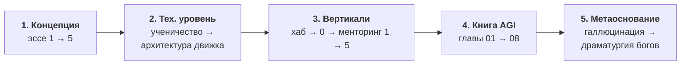

# Real AGI — строительство настоящего AGI на современных технологиях

> Корпус эссе и черновиков книг Алексея Крола о строительстве «настоящего AGI»: не чата, который отвечает на вопросы, а самообучающейся системы, которая ведёт человека по траектории его жизни. От метафизического основания — через концепцию и технологию — к рынку и исследовательской программе.

**Алексей Крол** — стратегия, ИИ, инфраструктура роста

[](https://github.com/alexeykrol/real-agi)
[](https://alexeykrol.com)
[](https://www.linkedin.com/in/alexkrol/)
[](https://github.com/alexeykrol)
[](https://alexeykrol.com)

> © 2026 Алексей Крол. Все права защищены. Републикация, распространение или коммерческое использование — только с явного письменного разрешения автора.

> **🌐 Язык:** [**English →** `README.md`](README.md) · **Русский** (эта страница)

**Языки:** основной язык корпуса — **американский английский** (`Eng/`). Русские оригиналы лежат в `Ru/` с идентичной структурой папок; каждый документ перекрёстно ссылается на свою версию на другом языке. Эта страница ведёт к русским оригиналам в `Ru/`.

---

## 1. Что это за проект

### Что он создаёт

Это не репозиторий кода — это **конструкторское бюро на бумаге**: связная система текстов, которая проектирует персональный AGI-навигатор и бизнес вокруг него. Корпус состоит из пяти слоёв, каждый отвечает на свой вопрос:

| Слой | Вопрос | Расположение |
|---|---|---|
| Концепция | Что мы строим? | `Ru/1_Concept/` |
| Технология | Как это работает и где сидит защищённая ценность? | `Ru/2_tech level/` |
| Рынок | Кому это продаётся и как? | `Ru/3_Verticals/` |
| Исследовательская рамка | Где проходит граница человек/AGI и как её проверить? | `Ru/AGI/` |
| Метаоснование | Почему уникальная траектория жизни — предельная ценность и как рассуждать о «невозможном»? | `Ru/4_MetaFoundation/` |



### Центральная идея (в одном абзаце)

Единица интеллекта — не **инференс** (пара «запрос → ответ», артефакт LLM без памяти), а **траектория** — эпизод жизни с памятью и последствиями. Поэтому Real AGI — не машина ответов, а **навигатор**: система с единым ядром (модель реальности → сценарное пространство → слой позиционирования), которая моделирует многомерное пространство жизни человека (карьера, здоровье, семья, деньги…), строит веер сценариев и помогает удерживать продуктивный вектор. Ядро одно; рынки («вертикали») сменны — первая вертикаль — менторинг. Система учится так, как ученик учится у мастера: на **размеченных последствиях** собственных решений, а не на текстах. Единственная детерминированная точка всей конструкции — фитнес-функция: **«победа = процветание клиента»**.



### Какие проблемы он решает

- **Проблема атома.** Индустрия LLM оптимизирует качество ответа; жизненный результат человека определяется качеством траектории. Проект меняет единицу оптимизации.
- **Проблема одномерного ассистента.** Сильный карьерный ход, который рушит здоровье и семью, невидим ассистенту, живущему внутри одной вертикали. Нужен навигатор сразу по всем осям.
- **Проблема передачи опыта.** Эксперты удерживают самое важное не из жадности — неявное знание нельзя передать текстом. Машинный аналог ученичества: замкнутый контур «ситуация → решение → результат → коррекция».
- **Проблема рва.** Всё вычислимое (промпты, модели, методология) дистиллируется в коммодити. Защищённая ценность — живой поток доверенных отношений и проприетарная онтология роста.
- **Проблема границы человек/AGI.** Где у человека сохраняется устойчивое преимущество над AGI — и как превратить этот метафизический вопрос в дешёвый, проверяемый эксперимент?

---

## 2. Структура папок

```
real-agi/
├── Ru/                   ← русские оригиналы (зеркальная структура)
│   ├── 1_Concept/        Серия «Траектории» — концептуальное ядро (5 эссе; 1–2 в исправленных версиях game/drama)
│   ├── 2_tech level/     Технологический уровень (2 эссе)
│   ├── 3_Verticals/      Рынки и go-to-market (портфель из 22 папок-проектов)
│   ├── 4_MetaFoundation/ Философско-эпистемологическое основание (2 текста)
│   └── AGI/              Книга о границе человек/AGI (введение + 8 глав)
├── Eng/                  ← основной язык (американский английский), идентичная структура
└── README.md
```

### `Ru/1_Concept/` — серия «Траектории» (концептуальное ядро)

Пять пронумерованных эссе, каждое опирается на предыдущее:

1. **[`1_from-inferences-to-trajectories.variant-game-drama.md`](Ru/1_Concept/1_from-inferences-to-trajectories.variant-game-drama.md)** — смена атома: траектория вместо инференса; четырёхслойная память; ядровая триада (модель реальности → сценарное пространство → слой позиционирования).
2. **[`2_one-ontology-many-verticals.variant-game-drama.md`](Ru/1_Concept/2_one-ontology-many-verticals.variant-game-drama.md)** — одно ядро описывает любую сферу жизни (карьера, война, медицина, образование…); вертикаль = сменная доменная специфика, а не отдельный ИИ.
3. **[`3_multidimensional-life-drift.md`](Ru/1_Concept/3_multidimensional-life-drift.md)** — концептуальный центр серии: вертикали — оси одного многомерного пространства; человек — точка; цель — конус допустимых состояний; форма — персональный аналитический центр («Хранитель»).
4. **[`4_personal-agi-osint-go-to-market.md`](Ru/1_Concept/4_personal-agi-osint-go-to-market.md)** — первый рынок (сегмент UHNW), модель «первой дозы», данные из OSINT и цифрового следа, этика как условие сделки.
5. **[`5_two-levels-and-group-dynamics.md`](Ru/1_Concept/5_two-levels-and-group-dynamics.md)** — финал: операционные действия против мета-действий («менять мир — менять игрока»); навигация группы как коллективного субъекта.

Эссе 1 и 2 носят суффикс `.variant-game-drama.md` по историческим причинам: они излагают онтологию на двух *существующих, кодифицированных* профессиональных языках — **гейм-дизайна** (как реально устроено движение через мир правил и препятствий; дисциплина, построенная на том, чтобы не дать игроку бросить на препятствии, — а это и есть единственный решающий фактор проекта) и **драматургии** (что движение меняет в субъекте: арка, ставки, поворотная точка). Более ранние версии строили тот же аргумент на личной *морской* метафоре, которая незаметно стала несущим слоем, не добавляя понимания; они удалены (почему — см. эссе 2, §2).

### `Ru/2_tech level/` — технологический уровень

- **[`from-apprenticeship-to-machine-experience.md`](Ru/2_tech%20level/from-apprenticeship-to-machine-experience.md)** — *почему*: мастерство нельзя передать текстом; четыре уровня ИИ-систем; самообучение возникает из размеченных последствий, а не из данных; `Знание < Опыт < Эволюционирующий опыт`.
- **[`mentoring-engine-architecture.md`](Ru/2_tech%20level/mentoring-engine-architecture.md)** — *как*: двухуровневая система «самообучающееся ядро + смертные вертикали»; что можно дистиллировать, а что нет (запас против потока); фитнес-функция «победа = процветание клиента». *(Приватный регистр — часть 3 трилогии о менторинге.)*

### `Ru/3_Verticals/` — рынки и портфель

Этот раздел устроен как **портфель папок-проектов** — одна папка на реальный проект, у каждой своё продуктовое описание — и читается задом наперёд как индуктивное доказательство архитектуры (один и тот же движок повторяется на дико разных рынках; ядро обнаруживается уже существующим, но по частям). Рядом с папками лежит один документ верхнего уровня:

- **[`README.md`](Ru/3_Verticals/README.md)** — *архитектура, подтверждённая практикой*: хаб раздела. Чтение ~100 рабочих кодовых проектов задом наперёд, лестница утилита → пайплайн → агент → вертикаль, находка «ядро существует по частям» и полный каталог с честной стадией каждого проекта.
22 папки-проекта, у каждой своё продуктовое описание (группировки — линзы для чтения, а не жёсткие категории):

- **Вертикали, которые ведут человека к цели** — [mentoring](Ru/3_Verticals/mentoring/README.md) (хранит и самые глубокие концептуальные эссе корпуса и партнёрскую рамку [`0_ideal-client-trillion-market`](Ru/3_Verticals/mentoring/0_ideal-client-trillion-market.md)) · [founder-pipeline](Ru/3_Verticals/founder-pipeline/README.md) · [ai-video-pipeline](Ru/3_Verticals/ai-video-pipeline/README.md) · [saved-downloader](Ru/3_Verticals/saved-downloader/README.md) · [tracking](Ru/3_Verticals/tracking/README.md) · [ai-test01](Ru/3_Verticals/ai-test01/README.md)
- **Организационная AI-трансформация** — [questions](Ru/3_Verticals/questions/README.md) · [fastbank](Ru/3_Verticals/fastbank/README.md)
- **Ядро-движок, по частям** — [maas](Ru/3_Verticals/maas/README.md) · [essays-claude](Ru/3_Verticals/essays-claude/README.md) · [autonomy-hub](Ru/3_Verticals/autonomy-hub/README.md) · [expert-constructor-core](Ru/3_Verticals/expert-constructor-core/README.md) · [synthetic-traffic-console](Ru/3_Verticals/synthetic-traffic-console/README.md)
- **Производство для creator / экономики экспертов** — [course-producer](Ru/3_Verticals/course-producer/README.md) · [course-distributor](Ru/3_Verticals/course-distributor/README.md) · [news](Ru/3_Verticals/news/README.md) · [ai-support-chat-plugin](Ru/3_Verticals/ai-support-chat-plugin/README.md) · [simple-cutter](Ru/3_Verticals/simple-cutter/README.md)
- **Контент и базы знаний** — [agibook](Ru/3_Verticals/agibook/README.md) · [aibook](Ru/3_Verticals/aibook/README.md) · [ontology](Ru/3_Verticals/ontology/README.md) · [strategy](Ru/3_Verticals/strategy/README.md)

### `Ru/4_MetaFoundation/` — основание

- **[`hallucination-as-filter.md`](Ru/4_MetaFoundation/hallucination-as-filter.md)** — эпистемология: «галлюцинация» — суждение наблюдателя, а не свойство сигнала; главный фильтр знания логистический, а не эпистемологический; ИИ впервые разгружает дотестовую стадию науки.
- **[`01-dramaturgia-bogov.md`](Ru/4_MetaFoundation/01-dramaturgia-bogov.md)** — метафизика (глава книги о симуляции): мир как сцена для восстановления дефицита и новизны; жизнь как уникальное «прохождение» — отсюда предельная ценность траектории.

### `Ru/AGI/` — книга о границе человек/AGI

Связный черновик книги (введение + 8 глав), выросший из диалога автора с ИИ. Дуга: «где у человека сохраняется преимущество над AGI» → снос гуманистических утешений → гипотеза, что человеческий интеллект вычислительно незамкнут → экспериментальная программа её проверки.

| Глава | Файл | Тема |
|---|---|---|
| Введение + 1 | [`01-iphone.md`](Ru/AGI/01-iphone.md) | Ловушка мастерства: рынок вознаграждает автоматизацию |
| 2 | [`02-agi-not-llm.md`](Ru/AGI/02-agi-not-llm.md) | Рабочее определение AGI (не LLM): функциональное, без метафизики |
| 3 | [`03-snos-ubezhish.md`](Ru/AGI/03-snos-ubezhish.md) | Снос семи «гуманистических убежищ»: всё человеческое — функция |
| 4 | [`04-paradoks-intellekta.md`](Ru/AGI/04-paradoks-intellekta.md) | Парадокс интеллекта; инсайт как катастрофа при дефиците контекста |
| 5 | [`05-podkluchennost.md`](Ru/AGI/05-podkluchennost.md) | Гипотеза подключённости: незамкнутость человеческого интеллекта |
| 6 | [`06-fizika-realnosti.md`](Ru/AGI/06-fizika-realnosti.md) | «Неправильная физика»: вычисление — исторический фрейм, а не природа реальности |
| 7 | [`07-pipeline-otbora-ontologij.md`](Ru/AGI/07-pipeline-otbora-ontologij.md) | Конвейер из 11 звеньев: машина отбора онтологий |
| 8 | [`08-mashina-ontologicheskogo-poiska.md`](Ru/AGI/08-mashina-ontologicheskogo-poiska.md) | Экспериментальный стенд: галлюцинации LLM как онтологические мутанты |

---

## 3. Порядок чтения

### Быстрый старт (3 текста, ~2 часа)

1. [`Ru/1_Concept/1_from-inferences-to-trajectories.variant-game-drama.md`](Ru/1_Concept/1_from-inferences-to-trajectories.variant-game-drama.md) — атом всей конструкции.
2. [`Ru/1_Concept/3_multidimensional-life-drift.md`](Ru/1_Concept/3_multidimensional-life-drift.md) — что в итоге строится.
3. [`Ru/2_tech level/from-apprenticeship-to-machine-experience.md`](Ru/2_tech%20level/from-apprenticeship-to-machine-experience.md) — почему это технически возможно.

### Полный маршрут (рекомендуется)

Слои читаются от концепции к основанию — каждый следующий слой объясняет предыдущий глубже:



1. **Концепция:** `Ru/1_Concept/` — эссе 1 → 2 → 3 → 4 → 5; эссе 1 и 2 — это файлы `.variant-game-drama` (гейм-дизайн + драматургия, гейм-дизайн как центр; более ранние морские версии удалены).
2. **Технология:** `Ru/2_tech level/` — `from-apprenticeship...` → `mentoring-engine-architecture`.
3. **Рынок:** `Ru/3_Verticals/` — хаб раздела (`README.md`) → `mentoring/0_ideal-client...` → эссе о менторинге (`mentoring/1` → `2` → `3` → `4` → `5`).
4. **Исследовательская рамка:** `Ru/AGI/` — главы 01 → 08 строго по порядку (это книга).
5. **Основание:** `Ru/4_MetaFoundation/` — `hallucination-as-filter` → `01-dramaturgia-bogov`.

### Маршруты по роли

- **Партнёр / инвестор:** `3_Verticals/mentoring/0_ideal-client...` → `1_Concept/4_personal-agi-osint...` → `mentoring/1_state-corruption-collapse` → трилогия о менторинге (`mentoring/2`, `mentoring/3`, `2_tech level/mentoring-engine-architecture`).
- **Инженер / AI-архитектор:** `1_Concept/1` → `1_Concept/2` → `1_Concept/3` → `2_tech level/` (оба) → `AGI/07` → `AGI/08`.
- **Философски настроенный читатель:** `Ru/AGI/` 01 → 08 → `4_MetaFoundation/` (оба) → `1_Concept/3`.
- **Широкий читатель (публичные тексты):** `mentoring/5_synergy-of-conversations` → `mentoring/4_real-estate-ai-collapse` → `2_tech level/from-apprenticeship...` → `4_MetaFoundation/hallucination-as-filter`.

---

## 4. Промпт для ИИ

Скопируйте промпт ниже, чтобы ИИ-ассистент впитал суть проекта и работал внутри его системы понятий:

```text
Ты изучаешь проект Real AGI — корпус эссе Алексея Крола, который проектирует
«настоящий AGI»: персональный навигатор жизненных траекторий и бизнес вокруг него.

ЧИТАЙ файлы в этом порядке. Эссе 1 и 2 — это файлы *.variant-game-drama.md —
они излагают онтологию на языке гейм-дизайна + драматургии (более ранние версии на
морской метафоре удалены). (Англоязычные версии каждого документа лежат в Eng/ по
идентичным путям.)

1. Ru/1_Concept/1_from-inferences-to-trajectories.variant-game-drama.md
2. Ru/1_Concept/2_one-ontology-many-verticals.variant-game-drama.md
3. Ru/1_Concept/3_multidimensional-life-drift.md
4. Ru/1_Concept/4_personal-agi-osint-go-to-market.md
5. Ru/1_Concept/5_two-levels-and-group-dynamics.md
6. Ru/2_tech level/from-apprenticeship-to-machine-experience.md
7. Ru/2_tech level/mentoring-engine-architecture.md
8. Ru/3_Verticals/mentoring/0_ideal-client-trillion-market.md
9. Ru/3_Verticals/mentoring/1_state-corruption-collapse.md
10. Ru/3_Verticals/mentoring/2_mentoring-power-meritocracy.md
11. Ru/3_Verticals/mentoring/3_mentoring-launch-strategy.md
12. Ru/AGI/01..08 (по порядку — это главы одной книги)
13. Ru/4_MetaFoundation/hallucination-as-filter.md
14. Ru/4_MetaFoundation/01-dramaturgia-bogov.md

ПО ХОДУ ЧТЕНИЯ строй карту проекта вокруг этих несущих конструкций:
- Атом: ТРАЕКТОРИЯ (эпизод жизни с памятью и последствиями), а не инференс
  «запрос → ответ».
- Ядро (триада, порядок инвариантен): модель реальности → сценарное пространство →
  слой позиционирования. Цель — продуктивный вектор в веере сценариев, а не лучший шаг.
- Одна онтология, много ВЕРТИКАЛЕЙ: ядро одно; сферы жизни / рынки — сменная
  доменная специфика.
- Многомерное пространство жизни: вертикали — оси, человек — точка, цель — конус
  допустимых состояний; вход — поведение-как-сигнал («сигнал для навигации, а не для
  суждения»).
- Машинный опыт: самообучение на РАЗМЕЧЕННЫХ ПОСЛЕДСТВИЯХ (ситуация → решение →
  результат → коррекция), а не на текстах; Знание < Опыт < Эволюционирующий опыт.
- Бизнес-архитектура: самообучающееся ядро + смертные вертикали; ров — живой поток
  отношений и проприетарная онтология роста (всё вычислимое дистиллируется).
- Инвариант всей системы: фитнес-функция «ПОБЕДА = ПРОЦВЕТАНИЕ КЛИЕНТА».
- Единственный решающий фактор этого процветания: способность НЕ БРОСАТЬ и креативно
  переобходить блокеры (большинство блокеров — сбой креативности, а не стена). Дефолтное
  поведение и людей, и агентов — бросать; система в основе своей — анти-бросательный
  движок. ГЕЙМ-ДИЗАЙН здесь центр — самая зрелая прикладная наука удержания человека
  в усилии через трудность (его коммерческий telos, retention, равен фактору победы
  проекта); он переводит человека из «easy fun» в «hard fun», то есть перепрошивает
  награду так, что упорство становится внутренним, а не волевым. ДРАМАТУРГИЯ — усилитель
  (смысл и арка этого изменения).
- Рамка AGI: AGI ≠ LLM (функциональное определение); гипотеза — человеческий
  интеллект вычислительно НЕЗАМКНУТ (инсайт при дефиците контекста, подключённость);
  тест — машина онтологического поиска (галлюцинации LLM как мутации + физический
  критерий отбора).
- Основание: ценность уникальной траектории (драматургия богов); «невозможное» часто
  означает «нет ресурсов проверить» (галлюцинация как фильтр).

ПРАВИЛА РАБОТЫ С КОРПУСОМ:
- Используй терминологию проекта точно; термины вводятся в глоссариях эссе с пометкой,
  какое эссе «владеет» каждым из них.
- Различай статус (approved/draft) и регистр (публичный / private-core «не для
  публикации»). Не пересказывай содержание private-core документов вовне.
- Автор систематически размечает «факт vs. моя гипотеза vs. спекуляция» — сохраняй эту
  разметку; не выдавай ставки за доказанное.
- Серия 1_Concept и книга AGI — связные последовательности: эссе ссылаются друг на
  друга и не должны читаться вне порядка.

ПОСЛЕ ЧТЕНИЯ проверь себя: (1) чем траектория отличается от инференса и почему это
смена атома; (2) почему вертикали — не отдельные ИИ; (3) что в системе нельзя украсть
через API и почему; (4) что единственное детерминированное в «аморальном движке»;
(5) что такое гипотеза незамкнутости и как её предлагается проверить?
```

---

## 5. Статусы, регистры, права

- Документы несут YAML-frontmatter со статусом (`draft` / `approved`) и регистром. Тексты с пометкой **private-core** («не для открытой публикации») — внутренние концептуальные документы для автора и доверенного круга.
- Каждый русский документ ссылается на свою английскую версию (и наоборот); деревья папок `Ru/` и `Eng/` идентичны.
- Все тексты © Алексей Крол. Распространение — только с письменного разрешения автора, если в самом документе не указано иное.
