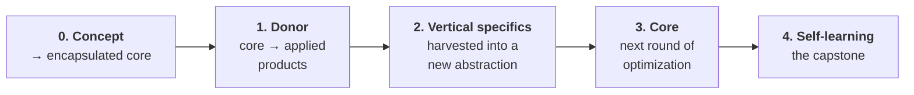

# Roadmap — From Concept to a Self-Learning Core

> **🌐 Language:** **English** (this page) · [**Русская версия →** `ROADMAP_RU.md`](ROADMAP_RU.md)

> **Status:** a working conception, not a commitment. This is the current conceptual sequence — the order that seems reasonable from where the architecture stands today. It is for orientation, not a schedule; nothing in the corpus depends on it, and it may change.

The `3_Verticals/` section reads the architecture **backward**, as inductive proof: the same engine, found to already exist *in pieces* across ~100 real working projects. This roadmap reads the same architecture **forward**: how that core, once pulled out and encapsulated, propagates — and what it culminates in.

---

## Stage 0 — Concept → an encapsulated core *(done / ongoing)*

The conceptual layer (this corpus) has done its real job: it let the core be pulled out of the texts and **encapsulated as a standalone engine** (`expert-constructor-core` — the project the `3_Verticals/` section already lists under "the core engine, in pieces"). The deliverable of the concept was never a document. It was an ontology clean enough that the core could become code.

## Stage 1 — The core as a donor to applied products *(current)*

The encapsulated core becomes a **donor** to a fan of already-applied products — each a real vertical with real users: [founder-pipeline](Eng/3_Verticals/founder-pipeline/README.md), [course-producer](Eng/3_Verticals/course-producer/README.md), [course-distributor](Eng/3_Verticals/course-distributor/README.md), [ai-support-chat-plugin](Eng/3_Verticals/ai-support-chat-plugin/README.md), [ai-video-pipeline](Eng/3_Verticals/ai-video-pipeline/README.md), [saved-downloader](Eng/3_Verticals/saved-downloader/README.md), [agibook](Eng/3_Verticals/agibook/README.md), [aibook](Eng/3_Verticals/aibook/README.md), and others.

The task is to bring each to a **product state** and embed the core, so the architecture is realized in each one **to exactly the degree that product needs** — no more, no less. Value lives here, in the real products; the core is a concept that serves them.

## Stage 2 — Vertical specifics, harvested into a new abstraction

Across these real products the specifics of each vertical become visible **empirically**. They are **signal, not noise**. The donor relationship is **two-way**: the core feeds the products, and the products' specifics flow **back** and enrich the core. Once a specific recurs across products, it is lifted into a new layer of abstraction — "vertical specifics."

Abstraction is **harvested bottom-up**, after a pattern has earned it — never designed top-down in advance. There is no fight to keep the core "clean" for its own sake: the rare-but-significant specific is exactly where the next abstraction is hiding. (This is the same discipline as the project's treatment of an LLM as an unreliable component: statistics is a signal, not a law; the tail is decided by judgment, and the rare-but-significant survives rather than being cut for being a "special case.")

## Stage 3 — Optimization of the core

With the donor relationship proven across verticals and the specifics layer in place, the core itself gets its next, deeper round of optimization — now informed by everything the real products fed back into it.

## Stage 4 — A self-learning system *(the capstone)*

Last, and only once the core and the verticals already work: the system's **own self-learning** — learning from the *labeled consequences* of its decisions (situation → decision → outcome → correction), not from texts. It is the hardest and most failure-prone component, and it is deferred **deliberately**, so that it lands on a substrate that already exists — a working core, live verticals, and the real usage they have been accumulating all along — rather than being engineered first, in a vacuum.

This is the point at which "real AGI" in the sense of the corpus — a self-learning navigator, not an answering machine — actually begins.

---

## The principles behind the order

- **Value is in the real products.** The core is a concept; the money and the proof are in the verticals it serves.
- **Specifics are signal, not noise.** The donor relationship runs both ways — the specifics of real verticals flow back and enrich the core.
- **Abstraction is harvested, not designed.** A layer is extracted only after its pattern recurs across real projects — never assumed up front.
- **The hardest component is the capstone.** Self-learning is landed last, on a working base — not built first, as the foundation.

---

*See [`Eng/3_Verticals/README.md`](Eng/3_Verticals/README.md) for the backward (inductive) view of the same architecture: the core, found to already exist in pieces across the portfolio of real projects.*

*© 2026 Alex Krol. A working document; no rights are asserted beyond those in the main [`README.md`](README.md).*
