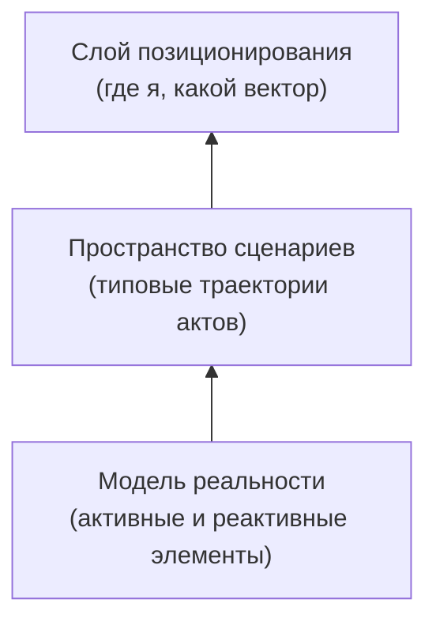

# 1. От инференсов к траекториям: память, веер сценариев, модель реальности

> **Вытеснено — ранняя версия.** Это эссе строит аргумент через личную морскую метафору (острова / ветра / корабли), ставшую несущим слоем. Исправленная, основная версия — [`1_from-inferences-to-trajectories.variant-game-drama.md`](1_from-inferences-to-trajectories.variant-game-drama.md): та же онтология на кодифицированных профессиональных языках гейм-дизайна и драматургии. Почему — см. §2 варианта эссе 2. Оставлено только для справки.

**Приватный документ. Не для открытой публикации.** Это первое из пяти эссе серии «Траектории» и её фундамент. Здесь я не строю мостик к чужой интуиции и не убеждаю с нуля — я фиксирую для себя и узкого круга свою ставку на то, чем является интеллект, если перестать мыслить его парами «запрос → ответ». Дальше вся серия стоит на этом основании.

**Alex Krol** — стратегия, AI, инфраструктура роста

> 🇬🇧 **English version:** [Eng/1_Concept/1_from-inferences-to-trajectories.md](../../Eng/1_Concept/1_from-inferences-to-trajectories.md)

> © 2026 Alex Krol. Приватный концептуальный документ серии «Траектории». Не для открытой публикации; распространение, цитирование и перевод — только с письменного согласия автора.

## Оглавление

0. [TL;DR — вся ставка на одной странице](#tldr)
1. [Инференс — артефакт беспамятных моделей](#1-inference)
2. [Траектория как новая единица](#2-trajectory)
3. [Не ответ, а позиция и вектор в веере сценариев](#3-vector)
4. [Локальный шаг против продуктивного вектора](#4-train)
5. [Пространство сценариев и модель реальности](#5-reality)
6. [Финал: рождается навигация](#6-navigation)
7. [Глоссарий](#glossary)

---

## 0. TL;DR — вся ставка на одной странице 

Моя ставка укладывается в одну смену атома. Единица интеллекта — не ответ, а траектория. Не «дай хороший ответ на запрос», а «займи продуктивную позицию в пространстве возможного и двигайся в нужную сторону».

Сегодня почти весь стек мыслит инференсами — парами «запрос → ответ». Это не природа интеллекта, а форма беспамятной модели: пришёл запрос, собрали промпт, получили ответ, всё забыли. Удобно для бизнеса на вызовах API, смертельно для идеи живого организма. Я меняю атом с «вызов модели» на «эпизод жизни организма» — траекторию, в которой агент планирует, действует, наблюдает, корректирует курс и накапливает опыт. Условие осмысленности такого эпизода — долгая многослойная память, а не длинный контекст.

Дальше меняется критерий. Я оптимизирую не локальную точность шага, а вектор: куда движется система в веере сценариев, в какую сторону смещается, какие ветки открывает и закрывает. Это ближе к управлению портфелем, чем к подбору удачной формулировки. Локальная ошибка не страшна, если поезд идёт в нужную сторону; идеальный шаг бесполезен, если вектор выбран неудачно. Дейтрейдинг против инвестирования.

Чтобы порождать сам веер сценариев, в ядре нужна явная модель реальности. Я строю её через активные и реактивные элементы: активные порождают воздействие, реактивные меняют состояние в ответ. Сценарий — цепочка таких актов. Пространство сценариев — множество типовых траекторий поверх этой модели. На этой конструкции — модель реальности, пространство сценариев, слой позиционирования — стоит вся серия. Дальше я разворачиваю каждый слой.

---

## 1. Инференс — артефакт беспамятных моделей 

Сегодня почти все мыслят интеллект инференсами — парами «запрос → ответ». Эта форма кажется такой естественной, что её перестали замечать. А она не природа интеллекта. Она отпечаток конкретной инженерной конструкции — трансформера с контекстным окном и без состояния между вызовами.

Трансформер ввёл механизм внимания и фиксированное контекстное окно: модель смотрит на поданный ей текст и выдаёт продолжение[^1]. У этой архитектуры нет рекуррентного состояния, которое переживало бы вызов. Каждый запуск начинается с чистого листа: всё, что модель «знает» в момент работы, — это то, что уместилось в окно прямо сейчас. Между двумя вызовами она ничего не помнит. Я называю это *stateless* — без сохранения состояния. Это не дефект и не временное ограничение реализации, а способ применения архитектуры: модель — функция, которая берёт вход и возвращает выход, ничего не унося с собой.

Из этого свойства и выросла вся индустрия инференса. Почти каждый стек устроен как обёртка над одним вызовом: пришёл запрос, собрали промпт, дёрнули модель, получили ответ, забыли. Удобно: вызов изолирован, его легко считать, продавать поштучно, масштабировать горизонтально. Бизнес на API любит беспамятность — она превращает интеллект в счётчик токенов. Но ровно эта беспамятность убивает идею живого организма ещё до того, как она родилась. Организм, который забывает всё после каждого действия, — не организм. Это калькулятор с хорошим словарным запасом.

Когда я смотрю на сегодняшний стек, я вижу не интеллект, а очень способную функцию без биографии. Она умеет блестяще ответить на любой отдельный вопрос и не умеет ничего, что требует продолжения во времени: накапливать опыт, узнавать ситуацию по второму разу, учиться на собственных исходах, держать курс через серию шагов. Слой «агентов» поверх этой функции чаще всего остаётся косметикой. Под капотом тот же беспамятный вызов, обёрнутый в цикл, который имитирует непрерывность, подкладывая в окно куски прошлого. Имитация работает, пока траектория короткая, и рассыпается, как только эпизод становится длинным или важным.

Я ставлю диагноз прямо: мышление инференсами — наследие беспамятных моделей, а не форма, которую интеллект выбрал бы сам. Пара «запрос → ответ» удобна как единица биллинга и вредна как единица проектирования. Если я хочу строить не умную ручку API, а нечто, что живёт во времени, мне нужно сменить сам атом. Этим я и занимаюсь дальше.

---

## 2. Траектория как новая единица 

Я меняю атом. Не «вызов модели», а эпизод жизни организма. Не точка «запрос → ответ», а отрезок времени, на котором что-то происходит: агент планирует, делает несколько действий, собирает наблюдения, ошибается, корректирует курс, что-то откладывает в память. Я называю этот отрезок траекторией.

Сдвиг кажется небольшим, но он перестраивает всё. Как только базовой сущностью становится не инференс, а траектория, появляется ось времени, которой у беспамятной модели нет в принципе. Вдоль этой оси можно сравнивать: одна траектория привела к результату, другая упёрлась в стену. Можно отбирать удачные ходы и выбраковывать тупиковые. Можно учить систему не «давать лучший ответ на этот вход», а «проходить сценарий лучше, чем в прошлый раз». Важен становится не только финал, но и путь: какие решения принимались, что агент увидел, где свернул не туда, что добавил в память. Финальный ответ — лишь последняя точка отрезка, и далеко не всегда самая важная.

Формулировка задачи меняется вместе с атомом. Вместо «сделай мне ответ» — «пройди сценарий взаимодействия с системой, пользователем или рынком и обнови своё внутреннее состояние». Это уже язык организма, а не функции. Организм не отвечает на стимул и не забывает его; он действует, опираясь на всю свою историю, и выходит из эпизода другим, чем вошёл.

Здесь и проходит граница, которую легко не заметить. Условие осмысленности траектории — не длинный контекст, а долгая многослойная память. Это разные вещи. Длинный контекст — это просто большое окно, в которое можно затолкать больше текста за один вызов; он всё равно обнуляется в конце. Память — это структура, которая переживает вызовы и копится между эпизодами. Без неё траектория иллюзорна: внешне агент проходит длинный путь, а внутри по-прежнему стартует с чистого листа на каждом шаге.

Память, которая делает траекторию реальной, я мыслю как несколько слоёв с разным временем жизни. Сессионная, краткосрочная — всё внутри одной задачи или диалога, то, что нужно прямо сейчас и уйдёт по завершении. Эпизодическая — истории конкретных сценариев: кейсы, проекты, сделки, прожитые от начала до конца, со своими исходами. Семантическая — выжимка фактов, паттернов и предпочтений, оторванная от конкретного эпизода: что вообще верно про этот домен, этого пользователя, этот тип ситуаций. И верхний слой — инсайты: агрегированные уроки, выведенные из множества эпизодов и читаемые при каждом новом запуске. Не «что случилось в кейсе номер 47», а «с этим типом ситуаций так не поступай». Деление на эти четыре слоя — моё, под мою задачу; академический ландшафт описывает память агентов иначе и шире[^8], но логика везде одна: внешнее долговременное хранилище плюс механизм выборки релевантных кусков в окно перед каждым шагом.

Современные агенты с памятью строятся примерно так и уже похожи на организм заметно сильнее, чем голый вызов. Иерархическая память, где быстрый слой работает с медленным по аналогии с памятью операционной системы, — рабочая инженерная схема[^2]. Поток наблюдений, который периодически сворачивается в рефлексию и питает планирование, — рабочий способ получить тот самый верхний слой выжатых уроков[^3]. Я не выдаю эти работы за подтверждение именно моей четырёхслойной схемы — слои я нарезаю под себя. Я опираюсь на установленное: память, переживающая вызовы, превращает реагирующую функцию в действующий организм. А организму нужна уже не лучшая реплика. Ему нужно понимать, куда он движется.

---

## 3. Не ответ, а позиция и вектор в веере сценариев 

Как только единицей становится траектория, главный вопрос смещается. Он перестаёт быть вопросом «какой ответ дать» и становится вопросом «какую позицию занять». Я перестаю спрашивать систему о релевантности отдельной реплики и начинаю спрашивать о её положении и векторе относительно всего веера возможных сценариев.

Веер сценариев — это множество траекторий, которые в принципе доступны из текущей точки. По пользователю, продукту, рынку, каналу разворачиваются разные возможные истории, и в каждый момент система стоит не перед выбором «что написать», а перед выбором позиции внутри этого множества. Какой сценарий разворачивать сейчас. В какую сторону смещать траекторию — рискованнее или консервативнее, вглубь известного или вширь неизведанного. Какие будущие ветки открыть, а какие закрыть, иногда необратимо. Отдельный ответ на этом фоне — лишь маленький шаг вдоль уже выбранного вектора. Объект управления — сам вектор.

Один из узловых выборов этого слоя имеет каноническое имя в теории обучения с подкреплением: *exploration/exploitation* — баланс между исследованием новых веток и эксплуатацией уже известной хорошей[^4]. Эксплуатировать — значит давить туда, где система уже знает, что работает, и собирать понятную отдачу. Исследовать — значит тратить ход на ветку с неясным исходом ради информации, которая может перевернуть стратегию. Безпамятная функция этот выбор даже не видит: у неё нет ни прошлого, чтобы знать «что работает», ни будущего, ради которого стоит исследовать. У организма, мыслящего траекториями, этот баланс — повседневное решение, и держать его — задача того слоя, который думает о позиции, а не о шаге.

Этот сдвиг уводит меня далеко от классической обработки языка и приводит к управлению и портфельному мышлению. В теории управления есть точная конструкция, описывающая ровно эту логику: управление с горизонтом планирования, *receding horizon* — на каждом шаге оптимизируется траектория на горизонт вперёд, исполняется только первый шаг, окно сдвигается, и всё повторяется[^6]. Локальное действие подчинено плану на горизонт, а не наоборот. Это в точности моя установка: шаг служит вектору, а не вектор собирается из шагов. Ценность хода измеряется не его собственным качеством, а тем, как он сдвинул стратегическую позицию системы — по бизнес-метрикам, по добытой информации, по риску, по накопленному опыту.

Отсюда меняется и то, чем должно быть ядро. Если оно мыслит инференсами, оно остаётся маршрутизатором запросов — принимает вход, выбирает инструмент, возвращает выход. Если оно мыслит позицией и вектором, оно становится слоем стратегического планирования, который держит карту сценариев и текущую точку на ней. Этот слой опирается на долгую память напрямую: эпизодическая хранит пройденные траектории и их исходы, чтобы было ясно, как разные векторы вели себя во времени; семантическая хранит модели самих сценариев — какие типы веток существуют и в каких контекстах срабатывали; инсайт-слой хранит выведенные правила позиционирования вроде «при такой фазе рынка стратегия X доминирует над Y». Саморазвитие организма на этом уровне — не «лучше отвечаем на те же вопросы», а «иначе расставляем веса на веере и занимаем другие позиции относительно будущего». Это уже не про шаг. Это про то, в какую сторону идёт всё движение.

---

## 4. Локальный шаг против продуктивного вектора 

Здесь — сердце моей ставки. Локальная девиация на малом отрезке не так важна, как продуктивный вектор. Что делать — менее важно, чем куда идти и на какой траектории ты находишься. Важно всегда оказываться в поезде, который идёт в нужную сторону.

Образ поезда я выбираю не для красоты, а потому что он точно делит два уровня, которые постоянно путают. Локальная девиация — это отдельный инференс, маленький шаг по рельсам. Агент неидеально сформулировал, выбрал не тот инструмент, чуть промахнулся в тоне, дал ответ на семь из десяти вместо девяти. Это шум вдоль линии. Продуктивный вектор — это выбранная траектория и поезд: каким типом стратегии система вообще играет сейчас, в какой воронке, кампании или процессе она находится, и ведёт ли этот процесс в принципе туда, куда нужно. Можно сделать безупречный шаг в поезде, идущем не в ту сторону, и каждый идеальный шаг будет уносить дальше от цели. И можно спотыкаться на каждом шагу в правильном поезде и всё равно приближаться. Геометрия движения важнее качества отдельного шага.

Лучшая аналогия для этой разницы — дейтрейдинг против инвестирования. Ответы и инференсы — это дейтрейдинг. Точность конкретной реплики, удачность формулировки, выбор одного вызова инструмента вместо другого, тонкая настройка промптов, схем подмешивания знаний из внешней памяти — я называю это *RAG*, выборку релевантного перед ответом, — бесконечные повторные попытки. Всем этим можно заниматься до изнеможения, как трейдер крутит сделки внутри дня, ловя тиковые движения. И ровно как у дейтрейдера, здесь главный риск — выгореть в микрооптимизации и не заметить, что глобальный вектор выбран неудачно: не та ниша, не та аудитория, не та модель. Вылизанный до блеска шаг в проигрышной стратегии — это идеально исполненная сделка против тренда.

Выбор вектора и траектории — это инвестирование. Вопрос не «как лучше сыграть этот ход», а «в каком активе и в какой стратегии ты находишься»: какая вертикаль, какая воронка, какой класс сценариев масштабируется. Здесь работает не качество отдельной сделки, а распределение по поездам, горизонт планирования и кумулятивный эффект решений. Локальный минус — неидеальный пост, не лучший ответ — не страшен, если портфель в целом идёт в правильную сторону. Это прямая логика портфельной теории: ценность определяется не отдельной позицией, а конфигурацией портфеля в координатах риска и доходности, и отдельная просадка ничего не решает при верном составе[^5]. Я переношу эту логику с активов на сценарии: интеллект-инвестор управляет портфелем траекторий, а не вылизывает каждый ход.

Из этого следует, чем должно быть ядро. Не дейтрейдером, гоняющим отдельные инференсы, а инвестором, управляющим портфелем сценариев. Основной интеллект — в выборе, какие сценарии запускать, какие масштабировать, какие гасить и как перераспределять между ними капитал внимания и вычислений. Не в доведении каждого шага до совершенства. И тогда локальные косяки слоя действий перестают быть угрозой: организм успевает их компенсировать, потому что глобально движется по верным траекториям. Фраза «всегда оказываться в поезде, который идёт в нужную сторону» — это инвариант, который я закладываю в систему как первичное требование. В каждый момент она обязана уметь ответить: в каком сценарии мы сейчас, куда он ведёт по ключевым метрикам, и не пора ли пересаживаться, потому что текущий поезд перестал идти куда нужно. Сценарий и его вектор становятся тем, что оптимизируется. Отдельные ответы — микрошум вдоль линии.

---

## 5. Пространство сценариев и модель реальности 

Чтобы рекомендовать куда двигаться, а не что ответить, в ядре нужна явная модель пространства сценариев. Не база фактов, а карта поездов и маршрутов. И сразу встаёт вопрос на уровень глубже: откуда эта карта берётся. Пространство сценариев не дано заранее — его надо чем-то порождать. Этим чем-то у меня служит модель реальности.

Сначала про само пространство. В ядре живут не только документы и знания, а сценарии как полноправные сущности: цепочки шагов с целями, условиями входа и выхода, метриками успеха. Каждый сценарий — поезд со своим направлением: формат взаимодействия, тип пользователя, горизонт, режим риска. Пространство сценариев — множество таких поездов плюс связи между ними: на какие ветки можно пересесть, какие сценарии несовместимы, какие усиливают друг друга. Рекомендация в такой системе — не «выбери лучший ответ», а «выбери сценарий и позицию в этом пространстве»: в какой поезд посадить процесс, по какой траектории вести, когда предлагать пересадку. Слой позиционирования смотрит на состояние организма — историю, контекст, текущие метрики, — проецирует его в пространство сценариев, находит кандидатов по целям и ограничениям, выбирает поезд и вектор внутри него, и только потом отдаёт это вниз, слою действий, который наполняет маршрут конкретными инференсами и вызовами инструментов.

Но карта поездов не висит в пустоте. Чтобы её породить, нужна модель реальности, и я строю её через активные и реактивные элементы. Активные элементы порождают воздействие: инициируют действия, меняют условия, запускают сценарии. Это сами агенты, пользователи, внешние акторы вроде рынка и конкурентов, мои автопроцессы. Они выбирают, какой поезд запустить и куда приложить усилие. Реактивные элементы отвечают на воздействие изменением своего состояния: обновляют данные, метрики, контекст, статусы. Это базы, логи, бизнес-показатели, состояния воронок, инфраструктура, аудитория как агрегат просмотров, кликов, удержания. Они фиксируют, как мир реально изменился в ответ на активность. Реальность в этой модели — поле, где активные непрерывно стреляют воздействиями, а реактивные обновляют карту, по которой я строю следующие сценарии.

Из этого деления пространство сценариев выводится напрямую. Сценарий — это последовательность актов: активное воздействие порождает реактивное изменение, оно даёт новое состояние, из которого следует новое воздействие, и так далее. Каждый сценарий — типовая траектория: какой активный элемент, на какие реактивные части системы, с какой целью и в какой последовательности давит. Пространство сценариев — множество таких траекторий, размеченных по тому, кто действует, на что действует, на каких горизонтах и по каким метрикам. И тогда рекомендация принимает свою окончательную форму: каким активным элементом сейчас быть, в какие реактивные части мира бить, по какой типовой траектории идти. Слой позиционирования работает не в вакууме, а на явно заданной модели — кто активен, что реактивно, как они связаны.

Я опираюсь здесь на общий тезис, у которого есть академическая родословная: агенту для порождения сценариев нужна внутренняя модель среды, на которой он планирует и проигрывает варианты вперёд[^7]. Деление на активные и реактивные элементы — моё, я его этой линии работ не приписываю; я беру оттуда только право говорить, что без модели реальности планирование сценариев невозможно в принципе. И это право мне нужно, потому что цена отсутствия такой модели конкретна. Без неё агентная система вырождается в продвинутый чат-бот: нет ясного деления, кто действует и что именно меняется от действий; пространство сценариев расплывается в набор цепочек промптов вместо структуры влияния на мир; нечего оптимизировать в долгую, потому что непонятно, какие удары по системе дают нужную перестройку состояния. А если активные и реактивные элементы заданы как первоклассные сущности ядра, всё становится измеримым: сценарии описываются как комбинации ударов активного по реактивному, можно мерить, как разные траектории реально перестраивают систему, и можно строить тот самый продуктивный вектор — последовательность воздействий, приводящую организм в желаемую конфигурацию. Модель реальности — активные и реактивные; пространство сценариев — типовые траектории актов поверх неё; слой позиционирования — выбор, каким активным быть и по каким реактивным проходиться. Этот порядок не случаен, и переставить слои нельзя.

---

## 6. Финал: рождается навигация 

Три слоя собираются в одну вертикаль, и в ней проступает то, чем всё это было с самого начала. Внизу — модель реальности через активные и реактивные элементы. На ней — пространство сценариев как множество типовых траекторий. Над ним — слой позиционирования, который выбирает, каким активным быть и по каким реактивным бить. Снизу вверх это перестаёт быть машиной ответов и становится навигацией. Система не отвечает на запросы. Она прокладывает курс.

И ровно здесь у этой конструкции прорезается собственный язык — морской. Острова — пассивные ограничения: регуляции, технические лимиты, особенности платформ, жёсткие рамки. Они не действуют сами, но задают геометрию: куда плыть можно, куда нельзя, куда слишком дорого. Ветра и течения — вероятностные активные силы: рынок, тренды, алгоритмы платформ, поведение аудитории, конкуренты. Их нельзя контролировать и нельзя предсказать точно, но можно ловить паттерны и статистику и выбирать выгодный курс. Корабли — агенты, идущие траекториями через это поле и оставляющие за собой историю, ту самую память. А капитану нужна ровно одна вещь — куда плыть. Не точная карта ветра на пятнадцатой минуте, а продуктивный вектор при текущей конфигурации островов и наблюдаемой статистике ветров. Тот же инвариант поезда, проступивший в другой стихии: важна не точность шага, важно направление флота.

Я даю этому образу только родиться. Система — не умный мотор для одной лодки, а навигатор для целой флотилии сценариев; с такого взгляда естественно мыслить не инференсами, а курсами, паттернами и портфелем маршрутов. Но что в конкретных вертикалях жизни оказывается островами, что — ветрами, какие там ходят корабли и как навигатор решает, куда вести флот в следующем спринте, — это уже другая карта. Её я разворачиваю в следующем тексте.

---

## Sources

[^1]: Vaswani, A., Shazeer, N., Parmar, N., Uszkoreit, J., Jones, L., Gomez, A. N., Kaiser, Ł., & Polosukhin, I. (2017). Attention Is All You Need. *Advances in Neural Information Processing Systems 30* (NeurIPS 2017). https://arxiv.org/abs/1706.03762

[^2]: Packer, C., Wooders, S., Lin, K., Fang, V., Patil, S. G., Stoica, I., & Gonzalez, J. E. (2023). MemGPT: Towards LLMs as Operating Systems. *arXiv preprint* arXiv:2310.08560. https://arxiv.org/abs/2310.08560

[^3]: Park, J. S., O'Brien, J. C., Cai, C. J., Morris, M. R., Liang, P., & Bernstein, M. S. (2023). Generative Agents: Interactive Simulacra of Human Behavior. *Proceedings of the 36th Annual ACM Symposium on User Interface Software and Technology* (UIST '23). https://arxiv.org/abs/2304.03442

[^4]: Sutton, R. S., & Barto, A. G. (2018). *Reinforcement Learning: An Introduction* (2nd ed.). MIT Press. http://incompleteideas.net/book/the-book-2nd.html

[^5]: Markowitz, H. (1952). Portfolio Selection. *The Journal of Finance*, 7(1), 77–91. https://onlinelibrary.wiley.com/doi/10.1111/j.1540-6261.1952.tb01525.x

[^6]: Rawlings, J. B., Mayne, D. Q., & Diehl, M. M. (2017). *Model Predictive Control: Theory, Computation, and Design* (2nd ed.). Nob Hill Publishing. https://sites.engineering.ucsb.edu/~jbraw/mpc/MPC-book-2nd-edition-1st-printing.pdf

[^7]: Ha, D., & Schmidhuber, J. (2018). World Models. *arXiv preprint* arXiv:1803.10122. https://arxiv.org/abs/1803.10122

[^8]: Zhang, Z., Bo, X., Ma, C., Li, R., Chen, X., Dai, Q., Zhu, J., Dong, Z., & Wen, J.-R. (2024). A Survey on the Memory Mechanism of Large Language Model based Agents. *arXiv preprint* arXiv:2404.13501. https://arxiv.org/abs/2404.13501

---

## Глоссарий 

**Инференс** — пара «запрос → ответ»: изолированный вызов модели, в котором приходит запрос, собирается промпт, выдаётся ответ и всё забывается. В эссе — единица, которую я отвергаю как атом интеллекта: удобная для биллинга, вредная для проектирования живого организма.

**Stateless-модель** — модель без сохранения состояния между вызовами: функция, которая берёт вход и возвращает выход, ничего не унося с собой. Каждый запуск стартует с чистого листа; это способ применения архитектуры трансформера, а не дефект реализации.

**Контекстное окно** — фиксированный объём текста, который модель видит за один вызов. В конце вызова обнуляется; всё, что модель «знает» в момент работы, — только то, что уместилось в окно прямо сейчас.

**Длинный контекст** — большое контекстное окно, в которое можно затолкать больше текста за один вызов. В эссе противопоставлен памяти: окно всё равно обнуляется в конце и не делает траекторию реальной.

**Траектория** — отрезок времени, на котором агент планирует, действует, наблюдает, ошибается, корректирует курс и копит опыт. Новый атом интеллекта вместо инференса; вдоль неё появляется ось времени, по которой траектории можно сравнивать и отбирать.

**Эпизод жизни организма** — то же, что траектория, в формулировке смены атома: «вызов модели» заменяется на «эпизод», из которого организм выходит другим, чем вошёл. Опирается на всю историю, а не реагирует на стимул.

**Память (долгая многослойная)** — структура, которая переживает вызовы и копится между эпизодами; условие осмысленности траектории, в отличие от длинного контекста. Без неё траектория иллюзорна: внешне путь длинный, внутри агент стартует с чистого листа на каждом шаге.

**Сессионная память** — краткосрочный слой: всё внутри одной задачи или диалога, нужное прямо сейчас и уходящее по завершении.

**Эпизодическая память** — истории конкретных сценариев: кейсы, проекты, сделки, прожитые от начала до конца со своими исходами. Хранит пройденные траектории и их исходы, чтобы было ясно, как разные векторы вели себя во времени.

**Семантическая память** — выжимка фактов, паттернов и предпочтений, оторванная от конкретного эпизода: что вообще верно про домен, пользователя, тип ситуаций. Хранит и модели самих сценариев — какие типы веток существуют и где срабатывали.

**Инсайт-слой** — верхний слой памяти: агрегированные уроки, выведенные из множества эпизодов и читаемые при каждом новом запуске. Не «что случилось в кейсе номер 47», а «с этим типом ситуаций так не поступай»; хранит правила позиционирования.

**Веер сценариев** — множество траекторий, в принципе доступных из текущей точки. В каждый момент система выбирает не «что написать», а позицию внутри этого множества: какой сценарий разворачивать, в какую сторону смещаться, какие ветки открыть или закрыть.

**Позиция** — положение системы внутри веера сценариев: какой сценарий разворачивается сейчас и каков режим риска. Главный вопрос смещается с «какой ответ дать» на «какую позицию занять».

**Продуктивный вектор** — направление движения системы в веере сценариев: куда смещается траектория, какие ветки открывает и закрывает. Объект управления вместо отдельного ответа; шаг служит вектору, а не вектор собирается из шагов.

**Слой позиционирования** — слой стратегического планирования, который держит карту сценариев и текущую точку на ней, выбирает поезд и вектор и только потом отдаёт это вниз, слою действий. Проецирует состояние организма в пространство сценариев и опирается на долгую память напрямую.

**Слой действий** — нижний слой, наполняющий выбранный маршрут конкретными инференсами и вызовами инструментов. Его локальные косяки не угроза, если глобально система движется по верным траекториям.

**Локальный шаг (локальная девиация)** — отдельный инференс, маленький шаг по рельсам: неидеальная формулировка, не тот инструмент, промах в тоне. Шум вдоль линии, менее важный, чем выбор вектора.

**Дрейф** — смещение траектории под действием накопленных шагов и вектора; в эссе выражен через образ поезда, который либо идёт в нужную сторону, либо уносит всё дальше от цели при каждом идеальном шаге. Геометрия движения важнее качества отдельного шага.

**Exploration / exploitation** — привлечённое понятие из обучения с подкреплением: баланс между исследованием новых веток и эксплуатацией уже известной хорошей. В эссе — узловой выбор слоя позиционирования, который беспамятная функция даже не видит.

**RAG** — выборка релевантных кусков из внешней памяти и подмешивание их в окно перед ответом. В эссе отнесён к «дейтрейдингу»: тонкая настройка подачи знаний на уровне отдельного шага, а не выбор вектора.

**Дейтрейдинг против инвестирования** — авторская метафора для двух уровней. Дейтрейдинг — точность отдельной реплики, выбор вызова, настройка промптов, бесконечные повторные попытки; главный риск — выгореть в микрооптимизации при неудачно выбранном глобальном векторе. Инвестирование — выбор вектора и траектории: в каком активе, нише, воронке и классе сценариев ты находишься.

**Портфель сценариев** — авторская метафора: ядро как инвестор, управляющий распределением капитала внимания и вычислений между сценариями, а не дейтрейдер, гоняющий отдельные инференсы. Какие сценарии запускать, масштабировать, гасить и как перераспределять между ними.

**Портфельная теория** — привлечённое понятие (Марковиц): ценность определяется не отдельной позицией, а конфигурацией портфеля в координатах риска и доходности, и отдельная просадка не решает при верном составе. В эссе перенесена с активов на сценарии — обоснование того, что локальный минус не страшен при верном портфеле траекторий.

**Receding horizon / MPC** — привлечённое понятие из теории управления: на каждом шаге оптимизируется траектория на горизонт вперёд, исполняется только первый шаг, окно сдвигается, всё повторяется. В эссе — точная конструкция под установку «локальное действие подчинено плану на горизонт, а не наоборот».

**«В каком поезде едешь»** — авторская метафора продуктивного вектора: тип стратегии, воронка, кампания или процесс, в котором система находится, и ведёт ли он туда, куда нужно. Безупречный шаг в поезде, идущем не туда, уносит от цели; инвариант — «всегда оказываться в поезде, который идёт в нужную сторону».

**Пространство сценариев** — явная карта поездов и маршрутов в ядре: множество сценариев плюс связи между ними (куда можно пересесть, какие несовместимы, какие усиливают друг друга). Не база фактов, а структура, по которой выбирают позицию и вектор; выводится из модели реальности.

**Сценарий** — полноправная сущность ядра: цепочка шагов с целями, условиями входа и выхода, метриками успеха; типовая траектория актов «активное воздействие → реактивное изменение». Каждый сценарий — поезд со своим направлением: формат взаимодействия, тип пользователя, горизонт, режим риска.

**Модель реальности** — нижний слой вертикали, порождающий пространство сценариев; строится через активные и реактивные элементы. Без неё планирование сценариев невозможно в принципе, а агентная система вырождается в продвинутый чат-бот.

**Активные элементы** — то, что порождает воздействие: инициирует действия, меняет условия, запускает сценарии. Агенты, пользователи, внешние акторы вроде рынка и конкурентов, автопроцессы — они выбирают, какой поезд запустить и куда приложить усилие.

**Реактивные элементы** — то, что отвечает на воздействие изменением своего состояния: данные, метрики, контекст, статусы. Базы, логи, бизнес-показатели, состояния воронок, инфраструктура, аудитория как агрегат просмотров и кликов — они фиксируют, как мир реально изменился.

**Модель среды (внутренняя)** — привлечённый общий тезис (World Models): агенту для порождения сценариев нужна внутренняя модель среды, на которой он планирует и проигрывает варианты вперёд. В эссе — право утверждать, что без модели реальности планирование сценариев невозможно; деление на активные и реактивные я этой линии работ не приписываю.

**Навигация** — то, чем оказывается вся вертикаль снизу вверх: система не отвечает на запросы, а прокладывает курс. Слой реальности, пространство сценариев и слой позиционирования вместе перестают быть машиной ответов.

**Морская метафора (острова / ветра и течения / корабли)** — собственный язык конструкции, который я «даю только родиться»: зерно, разворачиваемое в следующем эссе. Острова — пассивные ограничения (регуляции, лимиты, рамки платформ), задающие геометрию. Ветра и течения — вероятностные активные силы (рынок, тренды, алгоритмы, аудитория, конкуренты): не контролируются и не предсказываются точно, но можно ловить паттерны и выбирать курс. Корабли — агенты, идущие траекториями и оставляющие за собой память.

**Флотилия сценариев** — авторская метафора в морском языке: система как навигатор для целого флота маршрутов, а не умный мотор для одной лодки. Капитану нужна одна вещь — куда плыть; важна не точность шага, а направление флота. Тот же инвариант поезда в другой стихии.
