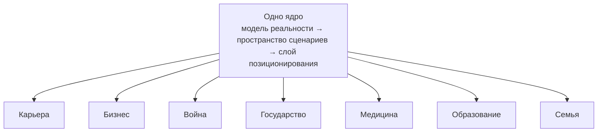

# 2. Одна онтология, много вертикалей: одно ядро под разными сферами жизни

> **Вытеснено — ранняя версия.** Это эссе опирается на личную морскую метафору (острова / ветра / корабли) как на несущую картину. Исправленная, основная версия — [`2_one-ontology-many-verticals.variant-game-drama.md`](2_one-ontology-many-verticals.variant-game-drama.md): та же онтология на кодифицированных профессиональных языках гейм-дизайна и драматургии; её §2 объясняет, почему личная метафора, став несущей, не добавляет понимания. Оставлено только для справки.

**Приватный документ. Не для открытой публикации.** Это второе из пяти эссе серии «Траектории». В первом я сменил атом интеллекта — с ответа на траекторию — и собрал ядро из трёх слоёв: модель реальности, пространство сценариев, слой позиционирования. Здесь я проверяю это ядро на прочность. Я беру одну онтологию и прогоняю её через несколько совершенно разных сфер жизни, чтобы показать: они не требуют разных интеллектов. Они требуют одной онтологии и разной конкретики.

**Alex Krol** — стратегия, AI, инфраструктура роста

> 🇬🇧 **English version:** [Eng/1_Concept/2_one-ontology-many-verticals.md](../../Eng/1_Concept/2_one-ontology-many-verticals.md)

> © 2026 Alex Krol. Приватный концептуальный документ серии «Траектории». Не для открытой публикации; распространение, цитирование и перевод — только с письменного согласия автора.

## Оглавление

0. [TL;DR — одно ядро, много сфер](#tldr)
1. [Ядро инвариантно: почему профессии выглядят разными](#1-core)
2. [Прогон по вертикалям](#2-verticals)
3. [Разные сферы, не разные интеллекты](#3-conclusion)
4. [Глоссарий](#glossary)

---

## 0. TL;DR — одно ядро, много сфер 

В первом эссе я сменил атом интеллекта: единица — не инференс, а траектория, и поверх неё стоит ядро из трёх слоёв — модель реальности (активные и реактивные элементы), пространство сценариев и слой позиционирования. Здесь у меня тезис, который без этого ядра звучал бы абстрактно, а с ним становится проверяемым.

Тезис простой и сразу на стол. Одно и то же ядро описывает любую сложную сферу жизни. Карьера, бизнес, война, государство, медицина, образование, семья — не разные типы интеллекта, требующие каждый своего специального движка. Это разные сферы для одной онтологии. В каждой есть ограничения, которые не сдвинуть быстро; вероятностные силы, которые не контролируешь; агенты, идущие сквозь это поле и копящие память. Меняется конкретика — конкретные ограничения, конкретные силы, конкретные агенты. Логика навигации не меняется нигде.

Я доказываю это не декларацией, а прогоном. Беру три слоя ядра и накладываю их на несколько вертикалей подряд — карьеру с её рынком талантов, войну с её тремя масштабами действия, медицину с её клиническими путями, образование с его веером сценариев. В каждой я нахожу ту же модель реальности, то же пространство сценариев, тот же слой позиционирования и один и тот же продуктивный вектор — куда идти. И когда вертикали выстраиваются в ряд, становится видно инженерное предубеждение, которое я хочу разоблачить: будто каждой сфере нужен свой отдельный ИИ. Не нужен. Нужна одна онтология и много карт конкретики. А если онтология одна, то и сам человек перестаёт быть набором изолированных вертикалей — но это уже следующее эссе.

---

## 1. Ядро инвариантно: почему профессии выглядят разными 

В первом эссе ядро собралось в вертикаль из трёх слоёв. Внизу — модель реальности через активные и реактивные элементы: одни порождают воздействие, другие меняют состояние в ответ. Над ней — пространство сценариев: множество типовых траекторий поверх этой модели. Сверху — слой позиционирования, который выбирает, в какой поезд садиться и каким вектором идти. Я не буду переобъяснять эти слои; они зафиксированы, и серия на них стоит. Я беру их как данность и задаю вопрос, который из них прямо следует.

Если ядро инвариантно, почему люди, которые им пользуются, выглядят как представители несовместимых профессий? Карьерный коуч, бизнес-стратег, военный планировщик, лечащий врач, методист образования — между ними, кажется, пропасть. Разный язык, разные инструменты, разные дипломы, разные конференции. Здравый смысл говорит, что это разные интеллекты: один умеет в людей и должности, другой в рынки и метрики, третий в театры военных действий, четвёртый в патофизиологию. И инженерный инстинкт послушно отвечает тем же — каждой сфере свой специальный движок, своя модель, своя команда.

Я считаю, что это иллюзия, и хочу снять её сразу, а не приберегать к финалу. Все эти люди делают одно и то же. Они навигируют по пространству сценариев на модели реальности. Карьерный коуч строит карту должностей и переходов и ведёт человека по ней. Военный планировщик строит карту театра и ведёт силы. Врач строит карту течения болезни и ведёт пациента. Одно ядро, один способ работы. Различаются они не интеллектом, а **конкретикой сферы** — конкретным набором ограничений, сил и агентов, по которым прокладывается курс. Профессия — это не отдельный мозг. Профессия — это конкретика, которую этот мозг загрузил.

Иллюзия держится на том, что словари несопоставимы. Язык карьеры — грейды, спонсоры, видимость; язык медицины — этиология, протокол, исход; язык войны — театр, кампания, эшелон. Между этими словарями нет ни одного общего термина, и кажется, будто за разными словарями стоят разные способы думать. Но словарь — это разметка местности, а не устройство навигатора. Геолог и моряк называют рельеф разными словами, и всё же оба читают высоту, уклон и препятствие. Различие словарей — поверхностный слой; под ним лежит одна и та же операция чтения реальности и прокладки курса. Я хочу спуститься под словари к этой операции и показать, что она в карьере, медицине и войне буквально одна.

Замечу сразу, чтобы не было соблазна принять мой тезис за тривиальность. Я не говорю, что «во всём есть что-то общее» — банальность, из которой ничего не следует. Я говорю сильнее: общее — это конкретная трёхслойная конструкция, которую можно перенести из сферы в сферу целиком, со всеми связями между слоями, ничего не теряя по дороге. Если перенос ломается хоть на одной вертикали — тезис ложен, и я это честно увижу. Прогон ниже и есть проверка на излом: я нагружаю одну онтологию семью разными сферами подряд и смотрю, где она треснет.

Чтобы пройти прогон, мне хватит ровно тех понятий, что зафиксированы в первом эссе. В каждой вертикали я буду спрашивать одно и то же. Что здесь играет роль пассивных ограничений — того, что задаёт геометрию и не меняется за один ход? Что здесь вероятностные силы — активные, чужие, ловимые статистикой, а не контролем? Кто здесь агент, идущий траекторией и копящий память? Как из этого собирается пространство сценариев и какой продуктивный вектор выбирает слой позиционирования? Это удобно держать перед глазами как картинку: ограничения — как острова, силы — как ветра, агенты — как корабли для капитана, которому важно одно — куда плыть. Картинка помогает увидеть, но работают под ней понятия первого эссе, и проверяю я именно их.

---

## 2. Прогон по вертикалям 

Начну с карьеры, потому что её устройство самое узнаваемое. Пассивные ограничения здесь — структура: уровни должностей, грейды, формальные требования, регламенты, отраслевые и личные границы вроде образования или географии. Они твёрдые: грейд не перепрыгнуть желанием, и это задаёт геометрию любого карьерного маршрута. Вероятностные силы — тренды внутри компании и на рынке: какие функции растут, какие команды на коне, какие роли в спросе, кто пришёл новым руководителем и сменил расклад альянсов. Агент — конкретный человек с его навыками, репутацией, отношениями и текущей позицией. И сразу видно, что помощник, который правит резюме, работает на уровне локального шага, а нужен слой позиционирования: он держит карту должностей и трендов, разворачивает веер маршрутов — вертикальный рост в функции, латеральный ход в смежную, прыжок через компанию на грейд выше, исследовательский ход вроде стажировки или secondment — и выбирает курс к целевой роли, даже если отдельные шаги по пути будут несовершенны.

У карьеры есть продолжение, которое стоит того, чтобы задержаться. Тот же слой позиционирования разворачивается на сто восемьдесят градусов и обслуживает не человека, а корпорацию — и оказывается, что это одна система с двух сторон. Со стороны человека она строит личное пространство карьерных маршрутов. Со стороны корпорации она подбирает людей под проекты. Проект здесь — связная группа ограничений со своим уровнем риска и своим прогнозом сил: M&A, запуск нового рынка, крупная трансформация — каждый несёт свой набор ограничений, свою неопределённость, своё давление сроков, своё окно возможности и внимание топ-менеджмента. И людей под него подбирают не по абстрактным навыкам, а по типу траектории. Кто-то любит уходить в неосвоенное и возвращаться с результатом — его на разведку нового рынка. Кто-то надёжно держит предсказуемость — его на масштабирование того, что уже работает. Кто-то идеален для связок между подразделениями, которые не разговаривают. Задача слоя позиционирования — не закрыть слот в проекте, а расставить людей по проектам так, чтобы каждый проект получил нужный ему тип траектории, а каждый человек оказался там, где это двигает его собственный курс. Карьерный коучинг и управление талантами перестают быть двумя разными задачами; это одно пространство сценариев на одной модели активных и реактивных элементов, где система одновременно ведёт людей и комплектует проекты. Она строит личное пространство маршрутов для каждого и одновременно оптимизирует портфель траекторий перспективных людей — чтобы не терять их и ставить на верные проекты. И чтобы работать так, ей не нужно быть инсайдером: достаточно видеть реальное поведение и результаты, а не резюме, — выявлять перспективных по тому, как они идут, а не по тому, как себя описывают. Эта развилка не гипотетика: внутренние *talent marketplaces* (внутренние биржи талантов — системы мэтчинга профилей сотрудников и внутренних возможностей) — реально внедряемая, хотя ещё развивающаяся корпоративная практика[^6][^7].

Война поднимает ставку и обнажает то, что в карьере было размыто, — масштаб действия. Военная доктрина давно формализовала то, что я в первом эссе назвал разницей локального шага и вектора: война разнесена по трём уровням — стратегия, оперативное искусство, тактика. Стратегия задаёт цели, оперативное искусство оркеструет кампании в театре, тактика разрешает отдельные бои; промежуточный, оперативный уровень — это звено, связывающее стратегические цели с тактическим применением сил[^1][^2]. Перевод в понятия ядра прямой: театр действий — это пассивные ограничения, противник и общая обстановка — вероятностные силы, операции и спецмиссии — агенты, посланные на разные участки. Спецоперация — рейд, десант, диверсия — это агент особого класса: суперточный подбор группы под задачу, глубокая разведка обстановки, жёсткие ограничения по времени и шуму, разовое окно, высокая цена провала. Туда нельзя послать случайного; туда идёт класс, заточенный именно под этот рельеф, — и это та же расстановка людей по проектам, что в карьере, только цена ошибки другая. В этой картине одно ядро работает сразу как генштаб и как офицер кадров и разведки: генштаб держит карту театра и состояние войск и планирует кампанию как последовательность операций, а кадровая сторона выявляет годных по реальному поведению и подбирает их под миссии так, чтобы это и усиливало кампанию, и развивало людей — карьера солдата складывается из верно выбранных операций. И главный урок войны для моего ядра в том, что выигрывает не тот, кто безупречно ведёт каждый бой, а тот, кто верно распределяет силы по направлениям и держит логистику кампании. Идеальная тактика в проигранной по стратегии войне — это вылизанный локальный шаг в поезде, идущем не туда. Те же два уровня, та же геометрия важнее качества шага, только цена ошибки измеряется иначе.

Медицина переносит ту же онтологию в стихию, где вероятностные силы — это уже не рынок, а биология, и ставки максимальны. Пассивные ограничения здесь твёрже, чем где бы то ни было: анатомия и физиология, протоколы, противопоказания, доступные технологии, регуляторика, хронические состояния пациента, возраст, генетика — всё, что задаёт форму ситуации и не меняется быстро. Вероятностные силы — ход заболевания, инфекции, реакции на терапию, образ жизни, случайные события. Агент — пациент вместе с лечащей командой, идущий совместной траекторией через диагностику, выбор терапии, коррекцию, реабилитацию. И медицина уже отчасти формализовала навигацию явно. Клинический путь (*clinical pathway* — мультидисциплинарный маршрут ведения пациента с предсказуемым течением, где вмешательства упорядочены по времени) — это заранее проложенный курс по протоколам, и систематические обзоры показывают, что он работает именно там, где течение предсказуемо, обеспечивая своевременность вмешательств без вреда[^3][^4]. А агенты здесь тоже разных классов — по тому, куда бьёт вмешательство. В русской медицинской традиции терапию делят на этиотропную (по причине болезни), патогенетическую (по механизму её развития) и симптоматическую (по проявлениям)[^5]; в англоязычной литературе классификация иная — и для меня важно не то, какая нарезка правильнее, а что слой позиционирования и здесь выбирает, куда бить: разведать причину, давить на механизм или гасить симптом. Позиционирование в медицинской стихии — это выбор не одной таблетки, а целого режима: идти агрессивно, держать щадящую тактику или ставить курс на качество жизни, когда хорошего исхода уже не остаётся. И клиническим путём дело не исчерпывается: живая навигация добавляет к протоколу то, чего в нём нет, — она наблюдает длинную траекторию пациента, учится на исходах прежних случаев и предлагает маршруты не только по диагнозу, но и по вектору жизни человека, для которого один и тот же диагноз — разная ситуация. Та же модель реальности, тот же веер сценариев, тот же выбор курса — просто ограничения называются противопоказаниями, а силы ходом болезни.

Образование замыкает выпуклый ряд и показывает веер сценариев в самом чистом виде. Пассивные ограничения — стандарты, учебные планы, возрастные ограничения, базовые когнитивные закономерности: то, что не сдвинуть за семестр. Вероятностные силы — спрос на профессии, технологические сдвиги, социально-экономические тренды, личная среда ученика. Агент — конкретный человек или группа на своей траектории развития компетенций. И здесь веер маршрутов виден без всякого перевода: сценарий обучения — это проект общей траектории курса с целями, этапами и контролем, а сама система образования тоже раскладывается веером возможных путей развития — от возврата к прежней модели до радикального обновления. Исследователи образования выделяют несколько типов таких сценариев, условно от реставрационного до инновационного, и спорят лишь об одном — какой курс выбрать. Перед нами вопрос позиционирования в чистоте: не «дать правильный урок», а выбрать вектор развития. И агент здесь — не обязательно один человек: это может быть и группа на общей траектории, и сама система образования, которая ведёт целое поколение через свои ограничения. Образовательный помощник, который не понимает этого, остаётся ещё одной курс-платформой — он шлифует отдельный урок, локальный шаг, и не видит, в каком поезде едет ученик. Слой позиционирования же видит, где человек в пространстве компетенций и какой курс ведёт его к целевым сферам — карьере, делу, здоровью, гражданской роли; и продуктивный вектор тут не «выучить факт», а оказаться на маршруте, который в долгую сходится с тем, куда человеку нужно прийти.

Бизнес, государство и семья дописывают ряд, и их я даю бегло — не потому, что онтология слабее, а потому, что после четырёх разворотов она читается с полуслова. В бизнесе пассивные ограничения — структура рынка, регуляторика, ресурсные и технологические рамки; силы — спрос, конкуренты, каналы, тренды внимания; агенты — продукты, инициативы, кампании; а воронка — это выбранный курс, по которому слой позиционирования ведёт портфель сценариев, гася одни и масштабируя другие. Государственное и муниципальное управление — та же онтология в большем масштабе: ограничения здесь конституция, законы, бюджетные правила, уровни власти и сами территории с их ресурсами; силы — экономические циклы, демография, миграция, политические и внешние сдвиги, которые власть не контролирует, но обязана закладывать в сценарии; агенты — национальные проекты, реформы, муниципальные инициативы и команды, которые их тянут. Проект здесь разворачивается в набор секторов одной территории — транспорт, ЖКХ, образование, безопасность, — по которым согласованно ведут портфель программ; и слой позиционирования снова выбирает не «правильное решение в одном вопросе», а вектор развития территории при заданных ограничениях и силах. В семье ограничения — характеры, ценности, история родительских семей, социально-экономические рамки; силы — кризисы, переезды, рождение детей, возрастные переходы, которые не предскажешь, но чьи паттерны видны; агент — семья как единый субъект, идущий долгой траекторией. И навигация здесь занята ровно тем же, чем везде: не разруливанием одной ссоры, а удержанием вектора отношений — куда движется пара, к близости или к отчуждению, и не пора ли менять курс. Семь сфер, от грейдов до брака, от театра войны до клинического протокола, от бюджета территории до семейного бюджета. Ограничения всюду разные, силы всюду свои, агенты всех классов. Онтология одна.

---

## 3. Разные сферы, не разные интеллекты 

Когда вертикали выстроены в ряд, в них проступает то, что я вынес на первую страницу и теперь могу опереть на прогон. Во всех семи сферах работает одно ядро. Модель реальности через активные и реактивные элементы, пространство сценариев поверх неё, слой позиционирования сверху — этот порядок не дрогнул ни в карьере, ни в войне, ни в медицине, ни в образовании, ни в управлении территорией. Менялась только конкретика: что считать ограничением, какие силы действуют в этой сфере, какие агенты по ней ходят. Грейды и противопоказания — ограничения разной природы. Рынок труда и ход болезни — силы разной природы. Сотрудник, спецгруппа, пациент, ученик — агенты одного ядра. Сама навигация — развернуть веер курсов и выбрать продуктивный вектор — не изменилась нигде.

Это позволяет назвать инженерное предубеждение, против которого написано всё эссе. Здравый смысл и индустрия в один голос говорят: каждой сфере — свой специальный ИИ. Отдельный движок для рекрутинга, отдельный для военного планирования, отдельный медицинский, отдельный образовательный, и каждый со своей моделью, своей командой, своим жаргоном. Я утверждаю, что это ошибка уровня атома. Это не разные интеллекты. Это разные сферы для одной онтологии. Специфика вертикали живёт не в ядре, а в конкретике — в наборе ограничений, сил и агентов, которые в эту вертикаль загружены. Строить под каждую сферу отдельный мозг — значит размножать ядро там, где надо размножать только конкретику. Правильная архитектура обратная: одно максимально абстрактное ядро про сценарии, векторы и активные/реактивные элементы — и вертикали как сменные наборы конкретики поверх него.

Из этого следует ставка, которую я делаю на ядро. Проектировать его надо не под первую вертикаль, которую возьмёшь в работу, а под инвариант — так, чтобы добавление новой сферы было загрузкой новой конкретики, а не переписыванием движка. Карьера, бизнес, война, государство, медицина, образование, семья — это не семь продуктов, которые однажды придётся как-то интегрировать. Это семь сфер одной онтологии, и общей она остаётся по построению, потому что общим было ядро, через которое все они описаны. Понятия первого эссе — модель реальности, пространство сценариев, слой позиционирования, продуктивный вектор — для этого и нужны: они задают единый формат, в котором любая сфера описывается так, что ядро её сразу понимает. Удобная картинка с островами и ветрами помогает увидеть это глазами, но несёт описание не она, а сами понятия.

И здесь онтология сама подсказывает следующий ход. Я всё время говорил о вертикалях так, будто это разные пространства, по которым движутся разные агенты. Но человек-то один. Он одновременно строит карьеру, держит дело, лечится, учится, живёт в семье — и это не семь отдельных агентов в семи мирах, а одна точка, чьё положение нужно мерить сразу по всем осям. Если онтология одна, то и человек перестаёт быть набором изолированных вертикалей и становится единой точкой в многомерном пространстве, по которому он дрейфует, сдвигаясь сразу во всех измерениях. Что это за пространство, как в нём заданы оси и куда сносит человека их общий ветер — с этого начинается следующее эссе.

---

## Sources

[^1]: U.S. Joint Chiefs of Staff (2022). *Joint Publication 3-0: Joint Campaigns and Operations*. Washington, D.C.: Chairman of the Joint Chiefs of Staff, 18 June 2022 (с изм. 10 September 2024). https://irp.fas.org/doddir/dod/jp3_0.pdf

[^2]: Свечин, А. А. (1927). *Стратегия*. Москва: Военный вестник. (Англ. изд.: Svechin, A. A. (1992). *Strategy* / ed. K. D. Lee. Minneapolis: East View Publications.) https://www.rusi.org/podcasts/talking-strategy/episode-5-alexander-svechin-soviet-strategic-thought

[^3]: De Bleser, L., Depreitere, R., De Waele, K., Vanhaecht, K., Vlayen, J., & Sermeus, W. (2006). Defining pathways. *Journal of Nursing Management*, 14(7), 553–563. https://e-p-a.org/care-pathways/

[^4]: Allen, D., Gillen, E., & Rixson, L. (2009). Systematic review of the effectiveness of integrated care pathways: what works, for whom, in which circumstances? *International Journal of Evidence-Based Healthcare*, 7(2), 61–74. https://onlinelibrary.wiley.com/doi/abs/10.1111/j.1744-1609.2009.00127.x

[^5]: Харкевич, Д. А. (2010). *Фармакология: учебник* (10-е изд.). Москва: ГЭОТАР-Медиа. Раздел «Виды фармакотерапии». https://ru.wikipedia.org/wiki/Фармакотерапия

[^6]: Gantcheva, I., Schwartz, J., Jones, R., et al. (2020). *Activating the internal talent marketplace*. Deloitte Insights, 17 September 2020. https://www.deloitte.com/us/en/insights/topics/talent/internal-talent-marketplace.html

[^7]: Gartner (2024). *Market Guide for Internal Talent Marketplaces*. Stamford, CT: Gartner, Inc. https://www.gartner.com/reviews/market/internal-talent-marketplaces

---

## Глоссарий 

Несущие термины этого эссе — понятия первого эссе; здесь они приведены кратко. Эссе 2 не вводит новых сущностей: оно показывает, что одна онтология работает по всем сферам. Морские образы (острова, ветра, корабли) — иллюстрация, а не понятия: за ними стоят перечисленные ниже термины эссе 1.

### Что вводит это эссе

**Вертикаль** — сфера сложной жизни (карьера, бизнес, война, государство, медицина, образование, семья). Не отдельный интеллект со своим движком, а та же онтология эссе 1 с конкретными ограничениями, силами и агентами. Тезис эссе: разные вертикали — разные сферы, не разные интеллекты.

**Реестр вертикалей** — набор сфер, по которым прогоняется одна онтология. Каждая — своя конкретика поверх одного ядра.

### Привлечённые внешние понятия

**Уровни войны: стратегия, оперативное искусство, тактика** — формализованное военной доктриной деление действия на три масштаба: стратегия задаёт цели, оперативное искусство оркеструет кампании, тактика разрешает отдельные бои. В эссе подтверждает, что продуктивный вектор важнее качества отдельного шага.

**Клинический путь (clinical pathway)** — мультидисциплинарный маршрут ведения пациента с предсказуемым течением, где вмешательства упорядочены по времени. В эссе — пример того, как медицина уже отчасти формализовала навигацию.

**Триада терапии: этиотропная / патогенетическая / симптоматическая** — деление терапии по точке приложения: по причине болезни, по механизму её развития, по проявлениям. Русская медицинская традиция (в англоязычной литературе классификация иная). В эссе — выбор режима воздействия под конкретику случая.

**Внутренние talent marketplaces (внутренние биржи талантов)** — системы мэтчинга профилей сотрудников и внутренних возможностей; реально внедряемая, хотя ещё развивающаяся корпоративная практика. В эссе — эмпирическое подтверждение развилки «навигатор обслуживает не человека, а корпорацию».

### Унаследовано из эссе 1 (кратко)

**Траектория** — отрезок времени, на котором агент планирует, действует, наблюдает, корректирует курс и копит опыт. Атом интеллекта вместо инференса.

**Модель реальности (активные / реактивные элементы)** — нижний слой ядра: активные элементы порождают воздействие, реактивные меняют состояние в ответ. В каждой вертикали — свои ограничения (реактивное, медленное) и свои силы (активное, чужое).

**Пространство сценариев** — множество типовых траекторий поверх модели реальности; то, по чему прокладывается курс.

**Слой позиционирования** — верхний слой ядра: выбирает, в какой поезд садиться и каким вектором идти.

**Продуктивный вектор** — направление движения в пространстве сценариев; объект управления вместо отдельного шага. В любой вертикали капитану важно одно — куда идти.

**Веер сценариев** — множество траекторий, доступных из текущей точки; объект выбора позиции.
