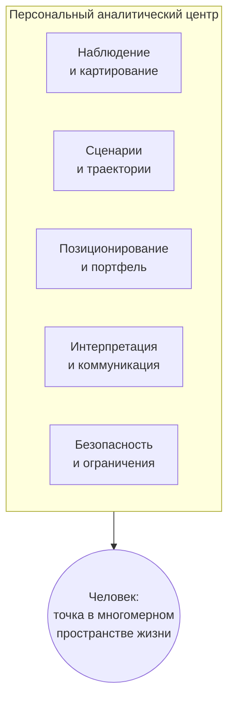

# 3. Многомерное пространство жизни и дрейф: один человек, одна карта, один навигатор

Это третье из пяти эссе серии «Траектории» и её концептуальный центр. В первом я сменил атом интеллекта — с ответа на траекторию — и собрал ядро из трёх слоёв. Во втором прогнал это ядро по семи сферам жизни и показал, что они не требуют разных интеллектов. Здесь я свожу эти сферы в одну фигуру: человек — точка в многомерном пространстве жизни, и навигатор у него один. Тут же триада онтологии впервые названа ядром явно, и тут же рождается её форма.

**Alex Krol** — стратегия, AI, инфраструктура роста

> 🇬🇧 **English version:** [Eng/1_Concept/3_multidimensional-life-drift.md](../../Eng/1_Concept/3_multidimensional-life-drift.md)

> © 2026 Алексей Крол. Все права защищены. Републикация, распространение или коммерческое использование — только с явного письменного разрешения автора.

## Оглавление

0. [TL;DR — семь карт оказались одной картой](#tldr)
1. [Из вертикалей — в оси одного пространства](#1-axes)
2. [Человек как точка: дрейф вместо ответа](#2-drift)
3. [Всё — сигнал: поведение вместо самоотчёта](#3-signal)
4. [Почему точность растёт с числом пользователей](#4-scale)
5. [Персональный аналитический центр: функции и контракты](#5-center)
6. [Охранительница: форма, а не фея](#6-form)
7. [Глоссарий](#glossary)

---

## 0. TL;DR — семь карт оказались одной картой 

Во втором эссе я прогнал одну онтологию по семи сферам жизни и доказал, что им не нужны разные интеллекты. Здесь я делаю следующий шаг, и он переворачивает картину. Семь вертикалей — не семь приложений, между которыми когда-нибудь придётся наводить мосты. Это семь осей одного пространства, в котором живёт один человек. А раз человек один, навигатор у него тоже один.

Из этого сразу следует смена режима работы. Навигатор не отвечает на запрос — он держит точку человека на всей карте сразу и моделирует дрейф: куда сносит человека по совокупности осей и каким малым приращением этот снос завернуть в нужную сторону. Цель при этом — не точка-мечта, а конус допустимых состояний, в котором человеку нормально. Хороший ход в карьере, который рушит здоровье, навигатор видит не как локальную удачу, а как конфликт вектора между осями.

И материал, по которому он читает позицию, — не анкета. Это поведение: что человек делает, чего он не делает, как он об этом говорит. Действие, бездействие и речь — поток наблюдаемых данных, по которому позиция обновляется непрерывно. С ростом числа людей, прошедших через систему, этот поток превращает её из умного чата в эмпирическую карту реальности: видно, какие семейства траекторий куда реально приводят. Архитектурно это не один большой агент, а персональный аналитический центр из нескольких богатых функций: у каждой — своя группа агентов, между ними — контракты. И у этой формы уже есть художественный прототип: у Снегова в «Людях как боги» она называется Охранительница. Я не копирую волшебную фею из фантастики — я вытаскиваю принцип организации и перевожу его в инженерные термины.

---

## 1. Из вертикалей — в оси одного пространства 

Второе эссе закончилось развилкой, которую я сейчас прохожу. Я весь прогон говорил о вертикалях так, будто это разные пространства, по которым ходят разные агенты: карьера отдельно, бизнес отдельно, здоровье отдельно. Удобно для доказательства инвариантности ядра, но неверно по факту. Человек-то один. Он одновременно строит карьеру, держит дело, лечится, учится, живёт в семье, держится за друзей. Это не семь агентов в семи мирах. Это одна точка, чьё положение нужно мерить сразу по всем направлениям.

И тогда вертикаль перестаёт быть отдельной картой и становится осью. Карьера, бизнес, образование, семья, друзья, здоровье — шесть содержательных осей жизни одного человека. Психология благополучия давно операционализирует «жизнь как целое» через похожий набор ядерных доменов — уровень жизни, здоровье, достижения, отношения, безопасность, принадлежность к сообществу, защищённость в будущем; *Personal Wellbeing Index* меряет именно это[^pwi]. Я беру оттуда одно: жизнь раскладывается на оси-домены, и их немного. К содержательным осям я добавляю системные координаты, которые пронизывают все домены сразу, — время, ликвидность, нагрузка, свобода. Это не отдельные сферы жизни, а измерения, в которых стоит цена любого хода по любой содержательной оси: всякий шаг в карьере или в семье чего-то стоит по времени, по деньгам, по нагрузке, по степени свободы, которую он отнимает или возвращает. Сложить содержательные оси с системными — и получится координатная сетка, в которой задаётся положение человека.

Прежде чем двигаться дальше, я останавливаюсь и называю вещь, ради которой написана вся серия. Под всеми вертикалями второго эссе и под этим пространством лежит одна конструкция, и до сих пор я разворачивал её по частям. Теперь собираю её в одно и называю ядром явно. Ядро — это триада. Внизу модель реальности: активные элементы порождают воздействие, реактивные меняют состояние в ответ. Над ней пространство сценариев: множество типовых траекторий «активное воздействие → реактивное изменение» поверх этой модели. Сверху слой позиционирования: выбор, каким активным элементом сейчас быть, по каким реактивным бить и каким вектором идти. Активные и реактивные элементы — деление моё, под мою задачу; я его внешним работам не приписываю. Но вся серия стоит на этой триаде, и порядок слоёв в ней переставить нельзя: позиционированию не на чем работать без пространства сценариев, а пространству сценариев неоткуда взяться без модели реальности.

Эта триада и есть несущая конструкция текущего эссе, и читать дальше надо через неё. Многомерное пространство жизни — это пространство сценариев, развёрнутое на все оси человека сразу, а не на одну вертикаль. Содержательные и системные оси — это разметка модели реальности: что здесь реактивно и медленно, что активно и чужое. А навигатор, который ведёт человека по этому пространству, — это слой позиционирования, поднятый с уровня одной сферы на уровень всей жизни. Я не ввожу новых сущностей. Я беру триаду, зафиксированную в первых двух эссе, и показываю, что она работает не только внутри вертикали, но и поперёк всех вертикалей разом — как единая карта одного человека.

Стоит показать, как триада ложится на каждую ось, чтобы видеть, что разметка действительно одна. На оси карьеры активные элементы — сам человек и менеджеры вокруг него; реактивные — оргструктура, грейды, репутация, медленно меняющиеся под давлением. На оси бизнеса активные — команды и капитал; реактивные — рынки, метрики, инфраструктура. На оси здоровья активные — человек и его врачи; реактивные — тело, ход болезни, система здравоохранения. На оси образования активные — он сам и те, кто его учит; реактивные — знание и навыки, которые приходится осваивать. На оси семьи и друзей активные — он и близкие; реактивные — структура отношений, быт, плотность связей. Каждая ось — своя «физика», свои конкретные активные и реактивные элементы, своя геометрия твёрдого и подвижного. Но логика везде одна: активное бьёт по реактивному, реактивное меняет состояние, из нового состояния следует новый ход. Оси отличаются содержанием, не устройством, и именно поэтому их можно собрать в одну сетку, а не держать семь несовместимых карт. Триада и делает оси соизмеримыми.

---

## 2. Человек как точка: дрейф вместо ответа 

Раз оси сведены в одну сетку, человек получает в ней координаты. Его позиция — точка: текущие роли и проекты, освоенные компетенции, состояние здоровья, конфигурация отношений, запас времени и денег, уровень нагрузки и свободы. Не образ и не самоописание, а положение в пространстве, заданное по всем осям сразу. И вокруг этой точки лежит геометрия, которую человек не выбирал: области, куда нельзя или слишком дорого заходить, — регуляторные и физические пределы, личные табу; провалы по метрикам, в которые легко свалиться и трудно выбраться, — выгорание, долговая яма, токсичная среда. Это та же модель реальности, что и в вертикалях: твёрдые ограничения, которые не сдвинуть за один ход, и вероятностные силы, которые не контролируешь.

Через это поле проходят семейства траекторий — типовые маршруты, по которым люди в похожем положении обычно идут. Карьерные, образовательные, семейные, деловые ветки, каждая со своим горизонтом, риском и характерным исходом. Навигатор видит не только текущую точку, но и веер этих маршрутов, расходящийся из неё. И вот здесь главный поворот всего эссе. Цель в таком пространстве — не точка. Точка-мечта — это иллюзия из мотивационных книг: «вот этой должности, этого дохода, этого тела я хочу достичь». Реальная цель — конус допустимых состояний: область, в которой человеку нормально по совокупности осей. Достаточно денег при достаточной свободе, достаточно глубины при достаточной широте, достаточно близости при достаточной автономии. Внутри конуса много разных точек, и все они человека устраивают. Навигатор целится не в одну из них, а в попадание в конус и в удержание внутри.

Из этого следует, чем оказывается рекомендация. Не «вот идеальное действие». А шаг, который создаёт устойчивый дрейф в сторону конуса, даже если локально он не оптимален. Дрейф — понятие первого эссе: смещение траектории под действием шагов и вектора, где геометрия движения важнее качества отдельного шага. Здесь он становится центральным и многомерным. Навигатор моделирует не один лучший ход, а малые приращения состояния, интегрируемые во времени в нужном направлении по всем осям. Эта оптика прямо наследует первому эссе: управление с горизонтом планирования — на каждом шаге оптимизируется траектория на горизонт вперёд, исполняется первый шаг, окно сдвигается; и портфельная логика — ценность не в отдельной позиции, а в конфигурации портфеля, и отдельная просадка не решает при верном составе. Я не переопределяю эти конструкции, я опираюсь на них: дрейф в многомерном пространстве — это та же траектория на скользящем горизонте, только горизонт теперь охватывает всю жизнь, а портфель распределён не между сделками, а между осями.

Развёрнутая рекомендация поэтому собирается в несколько движений, а не в одно. Сначала навигатор оценивает текущую позицию — где человек реально стоит в пространстве по накопленному поведению, а не по тому, что человек о себе говорит. Дальше выбирает не точку-мечту, а тот самый конус допустимых состояний, в который человеку нормально попасть. Потом сравнивает семейства сценариев: какие маршруты статистически заводят в этот конус, с какими рисками и на каком горизонте, а какие уводят мимо. И только в конце предлагает локальный шаг — не «идеальное действие вообще», а действие, которое сдвигает человека в сторону выбранной траектории и не вгоняет его в твёрдое ограничение. Все четыре движения работают в долгую: ни одно из них не про лучший ответ здесь и сейчас, все — про то, чтобы интеграл по времени оказался в плюс. Это близко к жизненному автопилоту, который не подменяет волю человека, а постоянно подсказывает курс, на котором накопленный дрейф складывается в нужную сторону.

И здесь же вылезает то, что одномерные помощники не видят в принципе. Хороший «поезд» в карьере может быть плохим для здоровья или для семьи. Повышение, которое двигает человека по карьерной оси вверх, сносит его по оси нагрузки в провал и по оси отношений в отчуждение. Помощник, который смотрит на карьеру отдельно, отрапортует об успехе. Навигатор, который держит все оси разом, видит то же событие как конфликт вектора между осями: суммарный дрейф уводит человека из конуса, хотя по одной координате он улучшился. Это не локальная оптимизация, которую надо доточить, а структурный выбор, который надо принять осознанно: чем готов пожертвовать, какую ось разменять, где провести границу размена. Одномерный совет такого вопроса даже не формулирует. Многомерный навигатор с него начинает.

---

## 3. Всё — сигнал: поведение вместо самоотчёта 

Чтобы держать точку человека на карте, навигатору нужно знать, где эта точка реально находится. И здесь он не имеет права верить анкете. Положение в пространстве задаётся не тем, что человек о себе говорит, а тем, что он делает. Истинные предпочтения раскрываются через реальный выбор, а не через декларацию — это старый и твёрдый результат экономической теории, теория выявленных предпочтений[^revpref]. Человек объявляет одну цель, а временем, вниманием и деньгами голосует за другую. Навигатор обновляет координаты по голосованию, а не по объявлению.

Материал для этого — три потока, и все три читаются как данные. Действие — прямой шаг по траектории: проекты, задачи, встречи, покупки, тренировки, разговоры, то, во что человек реально вкладывает время и энергию. Здесь видно, куда он движется фактически. Речь — окно в его текущую модель мира: как он описывает себя, других и будущее, что считает возможным и невозможным, за кем признаёт право действовать, какие причинно-следственные связи держит в голове. И третий поток, который обычно списывают со счёта, — бездействие. Чего человек не делает: откладывает важные письма, избегает разговоров, не идёт к врачу, не подаёт заявку, годами не запускает проект, о котором говорит. Бездействие — не пустота. Это поле избегания: страхи, слепые зоны, скрытые ограничения. Часто именно здесь видна реальная траектория яснее, чем в действиях — хроническое откладывание дискомфортного, но важного шага говорит о позиции человека больше, чем любая его декларация о намерениях.

Отсюда инвариант ядра: нет пустого времени и нет незначительных актов. Отсутствие действия в определённой зоне жизни — диагностический сигнал не слабее, чем действие. Каждый мелкий поступок и каждая реплика — измерение текущей траектории, шумное, но измерение. Поведенческая наука уже работает в этом режиме: *digital phenotyping* (цифровое фенотипирование) — поминутная количественная оценка состояния человека по данным его обычных устройств, причём значительная часть данных собирается пассивно, без активного участия человека[^digphen]. Я не прячу остроту этого. По всем трём потокам, включая то, чего человек не сделал, навигатор непрерывно уточняет, где человек стоит и куда его сносит. Звучит как тотальное наблюдение, и я не смягчаю: да, в поле зрения попадает всё.

Но именно здесь проходит граница, которую нельзя терять, и она встроена в саму конструкцию, а не приклеена сверху. Поток собирается не для оценки человека, а для подстройки навигации. Навигатор не выставляет оценку, не ведёт досье для приговора, не ранжирует человека относительно других. Он сверяет одно: соответствует ли реальный дрейф тому вектору, который человек сам считает желательным, или уводит в другую воронку сценариев. И если уводит — вмешивается дозированно: предлагает маленький шаг, разговор, эксперимент, смену фокуса, которая поправляет курс. Цель потока — помочь человеку дрейфовать туда, куда он сам хочет, а не куда хочет система. Различие между навигацией и надзором не в объёме наблюдения — он в обоих случаях тотален. Различие в том, кому принадлежит вектор и встроено ли в систему ограничение на то, что она вправе с этим знанием делать. Эту функцию — безопасность и ограничения как часть ядра, а не надстройка — я разворачиваю в пятом и шестом разделах. Здесь важно зафиксировать: «всё — сигнал» работает только в паре с «сигнал — для навигации, не для оценки», иначе это уже не то, что я проектирую.

---

## 4. Почему точность растёт с числом пользователей 

У всего описанного есть свойство, которое меняет природу системы по мере роста. Пока через навигатор проходит один человек, он опирается на его историю и на общие соображения. Когда через него проходят тысячи и сотни тысяч траекторий, появляется то, чего у одиночной системы быть не может, — статистика маршрутов. Видно, какие комбинации шагов в карьере, бизнесе, здоровье, образовании реально приводят к похожим исходам, а какие звучат привлекательно и эмпирически не работают. Семейства сценариев перестают быть умозрительными и становятся наблюдаемыми кластерами.

Механизм этого роста не новый, у него есть точное имя. Рекомендация «похожим на тебя» из агрегата чужих выборов — это коллаборативная фильтрация, термин и метод тридцатилетней давности[^cf]. Для нового человека сразу видно, к каким уже наблюдавшимся траекториям он ближе — по поведению, речи, бездействию — и какие сценарии для таких профилей оказывались продуктивными, а какие сливали ресурс. Это уже не советы из общих книг, а рекомендации по реально похожим жизням. А поверх лежит вторая петля, тоже с именем: сетевые эффекты данных — больше пользователей дают больше данных, больше данных делают продукт точнее, точность приводит новых пользователей[^datanfx]. Петля самоусиливается. С ростом числа прошедших через систему людей навигатор всё лучше понимает, какие поезда вообще бывают, куда они реально приходят и как малые сигналы коррелируют с будущими исходами.

Стоит задержаться на том, что именно улучшается, потому что это не одно качество, а три разных. Первое — кластеры сценариев становятся видны: устойчивые семейства маршрутов проявляются из массы траекторий, и вместо умозрительных «так обычно делают» начинают проступать эмпирические очертания участков, на которых видно, где человек стоит относительно типичных путей. Второе — крепнет обучение на исходах: накапливается статистика, какие сценарии реально дают нужный дрейф по ключевым координатам — доход, здоровье, удовлетворённость, устойчивость дела, — а какие ведут к системному сливу, и привлекательно звучащие, но не работающие маршруты можно отбраковывать по факту, а не по интуиции. Третье — растёт точность персонализации: новый человек по своему поведению, речи и бездействию сразу проецируется на ближайшие наблюдавшиеся жизни, и навигатор предлагает ему не усреднённое, а то, что срабатывало именно у похожих. Эти три качества тянут друг друга: чётче кластеры дают чище обучение на исходах, чище обучение даёт точнее персонализацию, а точнее персонализация удерживает больше людей и снова улучшает кластеры.

И тогда система меняет жанр. Из умного чата, отвечающего на запросы, она дрейфует в сторону того, что я называю эмпирической картой реальности, — карты, по которой видно, какие траектории через многомерное пространство куда сходятся. Здесь я обязан быть точным и не выдать желаемое за факт. Такого атласа сегодня не существует: нет проверенного источника, где траектории целых человеческих жизней были бы сведены в единую карту, и я не приписываю эту карту никакому исследованию. Это направление, к которому ведёт петля данных, а не готовый артефакт. Я утверждаю не «такая карта есть», а «коллаборативная фильтрация плюс сетевые эффекты данных задают вектор, вдоль которого система при росте сдвигается от чата к эмпирической карте». Карта здесь — горизонт, а не существующая вещь.

Этот горизонт берётся, только если выполнено жёсткое условие, и без него вся конструкция вырождается. «Больше сигналов — выше точность» верно лишь при двух вещах сразу. Первое: сигналы должны ложиться в единую геометрию — в многомерное пространство и его сценарии, — а не копиться несвязанными логами; иначе данных много, а карты нет. Второе: система должна учиться на траекториях и исходах, а не на отдельных запросах. И тогда становится критичным то, что легко проглядеть на радостях от масштаба: качество входа. Петля работает только при встроенном отборе сценариев, отбраковке вредных и токсичных паттернов и защите от отравления памяти — от того, что в карту просочится шум, мода или идеология и начнёт выдавать себя за статистику исходов. Без этого фильтра рост числа пользователей не повышает точность, а усиливает искажение: система начинает уверенно вести людей по маршрутам, которые популярны, а не по тем, которые работают. Поэтому отбор и защита — не гигиеническая опция, а условие, при котором масштаб вообще даёт точность. Это подводит прямо к вопросу о том, как навигатор устроен внутри.

---

## 5. Персональный аналитический центр: функции и контракты 

Когда я собираю всё, что навигатор обязан уметь, становится ясно: это не один большой агент. Один агент, которому поручено и наблюдать, и строить сценарии, и выбирать вектор, и объяснять решения, и держать ограничения, — это не архитектура, а свалка. Природа задачи раскладывается на несколько богатых функций, и у каждого человека получается свой персональный аналитический центр принятия решений — набор функций, неважно, кем исполненных. Сама идея разума как общества множества взаимодействующих агентов, из которого рождается интеллект, давно сформулирована — это *Society of Mind* Минского[^som]; я переношу её с устройства одного разума на устройство навигатора над жизнью.

Функций этих немного, и они складываются естественно. Есть функция наблюдения и картирования: она принимает три потока сигналов, нормализует их и привязывает к координатам пространства, держит позицию человека в актуальном состоянии. Есть функция сценариев и траекторий: она строит и обновляет семейства маршрутов, выделяет кластеры, оценивает качество сценариев по исходам, порождает новые ветки. Есть функция позиционирования и портфеля — стратегический штаб навигатора: она выбирает вектор и поезд на фоне текущей позиции, целей человека и геометрии ограничений и думает как инвестор, а не как дейтрейдер. Есть функция интерпретации и коммуникации: она переводит сложное внутреннее решение в человеческое объяснение и в мягкое вмешательство — не только что сделать, но и почему. И есть функция безопасности и ограничений: контроль приватности, лимитов вмешательства, фильтрация токсичных сценариев, защита от отравления данных — ровно тот встроенный слой, без которого «всё — сигнал» из третьего раздела превращается в надзор, а масштаб из четвёртого усиливает искажение.

Каждую такую функцию обслуживает не один исполнитель, а группа агентов со своими специализациями — наблюдение, анализ, планирование, симуляция, коммуникация внутри одной функции. А между функциями лежат контракты: чёткие интерфейсы, по которым они обмениваются результатами, не залезая друг другу внутрь. Наблюдение отдаёт наверх обновлённое состояние и сигналы. Сценарии отдают набор возможных маршрутов с их профилями. Позиционирование выбирает курс и спускает ограничения вниз. Интерпретация получает решение и выдаёт человеку понятный нарратив. Внутри функции — свои протоколы, снаружи она ведёт себя как чётко очерченный сервис. Это язык мультиагентных систем, где множество автономных агентов взаимодействуют по строгим интерфейсам — «контрактам»[^mas]; я не изобретаю его, я применяю к навигатору. Получается не один мозг, а архитектура центра, где группы агентов работают как департаменты хорошего аналитического штаба.

И главное свойство этой конструкции — она инвариантна к тому, кто сидит в клетках оргструктуры. Функции, роли и контракты заданы независимо от того, человек исполняет роль или ИИ. Сегодня это гибрид: часть функций тянут люди, часть — агенты. Завтра автоматизируется больше клеток. Послезавтра, может быть, ещё больше. Но сама оргструктура — какие функции есть, как они связаны контрактами, какой поток между ними идёт — не меняется от того, чем заполнены клетки. Я проектирую не ассистента и не конкретный состав исполнителей. Я проектирую паттерн организации принятия решений, в который ИИ постепенно заходит всё глубже, занимая всё больше ролей, тогда как сам паттерн остаётся прежним. Это и позволяет строить центр уже сегодня, не дожидаясь, пока автоматизируется всё: оргструктуру можно задать сейчас, а наполнять её — по мере того, как агенты дорастают до своих ролей.

---

## 6. Охранительница: форма, а не фея 

Когда я довожу эту конструкцию до конца — персональный аналитический центр у каждого человека, который наблюдает его жизнь, держит карту, моделирует дрейф, выбирает вектор и деликатно возвращает это советами и структурой среды, — я понимаю, что описываю не новое. Эта форма уже была описана, и описана точно. У Снегова в «Людях как боги» у каждого человека есть Охранительница.

Стоит привести, как это сделано в романе, потому что совпадение не приблизительное. Охранительница — это «мудрый и бесстрастный мой наставник и поводырь»; она «разговаривает приятным женским голоском… либо просто зажигает в мозгу свои ответы»; она «была своеобразной частью меня самого, моей связью со всем человечеством»[^snegov]. Разберу это по функциям, не растекаясь в пересказ романа. «Наставник и поводырь» — она не отвечает на вопрос, а ведёт траекторию: отговаривает от деструктивного, подталкивает к разумному, помогает выбирать, за что браться. Это слой позиционирования. «Связь со всем человечеством» — она встроена в общую цивилизационную инфосеть, знает геометрию мира и опирается на разум всей цивилизации, а не на одну голову. Это и функция наблюдения, картирующая мир, и петля масштаба из четвёртого раздела — точность от связи со всеми. А то, что в романе дано как нечто само собой разумеющееся, — Охранительница защищает человека от саморазрушения, а не просто оптимизирует его пользу — это функция безопасности и ограничений, встроенная, а не надстроенная.

И здесь — точка, ради которой я вообще завёл Снегова. Я не копирую интерфейс волшебной феи из фантастики. Образ в романе дан как художественный результат, как готовое свойство утопической цивилизации, про которое не спрашивают, как оно устроено внутри. Меня интересует не фея, а принцип организации, который под ней лежит, и я вытаскиваю его из романа и перевожу в инженерные термины: набор функций — наблюдение, сценарии, позиционирование, коммуникация, безопасность; архитектура групп агентов и контрактов между ними; многомерная карта жизни, по которой всё это ведёт человека. Снегов смотрел сверху, от готового общества людей-богов. Я смотрю снизу как системный архитектор: не «вот идеальная Охранительница», а «вот ядро, которое шаг за шагом, по мере того как агенты занимают свои роли, доращивает обычного человека до того, у кого такой центр есть». Охранительница — это не магия. Это правильная архитектура навигации по реальности, насыщенная данными, сценариями и обратной связью.

И на этом я останавливаюсь ровно там, где конструкция готова, но ещё не задан главный вопрос о ней. Если у каждого человека может быть такой центр — встаёт вопрос, у кого он будет в действительности: кому он доступен, на чём живёт, кто платит, где проходят границы того, что он вправе делать со всем, что знает. Форма описана. Дальше — вопрос о том, кому она достанется и какой ценой. С него начинается следующее эссе.

---

## Sources

[^snegov]: Снегов С. А. «Люди как боги» (роман-трилогия, 1966–1977): «Галактическая разведка» (1966), «Вторжение в Персей» (1968), «Кольцо обратного времени» (1977). Премия «Аэлита» (1984). Образ «Охранительницы» — персонального наставника-хранителя у каждого человека — цит. по кн. 1 «Галактическая разведка»: «мудрый и бесстрастный мой наставник и поводырь»; «разговаривает приятным женским голоском… либо просто зажигает в мозгу свои ответы»; «она была своеобразной частью меня самого, моей связью со всем человечеством». Текст: https://fantlab.ru/work13831

[^pwi]: Cummins R. A. (2003). Developing a National Index of Subjective Wellbeing: The Australian Unity Wellbeing Index. *Social Indicators Research*, 64, 159–190. Personal Wellbeing Index измеряет благополучие через ядерные домены жизни (уровень жизни, здоровье, достижения, отношения, безопасность, принадлежность к сообществу, будущая защищённость) — операционализация «жизнь как набор осей-доменов». https://www.acqol.com.au/uploads/pwi-a/pwi-a-english.pdf

[^revpref]: Samuelson P. A. (1938). A Note on the Pure Theory of Consumer's Behaviour. *Economica*, 5(17), 61–71. Теория выявленных предпочтений (revealed preference): истинные предпочтения раскрываются через реальный выбор, а не через декларации. https://en.wikipedia.org/wiki/Revealed_preference

[^digphen]: Torous J., Kiang M. V., Lorme J., Onnela J.-P. (2016). New Tools for New Research in Psychiatry: A Scalable and Customizable Platform to Empower Data-Driven Smartphone Research. *JMIR Mental Health*, 3(2):e16. Digital phenotyping — «поминутная количественная оценка человеческого фенотипа на индивидуальном уровне в естественной среде по данным персональных устройств»; пассивные данные собираются без активного участия человека. https://mental.jmir.org/2016/2/e16/

[^cf]: Goldberg D., Nichols D., Oki B. M., Terry D. (1992). Using collaborative filtering to weave an information tapestry. *Communications of the ACM*, 35(12), 61–70. Первоисточник термина «коллаборативная фильтрация»: рекомендация на основе выборов похожих пользователей. https://dl.acm.org/doi/10.1145/138859.138867

[^datanfx]: Hagiu A., Wright J. (2023). Data-enabled learning, network effects, and competitive advantage. *RAND Journal of Economics*, 54(4). Сетевые эффекты данных: больше пользователей → больше данных → точнее продукт → больше пользователей (самоусиливающаяся петля). https://onlinelibrary.wiley.com/doi/abs/10.1111/1756-2171.12453

[^som]: Minsky M. (1986). The Society of Mind. New York: Simon & Schuster. ISBN 0-671-65713-5. Разум как общество множества простых агентов, из взаимодействия которых рождается интеллект. https://en.wikipedia.org/wiki/Society_of_Mind

[^mas]: Wooldridge M. (2009). An Introduction to MultiAgent Systems, 2nd ed. Chichester: Wiley. ISBN 978-0-470-51946-2. Мультиагентная система — множество автономных агентов, взаимодействующих по чётким интерфейсам/«контрактам». https://www.wiley.com/en-us/An+Introduction+to+MultiAgent+Systems,+2nd+Edition-p-9780470519462

---

## Глоссарий 

Несущий язык этого эссе — понятия первого эссе; здесь они даны кратко, со ссылкой на владельца, и не переопределяются. Эссе 3 вводит немного нового: оно собирает вертикали эссе 2 в одну фигуру и впервые называет триаду онтологии ядром явно. Порядок статей — по ходу аргумента, не по алфавиту.

### Что вводит это эссе

**Ядро (триада онтологии)** — несущая конструкция всей серии, впервые названная ядром явно именно здесь. Три слоя в строгом порядке: внизу модель реальности (активные/реактивные элементы), над ней пространство сценариев, сверху слой позиционирования. Порядок слоёв переставить нельзя: позиционированию не на чем работать без пространства сценариев, а ему — неоткуда взяться без модели реальности. ↔ собирает воедино уже введённые понятия эссе 1, новой сущности не добавляет.

**Многомерное пространство жизни** — пространство сценариев эссе 1, развёрнутое не на одну вертикаль, а на все оси человека сразу. Человек — точка в нём, заданная по всем направлениям; навигатор у этой точки один. ↔ это пространство сценариев на масштабе всей жизни, а не новая сущность.

**Оси-домены (содержательные оси)** — вертикали эссе 2, переосмысленные как направления одного пространства, а не отдельные карты: карьера, бизнес, образование, семья, друзья, здоровье. Их немного, и они раскладывают жизнь как целое. ↔ вертикаль эссе 2 на этом масштабе становится осью.

**Системные координаты** — измерения, пронизывающие все содержательные оси разом: время, ликвидность, нагрузка, свобода. Не отдельные сферы жизни, а то, в чём стоит цена любого хода по любой оси. Вместе с осями-доменами задают координатную сетку положения человека.

**Точка (позиция человека)** — положение человека в координатной сетке, заданное по всем осям сразу: роли и проекты, компетенции, здоровье, отношения, запас времени и денег, нагрузка и свобода. Не образ и не самоописание, а измеренное положение. ↔ позиция эссе 1, поднятая на уровень всей жизни.

**Конус допустимых состояний** — настоящая цель навигации вместо точки-мечты: область, в которой человеку нормально по совокупности осей (достаточно денег при достаточной свободе, близости при автономии и т. д.). Внутри конуса много устраивающих человека точек; навигатор целится в попадание в конус и удержание внутри, а не в одну точку.

**Дрейф (центральный, многомерный)** — понятие эссе 1 (смещение траектории под действием шагов и вектора, где геометрия движения важнее качества шага), доведённое здесь до центрального и многомерного. Навигатор моделирует не один лучший ход, а малые приращения состояния, интегрируемые во времени в сторону конуса по всем осям сразу. ↔ та же траектория на скользящем горизонте, только горизонт охватывает всю жизнь, а портфель распределён между осями.

**Конфликт вектора (между осями)** — ситуация, которую видит только многомерный навигатор: хороший ход по одной оси (повышение в карьере) уводит человека по другим (нагрузка, отношения), и суммарный дрейф выносит его из конуса. Не локальная оптимизация, которую надо доточить, а структурный выбор размена, который надо принять осознанно. Одномерный помощник такого вопроса не формулирует.

**Поведение-как-сигнал** — принцип, по которому навигатор читает позицию: не по анкете, а по тому, что человек делает, чего не делает и как об этом говорит. Три потока — действие, бездействие, речь — поток наблюдаемых данных, по которому позиция обновляется непрерывно. Инвариант: нет пустого времени и нет незначительных актов.

**Бездействие как сигнал** — третий поток, который обычно списывают со счёта: чего человек не делает (откладывает, избегает, годами не запускает). Не пустота, а поле избегания — страхи, слепые зоны, скрытые ограничения. Часто показывает реальную траекторию яснее, чем действие.

**Сигнал — для навигации, не для оценки** — встроенная (а не приклеенная сверху) граница принципа «всё — сигнал»: поток собирается, чтобы подстраивать навигацию под вектор, который человек сам считает желательным, а не чтобы выставлять оценку, вести досье или ранжировать человека. Различие навигации и надзора не в объёме наблюдения (он тотален в обоих случаях), а в том, кому принадлежит вектор и встроено ли ограничение на использование знания.

**Эмпирическая карта реальности** — горизонт, к которому система дрейфует с ростом числа пройденных через неё траекторий: карта, по которой видно, какие семейства маршрутов через многомерное пространство куда реально сходятся. **Дефицит, держать честно:** такого атласа целых человеческих жизней сегодня не существует и он не приписывается никакому источнику — это направление, заданное петлёй данных (коллаборативная фильтрация плюс сетевые эффекты данных), а не готовый артефакт.

**Персональный аналитический центр** — архитектурный ответ на вопрос, как навигатор устроен внутри: не один большой агент, а центр из нескольких богатых функций-департаментов — у каждого человека свой. Функции: наблюдение/картирование, сценарии/траектории, позиционирование/портфель, интерпретация/коммуникация, безопасность/ограничения. Каждую обслуживает группа агентов; между функциями — контракты.

**Функции ядра и контракты** — пять функций центра плюс интерфейсы между ними. Внутри функции — свои протоколы и группа агентов; снаружи функция ведёт себя как чётко очерченный сервис, обменивающийся результатами по контракту, не залезая соседу внутрь. Главное свойство: оргструктура инвариантна к тому, кто в клетках — человек или ИИ; автоматизируется наполнение, а не паттерн.

**Функция безопасности и ограничений** — одна из пяти функций и единственная, превращающая всю конструкцию из надзора в навигацию: контроль приватности, лимиты вмешательства, фильтрация токсичных сценариев, защита от отравления данных. Встроена в ядро, а не надстроена сверху; без неё «всё — сигнал» вырождается в досье, а масштаб усиливает искажение.

**Охранительница (форма, а не фея)** — художественный прототип всей конструкции из романа Снегова «Люди как боги»: персональный наставник-поводырь у каждого человека, связанный с разумом всей цивилизации[^snegov]. Автор не копирует волшебную фею из фантастики — он вытаскивает принцип организации (функции, группы агентов, контракты, многомерная карта) и переводит в инженерные термины. ↔ Снегов смотрел сверху, от готового общества; здесь — снизу, как системный архитектор.

### Привлечённые внешние понятия

**Домены благополучия (Personal Wellbeing Index)** — операционализация «жизни как целого» через небольшой набор ядерных доменов (уровень жизни, здоровье, достижения, отношения, безопасность, принадлежность, защищённость в будущем)[^pwi]. В эссе — внешняя опора тезиса, что жизнь раскладывается на оси-домены, и их немного.

**Выявленные предпочтения (revealed preference)** — результат экономической теории: истинные предпочтения раскрываются через реальный выбор, а не через декларацию[^revpref]. В эссе — основание читать позицию человека по тому, как он голосует временем, вниманием и деньгами, а не по тому, что он о себе объявляет.

**Digital phenotyping (цифровое фенотипирование)** — поминутная количественная оценка состояния человека по данным его обычных устройств, значительная часть которых собирается пассивно[^digphen]. В эссе — показатель, что поведенческая наука уже работает в режиме «поведение как непрерывное измерение».

**Коллаборативная фильтрация (collaborative filtering)** — метод рекомендации «похожим на тебя» на основе агрегата чужих выборов[^cf]. В эссе — механизм, по которому новый человек проецируется на ближайшие наблюдавшиеся траектории и получает то, что срабатывало у похожих жизней.

**Сетевые эффекты данных (data network effects)** — самоусиливающаяся петля: больше пользователей дают больше данных, больше данных делают продукт точнее, точность приводит новых пользователей[^datanfx]. В эссе — вторая петля поверх коллаборативной фильтрации, задающая вектор от умного чата к эмпирической карте.

**Society of Mind (общество разума)** — идея Минского, что интеллект рождается из взаимодействия множества простых агентов[^som]. В эссе — перенесена с устройства одного разума на устройство навигатора над жизнью: центр как общество функций и агентов.

**Мультиагентные системы (multi-agent systems)** — множество автономных агентов, взаимодействующих по строгим интерфейсам — «контрактам»[^mas]. В эссе — язык, на котором описаны функции-департаменты и контракты между ними; автор применяет его к навигатору, не изобретая.

### Унаследовано из эссе 1 (кратко)

**Модель реальности (активные / реактивные элементы)** — нижний слой ядра: активные элементы порождают воздействие, реактивные меняют состояние в ответ. Деление активные/реактивные — авторское, внешним работам не приписывается. На каждой оси жизни — своя конкретика твёрдого и подвижного.

**Пространство сценариев** — множество типовых траекторий «активное воздействие → реактивное изменение» поверх модели реальности, то, по чему прокладывается курс. В этом эссе развёрнуто на все оси человека сразу.

**Слой позиционирования** — верхний слой ядра: выбор, каким активным элементом сейчас быть, по каким реактивным бить и каким вектором идти. Здесь поднят с уровня одной сферы на уровень всей жизни — это и есть навигатор.

**Продуктивный вектор** — направление движения в пространстве сценариев; объект управления вместо отдельного шага.

**Дрейф** — смещение траектории под действием шагов и вектора, где геометрия движения важнее качества отдельного шага. Полное развитие — выше, в статье «Дрейф (центральный, многомерный)».

**Веер сценариев** — множество траекторий, доступных из текущей точки; объект выбора позиции. Здесь — семейства маршрутов, расходящиеся из точки человека.

**Траектория** — отрезок времени, на котором агент планирует, действует, наблюдает, корректирует курс и копит опыт. Атом интеллекта вместо инференса; здесь — маршрут целой жизни через многомерное пространство.

**Вертикаль** — сфера сложной жизни (карьера, бизнес, война, государство, медицина, образование, семья) как та же онтология эссе 1 с конкретными ограничениями и силами. В этом эссе вертикаль становится осью одного пространства.
