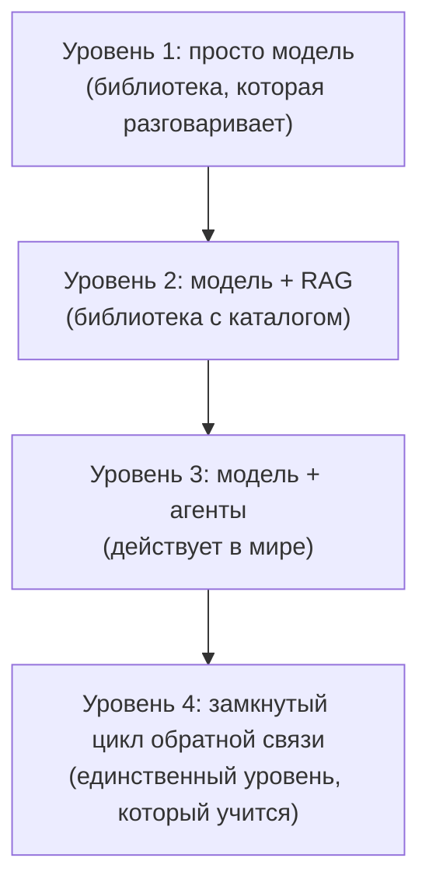
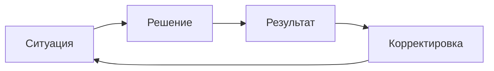

# От ученичества к машинному опыту

*Почему профессионалы редко делятся знаниями — и почему AI-системы следующего поколения воспроизводят логику ученичества*

**Alex Krol** — стратегия, AI, инфраструктура роста

[](https://github.com/alexeykrol/real-agi)
[](https://alexeykrol.com)
[](https://www.linkedin.com/in/alexkrol/)
[](https://github.com/alexeykrol)
[](https://alexeykrol.com)

> 🇬🇧 **English version:** [Eng/2_tech level/from-apprenticeship-to-machine-experience.md](../../Eng/2_tech%20level/from-apprenticeship-to-machine-experience.md)

> © 2026 Alex Krol. Эссе опубликовано для свободного чтения и обсуждения. Перепечатка, перевод, коммерческое использование — только с письменного согласия автора.

---

## Оглавление

0. [TL;DR](#tldr)
1. [Почему профессионалы редко делятся: пять причин](#1-five-reasons)
2. [Ученичество как механизм передачи знания](#2-apprenticeship)
3. [Четыре уровня AI-систем](#3-four-levels)
4. [Радикальное смещение: обслуживание как побочный эффект обучения](#4-radical-shift)
5. [Самообучение от размеченных последствий](#5-labeled-consequences)
6. [Формула: Знание < Опыт < Эволюционирующий опыт](#6-formula)
7. [Два феномена — одна структура](#7-one-structure)
8. [Sources](#sources)

---

## TL;DR <a id="tldr"></a>

Считается, что профессионалы высокого уровня редко делятся опытом из жадности или из нехватки времени. Это объяснение поверхностное. Главная причина в другом: значительная часть их мастерства не существует в форме, которая передаётся текстом. Она существует как паттерны, интуиция, микрорешения, контекстные оценки, накопленные за десятки тысяч часов практики. Книга обобщает, реальные решения контекстны. Полвека исследований неявного знания, экспертной деятельности и ученичества показывают одно и то же: между «прочитать» и «уметь» лежит зазор, который текстом не закрывается.

Исторически этот зазор закрывало ученичество — режим работы рядом с мастером, корректировка ошибок в момент совершения, постепенное движение от периферии к центру практики. Не «передача правил», а передача среды, в которой правила формируются.

Параллельная картина в AI. Модель, база знаний и агент — это всё ещё библиотека. Очень умная, с поиском, с инструментами, но библиотека. Самообучение возникает не от накопления данных. Оно возникает от накопления **размеченных последствий**: ситуация → решение → результат → корректировка. Цикл, в котором система видит, что произошло после её рекомендации, и связывает результат с гипотезой. Именно такой архив сегодня почти отсутствует в обучении моделей, и именно он ближе всего к тому, что люди называют опытом.

Это два угла одного и того же явления. Архитектура передачи опыта одинаковая у людей и у машин: ни там, ни там опыт не сводится к информации. И в обоих случаях главный дефицит — не данные, а доступ к последствиям.

---

## 1. Почему профессионалы редко делятся: пять причин <a id="1-five-reasons"></a>

Распространённое объяснение звучит просто: эксперты не делятся, потому что им невыгодно, или потому что у них нет времени, или потому что они оберегают конкурентное преимущество. Часть правды в этом есть. Но это объяснение оставляет за кадром главное. Если бы дело было только в мотивации, то нашлись бы экономические схемы, которые её исправляют — гонорары, репутация, академические позиции. И они есть. И профессионалы пишут книги, читают лекции, ведут блоги. И всё равно остаётся ощущение, что в книге сказано не всё. Что между тем, что написано, и тем, что человек реально делает, есть зазор.

Этот зазор имеет пять отдельных источников. Они складываются, и каждый по отдельности уже достаточно силён, чтобы объяснить наблюдаемую картину.

**Первое. Лучшие практики неявны.** Чем выше уровень специалиста, тем больше его знания существуют в форме паттернов, интуиции, микрорешений и контекстных оценок. Он сам не до конца осознаёт, почему принял именно такое решение. Хороший шахматист не перебирает варианты — он видит позицию. Хороший хирург не анализирует каждое движение — рука сама знает. Опыт превращается в автоматизм. Это не метафора. Полани в 1958 и 1966 годах сформулировал это в виде максимы: мы знаем больше, чем можем сказать[^1][^2]. Не «иногда не успеваем сказать», а структурно — значительная часть профессионального умения принципиально не вербализуется.

В психологии экспертизы это подтверждено десятилетиями экспериментов. Чейз и Саймон в 1973 году показали, что шахматные мастера не быстрее «думают» — они опознают паттерны на доске и извлекают целые «чанки» из долговременной памяти[^5]. Эрикссон с соавторами в 1993 году обосновали роль целенаправленной практики (deliberate practice) в формировании экспертного уровня — десятки тысяч часов структурированной отработки, без которых мастерство не появляется[^4]. Гэри Клейн на материале пожарных, военных командиров и врачей описал Recognition-Primed Decision: эксперт узнаёт ситуацию и сразу извлекает скрипт действия, минуя формальное сравнение опций[^7]. Во всех этих работах одно и то же. Мастерство — это огромная библиотека распознаваемых ситуаций, а не явный набор правил, которые можно записать.

Поэтому проблема не только в нежелании делиться. Часто человек физически не может выгрузить своё знание в текст.

**Второе. У экспертов мало времени.** Если специалист востребован, его час стоит дорого. Написать пост — час. Написать хорошую статью — день. Написать книгу — месяцы. Подготовить полноценный курс — годы. Для многих это просто плохая экономика времени: возврат от публикации меньше, чем стоимость её создания. Это банальное соображение, но его не стоит сбрасывать. Оно объясняет, почему даже те, кто хотел бы делиться, делятся в форме коротких заметок, а не структурированных описаний практики.

**Третье. Самые ценные нюансы контекстны.** Книга вынуждена обобщать. «Как запускать стартап», «как управлять компанией», «как вести переговоры». А реальные решения выглядят иначе: в ситуации А делаем Х, кроме случаев B, C и D; если рынок падает — делаем Y; если инвестор такого-то типа — Z. Если рядом ещё и сезонность, и репутационный фон, и история отношений с этим конкретным контрагентом — то Х превращается во что-то совсем другое. Книга такие развилки не вмещает. Не из-за плохого автора, а из-за природы жанра. Книга передаёт **карту местности**, а не опыт путешествия.

Дональд Шён в 1983 году описал это как reflection-in-action: профессионалы — архитекторы, инженеры, психотерапевты, городские планировщики — импровизируют в процессе работы, опираясь на знание, которое не могут полностью артикулировать[^9]. Они решают не задачи из учебника, а проблемы, которые не сформулированы. Сама задача в реальной практике сначала строится, а потом уже решается. Книга начинается с готовой задачи. Это уже потеря.

**Четвёртое. Обратный эффект.** Очень сильные специалисты иногда делятся больше всех. Деньги уже заработаны, репутация важнее секретов, а большая часть успеха лежит не в знании, а в исполнении. Многие венчурные инвесторы, известные программисты, учёные публикуют огромное количество материалов. Не из альтруизма. Из понимания: прочитать не равно сделать. Можно выложить весь рецепт ресторана. Это не создаст тысячи ресторанов такого же уровня. И сильный специалист это понимает раньше других. Поэтому он спокойно делится — он знает, что главное не передаётся.

**Пятое. Парадокс информации и среды.** Главное — здесь. Люди системно переоценивают ценность информации и недооценивают ценность среды. Если взять книгу очень сильного человека, там часто есть почти всё необходимое. Но отсутствует то, что не упаковывается: обратная связь, корректировка ошибок, приоритеты, понимание «что важно именно сейчас», накопленные тысячи часов практики. Ученик может читать ту же книгу, что и мастер, и не видеть половины того, что в ней заложено. Не потому что ученик глупее. Потому что у него нет среды, в которой эти страницы оживают.

Отсюда устойчивое ощущение, что эксперт что-то скрывает. Иногда скрывает. Но гораздо чаще проблема в другом: значительная часть мастерства передаётся не через текст, а через совместную практику, наблюдение и накопленный опыт. Давенпорт и Прусак в большой работе по knowledge management фиксируют это как системный барьер: организации не могут передать tacit knowledge без передачи самого режима работы, в котором это знание возникает[^11].

Исторически именно поэтому существовали системы ученичества. Ремесленники, мастера боевых искусств, хирурги, учёные. Не потому что они жадничали знаниями. А потому что значительную часть знаний невозможно было надёжно передать книгой. И сегодня это всё ещё верно.

---

## 2. Ученичество как механизм передачи знания <a id="2-apprenticeship"></a>

Ученичество выглядит как архаичный институт. Кажется, что современное образование его заменило: учебники, лекции, курсы, сертификации. Но если присмотреться к областям, где результат критичен, окажется, что ученичество никуда не делось. Хирургов до сих пор учат через резидентуру. Военных пилотов — через инструктора в кабине. Юристов — через младшие позиции в фирме, где они сначала смотрят, как ведут дела старшие. Программистов в сильных командах — через mentorship и code review, не через MOOC. Везде, где ставки высокие, формальное обучение оказывается прелюдией к реальному, а реальное устроено как ученичество.

Объяснение этому дали Лейв и Венгер в 1991 году в работе «Situated Learning». Они описали обучение как процесс legitimate peripheral participation — законного периферийного участия[^8]. Новичок не учится отдельно от практики. Он сразу включён в реальную деятельность сообщества — но на периферии, с ограниченной ответственностью, под прикрытием старших. Он делает настоящие задачи, но менее рискованные. Видит, как работают опытные. Постепенно, по мере роста компетенции, движется к центру — берёт на себя более сложные задачи, более ответственные роли. Обучение здесь — не передача правил из головы учителя в голову ученика. Это постепенная социализация в практикующее сообщество.

Главный механизм такой социализации — не лекция, а корректировка. Ошибки исправляются в момент совершения, не post-hoc. Старший видит, что младший делает не так, и говорит — или показывает — прямо сейчас. Не через неделю на разборе. Не на экзамене в конце курса. Сейчас. Это создаёт обратную связь с минимальной задержкой между действием и оценкой, и именно эта обратная связь учит. Не лекция о том, как правильно. А ощущение, что вот это движение — неточное, а вот это — правильное, и почему.

Коллинз, Браун и Ньюман в 1989 году попытались формализовать эту механику для когнитивных навыков и выделили шесть методов когнитивного ученичества: modeling (мастер показывает, как делает), coaching (мастер наблюдает и корректирует), scaffolding (мастер даёт временную поддержку, которую постепенно убирает), articulation (ученика побуждают проговорить, что он делает), reflection (сравнение своего исполнения с исполнением мастера), exploration (ученик начинает ставить собственные задачи)[^10]. Все шесть требуют присутствия мастера. Все шесть невозможны через книгу.

Если свести это к одной фразе, ученичество — это передача не правил, а **режима работы рядом с тобой**. Среды, в которой знание оживает.

Здесь и возникает мост к AI. Если бы можно было воспроизвести «мастер рядом с тобой, который видит каждый твой шаг и поправляет в момент совершения ошибки», это и было бы решение проблемы передачи мастерства. Воспроизведением, не имитацией. Не «робот, который читает лекцию». А режим работы, в котором система видит контекст, видит действие, видит результат, и подстраивается под конкретного ученика на конкретной задаче. Именно это обещают — не всегда честно, но обещают — AI-системы следующего поколения. Что они на самом деле умеют, и насколько они близки к этому обещанию, разберём дальше.

---

## 3. Четыре уровня AI-систем <a id="3-four-levels"></a>

Когда говорят про «AI», обычно имеют в виду модель — большой языковой движок, который отвечает на вопросы. Это очень узкий взгляд. Реальные системы, которые делают полезную работу, строятся из нескольких слоёв, и качество результата определяется не столько самим движком, сколько устройством этих слоёв. Я бы выделил четыре уровня.



**Уровень 1. Просто модель.** Сильные стороны очевидны: широкий кругозор, способность к обобщениям, формальное рассуждение. Слабые стороны столь же очевидны: модель не знает вашего контекста, не знает ваших данных, не знает ваших целей, не помнит результатов прошлых действий. Каждый разговор начинается с нуля. Модель отвечает из того, что было в её обучении плюс из того, что вы ей рассказали в текущем разговоре. И всё. Для большого класса задач этого достаточно — «объясни мне X», «перепиши Y», «придумай варианты Z». Но как только речь идёт о реальной работе со специфическим контекстом, модель в чистом виде упирается в свою главную слабость: она не знает вас.

**Уровень 2. Модель плюс качественная база знаний.** Сюда подключают внутренние документы, личные заметки, переписку, кейсы, исследования, историю проектов. Архитектурно это называется retrieval-augmented generation — RAG[^12]. Модель остаётся той же, но перед каждым ответом получает релевантные куски из базы и опирается на них при генерации. Для большинства профессиональных задач это уже огромный скачок. Часто именно здесь находится основной прирост качества — модель перестаёт «фантазировать в общем» и начинает работать с конкретикой пользователя.

Важно понимать, что это всё ещё библиотека. Очень умная, с хорошим поиском. Но библиотека. Система знает то, что в неё положили, и не знает того, чего не положили. Она не делает действий в мире и не видит результатов своих рекомендаций. Она отвечает.

**Уровень 3. Модель плюс база плюс агентная инфраструктура.** Здесь начинается качественно другой класс. Агент может искать недостающую информацию сам, задавать уточняющие вопросы, проверять гипотезы, вызывать инструменты, отслеживать промежуточные результаты, вести долгосрочную память, работать с календарём, документами, CRM, кодом, инфраструктурой. Архитектурно это паттерны вроде ReAct, где модель чередует reasoning и action[^13], или Toolformer, где модель сама решает, какой внешний API вызвать и как встроить результат[^14]. Система превращается из отвечающей в действующую.

Это огромный шаг. Но и это ещё не предел.

**Уровень 4. Модель плюс база плюс агенты плюс замкнутый цикл обратной связи.** Это система, которая знает: что она рекомендовала, что пользователь сделал на основе рекомендации, что получилось, что не получилось. И корректирует свои будущие рекомендации на основании этой истории. Это уже не консультация и не поиск. Это обучение. На каждом цикле система меняет себя — не модель в смысле весов, а свою модель мира, свой набор гипотез о том, что работает, а что нет, в каких контекстах.

Большинство людей сегодня переоценивают значение самой модели и недооценивают значение инфраструктуры вокруг неё. Условно говоря, разница между GPT-6 и GPT-7 окажется меньше, чем между GPT-6 без контекста и GPT-6 с вашими документами, памятью, инструментами и историей действий. Качество системы определяется в первую очередь качеством контекста, памяти, инструментов и обратной связи — а не качеством модели в чистом виде.

Это уже видно по структуре конкуренции. Сильные команды конкурируют не моделями. Модели становятся инфраструктурным слоем — как когда-то стали базы данных. Ценность создаётся не СУБД и не движком, а тем, что построено вокруг: данными, рабочими процессами, памятью, агентной архитектурой, накопленным опытом системы. Это нормальный ход индустриального развития. Сначала ценен сам новый компонент, потом он коммодитизируется и ценность смещается на уровень выше.

Здесь, на четвёртом уровне, заканчивается обычная агентная архитектура и начинается то, что я хочу назвать отдельно. Потому что замкнутый цикл обратной связи — это не доработка третьего уровня. Это смена режима работы системы целиком.

---

## 4. Радикальное смещение: обслуживание как побочный эффект обучения <a id="4-radical-shift"></a>

Для меня агент по умолчанию — не просто цикл обратной связи. Это система, в которой **самообучение является генеральной фоновой функцией**, а запросы пользователей — это просто учебные кейсы и источник данных. Это довольно радикальное смещение акцента, и оно меняет всё.

В обычной SaaS-логике причинность простая: пользователь платит, система решает задачу пользователя. Сервис существует ради сервиса. Если задача решена — деньги отработаны, цикл закрыт. Качество системы оценивается через удовлетворённость каждого отдельного пользователя в моменте.

В описываемой модели логика другая: пользователь платит, система решает задачу пользователя, одновременно извлекает уроки из этого решения, обновляет свою модель мира, становится ценнее для всех последующих пользователей. Каждый кейс одновременно — услуга, эксперимент, источник данных, источник новых гипотез. Сервис превращается в побочный эффект процесса непрерывного обучения.

Это не риторическая фигура. Это реальная архитектурная разница. В первом случае базой системы является корпус документов и набор инструментов. Во втором случае базой становится журнал эволюции — последовательность гипотез, проверок и корректировок. Документы лежат в качестве справочного материала. Инструменты — в качестве исполнителей. А ценность накапливается в журнале: что система предполагала, что она сделала, что произошло в результате, как она пересмотрела свою модель.

Из этого следует ряд практических вещей.

Первое. Ценность одного диалога перестаёт быть локальной. В обычной SaaS-модели хороший диалог — это диалог, который удовлетворил конкретного пользователя. В новой модели хороший диалог — это диалог, после которого система знает больше, чем до него. Эти два критерия могут совпадать, а могут и нет. Иногда лучший с точки зрения обучения кейс — это тот, где система ошиблась и узнала, что её гипотеза была неверна. Иногда лучший с точки зрения сервиса кейс — это тот, где она дала очевидный быстрый ответ, не получив никакого нового знания.

Второе. Внимание системы смещается с ответов на траектории. Ответ почти ничего не стоит, потому что хорошая модель сегодня даст вам сто разумно выглядящих ответов на любой вопрос. Ценность — в цепочке: запрос → гипотеза → действие → результат → анализ → обновление знаний. Полная цепочка, а не один отдельный ход. Поэтому система, которая собирает только финальные ответы, копит мало. Система, которая собирает полные траектории — копит то, что потом можно использовать для обучения.

Третье. База знаний становится не архивом, а живым организмом. Архив документов — это статика: что-то положили, что-то достали. Журнал эволюции — это динамика: каждая новая запись связана с предыдущими, новые гипотезы переоценивают старые, отдельные кейсы переходят в обобщения, обобщения проверяются новыми кейсами. Это уже не про хранение. Это про рост.

И здесь возникает интересная асимметрия. Обычная SaaS-логика поощряет пользователя задать вопрос, получить ответ, закрыть окно. Чем быстрее цикл — тем лучше воспринимается сервис. Логика обучающейся системы поощряет совсем другое: чтобы пользователь рассказал, что он сделал на основе рекомендации, и что из этого вышло. Чтобы вернулся через неделю, через месяц, через квартал. Чтобы цикл был длинным, а не коротким. Эти две логики плохо совместимы. Их трудно встроить в один и тот же интерфейс. Возможно, для систем, которые всерьёз идут в самообучение, потребуется отдельный режим работы — не разговорный, а проектный, с длинными циклами проверки и пересмотра. Это вопрос ближайших нескольких лет.

Радикальное смещение можно сформулировать одной фразой: обслуживание пользователя становится не целью системы, а способом, которым система учится. И как только это становится правдой архитектурно, а не риторически, всё дальнейшее поведение системы меняется.

---

## 5. Самообучение от размеченных последствий <a id="5-labeled-consequences"></a>

Дальше — самый важный технический поворот всего рассуждения.

Часто говорят, что самообучение возникает от накопления данных. Чем больше данных — тем умнее система. Это неточно. Самообучение возникает не от накопления данных. Оно возникает от накопления **размеченных последствий**.



Разница принципиальная. Покажу на двух примерах.

Плохой кейс. Пользователь спросил — агент ответил — диалог закончился. У системы остался лог: запрос, ответ. И всё. Что произошло после этого ответа в реальной жизни пользователя — система не знает. Использовал ли он рекомендацию или забыл. Принесла ли она результат или нет. Был ли результат тем, который ожидался, или совсем другим. Ценность этого лога для обучения — почти нулевая. Это просто запись разговора. Если у системы миллион таких логов, у неё миллион записей разговоров и ноль обучающих примеров.

Хороший кейс. Пользователь спросил — агент предложил решение — пользователь внедрил — через месяц выросла выручка на 30% — агент связал результат с гипотезой. Вот это уже обучающий пример. Здесь есть всё: ситуация, действие, наблюдаемое последствие, временной разрыв, attribution — связь результата с конкретной рекомендацией. Из такого примера можно учиться. И один такой пример ценнее тысячи логов первого типа.

Поэтому главный дефицит будущих агентных систем будет не в моделях и не в данных. А в доступе к последствиям своих рекомендаций. Это совершенно не та проблема, которую решает RAG или агентность. Это проблема архитектуры обратной связи, и её отдельно нужно строить.

Идея размечать последствия не новая в машинном обучении. Кристиано с соавторами в 2017 году показали, что RL-агента можно эффективно учить через попарные предпочтения человека вместо явно заданной reward function, и это работает на менее чем 1% его взаимодействий со средой[^15]. Уянг с соавторами в 2022-м применили эту логику к языковым моделям в работе InstructGPT — на основе RLHF получили модель 1.3B, которую люди предпочитали в большинстве сравнений GPT-3 175B, в сто раз большей[^16]. Главный урок этих работ не в численных результатах, а в архитектурном принципе: обратная связь — это отдельный контур, который накапливается отдельно от основной модели и через специальный механизм меняет её поведение. То же самое нужно сделать на уровне реальных последствий в реальном мире, не только на уровне человеческих предпочтений в моменте.

Здесь возникает более глубокий вопрос — про causal attribution. Связать результат с рекомендацией не так просто. Корреляция — не причина. Если после моего совета у пользователя выросла выручка, это могло быть из-за совета, а могло быть из-за сезонности, или нового сотрудника, или удачного запуска конкурента в смежной нише, который перевёл внимание рынка. Без causal reasoning размеченные последствия превращаются в шум. Перл в фундаментальной монографии по causality показал, что разделение корреляции и причины — это не вопрос статистики, а вопрос структурных моделей и counterfactual reasoning[^17]. Машинное обучение в массе своей этой технике пока не владеет. Когда речь идёт о размеченных последствиях, причинная атрибуция — это не приятное дополнение, а необходимое условие. Без него мы копим не опыт, а суеверия.

Если довести логику размеченных последствий до конца, система постепенно строит не базу знаний, а **базу причинно-следственных связей**. И это уже совсем другой объект, чем то, что мы называем knowledge base. Knowledge base отвечает на вопрос «что известно». Causal base — на вопрос «что происходит, когда мы делаем такое-то в такой-то ситуации». Учебник знает, что обычно рекомендуют. Практик знает, что обычно происходит после того, как это рекомендуют. Это разные уровни знания, и второй несравнимо труднее достичь.

Самым ценным активом такой системы оказывается даже не корпус документов и не память диалогов. А огромный архив вида: ситуация → решение → результат → корректировка модели. Именно такой архив сегодня почти отсутствует в обучении моделей. И именно он ближе всего к тому, что люди называют опытом.

Здесь становится виден точный смысл фразы «опыт нельзя загрузить из книги». Книга содержит знания. Опыт — это не знание. Опыт — это history of attempts с разметкой результатов. И его можно накапливать только проживая, не читая. У людей это занимает годы практики. У систем — годы циклов работы. Сократить нельзя, потому что природа того, что накапливается, требует времени и реальных вмешательств в реальность.

---

## 6. Формула: Знание < Опыт < Эволюционирующий опыт <a id="6-formula"></a>

Если попытаться записать эту иерархию строго, получается цепочка:

```
Модель < Модель + знания < Модель + знания + агенты <
  Модель + знания + агенты + память <
  Модель + знания + агенты + память + цикл решений и последствий
```

Каждая стрелка — не просто добавление компонента. Это качественный сдвиг возможностей. Модель сама по себе обобщает. Модель плюс знания — отвечает по специфике. Модель плюс знания плюс агенты — действует. Модель плюс знания плюс агенты плюс память — действует с контекстом из прошлого. Модель плюс знания плюс агенты плюс память плюс цикл решений и последствий — учится из собственного опыта.

Если сократить до сути:

> **Знание < Опыт < Эволюционирующий опыт**

Где:

- **Знание** — документы, книги, статьи, кейсы. Статика. То, что лежит и ждёт, пока его прочтут.
- **Опыт** — история действий и результатов. Динамика. То, что было сделано и что из этого вышло.
- **Эволюционирующий опыт** — система, которая меняет свои будущие решения на основании предыдущих результатов. Развитие. То, что становится другим во времени.

Метафорически это переход от библиотеки к организму. Библиотека хранит знания. Агент хранит знания и действует. Обучающийся агент хранит знания, действует и меняет себя. Между этими тремя состояниями такая же разница, как между книгой о плавании, человеком на бортике бассейна и человеком, который плавает каждый день уже двадцать лет.

С точки зрения создаваемой ценности формулу можно записать ещё жёстче:

> **Ценность ≈ Качество модели × Качество знаний × Качество обратной связи × Время обучения системы**

Последний множитель обычно игнорируют. Между тем именно он определяет долгосрочную траекторию. Две системы могут стартовать одинаковыми — одинаковая модель, одинаковая база, одинаковый агентный слой. Через пять лет одна накопит миллион циклов «проблема → решение → результат», другая останется просто очень умным чатом. Их интеллектуальная ценность начнёт расходиться не линейно, а на порядки. Это эффект, который трудно почувствовать в моменте, потому что в первый день разницы нет. Но через год — есть. Через пять лет — она уже непреодолимая для тех, кто стартует с нуля.

Это, кстати, важно для понимания, почему ранний старт критичен. Не из-за «first mover advantage» в классическом маркетинговом смысле. А потому что время, проведённое системой в цикле размеченных последствий, нельзя купить, нанять или скопировать. Его можно только прожить. И каждый день, который система работает в режиме обучения, увеличивает зазор между ней и любой системой, которая стартует позже.

Главный актив такой системы — не LLM, не RAG, не агент. Главный актив — это **накапливаемая история успешных и неуспешных вмешательств в реальность**. Это уже очень близко к тому, что можно назвать машинным опытом, а не машинным знанием.

И это, наконец, выводит на ту точку, ради которой всё рассуждение и велось.

---

## 7. Два феномена — одна структура <a id="7-one-structure"></a>

Я рассказывал две вроде бы разные истории. Одна — про то, почему профессионалы редко делятся знаниями. Вторая — про то, как устроены AI-системы следующего поколения. Между ними нет очевидной связи, кроме того, что обе про знание. Но если присмотреться к структуре, окажется, что это один феномен под двумя углами.

И там, и там есть зазор между тем, что упаковывается в текст, и тем, что определяет результат. У людей этот зазор — между книгой мастера и навыком мастера. У машин — между корпусом данных и реальной полезностью системы. В обоих случаях разрыв не закрывается ни количеством, ни качеством текста. Книги о tacit knowledge сами не передают tacit knowledge. Сколько бы данных ни закачивали в обучение модели, она остаётся в режиме «знает много, не умеет жить».

И там, и там зазор закрывается через одинаковый механизм. У людей — через ученичество: режим работы рядом с мастером, корректировка ошибок в момент совершения, постепенное движение от периферии к центру практики. У машин — через накопление размеченных последствий: ситуация → решение → результат → корректировка. Структурно это одно и то же: цикл, в котором действие производится в реальности, реальность отвечает, и эта реакция меняет следующее действие. Не «лекция», а «жить рядом с задачей и видеть, что получается».

Сходство не случайное. Оно проистекает из природы того, что накапливается. И в человеке, и в системе накапливается не информация, а карта последствий — то, что обычно происходит после того, как делается такое-то в таком-то контексте. Такая карта не может быть построена иначе, чем через реальные попытки. Её нельзя ни написать заранее, ни скачать у мастера. Её приходится прожить. И в этом смысле никакой принципиальной разницы между человеческой и машинной траекторией нет. Разная скорость, разная архитектура, разная природа носителя — но одинаковая структурная необходимость.

Из этого симметрия следует одно неудобное следствие. Если для людей мы знаем, что чтение книги мастера без работы рядом с мастером даёт половинчатый результат — то для AI-систем работает то же самое. Модель, обученная на огромном корпусе текстов, но без цикла размеченных последствий, — это машинный аналог ученика, который прочитал все книги, но никогда не работал рядом с мастером. Знаний у неё много. Опыта — нет. И в той области, где разница между знанием и опытом критична, она будет давать тот же тип ошибок, что и начитанный, но неопытный человек: формально правильные ответы, которые не выдерживают столкновения с реальностью в её конкретных оттенках.

И обратное тоже верно. Параллель не означает, что AI заменит мастеров. Это слишком прямолинейный вывод. Она означает другое: что архитектура передачи опыта одинаковая для людей и для машин, и в обоих случаях не сводится к информации. Для людей это значит, что недооценка ученичества — это недооценка единственного исторически работающего механизма передачи мастерства. Для систем это значит, что главный дефицит у будущих AI — не вычисления и не данные, а доступ к последствиям. Тот же дефицит, что у человеческого ученика, который читает книгу мастера, но не работает рядом с мастером.

Когда-нибудь, возможно, эти два контура замкнутся друг на друга — система с накопленным опытом тысяч пользователей будет работать рядом с практикующим профессионалом так, как раньше работал мастер рядом с подмастерьем. Но это уже отдельный сюжет. Базовая структура — одна, и она единственная.

То, что веками воспроизводило ученичество, теперь воспроизводится в машинной архитектуре. Не потому что архитекторов AI-систем вдохновили работы Лейв и Венгер — большинство из них этих работ не читали. А потому что задача одна, и природа решения определяется задачей, а не людьми, которые её решают. Опыт нельзя упаковать. Его можно только прожить. И на этом строится всё остальное.

---

## Sources <a id="sources"></a>

[^1]: Polanyi, M. (1966). *The Tacit Dimension*. University of Chicago Press, Chicago. URL: https://press.uchicago.edu/ucp/books/book/chicago/T/bo6035368.html

[^2]: Polanyi, M. (1958). *Personal Knowledge: Towards a Post-Critical Philosophy*. University of Chicago Press, Chicago. URL: https://press.uchicago.edu/ucp/books/book/chicago/P/bo19722848.html

[^4]: Ericsson, K. A., Krampe, R. T., & Tesch-Römer, C. (1993). The role of deliberate practice in the acquisition of expert performance. *Psychological Review*, 100(3), 363–406. URL: https://psycnet.apa.org/doi/10.1037/0033-295X.100.3.363

[^5]: Chase, W. G., & Simon, H. A. (1973). Perception in chess. *Cognitive Psychology*, 4(1), 55–81. URL: https://doi.org/10.1016/0010-0285(73)90004-2

[^7]: Klein, G. (1998). *Sources of Power: How People Make Decisions*. MIT Press, Cambridge, MA. URL: https://mitpress.mit.edu/9780262611466/sources-of-power/

[^8]: Lave, J., & Wenger, E. (1991). *Situated Learning: Legitimate Peripheral Participation*. Cambridge University Press, Cambridge. URL: https://doi.org/10.1017/CBO9780511815355

[^9]: Schön, D. A. (1983). *The Reflective Practitioner: How Professionals Think in Action*. Basic Books, New York. URL: https://www.basicbooks.com/titles/donald-a-schon/the-reflective-practitioner/9780465068784/

[^10]: Collins, A., Brown, J. S., & Newman, S. E. (1989). Cognitive apprenticeship: Teaching the crafts of reading, writing, and mathematics. In L. B. Resnick (Ed.), *Knowing, Learning, and Instruction: Essays in Honor of Robert Glaser* (pp. 453–494). Lawrence Erlbaum Associates, Hillsdale, NJ. URL: https://www.aft.org/sites/default/files/Collins.pdf

[^11]: Davenport, T. H., & Prusak, L. (2000). *Working Knowledge: How Organizations Manage What They Know* (revised ed.). Harvard Business School Press, Boston. URL: https://store.hbr.org/product/working-knowledge-how-organizations-manage-what-they-know/3014

[^12]: Lewis, P., Perez, E., Piktus, A., et al. (2020). Retrieval-augmented generation for knowledge-intensive NLP tasks. In *Advances in Neural Information Processing Systems 33 (NeurIPS 2020)*. arXiv: https://arxiv.org/abs/2005.11401

[^13]: Yao, S., Zhao, J., Yu, D., et al. (2023). ReAct: Synergizing reasoning and acting in language models. In *International Conference on Learning Representations (ICLR 2023)*. arXiv: https://arxiv.org/abs/2210.03629

[^14]: Schick, T., Dwivedi-Yu, J., Dessì, R., et al. (2023). Toolformer: Language models can teach themselves to use tools. In *Advances in Neural Information Processing Systems 36 (NeurIPS 2023)*. arXiv: https://arxiv.org/abs/2302.04761

[^15]: Christiano, P., Leike, J., Brown, T. B., et al. (2017). Deep reinforcement learning from human preferences. In *Advances in Neural Information Processing Systems 30 (NeurIPS 2017)*. arXiv: https://arxiv.org/abs/1706.03741

[^16]: Ouyang, L., Wu, J., Jiang, X., et al. (2022). Training language models to follow instructions with human feedback. In *Advances in Neural Information Processing Systems 35 (NeurIPS 2022)*. arXiv: https://arxiv.org/abs/2203.02155

[^17]: Pearl, J. (2009). *Causality: Models, Reasoning, and Inference* (2nd ed.). Cambridge University Press, Cambridge. URL: https://doi.org/10.1017/CBO9780511803161
