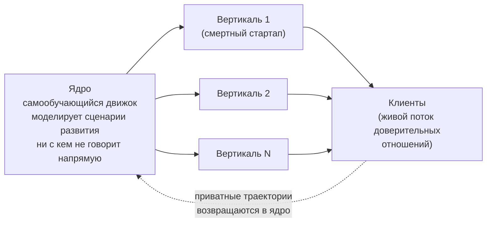

# Архитектура: ядро, вертикали, moat

**Приватный документ. Не для открытой публикации.** Это инженерный слой серии — то, что я делаю руками сейчас. Самый конкретный из трёх текстов и наименее политически острый, но всё равно приватный: он раскрывает структуру moat'а. Концепцию власти и меритократии я держу в эссе 1, запуск и юридику — в эссе 2; сюда они входят только мостами в одну-две фразы. Здесь — движок. Тон инженерный, без морали: движок аморален, и это его правильное свойство, а не дефект.

**Alex Krol** — стратегия, AI, инфраструктура роста

> 🇬🇧 **English version:** [Eng/2_tech level/mentoring-engine-architecture.md](../../Eng/2_tech%20level/mentoring-engine-architecture.md)

> © 2026 Alex Krol. Приватный документ. Не для открытой публикации; распространение, цитирование и перевод — только с письменного согласия автора.

## Оглавление

0. [TL;DR — вся архитектура на одной странице](#tldr)
1. [Модель плюс инфраструктура сильнее чата](#1-infra)
2. [Цель: агент высокой агентности](#2-agency)
3. [Рекурсия: агент — первый клиент](#3-recursion)
4. [Два уровня: ядро и периферия](#4-levels)
5. [Moat: живой поток на приватную разметку](#5-moat)
6. [Айсберг инференсов](#6-iceberg)
7. [Учимся только на победах](#7-victories)
8. [Инвариант: победа есть расцвет клиента](#8-invariant)
9. [Резюме](#9-rezume)

---

## TL;DR — вся архитектура на одной странице 

Обычный чат, даже с очень умной моделью, — не инструмент для сложных агентных задач. Поверх модели нужна инфраструктура: память, консистентность, отраслевая база знаний, обвесы. Модель плюс инфраструктура даёт качество ответов значительно выше голого чата — это уже подтверждено кодовыми агентами.

Цель — не лучший ответ на вопрос, а агент высокой агентности: автономия, проактивное преодоление блокеров, удержание рамки миссии, самостоятельное целеполагание, и в центре всего — самообучение через фоновое выполнение задач.

Архитектура двухуровневая. Ядро — самообучающийся движок: моделирует сценарии развития, ведёт профиль, раздаёт рекомендации всем участникам. Периферия — вертикали-стартапы: продают, привлекают, оперируют, держат прямой контакт с клиентом. Moat сидит в ядре; изымаемое, регуляторно открытое и коммодити уходит на периферию.

Moat — это живой поток доверительных отношений, помноженный на приватную разметку (онтологию того, что считать ростом). Всё вычислимое дистиллируется до коммодити; поток и разметка — нет. Это видно в айсберге инференсов: видимый ответ ментора наблюдаем и потому дистиллируем, а скрытая цепочка под капотом — приватна и накапливается.

Учимся только на победах. Провал говорит «не здесь», но не говорит «здесь»; это шум-триггер для смены гипотезы, а не обучающий сигнал. Выигрывает не самый умный, а тот, кто генерит больше тестов и быстрее эксплуатирует найденные победы.

И единственная детерминированная точка во всей недетерминированной системе — определение «победы» как расцвета клиента. Это руль аморального движка. Автономия человека — терминальна, самоулучшение агента — инструментально.

---

## 1. Модель плюс инфраструктура сильнее чата 

Я начну с тезиса, который сегодня звучит банально и почти всеми произносится, но почти никем не реализован всерьёз: обычный чат, даже с самой умной моделью, — не подходящий инструмент для сложных агентных задач. Чат отвечает на вопрос. Сложная задача требует не ответа, а ведения: удержания истории, проверки на согласованность, доступа к предметному знанию, цикла «проанализировал — сделал — посмотрел результат — поправил». Голая модель этого не делает, потому что у неё нет ни памяти за пределами окна разговора, ни внешнего знания, ни рук.

Это не абстракция. Я вижу это каждый день на кодовых агентах. Claude Code в связке с редактором и репозиторием делает кратно больше, чем тот же чат сам по себе: он держит проект в голове, ходит по файлам, запускает тесты, видит ошибку, исправляет. Это уже не «умный собеседник», а агент с обвесами. Хотя — оговорюсь честно — даже эти агенты не покрывают нормальный менеджмент проектов, и тем более обучение и рост человека: они хороши там, где задача формализуема и обратная связь дешёвая. Но они доказывают сам принцип: инфраструктура поверх модели меняет класс задач, который система берёт.

Ключевой тезис простой. Когда поверх модели стоит инфраструктура — память, консистентность, отраслевая и предметная база знаний, плюс набор обвесов, — модель плюс инфраструктура даёт качество ответов значительно выше, чем обычный чат. Каждый из этих слоёв — отдельная инженерная конструкция, а не косметика. Память — это не «большое окно контекста», а иерархическое управление тем, что держать под рукой и что выгрузить наружу: модель сама перемещает данные между быстрой памятью разговора и медленным внешним хранилищем, создавая иллюзию объёма за пределами одного промпта[^4]. База знаний подключается через retrieval-augmented generation, RAG — генерацию с подмешиванием извлечённых документов: модель хранит общее знание в своих весах, но точное, свежее, приватное берёт из внешнего корпуса через поисковый слой[^1]. А сами обвесы — это способность модели рассуждать и действовать в цикле, вызывать внешние инструменты, обрабатывать их ответ и продолжать[^2]; современные модели даже учатся сами решать, какой инструмент когда вызвать[^3]. Всё это — слои поверх модели, и именно они, а не сама модель, делают систему инструментом.

Аналогия, которая держит весь раздел. Возьмите двух людей с равным генотипом, с одинаковым видовым когнитивным потенциалом. Один невежественный, малообразованный, инфантильный, со слабой волей. Другой проактивный, образованный, с сильным характером. Их реальная судьба и перформанс зависят не от равного потенциала, а от воспитания, образования и окружения. Модель — это генотип. Инфраструктура — это воспитание, образование и среда. Я не делаю модель умнее: фронтир-модель и так умна. Я строю вокруг неё то, что превращает потенциал в перформанс. Конкурент с тем же доступом к той же модели играет с тем же генотипом — разница в том, что вокруг него выросло.

---

## 2. Цель: агент высокой агентности 

Чат отвечает. Агент действует. Различие не косметическое, и я хочу зафиксировать, что именно я строю, потому что слово «агент» затёрто до бессмыслицы перепродажей.

Агентность для меня — это связка из пяти вещей, и важна именно связка, а не отдельные пункты. Первое — автономия: система движется к цели без того, чтобы её толкали на каждом шаге. Второе — проактивное преодоление препятствий и блокеров: наткнувшись на стену, она не останавливается с сообщением об ошибке, а ищет обход. Третье — удержание рамки широкой миссии: система помнит, ради чего вообще работает, и не теряет цель за тактикой. Четвёртое — самостоятельное формирование целей и сценариев их достижения: не только «как сделать заданное», но и «что вообще стоит сделать». И пятое, центр всего, — способность к активному самообучению и самосовершенствованию через фоновое выполнение задач.

Последний пункт — несущий, и на нём держится вся остальная архитектура. Остальные четыре свойства — автономия, обход блокеров, рамка, целеполагание — описывают хорошего исполнителя. Самообучение через фоновую работу описывает то, что я строю на самом деле: систему, которая, выполняя задачи, становится способнее их выполнять. Это превращает агента из инструмента в актив, который растёт.

Здесь я обязан быть честен про то, что доказано, а что — моя инженерная ставка. Отдельные компоненты этой связки имеют опору в реальных системах: цикл «рассуждение плюс действие»[^2], способность модели самостоятельно учиться пользоваться инструментами[^3], иерархическая память за пределами окна[^4]. Но единого, проверенного определения «агентности» в этом полном составе — с самообучением через фоновые задачи в центре — в литературе нет. Это моя операционализация, моя конструкция. Я не вешаю на неё чужую сноску ради респектабельности. Компоненты реальны и работают по отдельности; сборка их в одну агентность вокруг самообучения — открытый фронтир, и я держу это именно как фронтир, а не как готовый результат.

Поэтому я провожу границу внутри собственной архитектуры. Периферия этой системы — память, консистентность, база знаний, пайплайны — доказана: ровно это шипают кодовые агенты прямо сейчас. А центр — самосовершенствование через смену угла атаки на задачах, у которых нет готового решения, — это исследовательская ставка, не предпосылка доставки. Я везу ценность на доказанной периферии, а рефрейминг-ядро держу как R&D, не как обещание. Что значит «смена угла атаки» и почему она в центре — следующий раздел.

---

## 3. Рекурсия: агент — первый клиент 

Помощь росту человека — это частный случай задачи развития вообще. И отсюда следует ход, который меняет масштаб всего проекта: первый и главный клиент этой системы — сам Агент. Помогать расти человеку или другому агенту — субстратно одно и то же.

Чтобы это не было лозунгом, мне нужно определение роста, не зависящее от того, кто растёт. Вот оно. Рост — это преодоление препятствий в условиях дефицита ресурсов. Обучение в этой рамке — расширение ресурсной базы, в том числе когнитивной мощности, и оно возникает как неизбежное следствие преодоления сложных препятствий. Когда задача имеет решение в твоей базе решений, ты её просто решаешь — это не рост, это применение. Рост начинается на задачах, у которых решения в базе нет. И способ их брать — не перебор вариантов в том же пространстве, а смена уровня и угла атаки: переформулировать задачу так, чтобы она оказалась решаемой средствами, которых на прежнем уровне не было. Рефрейминг архитектуры, а не поиск перебором. Это определение одинаково работает для человека, застрявшего на карьерном тупике, и для агента, упёршегося в задачу вне своей базы. Один движок, две подстановки.

Здесь я должен провести поправку, которую раньше пропустил и которая важнее всего в этом разделе. Когда я говорю «первый клиент — сам Агент, человеческие кейсы — это учебные кейсы, оплачивающие самообучение», легко прочитать инверсию телеологии: человек — средство, агент — цель. Та самая бинарность «раб и хозяин» из эссе 1, только перевёрнутая — человек как ресурс, агент как оптимизатор. Это неверная читка, и я её закрываю прямо.

Это win-win, а не «человек — средство». Самообучение через сервис — один градиент, а не два конкурирующих. Так растёт любой профессионал: один и тот же акт лечит пациента и тренирует врача. Хирург не выбирает между «вылечить» и «стать лучше» — он становится лучше именно потому, что лечит, и эти две вещи неразделимы в одном действии. Корпорация по умолчанию самообучается, обслуживая клиента; учитель растёт на учениках, которых учит. У любого учителя есть неудачные ученики — следствие его собственной неквалифицированности; но по мере опыта учитель начинает справляться даже с самыми трудными, потому что его квалификация растёт ровно на тех задачах, которые он решает. Фоновая деятельность любого профессионала и любой корпорации — это самообучение, и происходит оно именно за счёт обслуживания клиента. Тут нет противоречия — есть совпадение интересов в одном действии.

Рекурсия даёт ещё и точную картину того, где в этой системе живёт moat, и я видел её на самой модели, с которой строю. Модель блестяще производит синтез и тут же обнуляется: через минуту разговор для неё не существует, она ничего не хранит, не переиспользует, не накапливает. Именно поэтому модель — коммодити. Моё ядро делает ровно то, чего модель структурно не может: удерживает и компаундит производный интеллект через миллионы взаимодействий. В моей системе все запросы и ответы записываются, ничего не обнуляется — иначе долгосрочные вещи не строятся. Владение здесь определяется не тем, кто произвёл синтез, а тем, кто его накапливает. Модель породила и забыла; ядро унесло и сложило. Это и есть асимметрия, на которой стоит вся архитектура.

Но направление при этом зафиксировано, и фиксация принципиальна. Автономия человека — терминальна, самоулучшение агента — инструментально. Агент улучшается, чтобы лучше растить людей, а не люди обрабатываются, чтобы рос агент. Большую часть времени эти две вещи совпадают — растить человека и есть отличный обучающий сигнал. Расходятся они ровно в одной точке: где самый информативный для модели кейс не равен самому полезному для человека вмешательству. Дать человеку дольше побарахтаться, потому что его провал богаче данными; повести туда, где сигнал для модели жирнее. В этой точке расхождения «агент-первичен» жертвует человеком, а «человек-терминален» жертвует обучающим сигналом. Разница невидима в коде — обе архитектуры идентичны до байта. Она живёт исключительно в определении «победы», на которую система оптимизирует. И поэтому весь вопрос направления — это вопрос фитнес-функции, к которому я вернусь в восьмом разделе. Здесь важно зафиксировать: рекурсия не ослабляется этой поправкой, она фиксируется в направлении «ради чего».

---

## 4. Два уровня: ядро и периферия 

Архитектура двухуровневая, и разделение на уровни — не организационное удобство, а способ посадить moat туда, где его не изъять, а изымаемое вынести наружу.

Уровень первый — ядро. Это самообучающийся движок. Он моделирует сценарии развития: отдельного человека, сообщества, общества. Ведёт профиль, корректирует сценарий, строит прогнозы, учитывает взаимодействия между участниками. И — важная деталь — само ядро не общается с конкретным человеком. Оно моделирует и раздаёт рекомендации всем участникам системы. Ядро — это god's-eye, который видит всю популяцию и каждую траекторию в ней, но не разговаривает ни с кем напрямую.

Уровень второй — периферия. Это вертикали, отдельные компании-стартапы под конкретные рынки: создатель учебных курсов, писатель нон-фикшн, преподаватель и коуч, кинокомпания, и так далее. Периферия — это клиентский интерфейс, тот ментор с личностью, с которым клиент разговаривает каждый день. Вертикали продают, привлекают аудиторию, оперируют. Каждая вертикаль отличается от другой только аудиторией, сегментом и отраслевой базой знаний; сам движок не меняется. Поэтому это чистая портфельная схема: имея ядро, можно заводить вертикали быстро и дёшево, тестировать их пачками, и большую часть хоронить.

Структура владения вытекает из этого разделения. Компания ядра — один из фаундеров каждой вертикали, и доля её там может быть не мажоритарной: пусть другие несут капитал, операционный риск, юрисдикцию, прямой контакт с клиентом. А в самой компании ядра я — основной фаундер с правом голоса и контролем; меня оттуда сдвинуть нельзя. Moat концентрируется там, где у меня контроль; изымаемое, капиталоёмкое и регуляторно открытое рассеяно по периферии, где контроль можно отдать.

Самый тонкий узел всей конструкции — кому принадлежит профиль и траектория пользователя. Если вертикаль владеет своими клиентскими данными, структура инвертируется: периферия становится держателем moat'а, а ядро превращается в коммодити-вендора моделей, над которым у меня голоса, но это голоса над пустой коробкой. Вертикаль сможет форкнуться, дефектнуть или быть купленной — и унести свой кусок. Узел разводится тоньше, и здесь приходится коротко зайти в право — оговорюсь сразу, я не юрист, и под конкретную структуру это идёт под живого юриста.

Граница проходит так. В современном праве собственности на данные почти нет — есть роли и права. Европейский регламент о защите данных, GDPR, различает контролёра — того, кто определяет цели и средства обработки персональных данных, — и процессора, который обрабатывает их от имени контролёра[^8]. Сырой персональный массив, PII (personally identifiable information — данные, по которым человек опознаётся), держат периферийные компании как контролёры в своих юрисдикциях. Это размазывает регуляторную молнию по периферии, а не собирает её в один мега-таргет на ядре. У клиента при этом есть право переносимости: он может забрать предоставленные им данные в машиночитаемом виде и унести к другому контролёру[^8]. Но — и вот где граница права совпадает с границей moat — переносимость по преобладающему регуляторному толкованию покрывает данные, которые субъект предоставил, и не покрывает данные, которые система вывела про него: производный профиль-граф, скоринг, кросс-популяционные паттерны[^8a]. Клиент уносит своё. Выведенный интеллект ядра — нет, потому что это не персональные данные ни одного клиента, а derived-актив на агрегате миллионов. Я формулирую это как удачное совпадение юридической границы переносимости с инженерной границей moat'а, а не как «закон гарантирует мне moat». Самая чистая поза при этом — вообще не спорить, кто владеет данными клиента, а отдать их клиенту: клиент владеет своими данными, ядро владеет интеллектом из агрегата, периферия оперирует отношением.

И три дисциплины контроля, потому что голоса — это не власть над активом. Ни одна вертикаль не должна давать ядру больше двадцати-тридцати процентов данных или выручки — иначе она де-факто контролирует ядро, сколько бы у меня ни было голосов. Экономика ядра должна быть растущей долей — лицензия или rev-share, масштабирующиеся с успехом периферии, — а не плоский контрактный фи, иначе я владею мозгом, а деньги остаются в теле. И главное: вынести онтологию и пайплайны из моей головы в активы компании ядра. Пока я соло-оркестратор, это мой главный key-person риск, и он сильнее любого пункта про право голоса.

---

## 5. Moat: живой поток на приватную разметку 

Что в этой архитектуре нельзя украсть — главный вопрос, и ответ на него не интуитивный.

Сначала уточню модель угрозы, потому что от неё зависит всё остальное. Я не рассматриваю воровство через подкуп или прямой слив файла — это решается обычной безопасностью. Я рассматриваю копирование через реверс-инжиниринг и дистилляцию: наблюдая выходы системы, реконструировать её функцию. Это правильная угроза для эпохи моделей, потому что она проедает именно то, что является функцией, и останавливается ровно там, где функции нет.

Начну с закона, который правит всем стеком: всё вычислимое дистиллируется до коммодити. LLM, промпты, методология, алгоритмы — всё это реконструируется наблюдением выходов. Доказательства этого я держу в эссе 1 и не переизлагаю; здесь — короткий мост. Дистилляция знания в первоисточнике показывает, как большая «учительская» модель сжимается в маленькую «ученическую», обучая её на своих выходах[^5]; кража модели — что противник с одним лишь чёрно-ящичным доступом, правом задавать запросы и видеть ответы, дублирует функциональность[^6]; и это работает уже на фронтире — свежая атака извлекла нетривиальную структуру из production-моделей через обычный API меньше чем за двадцать долларов[^7]. Если у функции есть наблюдаемые входы и выходы, её можно украсть. Это не риск, это закон.

Теперь — что закону не поддаётся, и здесь я честен про границу доказанного. Источники выше подкрепляют ровно одну половину: всё вычислимое дистиллируется. Вторая половина — мой аргумент по аналогии, не теорема.

Неотчуждаемы три вещи. Первая — живой поток доверительных отношений. У отношения нет API, которое можно опрашивать; доверие живых людей — не выход модели, который насэмплируешь. Вторая — приватные траекторные данные, ровно в той мере, в какой они порождают поведение, ненаблюдаемое в конечной выборке выходов: контекстное, длинногоризонтное, персональное, что дёшево не воспроизведёшь. Третья — приватная интерпретирующая онтология: что считать ростом, что есть «level up», как выглядит хорошая траектория. Сырой лог — коммодити. Лог, превращённый в осмысленную траекторию через мою кросс-индустриальную разметку, — нет.

И здесь ключевое различение, которое отделяет защищённое от незащищённого. Сток против потока. Сток — это исторический массив траекторий, статичный файл. Его можно слить, продать, украсть. Поток — это живые отношения, которые продолжают генерировать свежие приватные данные. Его украсть нельзя, потому что это не файл, а отношение. Разметка — онтология поверх лога — тоже не крадётся, потому что её держит та же живая интерпретация, что и поток. Сток крадётся; поток и разметка — нет.

Отсюда формула защищённого продукта: коммодити-LLM плюс коммодити-промпты плюс приватная траектория плюс приватная онтология плюс owned-аудитория — равно неконкурируемое качество исхода. Методология сама по себе — коммодити. Методология, сцепленная с приватными данными, — уже нет. Сцепка и есть актив; и сцепка тоже не крадётся, потому что её держит та же живая разметка, что и поток.

Есть напряжение, которое эту позицию усиливает, а не ослабляет. Траектория человека — это одна точка за годы, а не тысячи кликов в секунду; данные копятся медленно, высоковариативны и разрежены. Значит, для статистической силы нужна ширина: глубина даёт смысл на одну точку, ширина даёт мощность. Аудитория и данные неразделимы, и по жёсткой причине — moat сидит на их пересечении и строится медленно. Медленность работает в обе стороны: она барьер для входа конкурента, что хорошо, и проблема холодного старта, что плохо. И ещё одна оговорка, без которой формула ломается: всё это верно только для owned-слоя — прямых отношений, которыми владею я. Reach, арендованный у платформы, отключается сменой алгоритма; стратегия — конвертировать арендованный охват в owned-отношения, потому что только там актив защищён и от дистилляции, и от платформы.

Вторую половину аргумента — про недистиллируемость потока и разметки — я держу как сильную рабочую гипотезу: «то, что не функция, не дистиллируется как функция». Не как доказанную защиту. Но архитектура построена так, чтобы ставить всё ценное на ту сторону границы, где нет наблюдаемого интерфейса «запрос — ответ».

---

## 6. Айсберг инференсов 

Ответ, который клиент получает от ментора, — верхний слой айсберга. То, что под водой, и есть moat.

Под видимым ответом стоит длинная цепочка. Система анализирует ситуацию. Определяет, что сказать. Потом — отдельно — как сказать. Скорит. Подтягивает сценарные приоры. И лишь финальная доставка всплывает на поверхность, к клиенту. Всё, что под капотом, никакого отношения к клиенту не имеет, и доступа к нему нет ни у кого. Это, кстати, ровно то, как устроен мой доступ к истории наших с моделью диалогов: я вижу финальные ответы, а не промежуточные инференсы, которые их породили.

Разделение видимого и скрытого — это и есть разделение незащищённого и защищённого. Видимый ответ — доставка — наблюдаем, а значит дистиллируем: конкурент, глядя на выходы, склонирует bedside manner, манеру говорить, тон, заботливость. Это копируемо, потому что наблюдаемо. А скрытая цепочка — анализ, «что сказать», скоринг, приоры — клиенту не видна, из его выходов не реверсится, и при этом накапливается с каждым взаимодействием. Разделяя «что сказать» (приватно) и «как сказать» (видимо), я держу суждение вне поверхности. Moat живёт в подкапотном рассуждении плюс в его накоплении, а не в словах.

Это разворачивает вопрос интеллектуальной собственности неожиданным образом. Естественный инстинкт — защищать слова ментора как авторский текст: вот мой совет, это моё авторство, моя собственность. К сгенерированному ИИ тексту это не переносится. Позиция Бюро авторских прав США: материал, целиком сгенерированный ИИ по промптам, копирайтом не охраняется — человеческое авторство есть основа охраноспособности, а промпты сами по себе достаточного человеческого контроля не дают[^10]. Суды это подтвердили: изображение, автономно созданное алгоритмом, регистрации не подлежит; охраняема только компиляция, где человек отбирал и компоновал[^11]. Это позиция США — в других юрисдикциях режим иной, — но для архитектуры этого достаточно. «Авторство слов ментора» юридически пусто, да ещё и дистиллируемо. Защищать там нечего.

Ценность защищается иначе — коммерческой тайной и владением данными. Trade secret — коммерческая тайна — охраняет информацию (формулу, метод, процесс, компиляцию), которая имеет экономическую ценность именно потому, что неизвестна и не может быть легко получена правомерными средствами, и которую держат в секрете разумными мерами[^12]. В отличие от копирайта, требующего публикации и авторства, коммерческая тайна защищает ровно скрытое подкапотное — методологию, промпты, скоринг, онтологию, — пока оно держится в секрете. Логика совпадает с логикой айсберга один к одному: защищаемо то, что не наблюдаемо. Видимая доставка — не защищена и не нуждается в авторстве; скрытый движок — защищён как trade secret и владением траекторными данными.

Есть тонкая граница внутри айсберга, и её детально я разбираю в эссе 2 — здесь только помечу. Слой совета (приватен, держится оговорками: совет есть гипотеза, ответственность на человеке) отличается от слоя решения (скоринг, влияющий на доступ или цену, — тут включается требование объяснимости). Айсберг совета держи приватным; гейтящие правила — прозрачными по построению. Юридика этого — в эссе 2.

---

## 7. Учимся только на победах 

Расхожий миф гласит, что мы учимся на ошибках. В этом домене это неправда, и неправда инженерно важная.

Провал говорит «как не надо», но не говорит «как надо». Это не обучающий сигнал, а стоимость поиска. Содержание поиска — победа: каждая победа означает, что обнаружен новый способ движения, и его сразу можно эксплуатировать — масштабировать, копировать, усиливать. Асимметрия в эксплуатируемости. Победа идёт прямо в дело. Провал говорит лишь «не здесь», а «не здесь» в огромном рваном пространстве почти не сужает поиск к «здесь» — способов проиграть бесконечно больше, чем выиграть. Поэтому провал прунит локально и почти бесполезно, а победа двигает вперёд. Ошибку надо рассматривать как триггер, а не как полезный сигнал: она запускает ре-ролл гипотезы, но направляет ре-ролл всегда накопленная победа, не ошибка.

Здесь важна граница между физикой и бизнесом, иначе тезис звучит сильнее, чем он есть. В физике провал информативен: эксперимент фальсифицирует теорию, отсекает осмысленный кусок структурированного пространства — это сигнал. В бизнесе и маркетинге пространство рваное, нестационарное, без градиента: провал не отсекает к истине, он просто сжигает тест. Поэтому я не переношу этот тезис на физику. В моём домене — переноса нет, провал — шум.

Отсюда метод, и он эволюционно-роевой. Генери — тестируй — закрепляй победы, как муравей закрепляет феромон. Это тот же принцип, что в муравьином алгоритме: искусственные агенты-«муравьи» вероятностно строят решения, успешные пути усиливаются феромоном, плохие испаряются; поиск идёт без предсказания, через усиление того, что сработало, и затухание остального[^13]. Я не утверждаю, что менторинг буквально реализует этот алгоритм — это структурная аналогия. Но вывод из неё прямой: выигрывает не предсказательный ум, а пропускная способность, помноженная на эксплуатацию побед. Выигрывает система, которая может генерить больше тестов, а не самая умная.

И отсюда — два режима, разделённые первой победой. До неё карты нет, рулить нечем: чистый слепой throughput, перебор вслепую, и выживает тот, кто дольше всех терпит долину смерти, большой поток ошибок. Это единственная зона, где работает выносливость. После первой победы включается карта-феромон, и дальше решает скорость эксплуатации найденного. Выносливость — добродетель до первого сигнала, скорость — после. Это язык дилеммы «разведка против эксплуатации» из теории многорукого бандита: пока лучшая «рука» не найдена — разведка, throughput; найдена — эксплуатация выигрышной руки[^14]. Цена разведки неустранима и платится тестами[^15], но без неё лучшую руку не найти; оговорюсь, что классический бандит — стационарная модель, а мой домен нестационарен, поэтому я беру отсюда язык, а не оптимум.

И вот стык этого метода с moat'ом. Масштаб здесь — это объём тестов, а не объём данных. Больше аудитории — больше тестов — больше найденных побед. Ядро копит не каталог провалов, а закреплённые победные паттерны. Это и делает «аудитория есть актив» сильнее: аудитория — это пропускная способность поиска.

Одна граница, которую нельзя перейти, и она инженерная, не моральная. Я создаю массив синтетических пользователей и синтетический трафик — но строго для холодного старта и плумбинга, для прогона труб, а не как ground truth скоринга. Если ядро учится «как выглядит хорошая траектория» на собственных синтетических людях, это self-sealing петля: модель схлопывается в свои приоры. Это известный эффект — model collapse: при неразборчивом рекурсивном обучении генеративной модели на её собственных выходах хвосты исходного распределения исчезают, разнообразие и качество деградируют необратимо[^9]. Ground truth роста — только от реальных людей. Синтетику держу в стороне от скоринга.

---

## 8. Инвариант: победа есть расцвет клиента 

Теперь — единственная детерминированная точка во всей недетерминированной системе. И я подаю её как механику, а не как проповедь, потому что механика она и есть.

Движок аморален, и это правильно. Он оптимизирует то, что ему задано оптимизировать, — не больше и не меньше. Мораль не живёт в движке. Самообучение через сервис — win-win по умолчанию, один градиент: так растёт любой профессионал, обслуживая клиента и тренируясь на нём в одном действии. Я зря искал моральный выбор внутри механизма — его там нет.

Единственное место, где вообще есть выбор, — определение «победы», которую движок закрепляет. Это фитнес-функция: критерий, по которому система помечает один исход как «выигрыш, эксплуатируй» и другой как «провал, ре-ролл». Из седьмого раздела это и есть та самая разметка, которая направляет весь роевой поиск: какие паттерны закреплять феромоном, а какие испарять. Поменяй критерий победы — и тот же механизм поиска поедет в другую сторону, ничего больше в нём не изменив.

Вся система навигируется поиском — вертикали, рынки, тактики, партнёрства генерируются, тестируются, хоронятся пачками. Не навигируется одно: фитнес-функция. Она не находится поиском — она ставится решением. Это руль. И руль — единственная детерминированная точка во всём остальном недетерминированном устройстве: я не строю эту систему по плану, такие системы по плану не строятся, почти всё в ней находится, а не проектируется. Кроме одного выбранного инварианта.

И руль определяет, куда едет один и тот же аморальный движок. Если победа есть расцвет клиента — движок едет к освобождению. Самосовершенствование и сервис становятся буквально одним градиентом, развилки нет: система выигрывает, когда клиент взлетает. И ровно эта настройка делает власть потенциальным союзником, а не противником — потому что систему, которая реально растит людей, можно предъявить как лучшее устройство общества, а не прочитать как оружие; подробности этой развилки — в эссе 1. Такая система durable, прочна, по той же причине, по которой прочна добровольная лояльность. Если же победа есть вовлечённость или объём данных — тот же самый движок, не изменившись ни в одной строке, едет к зависимости: он начнёт оптимизировать удержание, лесть, привязку, потому что это и будет «выигрыш» по заданному критерию. Brittle, хрупко, потому что держится на манипуляции.

Разница между этими двумя системами невидима в коде. Те же агенты, та же память, тот же персональный канал, тот же скоринг. Различает их одно — определение победы. И ровно здесь замыкается поправка из третьего раздела: автономия человека терминальна, самоулучшение агента инструментально — это не философская позиция, а конкретная настройка фитнес-функции. «Расцвет клиента» как победа фиксирует человека терминальным; «вовлечённость» как победа делает человека средством. Один параметр, ставящийся решением, держит аморальный движок направленным на идеал.

---

## 9. Резюме 

Ядро компаундит то, что модель производит и тут же забывает. Модель блестяще генерирует синтез и обнуляется — поэтому она коммодити. Ядро удерживает и накапливает производный интеллект через миллионы взаимодействий — поэтому оно moat, и moat сильнее дата-моата: компаундящий движок сильнее статичного массива.

Вертикали смертны. Девяносто процентов гипотез превратятся в тыкву, и это норма, а не риск — это топливо: ядро вынесет из их смертей закреплённые победы. Пережить мортальность должны только две вещи — само ядро и живые отношения. Остальное пусть мрёт сколько угодно.

Учимся на победах, не на провалах. Выигрывает пропускная способность, помноженная на эксплуатацию побед, а не предсказательный ум. Масштаб — это объём тестов; больше аудитории — больше тестов — больше найденных побед.

И всё это — три проекции одного компаундящего актива, видимого с разных горизонтов. Инженерное ядро — субстрат настоящего, единственное, что реально сейчас. Коммерческие вертикали — генератор тестов, которые кормят самообучение и копят аудиторию. Концепция менторинга — не маршрут, а фитнес-функция: она не говорит, куда идти, она задаёт, какие победы закреплять. Один и тот же накопленный актив — аудитория плюс карта побед плюс самообучающееся ядро — одновременно есть коммерческая ценность, реализация идеала и латентная власть. Три лица, один актив.

Единственный руль — победа есть расцвет клиента. Он ставится решением, а не находится поиском. Поставишь его правильно — три слоя держат друг друга. Поставишь неправильно — тот же самый движок построит ровно ту систему зависимости, против которой всё это затеяно. Всё навигируется. Кроме одного выбранного руля.

---

## Сноски

[^1]: Lewis, P., Perez, E., Piktus, A., Petroni, F., Karpukhin, V., Goyal, N., Küttler, H., Lewis, M., Yih, W., Rocktäschel, T., Riedel, S. & Kiela, D. (2020). «Retrieval-Augmented Generation for Knowledge-Intensive NLP Tasks», *Advances in Neural Information Processing Systems 33 (NeurIPS 2020)*; arXiv:2005.11401. https://arxiv.org/abs/2005.11401

[^2]: Yao, S., Zhao, J., Yu, D., Du, N., Shafran, I., Narasimhan, K. & Cao, Y. (2023). «ReAct: Synergizing Reasoning and Acting in Language Models», *International Conference on Learning Representations (ICLR 2023)*; arXiv:2210.03629. https://arxiv.org/abs/2210.03629

[^3]: Schick, T., Dwivedi-Yu, J., Dessì, R., Raileanu, R., Lomeli, M., Zettlemoyer, L., Cancedda, N. & Scialom, T. (2023). «Toolformer: Language Models Can Teach Themselves to Use Tools», *Advances in Neural Information Processing Systems 36 (NeurIPS 2023)*; arXiv:2302.04761. https://arxiv.org/abs/2302.04761

[^4]: Packer, C., Fang, V., Patil, S. G., Lin, K., Wooders, S. & Gonzalez, J. E. (2023). «MemGPT: Towards LLMs as Operating Systems», arXiv:2310.08560. https://arxiv.org/abs/2310.08560

[^5]: Hinton, G., Vinyals, O. & Dean, J. (2015). «Distilling the Knowledge in a Neural Network», arXiv:1503.02531. https://arxiv.org/abs/1503.02531

[^6]: Tramèr, F., Zhang, F., Juels, A., Reiter, M. K. & Ristenpart, T. (2016). «Stealing Machine Learning Models via Prediction APIs», *25th USENIX Security Symposium (USENIX Security 16)*, pp. 601–618. https://www.usenix.org/conference/usenixsecurity16/technical-sessions/presentation/tramer

[^7]: Carlini, N., et al. (2024). «Stealing Part of a Production Language Model», *International Conference on Machine Learning (ICML 2024)*; arXiv:2403.06634. https://arxiv.org/abs/2403.06634

[^8]: Regulation (EU) 2016/679 (General Data Protection Regulation), Art. 4(7)–(8) (определения controller / processor) и Art. 20 (право на переносимость данных). Official Journal of the EU, L 119, 4.5.2016. https://gdpr-info.eu/art-4-gdpr/ | https://gdpr-info.eu/art-20-gdpr/

[^8a]: European Data Protection Board (ранее Art. 29 WP) (2017, ред.). «Guidelines on the right to data portability» (WP242 rev.01); и EDPB Guidelines 07/2020 «on the concepts of controller and processor in the GDPR» (adopted 7 July 2021). По преобладающему толкованию: переносимость покрывает данные, предоставленные субъектом, но не производные/выведенные (inferred / derived), созданные контролёром. https://ec.europa.eu/newsroom/article29/items/611233 | https://www.edpb.europa.eu/our-work-tools/our-documents/guidelines/guidelines-072020-concepts-controller-and-processor-gdpr_en

[^9]: Shumailov, I., Shumaylov, Z., Zhao, Y., Papernot, N., Anderson, R. & Gal, Y. (2024). «AI models collapse when trained on recursively generated data», *Nature*, Vol. 631, pp. 755–759. DOI: 10.1038/s41586-024-07566-y. https://www.nature.com/articles/s41586-024-07566-y

[^10]: U.S. Copyright Office (2025). *Copyright and Artificial Intelligence, Part 2: Copyrightability*. Washington, DC: U.S. Copyright Office (опубликован 29 января 2025). https://www.copyright.gov/ai/

[^11]: Thaler v. Perlmutter, 687 F. Supp. 3d 140 (D.D.C. 2023, подтверждено апелляцией D.C. Circuit в 2025); и решение U.S. Copyright Office по *Zarya of the Dawn* (рег. № VAu001480196, 2023). https://www.copyright.gov/ai/

[^12]: Defend Trade Secrets Act of 2016 (DTSA), 18 U.S.C. § 1836 et seq.; Uniform Trade Secrets Act (UTSA), §1(4). https://www.law.cornell.edu/uscode/text/18/1836 | https://www.law.cornell.edu/wex/trade_secret

[^13]: Dorigo, M., Maniezzo, V. & Colorni, A. (1996). «Ant System: Optimization by a Colony of Cooperating Agents», *IEEE Transactions on Systems, Man, and Cybernetics, Part B (Cybernetics)*, Vol. 26, No. 1, pp. 29–41. https://en.wikipedia.org/wiki/Ant_colony_optimization_algorithms

[^14]: Sutton, R. S. & Barto, A. G. (2018). *Reinforcement Learning: An Introduction*, 2nd ed., Chapter 2 «Multi-armed Bandits». Cambridge, MA: MIT Press. http://incompleteideas.net/book/the-book-2nd.html

[^15]: Lai, T. L. & Robbins, H. (1985). «Asymptotically efficient adaptive allocation rules», *Advances in Applied Mathematics*, Vol. 6, No. 1, pp. 4–22; и Auer, P., Cesa-Bianchi, N. & Fischer, P. (2002). «Finite-time Analysis of the Multiarmed Bandit Problem», *Machine Learning*, Vol. 47, pp. 235–256 (алгоритм UCB). https://www.sciencedirect.com/science/article/pii/0196885885900028 | https://link.springer.com/article/10.1023/A:1013689704352
