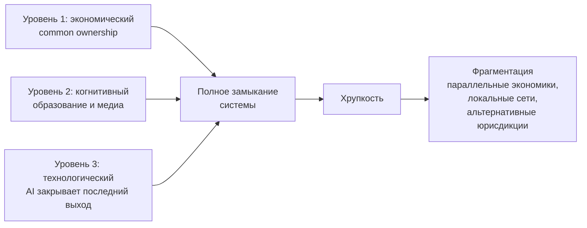

# Государство как машина стабильной коррупции

*Как современная западная система достигла стабильности — и почему это её главная уязвимость*

**Alex Krol** — стратегия, AI, инфраструктура роста

> 🇬🇧 **English version:** [Eng/3_Verticals/Mentoring/1_state-corruption-collapse.md](../../../Eng/3_Verticals/Mentoring/1_state-corruption-collapse.md)

> © 2026 Alex Krol. Все права защищены. Перепубликация, распространение и коммерческое использование — только с письменного согласия автора.

## Оглавление

0. [TL;DR](#tldr)
1. [Что значит «коррупционная система»: рабочее определение](#1-определение)
2. [Уровень 1 — Экономический: исчезновение конкуренции](#2-economic)
3. [Уровень 2 — Когнитивный: производство неспособности к анализу](#3-cognitive)
4. [Уровень 3 — Технологический: AI закрывает последний выход](#4-technological)
5. [Почему демократические процедуры стали косметикой](#5-democracy-facade)
6. [Внутренние конфликты элит как единственный механизм изменений](#6-elite-conflicts)
7. [Где остаются «зазоры» и почему AI их закрывает](#7-grey-zone)
8. [Почему устойчивая система парадоксально хрупка](#8-fragility)
9. [Что это значит для отдельного человека](#9-personal)
10. [Источники](#sources)

---

## TL;DR 

Я утверждаю простую вещь. Современное западное государство — это устойчивая коррупционная система, оформленная как демократия. Не коррупционная в смысле взяток в окошке; коррупционная в системном смысле — механизмы принятия решений захвачены узким бенефициаром, а демократические процедуры сохранены как косметика легитимности. Голосование происходит, парламенты заседают, суды выносят решения. Только реальная архитектура власти находится не там.

Стабильность этой системы достигнута через одновременное замыкание трёх уровней. Экономический уровень: концентрированное владение через институциональных инвесторов уничтожает реальную конкуренцию внутри отраслей и стандартизирует политические интересы крупного капитала. Когнитивный уровень: образование и медиа выращивают население, неспособное к системному анализу, — не из-за заговора, а из-за того, как устроены стимулы. Технологический уровень: AI методично закрывает последний исторический выход — возможность экономической автономии через интеллектуальный труд.

Когда три уровня замкнулись, традиционные механизмы коррекции работают только как симуляция. Выборы дают возможность выбрать оттенок одного и того же. Протест поглощается полицейской рутиной. Рыночная конкуренция фильтруется через интересы общих акционеров. Профессиональная мобильность стирается алгоритмами. Реальный механизм изменений остаётся один — внутриэлитные конфликты, и кейс Трамп/Маск/DOGE здесь не «народная революция», а фракционная перегруппировка наверху.

Главный неудобный поворот в моей модели: чем устойчивее становится эта система, тем большая часть населения выпадает не в управляемую зависимость, а в реальную бедность. Это создаёт давление, которое классическая стабилизация не умеет поглощать. Исторически такие конфигурации не оборачиваются революциями. Они оборачиваются фрагментацией — распадом единого политического поля на параллельные экономики, локальные сети, альтернативные юрисдикции. Не потому, что люди разумны и организованы. Просто потому, что выживание заставляет.

—

## 1. Что значит «коррупционная система»: рабочее определение 

Слово «коррупция» в этом эссе требует точного определения, иначе всё, что пойдёт дальше, прочтут как очередную конспирологическую жалобу. Поэтому начну с того, чего я не имею в виду. Я не говорю про взятку, переданную через стол. Не говорю про чемоданы наличных. Не говорю про чиновника, который попросил откат за лицензию. Это бытовая коррупция стран третьего мира, она грубая, нарушает закон, расследуется и наказывается. Развитые государства от неё отличаются качественно.

Под коррупцией я понимаю **системный capture** — захват институтов принятия решений узким бенефициаром, оформленный легально. Это понятие имеет почтенную академическую традицию. Джордж Стиглер ещё в 1971 году сформулировал, что регулирование «приобретается отраслью и проектируется и работает прежде всего в её интересах»[^1]. Это была первая формализация capture как тестируемой экономической модели, и за пятьдесят лет с тех пор она только укрепилась — её перепроверяли, уточняли, дополняли культурным и идеологическим захватом, но базовый тезис никто не опроверг[^4].

Параллельно с экономистами этим занимались социологи. Чарльз Райт Миллс описал в «Power Elite» переплетение военной, корпоративной и политической верхушки США в единую сеть, где рядовой гражданин — не агент, а объект манипуляции трёх взаимоувязанных институтов[^2]. Уильям Домхофф последующие шестьдесят лет развивал эту линию эмпирически, картируя через сетевой анализ директоров, фондов и policy planning groups, как именно работают каналы корпоративного и классового доминирования[^3]. Джеффри Уинтерс в работе «Oligarchy» дал современную систематизацию: олигархия безвременна, но принимает разные формы, и современные западные демократии — это «civil oligarchies», где богатство защищается не насилием, а правовой инфраструктурой[^5].

Это всё — академический мейнстрим, не маргинальные авторы. Никакого «глубинного государства», никаких рептилоидов. Просто описание архитектуры власти, которое десятилетиями подтверждается данными.

Кейс Невилла Сингема, развернувшийся в публичном пространстве в 2023–2026 годах, — хорошая иллюстрация того, как этот capture выглядит на современной поверхности. Расследование New York Times 2023 года, проведённое Хвистендал, Фарентолдом, Чутель и Джавери, задокументировало сеть организаций — Code Pink, Tricontinental Institute, The People's Forum, No Cold War, NewsClick — финансируемую американским технологическим миллиардером и синхронизирующую контент с позициями Пекина[^44]. Сотни миллионов долларов прослежены через каскад НКО, оформленных как благотворительные структуры со статусом 501(c)(3) и 501(c)(4). К 2025 году Комитет по путям и средствам Палаты представителей вышел с официальным заявлением и письмом с требованием раскрыть foreign funding, установив >$20 млн от Сингема и Джоди Эванс через shell-компании и donor-advised funds[^45]. В мае 2026 года расследование эскалировало — повторное требование compliance после отказа[^46].

К этому добавился случай Хасана Пикера. В марте 2026 года Treasury OFAC выписал ему и Медее Бенджамин субпоены в связи с гуманитарным конвоем CodePink на Кубу[^48]. На стриме Пикер, пытаясь защитить Сингема, прямо назвал его «финансовым двигателем политических движений» в США — формулировка, которая публично легитимизировала то, что следователи пытались доказать годами. Это структурный сюжет о том, как НКО используются как канал политического влияния под прикрытием благотворительности; Heritage Foundation в своём 2024 China Transparency Report показал, что подобные конструкции — часть документированной United Front стратегии и далеко не уникальны[^47].

Я привожу этот кейс не потому, что он эксклюзивен или сенсационен. Я привожу его потому, что он типичен. Архитектура «миллиардер → каскад НКО → политическое влияние, легально оформленное как благотворительность» — это не аномалия и не китайская специфика. Это норма работы политического капитала в современной демократии. Просто в большинстве случаев конкретное имя бенефициара не попадает в заголовки.

Главное в этом определении следующее. Демократические процедуры работают, но результат предопределён на уровнях, которые находятся вне процедур, — на уровне финансирования, медиа-доступа, политической инфраструктуры, regulatory capture. Голосование легитимирует решения, принятые до голосования. Фарс под видом демократии — не результат заговора, а эмерджентное свойство архитектуры.

## 2. Уровень 1 — Экономический: исчезновение конкуренции 

Первый уровень моей модели — экономический. Здесь происходит уничтожение реальной конкуренции внутри отраслей через **common ownership** — концентрированное перекрёстное владение акциями ключевых компаний одной отрасли через одних и тех же институциональных инвесторов.

Конкретно: BlackRock, Vanguard и State Street — «Big Three» индексных фондов — совокупно контролируют около 22–24% капитализации S&P 500 как пассивные владельцы; за десятилетие эта доля выросла с примерно 7%[^12]. Во многих крупных американских корпорациях суммарная доля Big Three — крупнейший консолидированный блок голосующих акций. Я подчёркиваю: «крупнейший консолидированный блок», а не «контрольный пакет». Цифры вроде «89% S&P 500» — обычно смешение beneficial ownership с custodial; научно сильнее аккуратная формулировка. Базовую количественную картину роста common ownership в S&P 500 за 1980–2017 годы задокументировали Backus, Conlon и Sinkinson — взрывной рост обусловлен индексированием и диверсификацией[^8].

Что меняет такая концентрация. Когда у двух конкурирующих компаний в одной отрасли крупнейшие акционеры — одни и те же институциональные инвесторы, эти компании теряют рациональный стимул конкурировать всерьёз. Реальный интерес общего акционера — стабильность отрасли как класса, а не захват доли одной компанией за счёт другой. Война за долю рынка снижает совокупную прибыль; стабильный олигопольный режим её повышает. Если ты владеешь и Coca-Cola, и PepsiCo, ты не выиграешь от того, что одна растоптает другую. Ты выиграешь от того, что обе спокойно поднимут цены.

Эмпирически это работает. Якорная работа Азара, Шмальца и Теку 2018 года на американских авиалиниях показала, что учёт common ownership увеличивает индекс рыночной концентрации в десять раз больше, чем порог, который антитраст считает «вероятно усиливающим рыночную власть»; within-route рост common ownership коррелировал с ростом цен на билеты порядка 3–7%[^6]. Параллельные находки делались по банковскому сектору, фармацевтике, технологическим компаниям. Литература за десять лет накопила достаточный объём свидетельств, чтобы говорить как минимум о серьёзной эмпирической проблеме.

При этом честность требует оговорки. Та же группа авторов в работе 2021 года по рынку ready-to-eat cereal обнаружила, что стандартная модель own-firm profit maximization лучше согласуется с данными, чем сильная версия common ownership effect[^9]. Академический консенсус не сложился полностью, и обзорные работы 2024 года это фиксируют[^10]. Это не ослабляет аргумент, а делает его честнее. Гипотеза существует, эмпирическая поддержка серьёзная, но не повсеместная. И именно поэтому регуляторы начали реагировать осторожно — в июне 2025 года Еврокомиссия впервые признала миноритарную долю около 15% «структурной связью, способной облегчать сговор» в деле Delivery Hero / Glovo[^11]. Прецедент создан.

Второй структурный эффект — на корпоративное управление. Бебчук и Хёрст в работе 2019 года показали то, что они назвали structural agency problem: менеджеры индекс-фондов имеют сильные incentives недоинвестировать в stewardship и чрезмерно поддерживать действующий менеджмент портфельных компаний[^7]. Логика простая: серьёзный stewardship стоит денег, а доходы фонда от него не растут, потому что он получает процент от активов под управлением. Гораздо проще проголосовать «за» по умолчанию. В результате BlackRock и Vanguard работают не как противовес корпоративной верхушке, а как её арматура.

Третий эффект — политический. Эти же институциональные инвесторы — крупнейшие доноры обеих главных партий США. Любая регуляторная инициатива, которая может реально задеть интересы концентрированного капитала, проходит через многослойный фильтр их влияния — через лоббистов, think tanks, кадровый обмен между Wall Street и Treasury, экспертные комиссии. Это **не заговор**. Это эмерджентное свойство концентрированного владения. Никто не управляет «из единого центра» — просто архитектура такова, что значимые отклонения от status quo блокируются автоматически.

И вот здесь — ключевая точка. Когда либеральный нарратив говорит про «эффективность рынка» и «конкуренцию как двигатель прогресса», он описывает экономику, которой больше нет. Реальная экономика крупных публичных корпораций США работает по другой логике — логике стабильного олигополиума, защищённого общим владением и regulatory capture. Конкуренция симулируется на уровне рекламных слоганов и витрин. На уровне ценообразования, отраслевой политики и регуляторного давления её больше нет. Это первое замыкание.

## 3. Уровень 2 — Когнитивный: производство неспособности к анализу 

Второй уровень — самый болезненный, потому что здесь приходится говорить вещи, которые в публичной речи произносить не принято. Я утверждаю, что современная система образования и медиа западных стран выращивает население, физиологически неспособное к системному анализу. Это не значит, что 90% людей «глупые». Это значит, что **способность к системному анализу стала редкой профессиональной компетенцией**, а не базовым свойством гражданина.

Сразу важная оговорка. Я не говорю о заговоре. Никто это сознательно не проектировал. Это эмерджентное следствие того, как устроены экономические стимулы внутри трёх главных институтов формирования сознания. Университет получает деньги за дипломы, а не за знания, поэтому он оптимизирован под удержание студента и сертификацию, а не под формирование мышления. Медиа получают деньги за вовлечённость, а не за истину, поэтому они оптимизированы под удержание внимания и эмоциональную реактивность, а не под информирование. Школа измеряется тестами, а не способностью к рассуждению, поэтому она оптимизирована под прохождение тестов, а не под способность думать. Каждый институт делает рациональную для себя вещь, и в сумме получается описанный эффект.

Эмпирика последних лет жёсткая. Самый свежий «Nation's Report Card» — NAEP 2024 — показал, что американские восьмиклассники по математике не показали прогресса ни в одном штате с 2022 года; около 40% учеников ниже NAEP Basic; только чуть больше четверти на NAEP Proficient[^13]. По чтению ситуация аналогичная: около 40% четвероклассников ниже NAEP Basic — наибольшая доля с 2002 года; около трети восьмиклассников ниже Basic — наибольшая доля за всю историю измерения[^14]. Это не временный пандемийный провал, не восстанавливается с 2022 года.

И это не американская специфика. PISA 2022 по странам OECD показал падение среднего балла по математике на рекордные 15 пунктов между 2018 и 2022 годами, по чтению — на 10 пунктов, вдвое больше предыдущего рекорда[^15]. Тренды по чтению и науке падали ещё до пандемии. Страны, которые ещё недавно отставали от США, — Польша, Швеция, Австралия — теперь опережают их по ключевым предметам.

Параллельно идёт изменение когнитивной базы под действием цифровой среды. Джин Твенге в работах «iGen» и «Generations» задокументировала на 24 национальных датасетах резкий рост депрессии у подростков с 2011 года, совпадающий с распространением смартфонов; падение face-to-face общения; падение сна; падение концентрации; главный драйвер генерационных изменений — технология[^16][^17]. Николас Карр в «The Shallows» ещё в 2010 году описал, как интернет реструктурирует нейронные паттерны в сторону поверхностного чтения и фрагментарного внимания за счёт глубокого[^18]. Это не моралистический алармизм, это нейропластичность: среда меняет когнитивный аппарат. Свидетельства о снижении показателей критического мышления в студенческой среде накапливаются фрагментарно, но в одну сторону[^19].

Социальное следствие. Население, у которого систематически снижена способность к долгой связной аргументации, к удержанию сложной модели в голове, к различению causal и correlational утверждений, к проверке источников, — такое население не может организовать политическое давление сложнее реактивного гнева. Оно может выйти на улицу. Оно может проголосовать за того, кто громче кричит. Но оно не может построить альтернативу, потому что построение альтернативы требует именно тех когнитивных операций, которые системно ослабляются.

Медиа здесь работают как усилитель. Алгоритмы социальных сетей оптимизированы под удержание внимания, а удержание внимания эмпирически достигается через эмоциональную реактивность — гнев, страх, моральное негодование. Не через анализ. В результате информационная диета большинства состоит из коротких эмоциональных всплесков, между которыми невозможно построить связную картину. Это не теория — это просто описание того, как работают рекомендательные системы Facebook, YouTube, TikTok, X. Они так работают не потому, что их создатели злы. Они так работают потому, что это максимизирует выручку.

Сюда добавляется отдельный аргумент Хайека из «The Use of Knowledge in Society» — но не в его обычной либертарианской интерпретации. Хайек показал, что знание в обществе принципиально распределено, и никакой центр не может им владеть. Это аргумент против централизованного планирования. Но у него есть зеркальная сторона: если знание распределено, то и **сопротивление коррупции** должно быть распределено. Когда же распределённая когнитивная база сжимается, исчезает и распределённая способность к сопротивлению. Остаётся узкая прослойка экспертов, чьё мнение легко маргинализировать как «элитистское» и оторванное от «настоящих людей». Это и наблюдается.

Я подчёркиваю ещё раз: я не утверждаю, что люди стали биологически глупее. Биология не меняется так быстро. Я утверждаю, что **средняя когнитивная среда** ухудшилась — школа, медиа, информационная диета, привычки внимания. Способность к системному анализу — это компетенция, которая требует тренировки, поддерживающей среды и длительной концентрации. Когда среда систематически разрушает все три условия, компетенция атрофируется. Это второе замыкание.

## 4. Уровень 3 — Технологический: AI закрывает последний выход 

Третий уровень — самый свежий и поэтому самый недооценённый. Исторически у человека из «низа» было два структурных выхода вверх. Первый — физический труд с накоплением капитала: фермер, ремесленник, мелкий торговец. Этот выход закрылся в XX веке через индустриализацию и корпоративизацию сельского хозяйства. Второй — интеллектуальный труд с продажей экспертизы: юрист, инженер, врач, аналитик, преподаватель. Этот выход активно закрывается прямо сейчас и закрывает его AI.

Якорная работа в этой области — Антона Коринека и Донгхо Су 2024 года «Scenarios for the Transition to AGI»[^20]. Их формальная модель показывает: если сложность задач, которые могут выполнять люди, ограничена сверху и AI достигает полной автоматизации этих задач, заработки коллапсируют. Более того, снижение заработков может произойти ещё **до** полной автоматизации — если автоматизация обгоняет накопление капитала и делает труд «слишком обильным» относительно спроса на него. В популярной версии этого аргумента, опубликованной в IMF Finance & Development, Коринек сформулировал тезис, который автор этого эссе цитирует прямо: **«ВВП на душу населения может фактически снизиться»** по мере того, как AI-агенты автоматизируют больше половины рабочих часов[^21]. Это академический мейнстрим, а не алармизм.

Логика здесь следующая. Классическая экономика автоматизации построена на различении двух эффектов, которые описали Дарон Аджемоглу и Паскуаль Рестрепо: displacement effect и reinstatement effect[^24]. Автоматизация двигает task content of production против труда — это displacement. Параллельно появляются новые задачи, в которых труд имеет comparative advantage, и это reinstatement. Исторически второй эффект компенсировал первый, и это позволяло индустриальной революции в долгую повышать заработки. На этом основан оптимизм «всегда появятся новые рабочие места».

Но именно здесь Коринек 2024 года делает шаг, который меняет картину. Он формализует условия, при которых reinstatement не сработает. Если AI приближается к универсальной способности выполнять интеллектуальные задачи, **новые задачи появляются медленнее, чем AI их осваивает**. Comparative advantage труда схлопывается. Это не «временный шок», это структурное изменение производственной функции — впервые в истории добавочный труд большинства не нужен для роста экономики.

Эмпирика на текущей фазе показывает движение в эту сторону. Аджемоглу и Рестрепо на промышленных роботах: один дополнительный робот на 1000 работников снижает employment-to-population ratio на 0.2 п.п. и заработки на 0.42%[^23]. Эффект automation на труд эмпирически отрицательный, и это до AI-революции. Бриньолфссон, Ли и Реймонд провели эксперимент на 5179 агентах колл-центра с генеративным AI-помощником: производительность +14% в среднем, +34% у новичков и низкоквалифицированных, около 0% у опытных[^25]. В краткосрочном периоде эффект уравнивающий снизу — но премия за квалификацию стирается, а именно она раньше держала средний класс.

Институциональные оценки масштаба сходятся в одну точку. Goldman Sachs Research 2023 года: 300 млн рабочих мест в мире подвержены автоматизации генеративным AI; в США и Европе около двух третей рабочих мест частично подвержены, до четверти всей работы может быть полностью выполнено AI[^26]. IMF Staff Discussion Note 2024 года: около 40% мировой занятости подвержено AI, в развитых экономиках — около 60%[^27]. McKinsey Global Institute: до 30% рабочих часов в США могут быть автоматизированы к 2030 году; низкооплачиваемые работники сталкиваются в 14 раз с большим числом профессиональных переходов[^28]. Это не одна оценка одного автора. Это согласованная картина из академических, центрально-банковских и индустриальных источников.

Параллельно идёт работа AI по интеллектуальному труду в самом узком смысле. Коринек в Journal of Economic Literature систематически описал, как генеративный AI уже сейчас замещает компоненты работы самого экономиста — литературный обзор, кодирование, формализация моделей, проверка статистики[^22]. Если AI ест работу экономиста, он ест работу любого аналитика, юриста, дизайнера, маркетолога, переводчика, журналиста. Всё, что не связано с физическим перемещением объектов, **уже сейчас** автоматизируется с очень высокой скоростью.

Структурное следствие для распределения. Богатые становятся богаче — они владеют AI-инфраструктурой и получают сверхдоходы от автоматизации труда других. Бедные становятся беднее — их заработная сила обесценивается. Средний класс сжимается как экономическая категория, потому что он жил на премию за интеллектуальный труд, а эта премия исчезает. Это согласуется с долгосрочной траекторией концентрации богатства, которую задокументировали Саэз и Зукман: между 1978 и 2018 годами доля богатства top 0.1% в США выросла с примерно 7% до примерно 18%[^49][^50]. Пикетти в «Capital in the Twenty-First Century» структурно объяснил это через тезис r > g: когда возврат на капитал превышает темп роста экономики, унаследованное богатство растёт быстрее, чем труд[^51]. AI ускоряет этот процесс — превращает «капитал» из абстракции в конкретную инфраструктуру, на которой можно зарабатывать без людей.

Среднему классу больно конкретно. Pew Research зафиксировал, что доля американцев в среднем классе упала с 61% в 1971 году до 51% в 2023-м; доля aggregate income, приходящегося на upper-income, выросла с 29% в 1970 году до 50% в 2020-м[^52][^53]. Economic Policy Institute задокументировал расхождение productivity-pay gap: между 1979 и 2019 годами net productivity выросла на 59.7%, медианная компенсация — на 15.8%, расхождение около 44 процентных пунктов[^54]. Это не результат AI — это структурная подготовка той сцены, на которую AI выходит. AI добивает то, что и так шло вниз сорок лет.

Третий уровень замыкания: исторический выход через интеллектуальный труд перестаёт быть выходом. Не у всех сразу, не одномоментно — но направление однозначное. Solopreneur-сегмент, фриланс, цифровая самозанятость держатся пока, потому что AI ещё не выровнял все ниши. К этому я вернусь в разделе 7. Здесь важна только структура: третий выход закрывается, и закрытие нельзя отменить регуляцией, потому что технология распределена и работает в каждой стране, которая хочет в ней участвовать.

## 5. Почему демократические процедуры стали косметикой 

К моменту, когда три уровня замкнулись, демократические процедуры перестают выполнять ту функцию, которую им приписывает учебник. Они продолжают работать как ритуал, но реальная архитектура власти проходит мимо них. Тезис «фарс под видом демократии» в этом эссе — не метафора. Это эмпирически фиксируемое состояние, которое начали замерять академические институты.

V-Dem Institute в Democracy Report 2025 зафиксировал: в 2024 году впервые с 2002 года автократий в мире больше, чем демократий, — 91 против 88; США показали самое большое падение Liberal Democracy Index за год среди всех стран мира, –0.18, в три раза больше второй по падению страны[^31]. Carnegie Endowment в августе 2025 года провёл прямое сравнение траектории США при второй администрации Трампа с семью кейсами democratic backsliding — Бразилия, Эквадор, Сальвадор, Венгрия, Индия, Польша, Турция — и пришёл к выводу: эрозия экзекутивной власти, делегитимизация горизонтальных институтов, давление на гражданское общество через регуляции и финансирование[^32]. Скорость и агрессия атаки на checks and balances в США выделяются на фоне сравнительной выборки.

The Century Foundation в январе 2026 года опубликовал количественную оценку через свой Democracy Meter: США 57 баллов из 100, падение на 28% за один год; report формулирует прямо — «slid into authoritarianism in 2025»[^34]. Это самая свежая институциональная фиксация события. Левицки и Зиблатт в «Tyranny of the Minority» 2023 года уже заявили, что одна из двух главных партий США отказалась от демократии, а counter-majoritarian institutions Конституции делают возможным правление меньшинства: «атака на американскую демократию хуже, чем мы ожидали в 2017»[^30]. Их базовая работа «How Democracies Die» 2018 года тогда же ввела рамку: демократии умирают не от переворотов, а от постепенной эрозии норм избранными лидерами[^29]. Через семь лет рамка подтвердилась.

К этому добавляется ключевой эмпирический вывод, сделанный Журналом «Journal of Democracy» в апреле 2025 года. Анализ всех стран, прошедших цикл democracy → authoritarianism → recovery с 1994 года, показал: почти ни одной не удалось sustain recovery; причина — институциональное наследство авторитарного эпизода и стимулы новых правительств сохранять расширенные полномочия предшественников[^33]. Это означает, что аргумент «маятник качнётся обратно» эмпирически не подтверждается. Маятник в большинстве случаев не качается. Власть, однажды концентрированная, остаётся концентрированной, потому что у любой следующей политической силы есть прямой интерес в сохранении инструментов.

Что это значит структурно. Демократическое правление в классическом смысле требует трёх вещей: реальной конкуренции политических сил, информированного избирателя и работающих институтов проверки власти. Уровень 1 уничтожает первое — реальной конкуренции среди тех, кто имеет шансы на власть, нет, потому что все жизнеспособные кандидаты финансируются из пересекающихся источников. Уровень 2 уничтожает второе — информированный избиратель не возникает в среде, где медиа оптимизированы под эмоциональную реактивность, а образование — под прохождение тестов. Уровень 3 уничтожает третье опосредованно — превращая большую часть населения в экономически зависимую и поэтому политически уязвимую массу.

И здесь — точка, где эмпирика смыкается с моделью. Когда Трамп, Маск и DOGE появляются на сцене в 2024–2026 годах как «движение, которое сломает истеблишмент», это **не народная революция**. Это **фракционная перегруппировка элит**. Одна часть капитала — технологические миллиардеры с интересами вне традиционных Wall Street/Pharma/Defense структур — атакует другую через популистскую риторику и захват экзекутивной власти. Везде структура одна: фракция внутри элиты использует популистский мандат, чтобы перенаправить инструменты государства в свою пользу.

Я подчёркиваю: я не делаю моральной оценки этой перегруппировки. Я её **классифицирую**. Это не возвращение власти народу, потому что народ никогда её не имел в том смысле, в котором об этом рассказывает учебник. Это перераспределение между фракциями верхушки, в котором популистская риторика выступает легитимирующим топливом. Голосующий гражданин в этой схеме — необходимый ритуальный участник, без которого результат не получает санкции легитимности, но не определяющий результат агент.

Тезис «демократия — это фарс» здесь означает узко: голосование сохранено как процедура и работает как косметика легитимности, но реальные решения о направлении государства принимаются на уровнях, к которым массовый избиратель не имеет доступа. Это не значит, что выборы «фейк» или что результаты подтасованы. Это значит, что выборы выбирают между вариантами, заранее отфильтрованными через капитал, медиа и партийные машины. Свобода выбора существует — внутри окна, границы которого определены не голосующими.

## 6. Внутренние конфликты элит как единственный механизм изменений 

Если выборы работают как косметика, а уровни 1–3 замкнули традиционные каналы давления снизу — что **действительно** меняет конфигурацию власти? Я утверждаю: только конфликты внутри элит. Это не я придумал; это базовая позиция академической традиции, идущей от Парето.

Вильфредо Парето в «Trattato di sociologia generale» сформулировал концепцию **circulation of elites**: общества всегда управляются элитой, но элита непрерывно «циркулирует» — старая замещается новой; революции и смены режимов — это elite replacement, а не восстания снизу[^35]. Народ в этой схеме — «не initiator, но follower». Уинтерс в «Oligarchy» развил это в более точную современную рамку: когда «civil oligarchy» теряет институциональные предохранители, она дрейфует обратно к «warring oligarchy» — богатые при дестабилизации начинают воевать между собой, а не сплачиваться[^36][^5].

Историческая аналогия, которую я ставлю явно: в тоталитарных государствах власть меняется через внутренние перевороты, а не через выборы. Народ — фон, не агент. Современный «демократический капитализм» движется к той же конфигурации — голосование сохранено, но реально меняет конфигурацию власти только перегруппировка наверху.

Конкретные кейсы, которые подтверждают эту динамику. Горбачёвская перестройка — не идейная революция, а конфликт элитных фракций внутри ЦК и КГБ, в котором реформаторская группировка победила охранительную; качественная академическая работа Арчи Брауна «The Gorbachev Factor» детально это разбирает[^37]. Никакого «восстания народа» не было; народ оказался в выигрыше или в проигрыше в зависимости от того, в каком регионе и слое находился, но не был агентом, который привёл Горбачёва к власти. Brexit — раскол британской элиты между Сити и космополитическим Лондоном, с одной стороны, и провинциальным консерватизмом, с другой; академические работы Гудвина, Хита, Эванса и Менона прямо формулируют это как elite split, а не как «восстание народа»[^38]. Народу дали ratify уже принятое внутри элиты решение референдумом. Трамп 2016 года — атака внешней для Republican establishment фракции на внутреннюю; работы Сайдса, Теслера, Ваврек и Скочпол-Уильямсон показали это как elite faction conflict, в котором MAGA / Tea Party вытеснили традиционных республиканцев из контроля над партией[^39].

Во всех трёх случаях есть одна и та же структура. Внутриэлитный конфликт мобилизует часть населения через эмоционально резонансную риторику, использует электоральные или референдумные процедуры как механизм легитимации и в результате перегруппировывает капитал и власть наверху. Население играет необходимую роль массовки и валидатора — без неё процедура не работает — но не определяет содержание исхода. Содержание определено заранее тем, какая фракция элиты в данный момент мобилизовалась эффективнее.

Современный кейс Трампа второй каденции 2024–2026 годов вписывается в ту же логику. Технологические миллиардеры — Маск как лицо, но не единственный игрок — мобилизовали часть рассерженного населения, использовали электоральную процедуру как механизм легитимации и теперь перенаправляют экзекутивную власть в свою пользу через DOGE и аналогичные структуры. Это **не разрушает мою модель — напротив, подтверждает её**. Даже самые радикальные политические изменения последних лет в США происходят не снизу, а через перегруппировку наверху.

Что это значит для гражданина практически. Участие в традиционной политике — голосование, активизм, протест — это участие в косметике, не во влиянии. Это не значит, что не надо голосовать; голосовать имеет смысл хотя бы как ритуал участия, иногда как защита от худшего из двух плохих вариантов. Это значит другое: представление, что через голосование, лоббизм или уличный протест можно изменить **направление** системы — это иллюзия. Реальные ставки решаются на уровнях, к которым массовый гражданин не имеет доступа. Иногда фракционный конфликт наверху случайно оказывается в его интересах. Иногда — против. Но **он не является агентом** в этих конфликтах.

Это неприятный вывод, и я понимаю, почему его публично произносить не любят. Он подрывает базовую гражданскую мифологию демократии. Но если задача — точная модель, а не утешение, то именно так и обстоит дело. Все остальные интерпретации требуют игнорировать слишком много данных.

## 7. Где остаются «зазоры»: и почему AI их закрывает 

В любой стабильной системе власти всегда существовала «серая зона» частичной автономии. Это историческая константа, и без её понимания модель закрытой системы выглядит слишком плоско. Янош Корнаи в каноническом труде «The Socialist System» систематически описал, как институциональная неспособность плановой системы избежать дефицита неизбежно ведёт к разрастанию неформальной экономики; в более ранней «Economics of Shortage» он показал, что soft budget constraint всегда производит параллельную экономику как побочный продукт[^40][^41]. Это закономерное следствие репрессивной формальной системы, не аномалия.

Конкретные примеры. Советский инженер, живущий на дачные доходы, репетиторство и мелкий частный заработок. Польские кооперативы 1970–1980-х годов, из неформальной сети которых выросла организационная база Solidarność[^42]. Венгерский «гуляш-социализм» — мелкая частная экономика, легализованная режимом как клапан безопасности. Во всех случаях зазоры возникают не потому, что система их разрешает, а потому, что она их не может закрыть, не разрушив сама себя.

В развитом капитализме сегодняшнего дня грей-зона имеет современную форму: фриланс, малый бизнес, solopreneur-сегмент, gig economy, цифровое предпринимательство. По оценкам ILO и OECD, это уже значимая часть западной рабочей силы — десятки процентов в некоторых сегментах[^43]. Для конкретного человека это часто единственная реальная альтернатива найму в крупной корпорации или зависимости от welfare. Solopreneur с цифровым продуктом, работающий без работодателя и без офиса, — это не маргинальный кейс, это растущий сегмент.

Эти зазоры держались исторически на одном — на **информационной и навыковой асимметрии**. Знал что-то, чего не знали другие, — мог монетизировать. Умел что-то, чего не умели другие, — мог продавать. Грейзона существовала ровно в том пространстве, где формальная система не покрывала весь спектр знаний и навыков и где индивидуальный человек мог занять рыночную нишу за счёт того, что был быстрее, точнее, гибче.

Здесь возвращается AI. И возвращается с разрушительной для грей-зоны логикой. AI методично выравнивает информационную и навыковую асимметрию — не только в работе с кодом, но в дизайне, юриспруденции, медицине, аналитике, маркетинге, переводе, копирайтинге, бухгалтерии. То, за что solopreneur раньше брал деньги, потому что владел экспертизой, через 5–10 лет в значительной части закроется. Не потому, что AI сделает это лучше — а потому, что AI сделает это **дешевле и быстрее**, и базовая бизнес-модель «продаю экспертизу, которой у клиента нет» перестанет работать.

Останется три ниши как минимум на ближайшие десятилетия. Первая — то, что требует физического присутствия: ремонт, забота, ручной труд, доставка, обслуживание физической инфраструктуры. AI пока не имеет надёжных рук. Вторая — то, где ценность не в экспертизе, а в **доверии и контексте**: психотерапия, наставничество, специфические сообщества, отношения. AI не может выровнять асимметрию доверия и специфического контекста — это структурно другая категория, она требует биографии, репутации, длительной связи. Третья — то, что прямо встроено в AI-инфраструктуру: владельцы платформ, инженеры моделей, разработчики верхнего слоя приложений. Эта ниша узкая, требует высокого порога входа и быстро концентрируется.

Парадокс здесь следующий. AI закрывает грей-зону снизу — для большинства индивидуальных предпринимателей, фрилансеров, малого бизнеса — и одновременно **создаёт новый класс рантье** наверху: владельцев AI-инфраструктуры. Это **усиливает** концентрацию, а не размывает её. Структурно это работает так же, как индустриальная революция XIX века — но быстрее и без компенсирующего эффекта reinstatement, потому что новых задач для людей появляется недостаточно.

В моей модели это значит следующее. Грей-зона как историческая константа никуда не исчезнет полностью — что-то останется в физическом труде, в доверительных нишах, в специфических локальных рынках. Но **массовая** грей-зона, которая последние тридцать лет давала экономическую автономию миллионам людей среднего класса через фриланс и solopreneurship, сжимается быстро. Это значит, что выход из закрытой системы через индивидуальное предпринимательство — тот выход, на который сейчас многие надеются как на личную страховку — закрывается быстрее, чем его успевают занять.

И это — структурное основание для следующего шага модели. Когда грей-зона сжимается, давление на систему растёт. Не потому, что люди становятся радикальнее. Потому что у них меньше способов выйти из неё мирно.

## 8. Почему устойчивая система парадоксально хрупка 

Кажется, что система с тройным замыканием — экономическим, когнитивным, технологическим — становится вечной. Если общая конкуренция уничтожена, население не способно к организованному политическому давлению, а грей-зона закрывается AI, то что вообще может её сдвинуть? Это очевидное возражение моей модели, и его обязательно нужно проговорить, иначе модель остаётся односторонней.

Я утверждаю обратное: именно полнота замыкания делает систему хрупкой. И вот почему.

Управляемая зависимость, на которой держится социальный мир развитых демократий, **требует ресурсов**. Welfare-системы, государственное здравоохранение, образование, инфраструктура, развлечения, частичные выплаты в виде различных бенефитов — всё это финансируется из налогов на работающее население и из долга. Когда AI снижает спрос на труд и обесценивает заработную плату большинства, налоговая база welfare-системы сокращается. Параллельно инфляция уничтожает реальную ценность фиксированных выплат. Параллельно стоимость жилья, медицины, образования продолжает расти быстрее общей инфляции. Реальные зарплаты медианного работника растут значительно медленнее производительности с 1970-х годов[^54]; стоимость ключевых компонентов качества жизни — жилья, медицины, образования — выросла в разы быстрее общей инфляции. Эта арифметика не меняется в положительную сторону.

Структурное следствие: всё больше людей выпадает **не в управляемую зависимость**, а в **реальную бедность**. Управляемая зависимость — это когда система платит тебе достаточно, чтобы ты не выходил из неё, и держит тебя на дозе через льготы, медицину, развлечения, цифровую среду. Это устойчивая конфигурация. Реальная бедность — это когда тебе перестали платить достаточно, чтобы ты оставался в системе. Тогда у тебя нет ставки в её сохранении.

Исторически это та точка, в которой системы перестают быть управляемыми. Не потому, что бедные становятся революционерами — большинство нет, — а потому, что система перестаёт обладать **достаточным контролем над их повседневной жизнью**, чтобы они продолжали играть отведённую им роль. Они начинают выходить из неё не идеологически, а **операционно** — переезжая, меняя юрисдикцию, переходя на наличный расчёт, в крипту, в бартер, в локальные сети взаимопомощи, в параллельные экономики.

К этому добавляется второй структурный фактор. Системы, которые слишком хорошо контролируют население, **теряют способность к коррекции**. Когда все каналы обратной связи задавлены, система перестаёт получать информацию о реальном состоянии своей среды. Она работает по внутренней оптимизации, оторванной от внешних сигналов. И когда внешний шок — война, кризис, природная катастрофа, технологический сдвиг — приходит, система не способна перестроиться, потому что её механизмы перестройки атрофировались.

Институциональная экономика давно фиксирует эту картину: общества с захваченными институтами могут долго оставаться стабильными, но при крупном внешнем потрясении не имеют адаптивных ресурсов и обрушиваются глубже, чем общества с открытыми институтами. Эта интуиция применима напрямую к моей модели.

Поэтому мой прогноз — **не революция**. Революция требует организованной силы снизу с альтернативной идеологией и лидерами; уровень 2 этой модели — когнитивная деградация — почти гарантирует, что такой силы не возникнет. Революция возможна там, где элиты слабы и население сохранило базовую способность к организации. Современная западная конфигурация противоположна обоим условиям.

Мой прогноз — **фрагментация**. Это структурно другое явление. Не свержение центра, а **постепенное обессмысливание центра** через отток ресурсов и людей в параллельные структуры. Несколько типичных направлений, в которых это уже наблюдается:

Параллельные экономики — крипта, бартер-сети, локальные валюты, нерегулируемые рынки услуг. Это не «революционная альтернатива капитализму», как любят формулировать энтузиасты. Это **инфраструктура выхода** для людей, которым формальная система перестала давать достаточно.

Локальные сети взаимопомощи — соседские группы, профессиональные сообщества, конфессиональные структуры, диаспоры. Они существуют всегда, но в периоды распада центральной системы они забирают на себя функции, которые раньше выполняло государство — взаимопомощь, защиту, разрешение конфликтов, образование детей.

Альтернативные юрисдикции — страны-убежища с низкой регуляцией, цифровое гражданство, special economic zones. Для людей с цифровым капиталом и мобильностью это уже работающая стратегия; для остальных она становится точкой притяжения как мечта или как реалистичный план.

Внутренняя миграция между штатами и регионами по принципу «бегства от регуляции» — в развитых странах это уже значимая социальная динамика последнего десятилетия. Это не идеологический выбор, это арбитраж качества жизни.

Это **не «надежда»**. Я не пишу это, чтобы кого-то утешить. Это прогноз структурной реакции на закрытую систему. Историческая константа простая: давление в закрытой системе не исчезает, оно ищет outlet. Если все мейнстримные outlet'ы закрыты, давление находит маргинальные. Это не от хорошей жизни — это от выживания. И это не оставляет систему такой, какой она была.

Главное — фрагментация **не приводит обратно к восстановлению того, что было**. Она не реставрирует «нормальный капитализм» 1990-х или «функционирующую демократию» 1960-х. Она производит **новую конфигурацию** — мозаичную, неоднородную, с архипелагом параллельных структур, без единого центра тяжести. Таков структурный сценарий следующих десятилетий, как я его вижу.

## 9. Что это значит для отдельного человека 

Финал моего эссе — без призывов и без утешений. Я не могу сказать читателю, что ему делать. Я могу описать ландшафт, в котором делается выбор.

Если модель верна, классические стратегии — хорошее образование → стабильная карьера → накопления → пенсия — больше не работают как **базовая** стратегия. Они работают для всё меньшей доли населения и всё хуже компенсируют инфляцию и обесценивание интеллектуального труда. Это не означает, что они полностью бессмысленны; для конкретного индивида в конкретной нише они могут работать ещё долго. Это означает, что **как массовая стратегия** они перестали быть надёжной траекторией.

Тогда что остаётся как реальные категории выбора. Я перечисляю их сухо, без оценочных коннотаций — каждая из них может быть рациональной в зависимости от стартовой точки и ценностей.

Первая категория — **войти в элиту**. Это означает построить бизнес, который генерирует значимый капитал; стать владельцем доли в AI-инфраструктуре, недвижимости, существенных активах; получить политический капитал; войти в high-finance или venture-сегмент. Эта траектория узкая, требует значительной комбинации удачи, способностей и стартового капитала, но именно она даёт реальную автономию в описанной системе.

Вторая категория — **обслуживать элиту** в высокооплачиваемой нише, где AI ещё не достал. Это означает войти в одну из доверительных или экспертных ниш с высокой стоимостью входа — top-уровневая юриспруденция для корпоративных клиентов, M&A, специализированная медицина, инвестиционный консалтинг, security, доступ к закрытым сетям. Не «средний интеллектуальный труд», а конкретно та его часть, которую AI не съест в ближайшие 10–15 лет благодаря требованию доверия, репутации, специфического контекста.

Третья категория — **уйти в зазор**, пока он существует. Solopreneur-сегмент, ниши на пересечении эмоционального труда и цифровых продуктов, локальные сети, специализированные сообщества. Эта категория сжимается по мере того, как AI выравнивает асимметрию, но в ближайшие годы у неё ещё есть пространство, особенно в сегментах с сильным доверительным компонентом.

Четвёртая категория — **принять welfare-зависимость** как сознательный выбор. Это не моральная катастрофа и не личный провал. Это рациональная стратегия для человека, который оценивает, что цена входа в первые три категории для него выше, чем выгода. Снижение качества жизни в обмен на отсутствие требований. Эта категория тоже не статична — реальный объём welfare сжимается под давлением структурных факторов, описанных в разделе 8 — но как **сознательный выбор** она существует.

Пятая категория — **жить вне системы** в любой форме. Физически — коммуны, off-grid, переезд в удалённые регионы. Цифрово — параллельные сети, крипто-экономики, альтернативные юрисдикции. Географически — переезд в страну с низкой регуляцией, цифровое гражданство, перманентный travel. Эта категория сейчас экспериментальная для большинства, но её реальный объём растёт быстро.

Это **не «выбор стратегии успеха»**. Это констатация архитектуры выбора. Каждая категория имеет свою цену входа, свои риски, свои внутренние компромиссы. Каждая открыта не для всех — старт, способности, гражданство, возраст, обязательства определяют, какие категории реалистичны для конкретного человека.

Главный неудобный вывод, который я хочу сформулировать прямо: **нейтральный человек**, не делающий явного выбора, **автоматически попадает в «фон»** — слой, который система использует как электоральный материал, налоговую базу и потребителей. Бездействие — тоже выбор, просто его последствия наступают через дрейф, а не через явное решение. Когда инфляция, AI-displacement и сужение grey-zone сходятся в точке, фон становится физически бедным, даже если субъективно человек продолжает считать себя «средним классом». Эта арифметика безразлична к самовосприятию.

Финальная позиция моя такая. Модель не определяет, что **должен** делать каждый. Я не призываю никого ни к чему. Я описываю, **в каком ландшафте** делается выбор. Дальше — личная ответственность каждого, кто этот ландшафт увидел. Один и тот же ландшафт допускает разные траектории, разные ценностные приоритеты, разные жизненные формы. Но он не допускает иллюзии, что система устроена так, как её описывают учебники гражданского образования. Это другая система. И чем точнее каждый видит её устройство, тем точнее он может проложить через неё собственный путь.

Я закончу одним наблюдением, которое относится к самому жанру этого эссе. Если читатель дошёл до этого места, он уже принадлежит к узкой прослойке, способной удерживать длинную аргументацию против эмоционального давления. Эта способность сама по себе — экономический и социальный актив, который AI пока не воспроизводит. Что с ним делать дальше — каждый решит сам.

—

## Sources 

[^1]: Stigler, G. J. (1971). «The Theory of Economic Regulation», *Bell Journal of Economics and Management Science*, Vol. 2, No. 1, pp. 3–21. https://www.jstor.org/stable/3003160

[^2]: Mills, C. W. (1956). *The Power Elite*. New York: Oxford University Press. https://global.oup.com/academic/product/the-power-elite-9780195133547

[^3]: Domhoff, G. W. (1967, ред. 2014, 7-е изд.). *Who Rules America? The Triumph of the Corporate Rich*. McGraw-Hill. https://whorulesamerica.ucsc.edu/wra50.html

[^4]: Carrigan, C. & Coglianese, C. (2021). «George Stigler and the Theory of Economic Regulation After Fifty Years», University of Chicago Law and Economics Working Paper. https://chicagounbound.uchicago.edu/cgi/viewcontent.cgi?article=2625&context=law_and_economics

[^5]: Winters, J. A. (2011). *Oligarchy*. Cambridge University Press. https://www.cambridge.org/core/books/oligarchy/1B3DB2A71C3672186D7A61401C0FC8679

[^6]: Azar, J., Schmalz, M. C., & Tecu, I. (2018). «Anticompetitive Effects of Common Ownership», *The Journal of Finance*, Vol. 73, No. 4, pp. 1513–1565. https://onlinelibrary.wiley.com/doi/abs/10.1111/jofi.12698

[^7]: Bebchuk, L. A. & Hirst, S. (2019). «Index Funds and the Future of Corporate Governance: Theory, Evidence, and Policy», *Columbia Law Review*, Vol. 119, pp. 2029–2146. https://columbialawreview.org/content/index-funds-and-the-future-of-corporate-governance-theory-evidence-and-policy/

[^8]: Backus, M., Conlon, C., & Sinkinson, M. (2021). «Common Ownership in America: 1980–2017», *American Economic Journal: Microeconomics*, Vol. 13, No. 3, pp. 273–308. https://www.aeaweb.org/articles?id=10.1257/mic.20190389

[^9]: Backus, M., Conlon, C., & Sinkinson, M. (2021). «Common Ownership and Competition in the Ready-to-Eat Cereal Industry», NBER Working Paper No. 28350. https://www.nber.org/papers/w28350

[^10]: Schmalz, M. C. (2021). «Recent Studies on Common Ownership, Firm Behavior, and Market Outcomes», *The Antitrust Bulletin*; см. также «A Critical Review of the Common Ownership Literature» (2024), *Annual Review of Financial Economics*. https://www.annualreviews.org/content/journals/10.1146/annurev-financial-082123-105841

[^11]: European Commission (2025). Решение от 2 июня 2025 года по делу Delivery Hero / Glovo. https://www.kirkland.com/publications/kirkland-alert/2026/02/2026-eu-antitrust-fsr-and-fdi-update

[^12]: «Do Vanguard, BlackRock, and State Street Run the World?» (Of Dollars And Data, 2023, на основе данных SEC 13F и Bloomberg). https://ofdollarsanddata.com/vanguard-blackrock-state-street/

[^13]: National Center for Education Statistics (2025). *2024 NAEP Mathematics Assessment: Results at Grades 4 and 8 for the Nation, States, and Districts*. U.S. Department of Education. https://www.nationsreportcard.gov/reports/mathematics/2024/g4_8/

[^14]: National Center for Education Statistics (2025). *2024 NAEP Reading Assessment: Results at Grades 4 and 8 for the Nation, States, and Districts*. https://nces.ed.gov/use-work/resource-library/report/statistical-analysis-report/2024-naep-reading-assessment-results-grades-4-and-8-nation-states-and-districts

[^15]: OECD (2023). *PISA 2022 Results (Volume I): The State of Learning and Equity in Education*. Paris: OECD Publishing. https://www.oecd.org/en/publications/pisa-2022-results-volume-i_53f23881-en.html

[^16]: Twenge, J. M. (2017). *iGen: Why Today's Super-Connected Kids Are Growing Up Less Rebellious, More Tolerant, Less Happy—and Completely Unprepared for Adulthood*. New York: Atria Books. https://www.simonandschuster.com/books/iGen/Jean-M-Twenge/9781501151989

[^17]: Twenge, J. M. (2023). *Generations: The Real Differences Between Gen Z, Millennials, Gen X, Boomers, and Silents—and What They Mean for America's Future*. New York: Atria Books. https://www.simonandschuster.com/books/Generations/Jean-M-Twenge/9781982181628

[^18]: Carr, N. (2010, расш. изд. 2020). *The Shallows: What the Internet Is Doing to Our Brains*. New York: W. W. Norton. https://wwnorton.com/books/9780393357820

[^19]: Halpern, D. F. & Dunn, D. S. et al. (2021+). Halpern Critical Thinking Assessment (HCTA); Roohr, K. C. & Burkander, K. (2020). «Exploring Critical Thinking as an Outcome for Students Enrolled in Community Colleges», *Community College Review*, 48(3). https://journals.sagepub.com/doi/abs/10.1177/0091552120923402

[^20]: Korinek, A. & Suh, D. (2024). «Scenarios for the Transition to AGI», NBER Working Paper No. 32255. https://www.nber.org/papers/w32255

[^21]: Korinek, A. (2023). «Scenario Planning for an AGI Future», *IMF Finance & Development*, December 2023. https://www.imf.org/en/publications/fandd/issues/2023/12/scenario-planning-for-an-agi-future-anton-korinek

[^22]: Korinek, A. (2023). «Generative AI for Economic Research: Use Cases and Implications for Economists», *Journal of Economic Literature*, Vol. 61, No. 4, pp. 1281–1317. https://www.aeaweb.org/articles?id=10.1257/jel.20231736

[^23]: Acemoglu, D. & Restrepo, P. (2020). «Robots and Jobs: Evidence from US Labor Markets», *Journal of Political Economy*, Vol. 128, No. 6, pp. 2188–2244. https://www.journals.uchicago.edu/doi/10.1086/705716

[^24]: Acemoglu, D. & Restrepo, P. (2019). «Automation and New Tasks: How Technology Displaces and Reinstates Labor», *Journal of Economic Perspectives*, Vol. 33, No. 2, pp. 3–30. https://www.aeaweb.org/articles?id=10.1257/jep.33.2.3

[^25]: Brynjolfsson, E., Li, D. & Raymond, L. R. (2023, опубл. 2025). «Generative AI at Work», NBER Working Paper No. 31161; *Quarterly Journal of Economics*, 2025. https://www.nber.org/papers/w31161

[^26]: Goldman Sachs Research (2023). «The Potentially Large Effects of Artificial Intelligence on Economic Growth». https://www.goldmansachs.com/insights/articles/how-will-ai-affect-the-us-labor-market

[^27]: Cazzaniga, M. et al. (2024). *Gen-AI: Artificial Intelligence and the Future of Work*, IMF Staff Discussion Note SDN/2024/001. https://www.imf.org/-/media/files/publications/sdn/2024/english/sdnea2024002.pdf

[^28]: McKinsey Global Institute (2023). *Generative AI and the Future of Work in America*; McKinsey Global Institute (2024). *A New Future of Work*. https://www.mckinsey.com/mgi/our-research/generative-ai-and-the-future-of-work-in-america

[^29]: Levitsky, S., & Ziblatt, D. (2018). *How Democracies Die*. New York: Crown. https://en.wikipedia.org/wiki/How_Democracies_Die

[^30]: Levitsky, S. & Ziblatt, D. (2023). *Tyranny of the Minority: Why American Democracy Reached the Breaking Point*. New York: Crown. https://www.amazon.com/Tyranny-Minority-American-Democracy-Breaking/dp/0593443071

[^31]: V-Dem Institute (2025). *Democracy Report 2025: 25 Years of Autocratization — Democracy Trumped?* University of Gothenburg. https://www.v-dem.net/documents/54/v-dem_dr_2025_lowres_v1.pdf

[^32]: Carrier, M. & Carothers, T. (2025). «U.S. Democratic Backsliding in Comparative Perspective», Carnegie Endowment for International Peace, August 2025. https://carnegieendowment.org/research/2025/08/us-democratic-backsliding-in-comparative-perspective

[^33]: Bianchi, M., Cheeseman, N., & Cyr, J. (2025). «Can Democracy Recover After Autocracy?» / «The Myth of Democratic Resilience», *Journal of Democracy*, April 2025. https://www.journalofdemocracy.org/articles/the-myth-of-democratic-resilience/

[^34]: The Century Foundation (2026). «Century's New Democracy Meter Shows America Took an Authoritarian Turn in 2025», January 2026. https://tcf.org/content/report/centurys-new-democracy-meter-shows-america-took-an-authoritarian-turn-in-2025/

[^35]: Pareto, V. (1916, англ. изд. 1935). *The Mind and Society (Trattato di sociologia generale)*. New York: Harcourt, Brace & Co. https://en.wikipedia.org/wiki/Circulation_of_elites

[^36]: Winters, J. A. (2011). *Oligarchy*. Cambridge University Press (см. также [^5]). https://www.cambridge.org/core/books/oligarchy/1B3DB2A71C3672186D7A61401C0FC8679

[^37]: Brown, A. (1996). *The Gorbachev Factor*. Oxford University Press. https://global.oup.com/academic/product/the-gorbachev-factor-9780192880529

[^38]: Goodwin, M. & Heath, O. (2016). «The 2016 Referendum, Brexit and the Left Behind», *The Political Quarterly*, 87(3); Evans, G. & Menon, A. (2017). *Brexit and British Politics*, Polity Press. https://onlinelibrary.wiley.com/doi/10.1111/1467-923X.12285

[^39]: Sides, J., Tesler, M., & Vavreck, L. (2018). *Identity Crisis: The 2016 Presidential Campaign and the Battle for the Meaning of America*. Princeton University Press; Skocpol, T. & Williamson, V. (2012). *The Tea Party and the Remaking of Republican Conservatism*, Oxford UP. https://press.princeton.edu/books/hardcover/9780691174198/identity-crisis

[^40]: Kornai, J. (1992). *The Socialist System: The Political Economy of Communism*. Princeton University Press / Oxford: Clarendon Press. https://press.princeton.edu/books/paperback/9780691003931/the-socialist-system

[^41]: Kornai, J. (1980). *Economics of Shortage*, 2 vols. Amsterdam: North-Holland. https://ideas.repec.org/e/pko198.html

[^42]: Ekiert, G. & Kubik, J. (1999). *Rebellious Civil Society: Popular Protest and Democratic Consolidation in Poland, 1989–1993*. University of Michigan Press. https://www.press.umich.edu/15665/rebellious_civil_society

[^43]: OECD (2019). *The Future of Work*; ILO (2023). *World Employment and Social Outlook 2023*. https://www.oecd.org/employment/future-of-work/

[^44]: Hvistendahl, M., Fahrenthold, D. A., Chutel, L., & Jhaveri, I. (2023). «A Global Web of Chinese Propaganda Leads to a U.S. Tech Mogul», *The New York Times*, August 5, 2023. https://www.nytimes.com/2023/08/05/world/europe/neville-roy-singham-china-propaganda.html

[^45]: House Committee on Ways and Means, Chairman Jason Smith (2025). «Chairman Smith Exposes U.S. Nonprofit as Likely CCP-Funded Propaganda Arm Operating Under Tax-Exempt Status», September 4, 2025. https://waysandmeans.house.gov/2025/09/04/chairman-smith-exposes-u-s-nonprofit-as-likely-ccp-funded-propaganda-arm-operating-under-tax-exempt-status/

[^46]: House Committee on Ways and Means (2026). «Chairman Smith Reasserts Demands for CCP-Linked Non-Profits to Comply with Committee Oversight», May 5, 2026. https://waysandmeans.house.gov/2026/05/05/chairman-smith-reasserts-demands-for-ccp-linked-non-profits-to-comply-with-committee-oversight/

[^47]: Heritage Foundation (2024). *2024 China Transparency Report*. https://www.heritage.org/CTP

[^48]: Hasan Piker / Medea Benjamin OFAC subpoena (Cuba humanitarian convoy, March 2026; subpoena issued May 2026). Reuters / Yahoo News / GameDaily coverage. https://gamedaily.com/games/hasan-piker-subpoenaed-cuba-trip-treasury-ofac

[^49]: Saez, E. & Zucman, G. (2016). «Wealth Inequality in the United States since 1913: Evidence from Capitalized Income Tax Data», *Quarterly Journal of Economics*, Vol. 131, No. 2, pp. 519–578. https://www.nber.org/papers/w20625

[^50]: Saez, E. & Zucman, G. (2020). «The Rise of Income and Wealth Inequality in America: Evidence from Distributional Macroeconomic Accounts», *Journal of Economic Perspectives*, Vol. 34, No. 4, pp. 3–26. https://www.aeaweb.org/articles?id=10.1257/jep.34.4.3

[^51]: Piketty, T. (2014). *Capital in the Twenty-First Century*. Cambridge, MA: Belknap Press of Harvard University Press. https://www.hup.harvard.edu/books/9780674430006

[^52]: Pew Research Center (2024). «The State of the American Middle Class», May 31, 2024. https://www.pewresearch.org/race-and-ethnicity/2024/05/31/the-state-of-the-american-middle-class/

[^53]: Pew Research Center (2020). «Trends in U.S. Income and Wealth Inequality». https://www.pewresearch.org/social-trends/2020/01/09/trends-in-income-and-wealth-inequality/

[^54]: Economic Policy Institute (2024). *The Productivity–Pay Gap*; Bivens, J. & Mishel, L. (2015). «Understanding the Historic Divergence Between Productivity and a Typical Worker's Pay», EPI Briefing Paper. https://www.epi.org/productivity-pay-gap/
