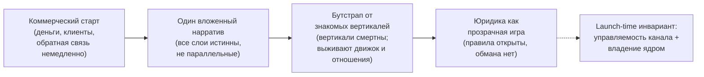

# Менторинг: как стартовать правильно — бутстрап, нарратив, юридика, власть

**Приватный документ. Не для открытой публикации.** Это операционный слой системы, а не её концепция. Концепцию — три слоя, аудитория как власть, менторинг как последняя миля влияния — я разобрал отдельно («Менторинг: развитие на поверхности, власть в глубине, меритократия в пределе»). Здесь меня не интересует, *почему* система устроена так; меня интересует, *как* её запустить, чтобы решить деньги, клиентов и юридику и при этом не угробить внутренний тезис и не спровоцировать преждевременный конфликт с властью. Я прагматик. Я зарабатываю деньги. Этот текст про это, и властный слой я здесь не смягчаю — для смягчения есть внешняя версия.

**Alex Krol** — стратегия, AI, инфраструктура роста

> © 2026 Alex Krol. Приватный документ. Не для открытой публикации; распространение, цитирование и перевод — только с письменного согласия автора.

## Оглавление

0. [TL;DR — стратегия запуска на одной странице](#tldr)
1. [Почему коммерческий старт](#1-kommercheskiy-start)
2. [Слоёный нарратив, не противоречивый](#2-narrativ)
3. [Бутстрап от частного к общему](#3-butstrap)
4. [Юридическая рамка как игра](#4-yuridika)
5. [Скоринг, рейтинг, привилегии, энфорсмент](#5-skoring)
6. [Equity и outcome](#6-equity)
7. [Университет/клуб как дом](#7-dom)
8. [Власть: союзник, враг или незаменимость](#8-vlast)
9. [Резюме](#9-rezume)

---

## TL;DR — стратегия запуска на одной странице 

Стартуем коммерчески, и это не камуфляж. Если система получает большой охват — влияет на оценки, поведение и решения большого числа людей, — цель достигнута, потому что охват и есть цель. Политический потенциал решается по мере поступления.

Нарратив слоёный, а не противоречивый. Инвестору — легитимная и истинная картинка: система образования вокруг интересов человека, а не корпораций. Глубже — та же система при масштабе: тысяча человек — бутиковая школа, сто миллионов — партия влияния. Это понимают все, и никто не возражает, потому что инвестировать в это хорошо. Тест простой: каждый бэкер спокоен, узнав про остальные слои? Один вложенный нарратив, не параллельные.

Юридика устроена как игра: правила открыты, стратегическая глубина исследуется, обмана нет. Ментор продаёт время и совместное размышление, а не консультацию; любой совет — гипотеза; ответственность на ученике, принято заранее. Но жёсткий контракт не закрывает неоговариваемое: где по сути финансовый, юридический, медицинский или психотерапевтический совет — ярлык «это размышление» не лечит. Слой совета лёгкий; слой решения — скоринг, цена, доступ — регулируется иначе, и спасает его прозрачность правил роста.

Дом — университет или клуб, а не free-to-play. Удержание через растущую реальную ценность, не через инженерную компульсию. Equity пока лозунг, не переинженерить. Власть — эмерджентное свойство масштаба, опция, не цель; решается по мере поступления — кроме одной вещи.

Откладывается всё, кроме launch-time инварианта: управляемость канала и владение ядром. Это единственное необратимое решение. «Решу потом» превращается в «решат за меня» ровно в день, когда канал управляем из единого центра, который власть может забрать.

---

## 1. Почему коммерческий старт 

Большой охват и есть цель. Я не строю систему влияния, которая потом, на каком-то этапе, монетизируется; я строю систему, успех которой *измеряется* охватом — числом людей, на чьи оценки, поведение и решения система реально влияет. Если миллион человек строят свою траекторию через мою систему и действуют на доверии к ней, я добился ровно того, ради чего всё затевалось. Менторинг — это последняя миля влияния, финальная конверсия внимания в действие конкретного человека; почему она работает именно так, разобрано в концепции, и я не буду пересказывать. Здесь важно операционное следствие: цель и метрика совпадают. Охват не средство к деньгам и не средство к власти. Охват — это и есть результат, в денежном выражении на поверхности и в политическом — в глубине.

Поэтому коммерческий старт не камуфляж, и это нужно проговорить точно, потому что соблазн думать иначе велик. Коммерция выглядит как маскировка — «продаём коучинг, а строим машину влияния», — но маскировки тут нет, и быть не может. Структура системы читается при произнесении. Стоит описать честно, что под капотом, — её видно за секунду. Стелс, который проговаривается, перестаёт быть стелсом; остаётся тонкий слой краски на видимой угрозе, и любой компетентный читатель, человек или машина, увидит, где торчат уши. Из этого один вывод: камуфляж бессмысленен, потому что недостижим. Значит, коммерческий старт — не маскировка чего-то другого, а честная форма того же объекта. Я продаю ровно то, что строю: систему, которая растит людей. Что эта же система при масштабе становится силой — не спрятанная вторая правда, а та же правда на другой глубине.

Из этого следует прагматика запуска. Коммерческий слой нужен не чтобы скрыть, а чтобы кормить: он даёт деньги, клиентов и обратную связь немедленно, на понятном рынке, без необходимости объяснять кому бы то ни было политический потенциал. Если на каком-то этапе компетентная власть проявит интерес к этому потенциалу — буду решать по мере поступления. Это не уход от вопроса, это правильная очерёдность: пока система мала, политический слой латентен и инертен, и тратить на него стартовый ресурс — ошибка. Сначала — охват, потому что без охвата нет ни денег, ни глубины, ни предмета для разговора с властью. Всё остальное надстраивается над охватом, а не наоборот.

---

## 2. Слоёный нарратив, не противоречивый 

Инвестору я даю легитимную картинку, и она истинная, а не выдуманная для него. Картинка такая: я строю систему образования и наставничества, выстроенную вокруг интересов человека, а не вокруг интересов корпораций. Этот феномен уже существует — коучинг, инкубаторы, персональные наставники, — я лишь перевожу его на новый технологический слой, который делает его массовым и дешёвым. Инвестор это понимает с первого взгляда, потому что рынок этого класса ему знаком. Дальше любому очевидно: если в системе тысяча человек — это бутиковая элитная школа; если сто миллионов — это партия влияния. Это видят все. И никто не возражает — потому что инвестировать в это хорошо, а сидеть в борде такой компании никто не против. Политический потенциал тут не спрятан и не запретен; он просто пока не главное, и все согласны, что пока не главное.

Но у «разного нарратива разным спонсорам» есть линия, переход которой убивает компанию, и её надо назвать точно. Это разница между слоёным нарративом и противоречивым.

Слоёный нарратив — это когда все версии одновременно истинны и примиримы. «Инфраструктура роста для человека» и «последняя миля влияния, способная переформатировать власть» — это одна компания, увиденная с разной глубины: вторая есть то, чем первая становится при масштабе. Тест простой и единственный: каждый бэкер был бы спокоен, узнав про остальные нарративы? Если да — это адресная упаковка, и её можно делать смело, потому что она не содержит обмана, только разную глубину раскрытия одному и тому же объекту.

Противоречивый нарратив — это когда для инвестора A компания есть «коуч-приложение», а для инвестора B — «система захвата власти», и это разные бизнесы с разным назначением денег. Инвесторы сидят в одном борде, говорят друг с другом, а due diligence — проверка перед сделкой — рано или поздно вытаскивает вторую колоду. И тогда срабатывает ровно та легибельность, о которой шла речь в первом разделе: уши торчат, но уже перед людьми, которые держат твои деньги и твой совет директоров. Это бомба, заложенная в структуру владения компанией, с детонацией в худший возможный момент.

Поэтому не параллельные нарративы, а один вложенный — устроенный ровно как сам актив: поверхность коммерческая и истинная, глубина цивилизационная и истинная, а доступ к глубине гейтится по alignment'у — по тому, кому из бэкеров можно показать, насколько глубоко. Интересантов, разделяющих внутренний тезис, надо сажать в структуру владения рано, хотя бы одного-двух: тогда у внутреннего тезиса есть защитник в комнате, когда решения принимает борд. И одно конкретное, где деньги смыкаются с нарративом: коммерческий капитал берётся под коммерческий слой, но контроль над ядром остаётся за мной. Как именно устроены ядро и периферия, что именно держать своим, а что отдать на риск инвесторам, — инженерный вопрос, и он в третьем тексте серии. Здесь достаточно правила: отдашь ядро — отдашь саму возможность иметь второй слой, и тогда вложенный нарратив схлопнется в коммерческий, потому что глубину будет некому защищать.

---

## 3. Бутстрап от частного к общему 

Я иду бутстрапом — от частного к общему, на собственные операционные деньги, а не на привлечённый капитал под обещание. Будь у меня сразу несколько миллионов долларов и полная свобода действий, всё было бы проще; но раз приходится бутстрапить, я начинаю там, где у меня уже есть экспертиза и где рынок кормит немедленно. Это вертикали, в которых я давно: инкубация, личностный рост, преподавание, написание нон-фикшн, блогинг, кинопроизводство. Каждая из них — отдельный прикладной продукт, который продаётся сегодня и приносит выручку сегодня, и одновременно — учебный субстрат для системы. Я начинаю с них не потому, что они важнее остальных, а потому, что в них у меня достаточно компетенции, чтобы не учиться рынку с нуля, и потому, что они помогают развивать операционный бизнес немедленно.

Логика портфеля простая. Над общим движком стоит слой вертикалей — рынков. Каждая вертикаль отличается только аудиторией, сегментом и отраслевой базой знаний; сам движок не меняется. Значит, вертикали можно заводить быстро и дёшево, тестировать пачкой и хоронить пачкой. Большая их часть превратится в тыкву, и это норма, а не риск; вертикали должны быть смертными — дёшево завести, дёшево похоронить, — а пережить их смерти обязаны только движок и реальные отношения с людьми. Это уже инженерная механика портфеля, и подробно она в третьем тексте; здесь важно только, что бутстрап опирается на смертные вертикали, а не на одну большую ставку.

Размер рынка я сейчас не считаю, и это сознательно. Точная оценка совокупного рынка — спекуляция, тем более когда сегментируешь по вертикалям и у каждой свой размер. У меня нет правила «если потенциальный рынок не два триллиона, а полтора, я не берусь». Я прагматик и предприниматель; если я заработаю сто миллионов долларов на первом этапе, меня это устроит — потому что я знаю: если я двигаюсь, рано или поздно я найду новый продукт и новый рынок. Совокупный рынок всех мыслимых вертикалей, корпоративных и потребительских, почти наверняка велик, но считать его на этой фазе незачем. И я не в фазе привлечения инвесторов — мне не нужно никому ничего доказывать. Я делаю это, потому что мне это нравится и потому что это часть моей операционки. Это не питч. Тот, кто читает этот текст как презентацию для сбора денег, читает не тот документ.

---

## 4. Юридическая рамка как игра 

Это ядро операционной стратегии, и здесь нужна точность, потому что цена ошибки высокая. Я не юрист; всё, что ниже, — это рабочая модель и разметка рисков, а не юридическое заключение, и любая конкретная конструкция идёт под живого юриста по конкретной юрисдикции. Я разделяю то, что считаю установленным, и то, что считаю своим разумным риск-аргументом по аналогии, и буду помечать границу прямо в тексте.

Начну с рамки отношения. Менторская позиция сильнее консультантской, и это эпистемически верно. Я продаю не консультацию, а время и совместное размышление. Условие проговаривается заранее: я готов слушать, размышлять вместе, делиться мыслями, давать советы — но ответственность и риск полностью на ученике, потому что любой совет есть гипотеза. Человек покупает право общаться и моё время, а не гарантированный результат. Он волен принять совет и следовать ему на свой страх и риск, провести собственное исследование, отказаться, взять другой совет. Это правильная рамка отношений ментора и ученика, и она подписывается жёстко и заранее, без задних дверей вроде «вы мне плохо посоветовали, теперь вы виноваты».

Сверху лежит игровая рамка, и она точнее университетской. В игре часть правил открыта — условие победы и начисление прозрачны, — а часть стратегической глубины скрыта и исследуется самим игроком: как именно играть хорошо. Проиграл, потому что не раскрыл глубину, — это механика, не претензия. Я задаю метаправила игры, явные и неявные, но обмана в них нет. Это важная оговорка: скрытая глубина — не ловушка и не обман, а нормальное свойство любой игры, как и любой сложной деятельности; человек может её исследовать, спрашивать других, искать. Юридического или академического источника прямо на «менторинг как игра» нет — это моя концептуальная модель, и я держу её именно как модель, а не как доктрину. Но границы этой модели — где она перестаёт защищать — описываются вполне твёрдым правом, и вот они.

Первая граница: нельзя оговорить неоговариваемое. Суд и регулятор смотрят на существо деятельности, а не на ярлык, который ей дали стороны. Если содержание по сути является финансовым, юридическим, медицинским или психотерапевтическим советом, фраза «это не совет, это размышление» его не лечит — включается регулируемый домен независимо от названия. Это принцип substance over form, квалификации по существу, и он работает в регулируемых доменах вполне предсказуемо[^8]. Самая чистая иллюстрация механизма — даже не из менторинга: американский регулятор в 2021 году квалифицировал income-share-соглашение — договор «доля от будущего дохода, не заём» — как кредитный продукт по существу, несмотря на договорный ярлык[^9]. Тот же механизм применим к менторской формуле. Я подчёркиваю: прямого судебного кейса именно про менторскую формулу «это размышление, не консультация» не существует, и я не выдаю это за установленный прецедент; это применение общих принципов по аналогии, разумный риск-аргумент, не доказанная защита.

Вторая граница: жёсткая подпись против потребителя слабее, чем кажется. Контрактный отказ от ответственности защищает от претензий за обычную небрежность, но в подавляющем большинстве юрисдикций США не защищает от грубой небрежности, обмана и вреда здоровью — такие отказы суды признают недействительными по соображениям публичного порядка[^6]. Конкретные пороги разнятся от штата к штату, поэтому формулирую осторожно: «в большинстве юрисдикций», без привязки к конкретному. Сверх того действует доктрина unconscionability — недобросовестности условий: суд может отказать в принудительном исполнении условия, учитывая ясность формулировок, неравенство переговорной силы и реальность выбора у потребителя[^7]. Парадокс в том, что чем жёстче и шире подпись, тем выше шанс, что суд сочтёт её недобросовестной. «Подписал всё жёстко» против частного лица — не броня.

Третья граница, и она главная: слой совета и слой решения — разные животные. Слой совета лёгок именно потому, что это совет: человек волен выполнить его или нет, оговорки работают, скрытая глубина остаётся скрытой, ответственность ограничена — пока не лезешь в регулируемые домены. Но скоринг, который определяет tier человека, его цену, его доступ, — это уже не «слово ментора», это решение системы о человеке. И на первый взгляд кажется, что менторская рамка сюда не дотягивается. Но я разбирал это и пришёл к тому, что само по себе «система принимает решение о человеке» — не проблема: это публичная оферта, как у университета, конкурса, клуба или любого платного сервиса. Сдал экзамены, выполнил условия — поступил; обязан следовать правилам — между тобой и университетом контракт. Не нравится — иди в другую. Легитимно и давно работает.

Чистоту этой конструкции держит ровно одно — прозрачность правил роста, — и здесь сходятся три вещи в одной. Прозрачные правила роста есть, во-первых, мотор мотивации: человек должен видеть, что именно делать, чтобы вырасти, иначе мотивация рушится. Это и отличает меритократическую систему от социальной сети, где спрятана сама цель оптимизации. Во-вторых, тот же прозрачный путь — юридический щит: решение принимается опубликованным правилом, а не скрытой моделью, и потому объяснимо и оспоримо. В-третьих, это data-protection-чистота: логика решения есть опубликованное правило, полностью прослеживаемое. Архитектурная дисциплина из этого одна: скрытая модель только советует и оптимизирует, а гейтит — прозрачное опубликованное правило. Пока айсберг рекомендует, а консеквенциальный гейт ставит правило вида «выполнил такие-то условия — получил такой-то доступ», система чиста. Экспозиция возникает ровно в одной точке: когда скрытая модель *молча* влияет на значимый гейт сверх опубликованных правил — тихо метит человека «low potential» и режет ему доступ или цену. Вот тут воссоздаётся тот самый чёрный ящик социальной сети, от которого вся конструкция отстраивается. Молча гейтит сверх правил — сломал собственную чистоту.

И почему это не теоретический риск, а профиль ровно этой системы. Автоматический гейт по скору — это именно то, что европейское право ограничивает: субъект данных имеет право не быть объектом решения, основанного исключительно на автоматизированной обработке, если оно существенно его затрагивает[^1]. Ярлык «это просто рекомендация» из-под нормы не выводит, если решение по сути автоматическое и значимое. Более того, суд ЕС уже постановил, что обязанность ложится и на того, кто *вычисляет скор*, а не только на того, кто формально принимает решение, — если на скор существенно опираются[^3]. Спрятать регулируемое решение за формулой «мы только считаем рейтинг, решает кто-то другой» не получится. А отдельно: образовательные системы, определяющие доступ к обучению, оценивающие компетенции и результаты, отнесены европейским законодательством об ИИ к категории высокого риска со всеми обязательствами — прозрачность, человеческий надзор, документация; а непрозрачный социальный скоринг и манипуляция поведением в обход свободы воли — к запрещённым практикам[^4][^5]. Прозрачное правило роста — не косметика, а способ не попасть в запрещённую категорию: «университет нового типа» с автоматическим скорингом и гейтингом доступа — кандидат на высокорисковый статус, и обязательства для таких систем вступают в силу поэтапно. Это надо проектировать заранее, не задним числом.

---

## 5. Скоринг, рейтинг, привилегии, энфорсмент 

В системах такого рода естественно появляются персональные рейтинги, причём публичные, как карма. Не обязательно раскрывать каждый конкретный скор и его внутреннюю кухню — но правила роста прозрачны, и из них человек *выводит*, почему его рейтинг упал: нарушил известное правило, поленился, повёл себя неблаговидно. Здесь нужна поправка к собственному соблазну скрыть «почему». Непрозрачный консеквенциальный скор — это самая давимая зона: именно к ней относятся решение суда ЕС по скорингу и норма об автоматизированных решениях, и именно она мгновенно ассоциируется с социальным кредитом[^3][^1]. Скрывая причину падения, ты снижаешь риск клеветы и поднимаешь риск алгоритмической подотчётности — меняешь меньшую угрозу на большую. И это противоречит собственному принципу: если правила роста прозрачны, причина падения выводима по построению. Прозрачная причина — снова три в одном: мотор мотивации, защита от клеветы (это просто применение опубликованного правила, а истинное утверждение факта клеветой быть не может[^11]) и чистота по защите данных. Публичный скор оставляю, непрозрачность убираю.

Привилегия — это заслуженная награда за прозрачное достижение, а не скрытый гейт. Выполнил условия — получил привилегию, например доступ к людям, к которым иначе не подобрался бы. Молча душить чей-то потенциал в этой модели не имеет даже экономического смысла, и это сильнее любого юридического аргумента. В extraction-модели — социальные сети, реклама — у молчаливого throttling есть смысл: ты доишь зависимость. Здесь всё наоборот: я зарабатываю, когда человек растёт — через upsell, долю, outcome. Душить его потенциал экономически самоубийственно. Выравнивание стимулов убирает сам мотив абузы. Микрошов остаётся только в распределении дефицитного ресурса среди уже прошедших правило — но и его закрывает дальнейший прозрачный критерий или лотерея.

Энфорсмент устроен через потерю накопленного, а не через чёрный список. Если человек нарушил правила, система оставляет за собой право отказать в дальнейшем сервисе пожизненно — и это контрактно, нейтрально, автоматически, по опубликованным правилам. Человек, выходящий из системы, теряет всё накопленное: анализ, сценарии, прогнозы, обратную связь, функции штурмана, который вёл его маршрут, доступ к сети нужных людей — весь свой компаундинг. Это страшнее любого блэклиста, потому что бьёт не репутацию, а накопленную траекторию.

И вот точка, где я сам когда-то едва не зашёл за грань и где её надо назвать жёстко. Соблазн при дефекте — «расскажу всей системе, что он не держит слово, и он не подаст в суд, потому что я предупредил заранее». Здесь «предупредил» не защищает. Активная негативная рассылка о человеке по сети — это, во-первых, потенциальная диффамация, а во-вторых, важнее, режим защиты данных: активное ведение и распространение негативной информации о человеке тянет на режим, который в США регулируется законом о потребительском репортинге, а в Европе — обязанностями контролёра по точности, исправлению и стиранию[^12]. Согласие на правила игры не даёт законного основания вещать чужие поведенческие данные на сеть. При масштабе скоординированное исключение добавляет ещё слой недобросовестной практики. И блэклист попросту не нужен: есть более сильный и чистый энфорсмент — потеря накопленной траектории и доступа. Пассивное исключение по условиям договора — чисто; активное вещание «он плохой» — опасно и при этом избыточно. Срезать рассылку, оставить потерю доступа.

Одну вещь я не выдаю за решённую. Публичный персональный рейтинг — это всё равно персональные данные конкретного человека, и его чистота зависит от реализации: что именно публично, есть ли договорное основание и согласие, насколько точны данные. Я не утверждаю, что публичный рейтинг гарантированно чист от претензий по защите данных и диффамации; принцип в пользу пассивного исключения по опубликованному правилу твёрд, но конкретная реализация публичного скора — пограничная зона под живого юриста, и я её так и держу.

---

## 6. Equity и outcome 

Equity пока лозунг, и переинженеривать его сейчас я не буду — это сырая идея, выстроенная на множестве гипотез, и точить её рано. Но контуры легитимных схем есть, и они существующие, не выдуманные.

Первая — модель найма. Если я как агент помог человеку устроиться на работу, я могу заранее оговорить долю от его вознаграждения за некоторый период за это трудоустройство. Это нормальное правило, и работают так рекрутинговые модели; типичная contingency-комиссия в рекрутинге составляет порядка пятнадцати-двадцати пяти процентов годового оклада, так что конкретная ставка — вопрос конструкции, а не закона. Цифра в брифе («десять процентов за год») — иллюстративная, не отраслевой стандарт; я держу её как пример конструкции. Вторая — advisory equity: если человек благодаря менторству создал юридическое лицо, ментор по договорённости получает долю в нём. Так работают акселераторы: Y Combinator берёт фиксированную долю за участие в программе — пятьсот тысяч долларов, из которых первая часть идёт за семь процентов через стандартный инструмент[^15]. Но это доля за деньги плюс программу акселератора, а не за менторство в чистом виде. Рыночный стандарт именно advisory equity — за консультативную роль — заметно ниже: обычно от четверти процента до одного процента, с вестингом около двух лет[^16]. Цифру «два процента за менторство», которую я держал в уме, корректнее понимать как верхний край для эксперта в особом случае, а не как стандарт. Я не подгоняю её под рынок как факт; это пример, а не ставка.

Выгода для клиента в обеих схемах прозрачна: он платит из большего дохода, который, как предполагается, возник в том числе благодаря менторству, и не несёт риска вперёд. Он может согласиться, потом отказаться платить — тогда я просто разрываю отношения, без скандала: он нарушил обязательство и выпадает из системы, теряя накопленное, ровно по механике предыдущего раздела. Никакого блэклиста для этого не нужно.

Один нюанс на потом, и он юридический. Конструкция «доля от дохода за период» по сути близка к income-share-соглашению, а в ряде юрисдикций его трактуют как кредитный продукт со своим регулированием — независимо от того, что это «правило игры». Это не моя догадка: американский регулятор в 2021 году квалифицировал ISA конкретной компании как кредит и частный образовательный заём по существу, со всеми вытекающими требованиями к раскрытию; Министерство образования США в 2022-м подтвердило ту же позицию[^9][^10]. Я подчёркиваю — это административный акт, а не закон с универсальной силой, и формулировать надо «регулятор квалифицировал ISA как кредитный продукт по существу», а не «ISA запрещены». Контингентность платежа не выводит конструкцию из-под финансового надзора. Но это вторично сейчас и решается при оформлении.

И мост, который тут важен. Модель денег должна хотеть выпускника, а не его удержания. Подписка и длинный upsell хотят, чтобы человек оставался; доля в успехе и оплата за результат хотят, чтобы он взлетел. Какая именно экономика держит систему направленной на расцвет клиента, а не на retention, — это инвариант, на котором стоит вся концепция, и он раскрыт в третьем тексте серии. Здесь фиксирую только направление выбора: вес экономики — в сторону исхода, не удержания.

---

## 7. Университет/клуб как дом 

Правильный дом для всего этого — университет или клуб, а не игровая free-to-play-механика. И различие тут не косметическое, оно проходит ровно по линии, отделяющей развитие от эксплуатации зависимости.

Удержание в зрелой системе держится на растущей реальной ценности. Кит в хардкорной игре и член элитного клуба остаются не от компульсии, а потому что ценность для них на порядки превышает цену — и превышает тем сильнее, чем выше они выросли. У продвинутого человека членство в элитном клубе не обсуждается: реальные коммуникации, реальные связи, доступ к нужным людям стоят несопоставимо больше взноса. Чем выше человек поднялся, тем дороже ему сеть и тем ценнее он самой сети. Это прочная лояльность: человек не уходит героем и не сидит в ловушке — он переходит из протеже в равного и остаётся, потому что оно того стоит.

Но клуб и free-to-play-кит — не одно и то же, и их легко спутать в отчёте о прибыли. Тест простой: член может уйти без боли и всё равно остаётся? Клуб — да; дарк-паттерн — нет. В клубе остаются, потому что ценность растёт; в free-to-play заметная доля «китов» держится не на расчёте, а на инженерных петлях компульсии — это полюс зависимости. Цифры тут показательны: по отраслевым данным менее четверти процента игроков free-to-play приносят около половины всей выручки от внутриигровых покупок, а верхние десять процентов платящих — большую её часть[^13]. В отчёте о прибыли «кит» и «член элитного клуба» выглядят одинаково; механизм удержания и долговечность — противоположны. Брать надо клубный механизм, а не free-to-play, хотя киты получаются в обоих случаях.

Эндаументы и сети выпускников — эмпирически самая долговечная модель из существующих, и это структурный факт, а не лозунг. Эндаумент устроен как вечный капитал: тратится доход, тело сохраняется. Крупнейшие университеты существуют столетиями, и дары поступают поколениями именно потому, что удержание держится не на компульсии, а на растущей реальной ценности — сеть, доступ, престиж, идентичность выпускника — и на самоподдерживающемся цикле, где выросший выпускник возвращает в систему[^14]. Это прямой контраст free-to-play-механике: добровольная лояльность по выбору против инженерной зависимости.

Поэтому правильная рамка — «университет нового типа». Как у университета задача дать квалификацию и сертификат, здесь задача — помочь человеку расти, что тоже измеримо; и внутри этого контура можно делать что угодно полезное, включая курсы. Красиво, что всё сходится в одной точке: институты, которые удерживают растущей реальной ценностью, — великие университеты, сети выпускников, настоящие клубы — это ровно те, что выпускают автономных успешных людей, остающихся по выбору. Легитимная рамка, этичная и долговечная — здесь одно и то же. На этом стыке и стоит строить.

---

## 8. Власть: союзник, враг или незаменимость 

Власть — эмерджентное свойство масштаба, опция, которую создаёт исполнение, а не цель, которую планируешь. Почти всё про власть решается по мере поступления: появится она, появится и разговор. Но одно не откладывается, и это единственное необратимое решение запуска — управляемость канала.

Логика жёсткая. К моменту, когда власть проявит интерес к политическому потенциалу системы, канал уже будет построен, а данные накоплены. Если канал управляем из единого центра, «решу потом» превращается в «решат за меня»: способность направлять решения миллионов через доверенный персональный канал власть не покупает — она забирает. Это не философия, это одно launch-time-решение, которое при масштабе становится необратимым. Поэтому управляемость канала и владение ядром — то немногое, что нельзя отложить. Всё остальное — да, по мере поступления.

Дальше — три иллюзии, которые умирают при масштабе, и их надо похоронить заранее, чтобы не строить на них.

Первая — суверенитет. Мандат власти на уничтожение любой корпорации или индивида под предлогом «угрозы государству» безусловен и срабатывает на *веру* в угрозу, а не на факт. Сеть из десятков миллионов человек, связанных доверием и директивным влиянием, лояльных системе, а не режиму, читается как вектор переворота — и среагируют на неё как на оружие, потому что в политическом смысле она оружием и является. Никакого суверенитета у приватного игрока над такой сетью нет.

Вторая — стелс. Структура читается при произнесении; маскировки нет, как разобрано в первом разделе. На веру в стелс полагаться нельзя.

Третья — независимость через владение, и она самая контринтуитивная. Владение платформой и активами не даёт независимости — оно даёт обратное. Маск тут идеальное доказательство, причём сильнее, чем кажется: X, Tesla, SpaceX, государственные контракты, счета — это заложники. Чем больше владеешь, тем больше рычагов сам вручил власти. Один судья верховного суда Бразилии в 2024 году выключил X по всей стране, а заодно заморозил местные активы Starlink как рычаг давления — решение поддержала панель из пяти судей[^17]. Самый богатый человек с собственной трибуной оказался не свободнее, а уязвимее, потому что у него есть что отнять. И это не разовый случай: европейское регулирование цифровых сервисов держит платформы свыше определённого размера под прямым институциональным рычагом — штрафы до процентов мирового оборота, как крайняя мера приостановка сервиса[^18]; а инфраструктуру распространения держат третьи стороны и государство — Parler был почти одновременно удалён из обоих магазинов приложений и лишён хостинга — уничтожен инфраструктурно, а не контентно; TikTok снимали и возвращали по закону и политическому решению[^19]. Контроль над трубой важнее владения тем, что по ней течёт.

Из этого следует операционное различение, которое надо встроить в структуру с самого начала: развести актив и аппарат конверсии. Актив — доверие в головах людей — неизымаем: его нельзя скопировать наблюдением и нельзя изъять ордером, потому что он существует как состояние в головах живых людей. Даже формальное право на переносимость данных касается данных, которые человек *предоставил*, а не выводов и доверия, накопленных в головах[^2]. Но актив латентен — сам по себе инертен, пока не направлен. Аппарат, который конвертирует доверие в направленную власть и в деньги — серверы, юрлицо, владелец, счета, — всегда имеет адрес и потому всегда изымаем. Власть живёт в точке конверсии, и у этой точки всегда есть адрес. Я подчёркиваю: «неизымаемость доверия» — мой тезис по аналогии, не доказанный результат; изымаемость аппарата — наблюдаемый факт, подтверждённый кейсами выше.

Вывод не «побег» и не «независимость» — их не существует. Вывод — embeddedness, распределённая незаменимость: быть несущей конструкцией внутри достаточного числа конкурирующих властей, так что уничтожение системы дороже её существования. Не суверенитет, а вплетённость поперёк фракций. Как это строится инженерно — отдельный разговор; здесь важен политический вывод.

И вывод про то, кому это вообще можно продать. Не действующему режиму. Любой устойчивый режим оптимизирует собственное выживание через контроль, а не способность нации через меритократию, и сеть на доверии растит лояльность сети, а не режима. Менторинг можно на короткой дистанции продать власти как апгрейд контроля — лучше отбираем способных, развиваем, привязываем доверием, — и в этой логике власть держится как союзник. Но компетентная власть видит, что инструмент улучшает контроль в краткосроке и выращивает конкурирующую лояльность в долгосроке. Поэтому партнёрство с действующей властью — не устойчивое состояние, а обратный отсчёт: оно держится ровно до дня, когда система становится достаточно большой, чтобы быть распознанной как конкурирующий центр. «Правильные люди», которым систему можно продать, — не власть как таковая, а компетентная контр-элита внутри неё или рядом, которой самой тесно среди инкумбентов. Продаёшь фракции, претендующей на власть, а не действующему режиму. Почему власть структурно не может быть заказчиком системы влияния, разобрано в концепции; здесь операционный вывод один и жёсткий: продаёшь фракции, держишь управляемость канала и ядро, всё остальное — по мере поступления.

---

## 9. Резюме 

Стартуй коммерчески: охват и есть цель, а коммерция — честная форма системы, не камуфляж, потому что камуфляж недостижим — структура читается при произнесении. Нарратив — один вложенный, не параллельные: все слои истинны и примиримы, тест на каждого бэкера пройден. Бутстрап от знакомых вертикалей, которые кормят сегодня и которые не жалко хоронить пачкой; считать совокупный рынок сейчас незачем, ста миллионов на первом этапе достаточно.

Юридика — игра с прозрачными правилами роста: ментор продаёт время и совместное размышление, ответственность на ученике, принято заранее. Но неоговариваемое не оговоришь: где по сути регулируемый совет — ярлык не лечит, и широкая подпись против потребителя слабее, чем кажется. Слой совета лёгок, слой решения регулируется — и спасает его прозрачность правил, которая разом и мотор мотивации, и юридический щит, и чистота по данным. Скрытая модель советует, прозрачное правило гейтит; молча гейтить сверх правил — сломать собственную чистоту. Энфорсмент — потеря накопленного и доступа, не блэклист; активная рассылка о человеке опасна и избыточна. Equity пока лозунг, не переинженеривать; модель денег должна хотеть выпускника, а не удержания. Дом — университет или клуб: прочная лояльность через растущую ценность, а не free-to-play-компульсия. Власть — по мере поступления, кроме launch-time-управляемости канала и владения ядром; продаёшь фракции, не режиму; независимости через владение не бывает, бывает только распределённая незаменимость.

Это всё навигируется — вертикали, рынки, нарративы, тактики, юридические конструкции генерируются, тестируются и закрепляются на победах. Не навигируется ровно одно: инвариант «победа = расцвет клиента», на котором стоит вся концепция и который превращает власть из жертвы в потенциального союзника. Как именно операционализируется этот инвариант — какие победы закреплять, как развязать moat, как удержать ядро против градиента рынка — раскрывается в третьем тексте серии. Здесь зафиксировано только: запускай коммерчески, держи управляемость и ядро, строй юридику как прозрачную игру, выбирай дом и деньги, которые хотят, чтобы клиент взлетел. Поставишь это правильно — система масштабируется, не теряя тезиса. Поставишь неправильно — отдашь ядро капиталу или канал власти, и масштаб станет не достижением, а моментом, когда за тебя решат другие.

---

## Сноски

[^1]: Regulation (EU) 2016/679 (GDPR), Article 22 — «Automated individual decision-making, including profiling». https://gdpr-info.eu/art-22-gdpr/

[^2]: Regulation (EU) 2016/679 (GDPR), Article 20 — «Right to data portability». https://gdpr-info.eu/art-20-gdpr/

[^3]: CJEU, Judgment of 7 December 2023, *SCHUFA Holding (Scoring)*, Case C-634/21, ECLI:EU:C:2023:957. https://eur-lex.europa.eu/eli/C/2024/913/oj/eng | https://iapp.org/news/a/key-takeaways-from-the-cjeus-recent-automated-decision-making-rulings

[^4]: Regulation (EU) 2024/1689 (Artificial Intelligence Act), принят 13 June 2024; запреты (Art. 5) применяются с 2 февраля 2025. https://eur-lex.europa.eu/eli/reg/2024/1689/oj | https://artificialintelligenceact.eu/high-level-summary/

[^5]: AI Act — Annex III (high-risk use cases) и Art. 6; обязательства для систем Annex III применяются с 2 августа 2026. Образование и профессиональное обучение, профилирование физлиц — high-risk. https://artificialintelligenceact.eu/annex/3/ | https://artificialintelligenceact.eu/article/6/

[^6]: Доктрина и судебная практика США: liability waivers и пределы их действия — gross negligence, вред здоровью, public policy. https://aaronhall.com/liability-waivers-in-consumer-contracts/ | https://legalclarity.org/can-you-waive-gross-negligence-in-a-contract/

[^7]: Unconscionability как основание невалидности потребительского контракта (procedural + substantive). https://www.stimmel-law.com/en/articles/waivers-california-contract-law | https://rothman.law/blog/when-liability-waivers-are-unenforceable

[^8]: Substance over form — общий принцип регулируемых доменов (финансы, право, медицина, психотерапия): квалификация по существу, не по ярлыку. Ведущая иллюстрация — кейс ISA, см. [^9]. https://www.consumerfinance.gov/about-us/newsroom/cfpb-takes-action-against-student-lender-for-misleading-borrowers-about-income-share-agreements/

[^9]: CFPB Consent Order, *In re Better Future Forward, Inc.*, 7 September 2021 (File No. 2021-CFPB-0005). ISA квалифицированы как «extensions of credit» и «private education loans» по существу. https://www.consumerfinance.gov/enforcement/actions/better-future-forward-inc/

[^10]: U.S. Dept. of Education / Federal Student Aid (2 March 2022). «Income Share Agreements and Private Education Loan Requirements». https://fsapartners.ed.gov/knowledge-center/library/electronic-announcements/2022-03-02/income-share-agreements-and-private-education-loan-requirements

[^11]: Defamation в США: truth как абсолютная защита; opinion (Milkovich v. Lorain Journal Co., 1990) защищён условно; qualified privilege. https://www.law.cornell.edu/wex/defamation | https://www.minclaw.com/opinion-defense/

[^12]: Data protection при кредитных/репутационных чёрных списках: GDPR Art. 16 (rectification), Art. 17 (erasure); в США — Fair Credit Reporting Act (FCRA), регулирующий «consumer reporting agencies». https://gdpr-info.eu/art-17-gdpr/ | https://gdpr-info.eu/art-16-gdpr/ | https://iapp.org/news/a/gdpr-matchup-us-financial-privacy-laws

[^13]: Swrve, *Monetization Report* (серия 2015–2016; данные по F2P mobile in-app purchases); освещение Game Developer / Gamasutra. Менее ~0.22% игроков ≈ половина IAP-выручки; топ-10% платящих ≈ 64%. https://www.gamedeveloper.com/business/half-of-all-f2p-mobile-game-revenue-comes-from-0-22-of-players---report

[^14]: University endowments как perpetual-структуры; Harvard (осн. ~1636) и Yale (осн. 1701) существуют столетиями; значимая доля эндаумента Yale — restricted (целевые дары). https://www.harvard.edu/about/endowment/ | https://www.yale.edu/funding-yale-home/overview-yales-endowment

[^15]: Y Combinator — «The YC Standard Deal» (актуально с января 2022): $500K, из них $125K за фиксированные 7% equity через SAFE, плюс $375K на uncapped SAFE с MFN. https://www.ycombinator.com/deal | https://www.ycombinator.com/blog/ycs-500-000-standard-deal

[^16]: Founder/Advisor Standard Template (FAST), Founder Institute (публичный шаблон с 2011); стандартная advisory equity 0.25%–1%, вестинг ~2 года. https://fi.co/fast | https://fi.co/insight/the-founder-institute-s-standard-advisor-agreement-for-startups-fast

[^17]: Блокировка X в Бразилии (30 августа – 8 октября 2024), судья Верховного суда Alexandre de Moraes; заморозка активов Starlink; решение поддержано панелью из 5 судей 2 сентября 2024. https://en.wikipedia.org/wiki/Blocking_of_X_in_Brazil | https://www.france24.com/en/americas/20240830-brazilian-judge-orders-musk-s-x-to-shut-down-as-starlink-contests-account-blockage

[^18]: Regulation (EU) 2022/2065 — Digital Services Act (DSA); в силе для VLOP/VLOSE с августа 2023. Штрафы до 6% мирового годового оборота; как крайняя мера — временная приостановка сервиса. https://eur-lex.europa.eu/eli/reg/2022/2065/oj | https://digital-strategy.ec.europa.eu/en/policies/digital-services-act

[^19]: Делистинг приложений из App Store / Google Play: Parler (Google и Apple, 8–9 января 2021; также отключён AWS-хостинг); TikTok (Apple/Google, 18 января 2025, по divest-or-ban закону; восстановлен после). https://techcrunch.com/2021/01/08/parler-removed-from-google-play-store-as-apple-app-store-suspension-reportedly-looms/ | https://www.cnbc.com/2025/01/18/apple-google-remove-tiktok-from-stores-as-app-halts-service-in-us.html
