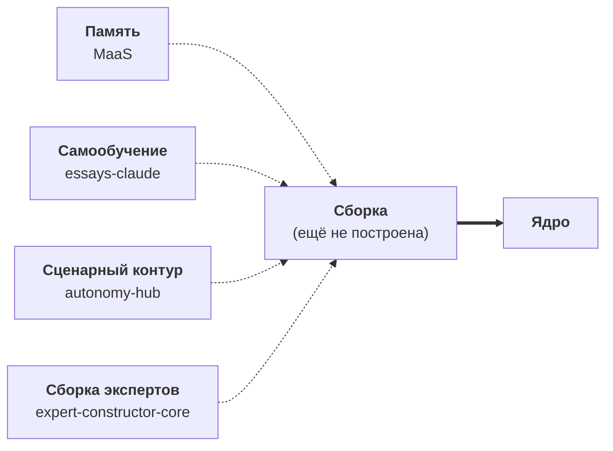

# Вертикали — архитектура, подтверждённая практикой

> **English counterpart:** [`Eng/3_Verticals/README.md`](../../Eng/3_Verticals/README.md)

Весь остальной корпус проектирует навигатор на бумаге. Этот раздел делает обратное: он читает примерно сотню рабочих кодовых проектов задом наперёд, чтобы спросить — действительно ли архитектура, которую описывают эссе, проявляется, когда человек садится и строит что-то для решения реальной задачи.

Проявляется. И проявляется в совершенно определённой форме.

---

## 1. Метод: частное → общее

Корпус выводит архитектуру сверху вниз — от метафизики уникальных траекторий к самообучающемуся движку и его рынкам. Этот раздел идёт в обратную сторону. Несколько лет автор не переставал строить прикладные инструменты — каждый начинался с конкретной, личной задачи: спродюсировать курс, вырастить канал, спланировать поездку, валидировать идею, диагностировать организацию, решить, на что потратить неделю. **Ни один не ставил целью «построить AGI».** Они запускались в разное время, по разным причинам, и большинство не задумывалось как нечто большее, чем то, чем они были.

И всё же всякий раз, когда инструмент становился серьёзным, его решение сходилось к одной и той же фигуре: **эксперт, который не отвечает, а ведёт** — навигатор с памятью, целью, веером маршрутов и доменом. Ранние проекты — это там, где общие паттерны впервые стали видны; те, что продолжают развиваться, — это те, что дрейфуют к этой фигуре. Так что каталог ниже читается как индуктивное доказательство того, что эссе утверждают дедуктивно: одна и та же конструкция, достигнутая из множества стартовых точек, при том что никто к ней не стремился.

Слово о том, как это читать. **Эти проекты не разложены по жёстким ящикам.** Каждый из них в той или иной степени — часть одной концепции; они просто стоят в разных точках пути от частного к общему и на разных стадиях зрелости. Какие-то — полные вертикали; какие-то — части ядра-движка; какие-то — узкоспециальные утилиты, которые тем не менее репетируют одно движение большей фигуры. Группировки ниже — *линзы для чтения, а не таксономия*: несколько проектов могли бы попасть сразу в две. Важна стадия, на которой каждый честно находится, — она указана на его собственной карточке.

Чтобы чтение было механическим, а не импрессионистским, каждый проект помещён на одну лестницу:

> **Утилита** — это один шаг. **Пайплайн** — много шагов, нацеленных на результат: одни шаги выполняют код, другие зовут модель. **Агент** = пайплайн **+** обратная связь **+** самообучение. **Вертикаль** = агент, конечный потребитель которого — *человек с целью*, плюс доменная база знаний, плюс рынок.

Единственный фундаментальный тест — **пайплайн**: есть ли цель, достигаемая через многоступенчатый сценарий, или это разовый инструмент? Всё, что выше пайплайна, — как минимум кандидат. (Полная рубрика и сырые профили по проектам лежат в приватных рабочих заметках автора, вне этого репозитория.)

---

## 2. Находка: одна архитектура, много рынков — и ядро, существующее по частям

Проявляются две вещи, которые одна бумага установить не может.

**Одна и та же архитектура — на дико разных рынках.** Менторинг жизни и карьеры, валидация фаундерской идеи, рост креатора, персональная travel-экспертиза, организационная AI-трансформация и стратегия времени — это очень разные бизнесы. У них один движок: *модель реальности → веер сценариев → позиционирование*, обучающийся на размеченных последствиях. Это в точности утверждение корпуса — **одно ядро, сменные вертикали** — наблюдённое, а не постулированное. И стадии реальны: можно наблюдать, как архитектура утолщается — от разговорного ментора, у которого пайплайна ещё нет, до двухконтурного пайплайна со спроектированным контуром обучения и до сквозной машины, уже отгрузившей контент. Лестница — не таксономия, придуманная задним числом, а реальный путь роста, которым эти проекты прошли.

**Ядро уже существует — но по частям, ещё ни разу не собранное.** Ни один отдельный проект не является «движком». Ядро построено фрагментами по всему портфелю, и каждый фрагмент случайно реализует свой орган:

Память ([maas](maas/README.md)), самообучение ([essays-claude](essays-claude/README.md)), сценарно-антипараличный контур ([autonomy-hub](autonomy-hub/README.md)) и платформа сборки экспертов ([expert-constructor-core](expert-constructor-core/README.md)) существуют **по отдельности**. Сплавить их — одна память, питающая один сценарный движок, который учится на собственных залогированных последствиях, — и есть «проект, в котором реализуется само ядро». На бумаге это центр корпуса. В портфеле это единственное, что ещё не построено. Это отсутствие — не слабость анализа, а его самый полезный вывод: оно называет следующее, что нужно построить.

---

## 3. Каталог

Рядом с папками проектов лежит один концептуальный документ верхнего уровня:

- [`0_ideal-client-trillion-market.md`](0_ideal-client-trillion-market.md) — внешняя рамка для партнёров: идеальный клиент (меньшинство с нелатентным спросом на рост), механика хардкорных игр и элитных акселераторов, рынок, измеряемый в триллионах, модель growth-скоринга как ров.

У каждого проекта ниже есть своя папка и продуктовое описание. Линзы — это вспомогательные средства для чтения, а не ящики.

### Вертикали, которые ведут человека к цели

| Проект | Что это | Лестница / стадия |
|---|---|---|
| [mentoring](mentoring/README.md) | Канонически первая вертикаль: навигатор для жизненного/карьерного перехода; работающий, но тонкий ментор уже есть, плюс самые глубокие концептуальные эссе корпуса. | фигура ментора, до-пайплайн · работает, тонкий |
| [founder-pipeline](founder-pipeline/README.md) | Ведёт фаундера от сырого ощущения к валидированному, пригодному для инвестиций тезису; самый полный агент в рамках одного проекта во всём портфеле. | полный агент · прототип |
| [ai-video-pipeline](ai-video-pipeline/README.md) | «Автоматизированная киностудия», растящая канал креатора; карточка, ближе всех стоящая к реальному рынку. | агент, готов к рынку · прототип, отгружает |
| [saved-downloader](saved-downloader/README.md) | Превращает твои сохранённые посты в персонального доменного эксперта, который ведёт тебя к плану (первая вертикаль — путешествия). | полный агент · прототип |
| [tracking](tracking/README.md) | Навигатор, наведённый на самого себя, — ранжирует собственные ставки автора по тому, куда должно идти время. | агент · работает, личный |
| [ai-test01](ai-test01/README.md) | Idea Intake: умное вступительное интервью для сырых фаундерских идей; донор машинерии ядра (Learning Orchestrator, Synthetic User Lab). | агент · рабочий прототип (legacy-линия) |

### Организационная AI-трансформация

| Проект | Что это | Лестница / стадия |
|---|---|---|
| [questions](questions/README.md) | Структурированный движок интейка, строящий модель реальности из людей, — диагностический фронтенд. | пайплайн · работает, один клиент |
| [fastbank](fastbank/README.md) | Программа передачи AI-компетенций предприятию, упакованная как повторяемый консалтинговый пайплайн (ведёт человек, ещё не агент). | пайплайн · черновики |

### Ядро-движок, собранное по частям

| Проект | Что это | Лестница / стадия |
|---|---|---|
| [maas](maas/README.md) | Memory as a Service — долговременная память ядра, построенная как самостоятельная инфраструктура. | слой ядра (память) · прототип |
| [essays-claude](essays-claude/README.md) | Самообучающаяся организация агентов — контур «решение → результат → коррекция», реально работающий. | слой ядра (самообучение) · прототип |
| [autonomy-hub](autonomy-hub/README.md) | Антипараличный движок — сценарный контур, удерживающий проект в движении сквозь блокеры. | слой ядра (сценарий) · стадия проектирования |
| [expert-constructor-core](expert-constructor-core/README.md) | Конструктор заземлённых доменных экспертных AI-чатов — платформа, на которой собираются вертикали. | слой ядра (сборка) · рабочий прототип |

### Производство для creator / экономики экспертов

| Проект | Что это | Лестница / стадия |
|---|---|---|
| [course-producer](course-producer/README.md) | Превращает сырой материал эксперта в готовый, развёрнутый курс. | агент · рабочий инструмент |
| [course-distributor](course-distributor/README.md) | Движок публикации, выкладывающий готовые курсы на живые платформы. | пайплайн · работает |
| [news](news/README.md) | Курировать → прокомментировать → опубликовать: авторский пайплайн производства новостных дайджестов. | пайплайн · работает |
| [ai-support-chat-plugin](ai-support-chat-plugin/README.md) | Привязанный к базе знаний ассистент поддержки, который диагностирует, а не угадывает. | агент (узкий) · рабочий релиз |
| [simple-cutter](simple-cutter/README.md) | Автоматизированный постпродакшн записанных выступлений — узкоспециальная утилита. | пайплайн / утилита · работает |

### Контент и базы знаний

| Проект | Что это | Лестница / стадия |
|---|---|---|
| [agibook](agibook/README.md) | Книга о концепции, написанная через (и как) самоулучшающийся писательский пайплайн. | агент (письмо) · работает |
| [aibook](aibook/README.md) | Книга-квест, обучающая мастерству работы с ИИ и заканчивающаяся персональным Ментором. | контент + пайплайн · ранние черновики |
| [ontology](ontology/README.md) | Вымышленная вселенная как база знаний — протоязык ядра. | доменная база знаний · черновики |
| [strategy](strategy/README.md) | Архив автора «куда ставить» — контент слоя позиционирования, без машины. | база знаний · работает |

---

*Источник истины: приватные рабочие заметки автора (вне этого репозитория). Эти карточки — абстракции собственных проектов автора; никакие приватные данные не воспроизводятся.*
