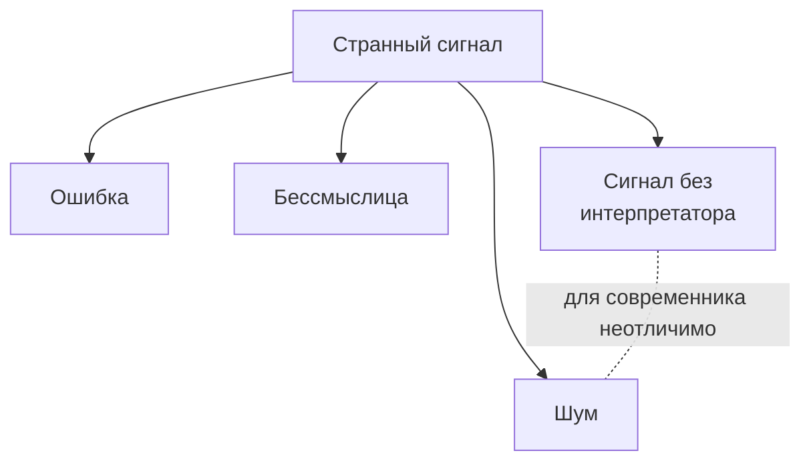

# Галлюцинация как фильтр-механизм

*Почему термин «галлюцинация» — это оценка наблюдателя, а не свойство сигнала*

**Alex Krol** — стратегия, AI, инфраструктура роста

> 🇬🇧 **English version:** [Eng/4_MetaFoundation/hallucination-as-filter.md](../../Eng/4_MetaFoundation/hallucination-as-filter.md)

> © 2026 Alex Krol. Эссе опубликовано для свободного чтения и обсуждения. Перепечатка, перевод, коммерческое использование — только с письменного согласия автора.

---

## Оглавление

0. [TL;DR](#tldr)
1. [«Галлюцинация»: оценка, замаскированная под свойство](#1-evaluation-vs-property)
2. [Шум, ошибка, бессмыслица и сигнал без интерпретатора](#2-four-things)
3. [Подмена формулировок как механизм закрытия мысли](#3-substitutions)
4. [Метод vs психология научного сообщества](#4-method-vs-psychology)
5. [Логистическая природа фильтра](#5-logistical-filter)
6. [Радикальное следствие: «невозможности» как артефакты дефицита](#6-impossibilities-as-artifacts)
7. [Sources](#sources)

---

## TL;DR 

Слово «галлюцинация» применительно к большой языковой модели содержит оценку, выдаваемую за описание. Внутри модели нет различения между «правильным ответом» и «галлюцинацией»: модель производит вероятностно правдоподобную последовательность токенов. Классификация происходит снаружи — со стороны интерпретатора, который сверяет ответ модели с собственной картиной мира. То, что одному выглядит как галлюцинация, другому может казаться нормальным высказыванием, потому что граница между «осмысленным» и «бессмысленным» проходит не в сигнале, а в наблюдателе. Более того, формальный результат Kalai & Vempala показывает: статистически калиброванная модель *обязана* галлюцинировать, и нижний предел этой частоты соответствует доле фактов, встречающихся в обучающих данных ровно один раз[^3]. Это превращает галлюцинацию из дефекта в неизбежное следствие архитектуры.

Та же структура работает в науке. Утверждение «это невозможно» при заведомо ограниченных знаниях логически сомнительно — но делается рутинно. Существуют три рабочие подмены: «у нас нет ресурсов это исследовать» подменяется на «это чушь»; «вероятность низкая» — на «это невозможно»; «механизм неизвестен» — на «механизма нет». Эти три формулировки внешне неотличимы, но утверждают совершенно разное.

Критика направлена не на научный метод — он скромен, — а на психологию научного сообщества. На более глубоком уровне это критика логистики познания: при конечных ресурсах любой фильтр гипотез — это набор предположений о будущем, и эти предположения чаще делаются культурой, авторитетами, грантовой системой и инерцией, чем данными. Главное ограничение знания — не эпистемологическое, а логистическое. Не «мы не можем узнать», а «мы не можем позволить себе проверять всё». В этом компромиссе и спрятана вся проблема.

---

## 1. «Галлюцинация»: оценка, замаскированная под свойство 

Термин «галлюцинация» в применении к большой языковой модели лингвистически вызывает образ субъекта, который видит несуществующее. Это антропоморфизм, и он создаёт ложную картину. У модели нет внутренней инстанции, которая принимает галлюцинацию за восприятие. Модель производит последовательность токенов, статистически правдоподобную в свете обучающего распределения. Никакого «я ошибся» в модели не происходит — потому что нет «я».

Канонические обзоры в литературе осторожно фиксируют это в технических определениях, но удерживают сам термин. Ji и соавторы делят «галлюцинации» на интринсивные (генерация противоречит входу) и экстринсивные (генерация невозможно проверить по входу)[^1]. Huang и соавторы расширяют таксономию: factuality hallucinations против faithfulness hallucinations, причины ищутся в распределении данных, архитектуре трансформера, целевой функции (next-token prediction), стратегиях семплирования на инференсе[^2]. Bender и соавторы в нашумевшей работе про «стохастических попугаев» прямо ставят терминологический вопрос: то, что выглядит как понимание или суждение, есть статистическая аппроксимация распределения языка, не семантическая работа[^4]. Если нет понимания — нет и галлюцинации в человеческом смысле. Нет субъекта, который видит несуществующее. Есть машина, сшивающая правдоподобные формы.

Дальше идёт ход, который меняет всю рамку. В 2024 году Kalai и Vempala доказали теорему: для статистически калиброванной языковой модели существует нижний предел частоты галлюцинаций, и этот предел приблизительно равен доле фактов, встречающихся в обучающих данных ровно один раз — то, что в статистике называется оценкой Гуд-Тьюринга[^3]. Если модель честно отражает распределение данных, она *обязана* фабриковать факты на редких хвостах. Это нельзя «починить» инженерными средствами без потери калибровки. Галлюцинация — не баг архитектуры, а её рабочий режим. Эмпирические работы McCoy и соавторов идут в ту же сторону: поведение моделей детерминировано задачей, на которой они обучены, — предсказанием следующего токена; «возможно» и «невозможно» для модели — статистические, а не онтологические категории[^5].

Из этого следует простое. Модель не отличает «правильный ответ» от «галлюцинации». Это различение производится снаружи. Интерпретатор берёт выход модели, сверяет с собственной картиной мира и навешивает ярлык. Если совпало — правильный ответ. Если не совпало — галлюцинация. Сам этот ярлык говорит не о модели. Он говорит об интерпретаторе и его картине мира.

Отсюда сразу появляется неудобный вопрос. Что произойдёт, если интерпретаторов с разной картиной мира двое? Один и тот же ответ модели один назовёт верным, другой — галлюцинацией. Картина мира — переменная. Граница тоже становится переменной. История науки полна случаев, когда идея в момент появления выглядела как галлюцинация относительно господствующей картины — и спустя поколение становилась нормой. Это не значит, что любая странность есть скрытое открытие. Это значит, что граница между осмысленным и бессмысленным зависит от контекста интерпретатора, а не от свойств сигнала.

И вот здесь термин «галлюцинация» предательски замыкает мысль. Он заставляет считать, что проблема внутри модели — она «видит несуществующее». Но если граница ставится снаружи, то техническая проблема описана неточно. Точнее так: модель производит сигнал, наблюдатель его оценивает, оценка часто говорит больше о наблюдателе, чем о сигнале. То же самое, в зеркальном виде, происходит в науке — и об этом дальше.

## 2. Шум, ошибка, бессмыслица и сигнал без интерпретатора 

Главная сложность любого фильтра — то, что он должен различать вещи, визуально неразличимые. Когда перед вами странный сигнал, у него есть как минимум четыре природы, и они для современника выглядят одинаково.

Первая — шум. Случайная флуктуация, не несущая структуры. Просто помехи.

Вторая — ошибка. Сигнал нёс структуру, но она исказилась в передаче или в производстве. Структура была, но не та, что должна была быть.

Третья — бессмыслица. Структура есть, она внутренне когерентна, но не отсылает ни к чему за пределами самой себя. Самоподдерживающаяся форма без референта.

Четвёртая — сигнал, для которого ещё нет интерпретатора. Структура есть, референт есть, но язык, на котором его можно прочитать, ещё не построен. Сигнал ждёт своего читателя.

Эти четыре природы для современника визуально не различаются. Все четыре выглядят как «что-то странное, не похожее на привычное». Задним числом всё кажется очевидным: ну вот же теория относительности, ну вот же алхимия. Но в момент появления нового никто не знает, на что смотрит — на физику будущего или на ритуальную бессмыслицу. Это и есть фундаментальная проблема не только ИИ, но и человеческого познания вообще. Кун описал её в терминах парадигм: внутри парадигмы аномалия сначала вообще не «видится» — она лежит в слепом пятне сообщества[^7]. Лакатос показал технический механизм: вокруг hard core теоретической программы строится защитный пояс вспомогательных гипотез, и сигнал, угрожающий ядру, отбивается этим поясом до того, как будет рассмотрен по существу[^8].

Из этого следует напряжение, которое нужно держать в голове одновременно. Большинство странных сигналов — действительно шум. Это статистический факт. Если впускать всё, утонете в мусоре. Но: некоторые самые важные сигналы в истории сначала тоже выглядели как шум. Дрейф континентов в 1920-х американская геология отвергала как невозможный — не из-за плохих данных, а потому что идея не вписывалась в стандарты практики сообщества; механизм нашли позже, в 1960-х, и то, что было «галлюцинацией», стало тектоникой плит[^15]. Бактериальная природа язвы желудка отвергалась — «бактерии не могут жить в кислой среде». Маршалл выпил культуру H. pylori, чтобы заставить рассмотреть гипотезу всерьёз; Нобелевская премия пришла через двадцать с лишним лет[^16]. Прионная гипотеза Прусинера была названа еретической[^17]. И так далее.

Напряжение между «большинство — шум» и «самое важное иногда тоже сначала выглядело как шум» — это и есть рабочее состояние любого познающего сообщества. Снять это напряжение нельзя. Им можно только управлять. Беда в том, что управление здесь происходит не через метод, а через социальный фильтр — который оказывается грубее метода и систематически смещён.

## 3. Подмена формулировок как механизм закрытия мысли 

Самая интересная часть этой картины — как именно фильтр срабатывает в реальной речи. Не в учебнике по эпистемологии, а в живой публичной дискуссии. И здесь работают три подмены, которые я хочу разобрать прямо.

**Первая подмена.** «У нас нет ресурсов это исследовать» подменяется на «это чушь». Это две совершенно разные пропозиции. Первая — о состоянии исследовательского аппарата. Вторая — о состоянии мира. Из первой не следует вторая. Но в публичной риторике они часто звучат одинаково и неразличимо: «ну это же ерунда, никто этим серьёзно не занимается». Сам факт, что никто не занимается, превращается в эпистемологический аргумент. Силлогизм скрыт, но он есть, и он порочен: «никто не вкладывает ресурсы → это не заслуживает ресурсов → это не имеет содержания». Между первым и вторым шагом — пропасть, заполненная инерцией грантовой системы.

**Вторая подмена.** «Вероятность низкая» подменяется на «это невозможно». Низкая вероятность и невозможность — это разные категории. Первая допускает событие; вторая исключает его. Из того, что событие маловероятно, не следует, что оно не произойдёт. Но в дискуссии «низкая вероятность» произносится с интонацией «забудьте об этом», и слушатель уже не различает: ему сказали «это исключено» или «это маловероятно». Поппер настаивал, что научно лишь то утверждение, которое в принципе фальсифицируемо[^6]; «это невозможно» в большинстве случаев означает «у меня нет модели, в которой это происходило бы» — и это критерий о говорящем, а не о мире.

**Третья подмена.** «Мы не понимаем механизм» подменяется на «механизма нет». Отсутствие модели у наблюдателя выдаётся за свойство явления. Это, пожалуй, самая частая ошибка. Когда наука сталкивается с воспроизводимым эффектом, для которого нет принятого объяснения, реакция сообщества обычно проходит через стадию отрицания: «этого не может быть, потому что мы не понимаем как». Но «мы не понимаем как» — утверждение о наших ограничениях. «Этого не может быть» — утверждение о мире. Между ними — снова пропасть.

Что общего у всех трёх подмен? Все три превращают высказывание о состоянии знания в высказывание о состоянии реальности. Все три скрывают за уверенной формулировкой признание собственной ограниченности. И все три работают по одной и той же психологической причине: человеческий мозг очень плохо переносит неопределённость.

Это не отвлечённая идея, а вещь, которую легко наблюдать на людях и на сообществах. Учёные здесь не исключение. Очень часто люди — и сообщества — предпочитают ложную определённость честному незнанию. «Это невозможно» закрывает вопрос. «Мы не понимаем механизм, и у нас нет ресурсов это исследовать» — оставляет его открытым. Закрытый вопрос психологически комфортнее. Он создаёт ощущение, что картина мира согласована. Открытый — создаёт раздражение, которое требует энергии.

И вот здесь, в этой точке, я хочу провести разделение, которое мне кажется ключевым для всего эссе.

## 4. Метод vs психология научного сообщества 

Когда говорят «наука то-то отвергла» или «наука то-то признала», подразумевают, что субъектом действия выступает некая единая инстанция — научный метод. Это не так. Научный метод — формальная процедура: гипотеза, проверка, данные, пересмотр. Метод сам по себе скромен. Он не выдаёт окончательных суждений. Он не говорит «это невозможно». Он говорит «эта гипотеза не подтвердилась в таких-то условиях такими-то измерениями». Метод оставляет пространство для пересмотра, потому что любое подтверждение в нём временное, а опровержение — содержательное только при заданных условиях.

Реальные оценки выносит другая инстанция — сообщество. И у сообщества другие свойства. Сообщество состоит из людей с карьерами, привязанностями, репутациями, грантовыми историями, личной верой в свои предыдущие работы. Сообщество говорит не «эта гипотеза пока не подтвердилась», а «это ерунда, потому что я уверен». Это не одно и то же. Это вообще другой жанр высказывания.

Социология науки давно эту разницу зафиксировала. Программа Блора в Эдинбургской школе строилась на принципе симметрии: один и тот же тип причин должен объяснять, почему сообщество принимает истинные идеи и почему отвергает ложные[^10]. Латур и Вулгар в этнографии лаборатории показали, как именно высказывание превращается в «факт» — через цепочку записей, ссылок, грантовых решений, согласований; «факт» оформляется тогда, когда стоимость его оспаривания превышает выгоду, а не тогда, когда оно «соответствует реальности»[^11]. Мертон описал *эффект Матфея* (Matthew Effect): признание распределяется не пропорционально вкладу, а пропорционально уже накопленному статусу[^12]. Lee и соавторы дали систематический обзор предвзятостей peer review — гендерных, институциональных, национальных, парадигмально-конформных[^13]. Файерабенд в радикальной форме заявил, что крупные продвижения науки делались *вопреки* нормам тогдашнего сообщества[^9].

Сложение этих линий даёт устойчивую картину. Метод и сообщество — разные машины. Метод — про процедуру верификации. Сообщество — про распределение легитимности. Они работают на разных принципах, и второе систематически шире и инерционнее первого. Когда новая идея отвергается, это почти никогда не метод её отвергает — это сообщество отказывает ей в доступе к процедурам метода. Идея отбрасывается до того, как методу дают её рассмотреть.

И здесь становится понятной нетривиальная параллель с LLM. Обычно вопрос ставится так: почему модель генерирует столько странных вещей? Это вопрос про производство сигнала. Но есть зеркальный вопрос, который меняет рамку: почему человек так быстро классифицирует большинство странных вещей как бессмыслицу? Это уже вопрос про фильтр, не про производство.

Обе системы — модель и человек — имеют свои ограничения. Модель плохо отличает сигнал от шума, потому что у неё нет внешнего критерия истины, есть только статистика языка. Человек иногда фильтрует всё необычное слишком агрессивно, потому что когнитивная стоимость пересмотра картины мира высока, а психологическая стоимость «не знаю, но интересно» ещё выше. Модель производит слишком много. Человек впускает слишком мало. И настоящий вопрос — не «кто из них прав», а где находится оптимальная граница между доверчивостью и скепсисом.

По одну сторону этой границы — мир суеверий. Любой странный сигнал принимается за смысл; реальность тонет в галлюцинациях, в первобытном понимании этого слова — приписывании структуры там, где её нет. По другую сторону — мир, в котором новое знание не появляется вовсе, потому что всё новое объявляется невозможным ещё до рассмотрения. Это парализованная наука, защищающая hard core программы любой ценой, в дегенеративной фазе по Лакатосу.

Граница не решается раз и навсегда. Её приходится постоянно пересматривать — и пересмотр этот делается не методом, а сообществом, со всеми его смещениями. Это и объясняет, почему наука периодически проходит через куновские революции: накопленное смещение фильтра достигает порога, при котором аномалии становятся невозможно игнорировать, и тогда сообщество резко переключается на новую картину — часто отрицая её существование ещё за день до переключения.

Виноват в этом цикле не метод. И не наука как идея. Виновата конкретная социальная машина, через которую наука работает в данный исторический момент. И эта машина устроена так, что её решения о «возможно/невозможно» зависят от ресурсов гораздо больше, чем принято говорить.

## 5. Логистическая природа фильтра 

Здесь я делаю радикальный поворот, ради которого писалось всё предыдущее.

В обычном понимании главный вопрос науки — как отличить истинную гипотезу от ложной. Эпистемология строится вокруг критериев истинности: соответствие данным, предсказательная сила, фальсифицируемость, согласованность с принятой теорией. Это всё верно — но это вопрос второго порядка. Главный вопрос возникает раньше: **кто вообще решил, какие гипотезы попадут на рассмотрение.**

Если ресурсов бесконечно много, ответа не нужно. Стратегия очевидна: генерируем миллион гипотез, проверяем миллион гипотез, смотрим результат. Никакого фильтра. Но ресурсы конечны — лаборатории, время, гранты, внимание сообщества, страницы в журналах, слоты на конференциях. И как только ресурсы становятся конечны, появляется фильтр. А любой фильтр — это набор предположений о будущем. Ещё до начала исследования мы уже сделали ставку: одни направления перспективнее других. Сама ставка делается не данными — у нас их по определению ещё нет, мы ведь ещё не исследовали. Ставка делается чем-то другим.

Чем именно? Культурой сообщества — что считается интересным, что считается «настоящей наукой», что считается несерьёзным. Авторитетами — кто решает, что важно. Модой — какие темы сейчас горячие, какие холодные. Грантовой системой — что финансируется, что нет. Карьерными стимулами — на чём можно построить карьеру, на чём нельзя. Исторической инерцией — что делали последние двадцать лет, то и будем делать дальше.

Paula Stephan в работе по экономике науки показывает это на массиве данных предельно конкретно: лаборатории комплектуются дешёвой временной рабочей силой, университеты переносят грантовый риск на работников, гипотеза вне текущей грантовой повестки не получает финансирования[^14]. Это не моральный недостаток отдельных учёных. Это рабочее устройство машины. Она *не может* финансировать всё; она вынуждена выбирать; выбирает по сигналам, которые приходят не из эпистемологии, а из экономики и социологии. Lee и соавторы в обзоре peer review добавляют: даже на стадии оценки уже написанной работы фильтр систематически смещён в пользу конформной к парадигме новизны и против радикальной[^13]. Мертоновский эффект Матфея завершает: уже опубликованные работы из престижных институций цитируются непропорционально чаще, что усиливает фильтр на следующем витке[^12].

Из всего этого следует мой главный тезис.

**Ограничение познания часто является не эпистемологическим, а логистическим.**

Мы не столько не можем узнать. Мы не можем позволить себе проверять всё подряд. И дальше начинается компромисс — выбор приоритетов при дефиците ресурсов. В этом компромиссе скрыта вся настоящая проблема современной науки. Не в методе. Не в принципиальной непостижимости каких-то вопросов. В том, что между гипотезой и её проверкой стоит экономика, социология и культура — и они определяют, какие гипотезы вообще доживут до проверки.

Это переворачивает обычную картину. Когда мы говорим «наука доказала, что X невозможно», в реальности часто имеется в виду: «исследовательский истеблишмент не направил ресурсов на проверку X, потому что X не вписывался в текущую повестку». Это не одно и то же. Первое — утверждение о реальности. Второе — утверждение о состоянии исследовательской машины. Они смешиваются в одну формулировку.

Здесь появляется неожиданная связь с ИИ — и не та, которую обычно ожидают. На протяжении всей истории человечества стоимость предварительного анализа гипотез, моделирования, критики, генерации альтернатив была огромной. Это требовало времени экспертов, доступа к литературе, годов обучения. Сейчас впервые в истории возникает ситуация, когда стоимость этой стадии падает на порядки. Не стоимость финального эмпирического теста — там по-прежнему нужны реальные эксперименты и реальные деньги. А стоимость предтестовой стадии: формулирование, прокрутка, поиск аналогий, генерация контр-аргументов, литературный обзор. Именно эта стадия логистически забивала фильтр. Именно её AI начинает разгружать.

Не весь логистический барьер. Часть. Но эта часть — критическая.

## 6. Радикальное следствие: «невозможности» как артефакты дефицита 

Если довести логику предыдущего раздела до предела, получается следующее.

Многие научные «невозможности» — не выводы из знания, а артефакты дефицита исследовательских ресурсов. Не «доказано, что нельзя», а «не смогли позволить себе проверить». Эти две формулировки звучат одинаково, но описывают совершенно разные ситуации. В первой проблема в реальности — она устроена так, что нечто исключено. Во второй проблема в нас — мы устроены так, что не дотягиваемся.

Я не утверждаю, что все отвергнутые идеи окажутся верными. Подавляющее большинство — действительно мусор. Это статистика, и она против. Но я утверждаю другое: историческая граница между «невозможно» и «мы не можем позволить себе это исследовать» проходила гораздо менее чётко, чем принято считать. И эта смазанная граница систематически выдавалась за чёткую — потому что чёткая граница психологически проще, а сообщество, как мы видели, плохо переносит неопределённость.

И здесь параллель с галлюцинацией LLM становится точной. Когда мы говорим «модель сгенерировала бессмыслицу», в значительной части случаев реальное утверждение звучит иначе: «у нас нет эффективного способа извлечь из этого ценность». Это совсем другое утверждение. В первом случае проблема в сигнале — он не несёт информации. Во втором случае проблема в нашем механизме обработки сигнала — мы не умеем его прочитать. Эти два диагноза требуют разных ответов. Первый — фильтровать сильнее. Второй — учиться читать.

Та же логика работает и в обратную сторону, в науке. Когда сообщество говорит «эта гипотеза бессмысленна», часто реальное содержание утверждения такое: у нас нет логистики, чтобы её проверить, и нет языка, чтобы её сформулировать строго. Это утверждение о нашей машине, а не о гипотезе. И требует оно другого ответа: не «отбросить», а «зафиксировать как ожидающую логистики».

Я намеренно не предлагаю «решения». Граница между доверчивостью и скепсисом не решается раз и навсегда. Любая попытка её зафиксировать — суррогат, неизбежно склонный в одну из сторон. Слишком открытый фильтр — мир суеверий. Слишком закрытый — мир, где новое знание не появляется. Эту границу приходится постоянно двигать, и двигать её должно сообщество, осознавая, что оно её двигает не по эпистемологическим, а по логистическим основаниям.

Что меняется в моменте, в котором мы живём, — это сама логистика. Стоимость предварительной фазы (анализ, моделирование, критика, формулирование альтернатив) падает на порядки впервые в истории. Это значит, что логистический фильтр первого этапа становится менее жёстким. Гипотезы, которые раньше отбрасывались потому, что их «слишком дорого даже рассматривать», теперь могут быть прокручены за минуты. Это не делает их верными. Но это меняет состав того, что доходит до эмпирического теста.

И последнее. Термин «галлюцинация» применительно к языковой модели — это маленькая иллюстрация большой ошибки. Ошибка состоит в том, что свойство наблюдателя выдаётся за свойство наблюдаемого. Модель «галлюцинирует», потому что её выход не совпадает с нашей картиной. Гипотеза «невозможна», потому что она не вписывается в нашу программу. В обоих случаях формулировка звучит как описание мира, а описывает интерпретатора. Развести эти два уровня — не косметическая правка терминологии. Это другая дисциплина мышления о том, как вообще устроены наши фильтры. И эта дисциплина сейчас — на фоне разгружающейся логистики — становится не отвлечённой философией, а рабочим вопросом для каждого, кто пытается отличить сигнал от шума.

---

## Sources 

[^1]: Ji, Z., Lee, N., Frieske, R., Yu, T., Su, D., Xu, Y., Ishii, E., Bang, Y. J., Madotto, A., & Fung, P. (2023). Survey of Hallucination in Natural Language Generation. *ACM Computing Surveys*, 55(12), Article 248, 1–38. DOI: [10.1145/3571730](https://doi.org/10.1145/3571730). arXiv: [2202.03629](https://arxiv.org/abs/2202.03629).

[^2]: Huang, L., Yu, W., Ma, W., Zhong, W., Feng, Z., Wang, H., Chen, Q., Peng, W., Feng, X., Qin, B., & Liu, T. (2023). A Survey on Hallucination in Large Language Models: Principles, Taxonomy, Challenges, and Open Questions. *arXiv preprint* [arXiv:2311.05232](https://arxiv.org/abs/2311.05232).

[^3]: Kalai, A. T., & Vempala, S. S. (2024). Calibrated Language Models Must Hallucinate. *Proceedings of the 56th Annual ACM Symposium on Theory of Computing* (STOC '24), 160–171. DOI: [10.1145/3618260.3649777](https://doi.org/10.1145/3618260.3649777). arXiv: [2311.14648](https://arxiv.org/abs/2311.14648).

[^4]: Bender, E. M., Gebru, T., McMillan-Major, A., & Shmitchell, S. (2021). On the Dangers of Stochastic Parrots: Can Language Models Be Too Big? *Proceedings of the 2021 ACM Conference on Fairness, Accountability, and Transparency* (FAccT '21), 610–623. DOI: [10.1145/3442188.3445922](https://doi.org/10.1145/3442188.3445922).

[^5]: McCoy, R. T., Yao, S., Friedman, D., Hardy, M. D., & Griffiths, T. L. (2024). Embers of Autoregression Show How Large Language Models Are Shaped by the Problem They Are Trained to Solve. *Proceedings of the National Academy of Sciences*, 121(41), e2322420121. DOI: [10.1073/pnas.2322420121](https://doi.org/10.1073/pnas.2322420121). arXiv: [2309.13638](https://arxiv.org/abs/2309.13638).

[^6]: Popper, K. R. (1959). *The Logic of Scientific Discovery*. Routledge, London (нем. оригинал: *Logik der Forschung*, 1934). [Routledge edition](https://www.routledge.com/The-Logic-of-Scientific-Discovery/Popper-Popper/p/book/9780415278447).

[^7]: Kuhn, T. S. (1962). *The Structure of Scientific Revolutions*. University of Chicago Press, Chicago. [UChicago Press](https://press.uchicago.edu/ucp/books/book/chicago/S/bo13179781.html).

[^8]: Lakatos, I. (1978). *The Methodology of Scientific Research Programmes: Philosophical Papers Volume 1* (J. Worrall & G. Currie, Eds.). Cambridge University Press, Cambridge. [Cambridge Core](https://www.cambridge.org/core/books/methodology-of-scientific-research-programmes/3CEA865F766E9F313A1FF5582B28E943).

[^9]: Feyerabend, P. (1975). *Against Method: Outline of an Anarchistic Theory of Knowledge*. New Left Books (Verso), London. [Verso Books](https://www.versobooks.com/products/1041-against-method).

[^10]: Bloor, D. (1976). *Knowledge and Social Imagery*. Routledge & Kegan Paul, London (2nd ed., University of Chicago Press, 1991). [UChicago Press](https://press.uchicago.edu/ucp/books/book/chicago/K/bo3684600.html).

[^11]: Latour, B., & Woolgar, S. (1979). *Laboratory Life: The Social Construction of Scientific Facts*. Sage, Beverly Hills (2nd ed., Princeton University Press, 1986). [Princeton UP](https://press.princeton.edu/books/paperback/9780691028323/laboratory-life).

[^12]: Merton, R. K. (1968). The Matthew Effect in Science. *Science*, 159(3810), 56–63. DOI: [10.1126/science.159.3810.56](https://doi.org/10.1126/science.159.3810.56).

[^13]: Lee, C. J., Sugimoto, C. R., Zhang, G., & Cronin, B. (2013). Bias in Peer Review. *Journal of the American Society for Information Science and Technology*, 64(1), 2–17. DOI: [10.1002/asi.22784](https://doi.org/10.1002/asi.22784).

[^14]: Stephan, P. E. (2012). *How Economics Shapes Science*. Harvard University Press, Cambridge, MA. [Harvard UP](https://www.hup.harvard.edu/books/9780674088160).

[^15]: Oreskes, N. (1999). *The Rejection of Continental Drift: Theory and Method in American Earth Science*. Oxford University Press, New York. [Oxford UP](https://global.oup.com/academic/product/the-rejection-of-continental-drift-9780195117332).

[^16]: Ahmed, N. (2008). *Helicobacter pylori: A Nobel pursuit?* PubMed Central. [PMC2661189](https://pmc.ncbi.nlm.nih.gov/articles/PMC2661189/).

[^17]: Keyes, M. E. (2007). The Early History of the Protein-only Hypothesis: Scientific Change and Multidisciplinary Research. In *Multidisciplinarity and Translation in Pharmaceutical Research*. Palgrave Macmillan, London. [Springer](https://link.springer.com/chapter/10.1057/9780230524392_2).
